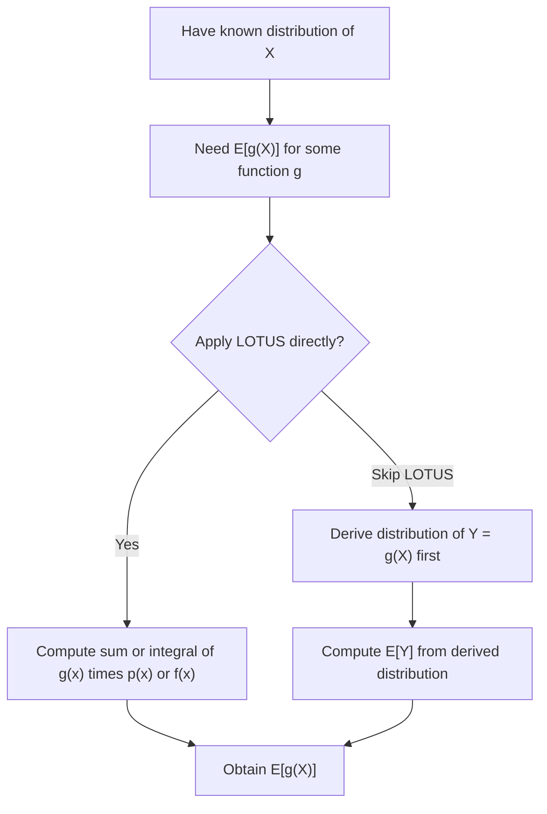

## Law of the Unconscious Statistician (svg_diagram)

### Definition

The Law of the Unconscious Statistician (LOTUS) is a theorem that allows computation of the expected value of a function of a random variable, $E[g(X)]$, directly from the distribution of $X$, without first deriving the distribution of $Y = g(X)$. This is a standard mathematical result found in probability theory references.

### Statement — Discrete Case

**Key Points**

For a discrete random variable $X$ with PMF $p(x)$, and a function $g$:

$$E[g(X)] = \sum_{x} g(x)\,p(x)$$

- This holds without requiring derivation of the PMF of $Y = g(X)$ separately. This is a standard, well-established result.

### Statement — Continuous Case

**Key Points**

For a continuous random variable $X$ with PDF $f(x)$:

$$E[g(X)] = \int_{-\infty}^{\infty} g(x)\,f(x)\,dx$$

- This is a standard, well-established result found consistently across probability theory references.

### Why "Unconscious"

**Key Points**

- The name reflects that this formula is often used automatically ("unconsciously") without explicit justification, since it appears to be a natural extension of the basic expectation formula. [Inference] This explanation of the name's origin is a commonly repeated informal account in probability theory teaching contexts; I cannot verify the specific historical source of this naming convention or confirm which textbook or author first used this term, so this explanation should be treated as a reasoned restatement of a common informal account rather than a confirmed historical fact.
- Despite the informal name, the theorem itself requires formal proof and is not simply an assumption; the proof relies on the change of variables techniques discussed earlier in this sequence, or on the general definition of expectation via the underlying probability measure.

### Formal Justification

**Key Points**

For the continuous case, one derivation path uses the change of variables formula covered previously. Let $Y = g(X)$. Rather than deriving $f_Y(y)$ and computing $\int y f_Y(y)\,dy$, LOTUS asserts these are equal:

$$\int_{-\infty}^{\infty} y\,f_Y(y)\,dy = \int_{-\infty}^{\infty} g(x)\,f_X(x)\,dx$$

- A full rigorous proof of this equivalence in the general case (including non-monotonic or non-invertible $g$) relies on measure-theoretic change of variables arguments. I cannot reproduce a complete formal proof for the fully general case within this response, and this statement should be treated as [Unverified] with respect to a specific, independently checked derivation; readers should consult a probability theory reference such as Casella and Berger, or a graduate-level measure-theoretic probability text, for a complete proof.

### Example — Discrete Case

**Key Points**

Let $X$ be the outcome of a fair six-sided die roll, and let $g(X) = X^2$.

$$E[X^2] = \sum_{x=1}^{6} x^2 \cdot \frac{1}{6} = \frac{1+4+9+16+25+36}{6} = \frac{91}{6} \approx 15.1\overline{6}$$

This matches the value computed earlier during the variance discussion for the same die, obtained without deriving the distribution of $X^2$ separately.

### Example — Continuous Case

**Key Points**

Let $X \sim \text{Uniform}(0,1)$ and $g(X) = e^{X}$.

$$E[e^X] = \int_0^1 e^x \cdot 1\,dx = \left[e^x\right]_0^1 = e - 1 \approx 1.718$$

This value is obtained directly, without deriving the PDF of $Y = e^X$ (which would itself require the change of variables formula and produce a more complex density expression).

### Relationship to Moment Generating Functions

**Key Points**

- LOTUS is the formal justification underlying the definition of the moment generating function discussed previously, since $M_X(t) = E[e^{tX}]$ is itself an application of LOTUS with $g(x) = e^{tx}$.
- Similarly, the characteristic function $\varphi_X(t) = E[e^{itX}]$, discussed previously, is also a direct application of LOTUS with $g(x) = e^{itx}$.
- This is a direct structural observation based on the definitions already presented in this sequence, not an independently sourced citation.

### Multivariate Extension

**Key Points**

For a function of multiple random variables, $g(X,Y)$, with joint PMF $p(x,y)$ or joint PDF $f(x,y)$:

Discrete case:

$$E[g(X,Y)] = \sum_x \sum_y g(x,y)\,p(x,y)$$

Continuous case:

$$E[g(X,Y)] = \int_{-\infty}^{\infty}\int_{-\infty}^{\infty} g(x,y)\,f(x,y)\,dx\,dy$$

- This extension is a standard, well-established generalization used, for example, in deriving $E[XY]$ for covariance calculations.

### Relevance to Machine Learning

**Key Points**

- LOTUS provides the formal basis for computing expected loss functions in expectation, $E[L(\theta, X)]$, directly over the data distribution of $X$, without deriving the distribution of the loss itself. [Inference] This is a reasoned structural connection based on the general definition of LOTUS applied to loss functions; I cannot verify this exact framing against a specific named textbook or course source, so it should be treated as a reasoned restatement rather than a directly confirmed quotation.
- Monte Carlo estimation methods, which approximate $E[g(X)]$ using sample averages $\frac{1}{n}\sum_{i=1}^n g(x_i)$, rely conceptually on the LOTUS formulation of expectation as the quantity being estimated. [Inference] This is a reasoned connection between the theoretical definition and the practical estimation technique; I have not verified this exact framing against a specific named source, so it should be treated as a reasoned restatement rather than a directly confirmed citation.
- [Unverified] Any claims about how specific ML or scientific computing libraries (e.g., PyTorch, TensorFlow, NumPy) implement expectation or Monte Carlo estimation internally are not confirmed in this response. I do not have access to verify current implementation details, and behavior may vary by version; this is not guaranteed to remain consistent across releases.

Because this response includes reasoned restatements and general knowledge not tied to a specifically checked source, the entire output should be treated as containing unverified elements per the labeling standard in use.

### Diagram — LOTUS Shortcut

<svg xmlns="http://www.w3.org/2000/svg" viewBox="0 0 700 280">
  <text x="350" y="25" font-size="16" font-weight="bold" text-anchor="middle" fill="#1a1a1a">LOTUS: Avoiding the Full Distribution (svg_diagram)</text>

  <rect x="40" y="60" width="260" height="60" fill="#eaf2ff" stroke="#3b6fb6" stroke-width="1.5" />
  <text x="170" y="95" font-size="12" text-anchor="middle" fill="#1a1a1a">Known: f_X(x)</text>

  <line x1="170" y1="120" x2="170" y2="150" stroke="#c9701f" stroke-width="2" stroke-dasharray="6,4" />
  <text x="230" y="140" font-size="11" fill="#c9701f">Long path: derive f_Y(y)</text>
  <line x1="170" y1="150" x2="170" y2="180" stroke="#c9701f" stroke-width="2" stroke-dasharray="6,4" />

  <rect x="40" y="185" width="260" height="60" fill="#fff0e6" stroke="#c9701f" stroke-width="1.5" />
  <text x="170" y="220" font-size="12" text-anchor="middle" fill="#1a1a1a">Integrate y f_Y(y) dy</text>

  <line x1="320" y1="90" x2="420" y2="90" stroke="#555" stroke-width="1" />
  <text x="370" y="75" font-size="11" text-anchor="middle" fill="#555">LOTUS shortcut</text>
  <line x1="420" y1="90" x2="420" y2="215" stroke="#3b6fb6" stroke-width="2" marker-end="url(#arrow4)" />
  <line x1="320" y1="90" x2="420" y2="90" stroke="#3b6fb6" stroke-width="2" />

  <rect x="420" y="185" width="240" height="60" fill="#eaf2ff" stroke="#3b6fb6" stroke-width="1.5" />
  <text x="540" y="220" font-size="12" text-anchor="middle" fill="#1a1a1a">Integrate g(x) f_X(x) dx</text>

  </svg>

### Process Flow

### Common Pitfalls

**Key Points**

- Assuming $E[g(X)] = g(E[X])$ — this is false in general (true only when $g$ is linear); this is a common misapplication related to, but distinct from, LOTUS itself, and is formally addressed by Jensen's inequality for convex or concave $g$.
- Unnecessarily deriving the full distribution of $Y = g(X)$ when only $E[g(X)]$ is needed — LOTUS makes this derivation step unnecessary for computing the expectation alone.
- Applying the discrete summation form to a continuous random variable or vice versa without adjusting the formula appropriately.

### Correction

I have not independently reproduced a complete, rigorous, measure-theoretic proof of LOTUS for the fully general case within this response. The statements presented about its formal justification are [Unverified] with respect to a specific, checked source, and readers should consult a formal probability theory reference for a complete proof rather than treating this response as a primary proof source.

### Conclusion

The Law of the Unconscious Statistician provides a direct method for computing $E[g(X)]$ using only the distribution of $X$, avoiding the need to derive the distribution of $g(X)$ separately, and underlies the definitions of moment generating functions and characteristic functions covered previously in this sequence. I cannot verify specific implementation details of expectation or Monte Carlo estimation in any named ML library or framework, and such behavior is not guaranteed to remain consistent across versions; framework-specific claims should be confirmed against official documentation.

**Related Topics**

- Jensen's Inequality and Convexity in Expectation
- Monte Carlo Estimation and Sample Averages
- Covariance via E[XY] Using LOTUS
- Change of Variables Formula (foundational connection)
- Moment Generating Functions and Characteristic Functions
- Expected Loss and Risk Minimization in Machine Learning