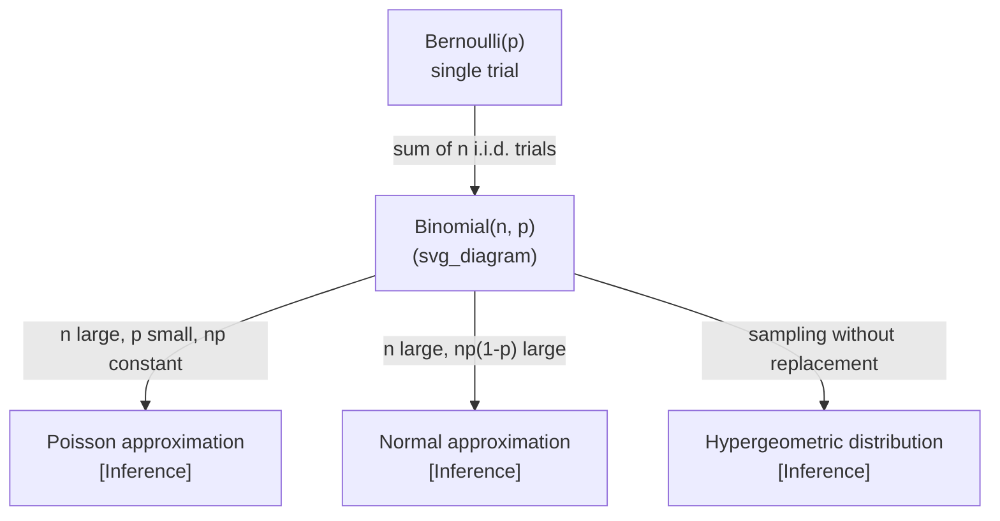

## Binomial Distribution

### Definition

The binomial distribution models the number of successes in $n$ independent trials, each with the same probability of success $p$. Each trial is a Bernoulli trial, meaning it has exactly two outcomes: success (probability $p$) or failure (probability $1-p$).

A random variable $X$ follows a binomial distribution if:

$$X \sim \text{Binomial}(n, p)$$

where $n$ is the number of trials and $p$ is the probability of success on each trial.

### Probability Mass Function

$$P(X = k) = \binom{n}{k} p^k (1-p)^{n-k}$$

where:
- $k$ = number of successes ($0 \le k \le n$)
- $\binom{n}{k} = \frac{n!}{k!(n-k)!}$ is the binomial coefficient, counting the number of ways to choose which $k$ trials are successes

**Key Points**
- Requires trials to be independent and identically distributed (i.i.d.)
- $p$ must remain constant across all trials
- $k$ must be a non-negative integer no greater than $n$
- The binomial coefficient accounts for all orderings of successes/failures that yield the same count $k$

### Assumptions

The binomial model relies on four conditions:
1. Fixed number of trials $n$
2. Each trial has only two possible outcomes
3. Constant probability $p$ across trials
4. Trials are independent of one another

[Inference] Violating these assumptions (e.g., sampling without replacement from a small population) typically means the binomial model is not the correct fit, and a hypergeometric distribution may be more appropriate instead. This is a modeling judgment, not a fixed rule, and should be verified against the specific data-generating process.

### Mean and Variance

$$E[X] = np$$

$$\text{Var}(X) = np(1-p)$$

$$\sigma = \sqrt{np(1-p)}$$

**Key Points**
- The mean scales linearly with both $n$ and $p$
- Variance is maximized when $p = 0.5$ and shrinks as $p$ approaches 0 or 1
- As $n$ grows, the distribution shape approaches a normal distribution [Inference] — this is a consequence of the Central Limit Theorem and De Moivre–Laplace theorem, and the quality of the approximation depends on how close $p$ is to 0.5 and how large $n$ is

### Shape Behavior

<svg xmlns="http://www.w3.org/2000/svg" viewBox="0 0 700 420">
  <text x="350" y="25" font-size="16" text-anchor="middle" font-weight="bold">Binomial PMF Shapes (svg_diagram)</text>

  
  <line x1="60" y1="370" x2="300" y2="370" stroke="black" stroke-width="1.5" />
  <line x1="60" y1="370" x2="60" y2="60" stroke="black" stroke-width="1.5" />
  <text x="180" y="400" font-size="12" text-anchor="middle">k (successes)</text>
  <text x="30" y="215" font-size="12" text-anchor="middle" transform="rotate(-90 30 215)">P(X=k)</text>
  <text x="180" y="55" font-size="13" text-anchor="middle">n=10, p=0.5 (symmetric)</text>

  
  <rect x="70" y="360" width="18" height="10" fill="#4a90d9" />
  <rect x="95" y="330" width="18" height="40" fill="#4a90d9" />
  <rect x="120" y="280" width="18" height="90" fill="#4a90d9" />
  <rect x="145" y="210" width="18" height="160" fill="#4a90d9" />
  <rect x="170" y="140" width="18" height="230" fill="#4a90d9" />
  <rect x="195" y="120" width="18" height="250" fill="#4a90d9" />
  <rect x="220" y="140" width="18" height="230" fill="#4a90d9" />
  <rect x="245" y="210" width="18" height="160" fill="#4a90d9" />
  <rect x="270" y="280" width="18" height="90" fill="#4a90d9" />

  
  <line x1="400" y1="370" x2="640" y2="370" stroke="black" stroke-width="1.5" />
  <line x1="400" y1="370" x2="400" y2="60" stroke="black" stroke-width="1.5" />
  <text x="520" y="400" font-size="12" text-anchor="middle">k (successes)</text>
  <text x="520" y="55" font-size="13" text-anchor="middle">n=10, p=0.2 (right-skewed)</text>

  
  <rect x="410" y="200" width="18" height="170" fill="#d9704a" />
  <rect x="435" y="120" width="18" height="250" fill="#d9704a" />
  <rect x="460" y="150" width="18" height="220" fill="#d9704a" />
  <rect x="485" y="230" width="18" height="140" fill="#d9704a" />
  <rect x="510" y="300" width="18" height="70" fill="#d9704a" />
  <rect x="535" y="345" width="18" height="25" fill="#d9704a" />
  <rect x="560" y="360" width="18" height="10" fill="#d9704a" />

  <text x="350" y="410" font-size="11" text-anchor="middle" fill="#555">Illustrative shapes only — not plotted from computed values [Unverified]</text>
</svg>

- When $p = 0.5$, the distribution is symmetric
- When $p < 0.5$, the distribution is right-skewed (mass concentrated at lower $k$)
- When $p > 0.5$, the distribution is left-skewed
- As $n$ increases, skewness decreases regardless of $p$ [Inference]

### Worked Example

Suppose a binary classifier has a known false positive rate of $p = 0.1$ on negative examples, and you draw $n = 5$ independent negative examples. What is the probability of exactly 2 false positives?

$$P(X = 2) = \binom{5}{2}(0.1)^2(0.9)^3$$

$$\binom{5}{2} = 10$$

$$P(X = 2) = 10 \times 0.01 \times 0.729 = 0.0729$$

**Output**
$$P(X = 2) = 0.0729 \approx 7.29\%$$

### Relevance to Machine Learning

**Key Points**
- Models binary outcomes across repeated trials, e.g., counting misclassifications over $n$ independent test samples [Inference] — assumes test samples are i.i.d., which may not hold under distribution shift or correlated sampling
- Underlies the derivation of the Bernoulli loss / binary cross-entropy when trials are treated individually rather than aggregated
- Used in A/B testing frameworks to model conversion counts, click-through counts, or success counts under a fixed sample size
- Appears in bootstrap and resampling analysis when estimating confidence intervals over binary outcome counts
- [Speculation] Some ensemble methods that aggregate independent binary classifier votes (e.g., certain majority-vote schemes) can be analyzed using binomial reasoning, though the independence assumption between classifiers is often violated in practice and should be checked case by case

### Relationship to Other Distributions

**Key Points**
- The Bernoulli distribution is the special case of Binomial with $n = 1$
- The Poisson approximation is commonly used when $n$ is large, $p$ is small, and $np$ stays moderate [Inference] — the accuracy of this approximation depends on how small $p$ is and how large $n$ is; general rules of thumb exist but are not universal thresholds
- The normal approximation via the Central Limit Theorem is often considered reasonable when both $np$ and $n(1-p)$ are sufficiently large [Inference] — "sufficiently large" varies by source and is not a fixed cutoff

### Common Pitfalls

- Assuming independence when trials are actually correlated (e.g., sequential dependent events)
- Applying the binomial model to sampling without replacement from small finite populations, where hypergeometric is more appropriate [Inference]
- Confusing the binomial coefficient $\binom{n}{k}$ with the probability itself
- Misinterpreting $p$ as fixed when it is actually estimated from data, which introduces additional uncertainty not captured by the binomial variance formula alone [Inference]

**Next Steps**
- Bernoulli distribution (foundational single-trial case)
- Poisson distribution and its relationship to the binomial under rare-event limits
- Normal approximation to the binomial (De Moivre–Laplace theorem)
- Hypergeometric distribution (sampling without replacement)
- Multinomial distribution (generalization to more than two outcomes)
- Negative binomial distribution (modeling number of trials until a fixed number of successes)
- Applications in hypothesis testing (binomial test, proportion tests)