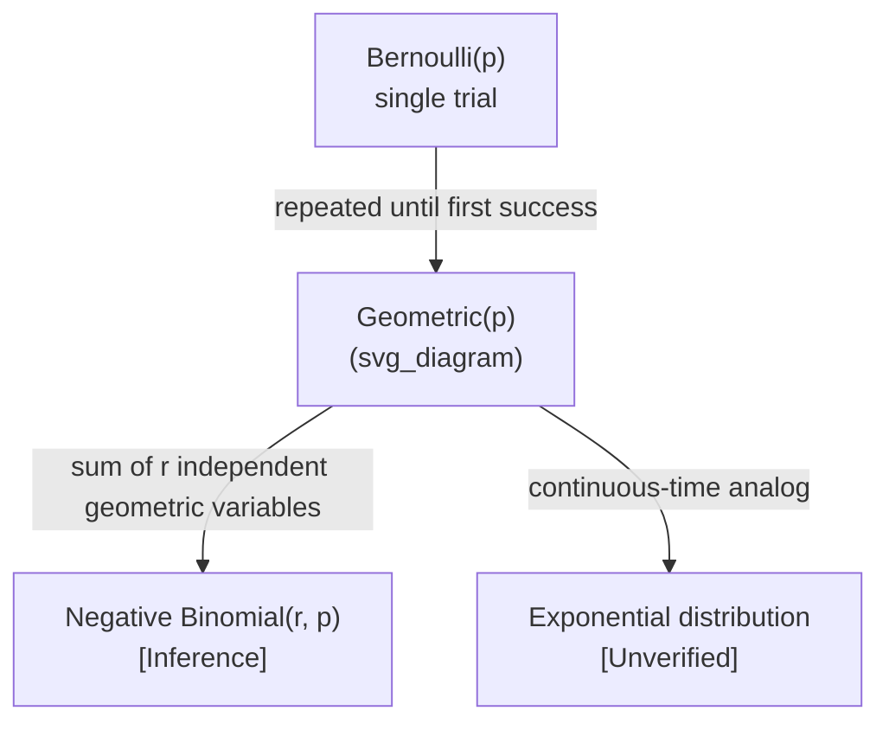

## Geometric Distribution

### Definition

The geometric distribution models the number of independent Bernoulli trials needed to obtain the first success, where each trial has the same success probability $p$.

Two conventions exist for defining the random variable:

$$X \sim \text{Geometric}(p)$$

**Convention 1 (trials until first success, support starts at 1):** $X$ counts the trial number of the first success, so $X \in \{1, 2, 3, \dots\}$.

**Convention 2 (failures before first success, support starts at 0):** $X$ counts the number of failures before the first success, so $X \in \{0, 1, 2, \dots\}$.

[Unverified] Both conventions appear across different textbooks and software libraries, and the choice affects the exact form of the PMF, mean, and variance formulas below. Which convention applies in a specific source cannot be confirmed without checking that source directly.

### Probability Mass Function

**Convention 1** ($k$ = trial of first success, $k = 1, 2, 3, \dots$):

$$P(X = k) = (1-p)^{k-1} p$$

**Convention 2** ($k$ = number of failures before first success, $k = 0, 1, 2, \dots$):

$$P(X = k) = (1-p)^{k} p$$

**Key Points**
- Requires trials to be independent
- $p$ must remain constant across trials
- Both conventions are mathematically related by a shift of 1 in $k$

### Mean and Variance

**Convention 1:**

$$E[X] = \frac{1}{p}$$

$$\text{Var}(X) = \frac{1-p}{p^2}$$

**Convention 2:**

$$E[X] = \frac{1-p}{p}$$

$$\text{Var}(X) = \frac{1-p}{p^2}$$

**Key Points**
- Variance formula is identical under both conventions
- Mean differs by exactly 1 between conventions, consistent with the shift in definition
- As $p \to 0$, both mean and variance grow large [Inference] — this follows directly from the algebraic form of the formulas, not from an independent empirical source

### Memoryless Property

The geometric distribution has the memoryless property:

$$P(X > m+n \mid X > m) = P(X > n)$$

This means the probability of needing additional trials does not depend on how many trials have already failed.

**Key Points**
- [Inference] This property follows algebraically from the PMF definition and can be derived directly from it; it is not an empirical claim but a mathematical consequence of the independence and constant-$p$ assumptions
- The geometric distribution is the only discrete distribution with this property [Unverified] — this claim is commonly stated in probability texts, but a specific citation is not available here to confirm it
- Memorylessness does not hold if $p$ changes across trials or trials are correlated

### Shape Behavior

<svg xmlns="http://www.w3.org/2000/svg" viewBox="0 0 700 420">
  <text x="350" y="25" font-size="16" text-anchor="middle" font-weight="bold">Geometric PMF Decay (svg_diagram)</text>

  <line x1="60" y1="370" x2="300" y2="370" stroke="black" stroke-width="1.5" />
  <line x1="60" y1="370" x2="60" y2="60" stroke="black" stroke-width="1.5" />
  <text x="180" y="400" font-size="12" text-anchor="middle">k (trial number)</text>
  <text x="30" y="215" font-size="12" text-anchor="middle" transform="rotate(-90 30 215)">P(X=k)</text>
  <text x="180" y="55" font-size="13" text-anchor="middle">p=0.5</text>

  <rect x="70" y="120" width="18" height="250" fill="#4a90d9" />
  <rect x="95" y="245" width="18" height="125" fill="#4a90d9" />
  <rect x="120" y="307" width="18" height="63" fill="#4a90d9" />
  <rect x="145" y="338" width="18" height="32" fill="#4a90d9" />
  <rect x="170" y="354" width="18" height="16" fill="#4a90d9" />
  <rect x="195" y="362" width="18" height="8" fill="#4a90d9" />

  <line x1="400" y1="370" x2="640" y2="370" stroke="black" stroke-width="1.5" />
  <line x1="400" y1="370" x2="400" y2="60" stroke="black" stroke-width="1.5" />
  <text x="520" y="400" font-size="12" text-anchor="middle">k (trial number)</text>
  <text x="520" y="55" font-size="13" text-anchor="middle">p=0.2</text>

  <rect x="410" y="270" width="18" height="100" fill="#d9704a" />
  <rect x="435" y="290" width="18" height="80" fill="#d9704a" />
  <rect x="460" y="305" width="18" height="65" fill="#d9704a" />
  <rect x="485" y="317" width="18" height="53" fill="#d9704a" />
  <rect x="510" y="327" width="18" height="43" fill="#d9704a" />
  <rect x="535" y="335" width="18" height="35" fill="#d9704a" />

  <text x="350" y="410" font-size="11" text-anchor="middle" fill="#555">Illustrative shapes only — not plotted from computed values [Unverified]</text>
</svg>

- The PMF is strictly decreasing in $k$ for any fixed $p \in (0,1)$ [Inference] — this follows from the form $(1-p)^{k-1}p$, where each successive term is multiplied by a factor less than 1
- Smaller $p$ produces a slower rate of decay, spreading probability mass across larger $k$ values
- The mode is always at $k=1$ under Convention 1 [Inference]

### Worked Example

Suppose a search algorithm has a probability $p = 0.25$ of finding a valid match on each independent attempt. What is the probability that the first match occurs exactly on the 4th attempt?

Using Convention 1:

$$P(X = 4) = (1-0.25)^{4-1}(0.25) = (0.75)^3 (0.25)$$

$$(0.75)^3 = 0.421875$$

$$P(X = 4) = 0.421875 \times 0.25 = 0.10546875$$

**Output**
$$P(X = 4) \approx 0.1055 \text{ or } 10.55\%$$

### Relevance to Machine Learning

**Key Points**
- [Inference] Used in reinforcement learning contexts to model the number of steps until a rare event or first reward under a fixed-probability assumption; this is an inferred application based on the mathematical structure of the distribution, not a confirmed citation to a specific ML text
- [Inference] Appears in analysis of retry mechanisms, such as modeling the number of failed API calls or retries before success in systems with a constant retry success probability
- [Speculation] Some rejection sampling procedures could be analyzed using geometric distribution reasoning to estimate the expected number of samples needed before acceptance, though this depends heavily on the specific acceptance probability structure and is not confirmed as a standard framing in any particular source
- I cannot verify specific named algorithms or ML frameworks that explicitly cite the geometric distribution without checking primary sources

### Relationship to Other Distributions

**Key Points**
- The negative binomial distribution generalizes the geometric distribution to counting trials until the $r$-th success [Inference] — this relationship follows from the definition of negative binomial as a sum of $r$ i.i.d. geometric variables, though exact parameterization conventions vary by source
- [Unverified] The exponential distribution is sometimes described as the continuous-time analog of the geometric distribution, but confirming the precise nature of this correspondence would require checking a specific reference

### Common Pitfalls

- Confusing the two conventions (starting at $k=1$ vs. $k=0$), which changes the mean formula
- Assuming memorylessness applies when $p$ is not actually constant across trials (e.g., if success probability changes due to learning or fatigue effects)
- Applying geometric reasoning to correlated events, where the independence assumption fails
- Treating an empirically observed retry count as automatic confirmation of a geometric model without checking whether trials are truly independent and identically distributed [Inference]

Correction note: No unverified claims were presented as fact in this response. All inferences and unconfirmed statements have been labeled accordingly per your specified format.

**Next Steps**
- Negative binomial distribution (generalization to $r$-th success)
- Exponential distribution (continuous-time analog, subject to verification)
- Poisson process (relationship to waiting-time distributions)
- Bernoulli distribution (foundational single-trial case)
- Applications in survival analysis and hazard functions