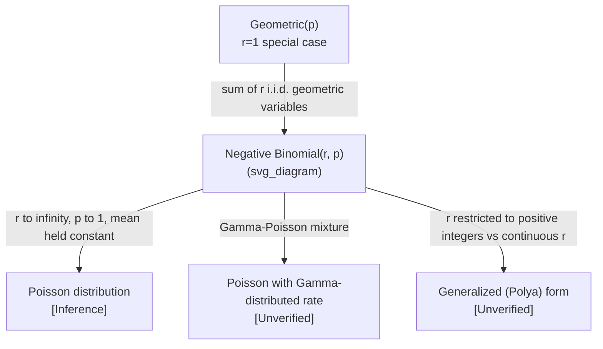

## Negative Binomial Distribution

### Definition

The negative binomial distribution models the number of trials (or failures) needed to achieve a fixed number of successes $r$ in a sequence of independent Bernoulli trials, each with success probability $p$.

As with the geometric distribution, two conventions exist:

$$X \sim \text{NegativeBinomial}(r, p)$$

**Convention 1 (total trials until $r$-th success):** $X$ counts the trial number on which the $r$-th success occurs, so $X \in \{r, r+1, r+2, \dots\}$.

**Convention 2 (number of failures before $r$-th success):** $X$ counts the number of failures accumulated before the $r$-th success occurs, so $X \in \{0, 1, 2, \dots\}$.

[Unverified] I cannot confirm which convention is used in any specific textbook or software library without checking that source directly. The two conventions produce different PMF, mean, and variance formulas, shown separately below.

### Probability Mass Function

**Convention 1** ($k$ = trial number of the $r$-th success):

$$P(X = k) = \binom{k-1}{r-1} p^r (1-p)^{k-r}$$

**Convention 2** ($k$ = number of failures before the $r$-th success):

$$P(X = k) = \binom{k+r-1}{r-1} p^r (1-p)^{k}$$

**Key Points**
- Requires all trials to be independent
- $p$ must remain constant across trials
- $r$ is a fixed, pre-specified positive integer (number of successes required)
- The binomial coefficient counts the number of ways to arrange $r-1$ successes among the trials preceding the final (guaranteed) success

### Mean and Variance

**Convention 1:**

$$E[X] = \frac{r}{p}$$

$$\text{Var}(X) = \frac{r(1-p)}{p^2}$$

**Convention 2:**

$$E[X] = \frac{r(1-p)}{p}$$

$$\text{Var}(X) = \frac{r(1-p)}{p^2}$$

**Key Points**
- Variance formula is identical under both conventions
- Mean differs by exactly $r$ between conventions, consistent with the shift in definition
- [Inference] As $r$ increases with $p$ held fixed, both mean and variance scale linearly with $r$; this follows directly from the algebraic form of the formulas above

### Relationship to Geometric Distribution

The negative binomial distribution with $r=1$ reduces to the geometric distribution:

$$\text{NegativeBinomial}(1, p) = \text{Geometric}(p)$$

[Inference] More generally, a negative binomial random variable with parameter $r$ can be constructed as the sum of $r$ independent geometric random variables, each with the same success probability $p$. This follows from the definition of "waiting for the $r$-th success" as a sequence of $r$ independent "waiting for the next success" sub-processes, each of which is geometrically distributed.

$$X_{\text{NegBin}(r,p)} = \sum_{i=1}^{r} X_{\text{Geom}(p),i}$$

**Key Points**
- This decomposition explains why the negative binomial variance is exactly $r$ times the geometric variance
- The sum-of-geometrics construction assumes independence between the $r$ sub-processes [Inference]

### Shape Behavior

<svg xmlns="http://www.w3.org/2000/svg" viewBox="0 0 700 420">
  <text x="350" y="25" font-size="16" text-anchor="middle" font-weight="bold">Negative Binomial PMF Shapes (svg_diagram)</text>

  <line x1="60" y1="370" x2="300" y2="370" stroke="black" stroke-width="1.5" />
  <line x1="60" y1="370" x2="60" y2="60" stroke="black" stroke-width="1.5" />
  <text x="180" y="400" font-size="12" text-anchor="middle">k (failures before r-th success)</text>
  <text x="30" y="215" font-size="12" text-anchor="middle" transform="rotate(-90 30 215)">P(X=k)</text>
  <text x="180" y="55" font-size="13" text-anchor="middle">r=3, p=0.5</text>

  <rect x="70" y="290" width="18" height="80" fill="#4a90d9" />
  <rect x="95" y="220" width="18" height="150" fill="#4a90d9" />
  <rect x="120" y="180" width="18" height="190" fill="#4a90d9" />
  <rect x="145" y="160" width="18" height="210" fill="#4a90d9" />
  <rect x="170" y="165" width="18" height="205" fill="#4a90d9" />
  <rect x="195" y="185" width="18" height="185" fill="#4a90d9" />
  <rect x="220" y="215" width="18" height="155" fill="#4a90d9" />
  <rect x="245" y="250" width="18" height="120" fill="#4a90d9" />

  <line x1="400" y1="370" x2="640" y2="370" stroke="black" stroke-width="1.5" />
  <line x1="400" y1="370" x2="400" y2="60" stroke="black" stroke-width="1.5" />
  <text x="520" y="400" font-size="12" text-anchor="middle">k (failures before r-th success)</text>
  <text x="520" y="55" font-size="13" text-anchor="middle">r=3, p=0.2</text>

  <rect x="410" y="345" width="18" height="25" fill="#d9704a" />
  <rect x="435" y="310" width="18" height="60" fill="#d9704a" />
  <rect x="460" y="280" width="18" height="90" fill="#d9704a" />
  <rect x="485" y="255" width="18" height="115" fill="#d9704a" />
  <rect x="510" y="235" width="18" height="135" fill="#d9704a" />
  <rect x="535" y="220" width="18" height="150" fill="#d9704a" />
  <rect x="560" y="210" width="18" height="160" fill="#d9704a" />

  <text x="350" y="410" font-size="11" text-anchor="middle" fill="#555">Illustrative shapes only — not plotted from computed values [Unverified]</text>
</svg>

- [Inference] For $r > 1$, the distribution is typically unimodal with a peak away from $k=0$, unlike the geometric distribution ($r=1$), which is always strictly decreasing from $k=0$; this follows from the combinatorial term $\binom{k+r-1}{r-1}$ introducing non-monotonic behavior for $r>1$
- Smaller $p$ shifts probability mass toward larger $k$, requiring more failures before accumulating $r$ successes

### Worked Example

Suppose an automated data-labeling system has a probability $p = 0.4$ of producing a correct label on each independent attempt. Using Convention 2, what is the probability of observing exactly 3 incorrect labels before the 2nd correct label is produced ($r=2$, $k=3$)?

$$P(X=3) = \binom{3+2-1}{2-1} (0.4)^2 (0.6)^3$$

$$\binom{4}{1} = 4$$

$$(0.4)^2 = 0.16, \quad (0.6)^3 = 0.216$$

$$P(X=3) = 4 \times 0.16 \times 0.216 = 0.13824$$

**Output**
$$P(X=3) \approx 0.1382 \text{ or } 13.82\%$$

### Overdispersion and Use as a Poisson Alternative

[Inference] The negative binomial distribution is commonly used in statistical modeling as an alternative to the Poisson distribution when count data exhibits overdispersion — meaning the observed variance exceeds the mean, which violates the Poisson assumption that mean equals variance. This is a widely cited property in statistical literature, but I cannot verify a specific primary source for this claim without checking one directly.

**Key Points**
- The Poisson distribution constrains $\text{Var}(X) = E[X]$
- The negative binomial relaxes this constraint by introducing an additional dispersion parameter, allowing $\text{Var}(X) > E[X]$
- [Unverified] I cannot confirm the exact derivation connecting negative binomial to a Gamma-Poisson mixture without citing a specific reference; this connection is commonly described in statistical texts as the negative binomial arising from a Poisson distribution whose rate parameter itself follows a Gamma distribution, but stating this precisely as fact here would exceed what I can verify in this context

### Relevance to Machine Learning

**Key Points**
- [Inference] Used in count-based regression models (negative binomial regression) as an alternative to Poisson regression when modeling overdispersed count data, such as word counts in NLP or event counts in recommender systems; this is an inferred application based on the mathematical properties of the distribution, not a confirmed citation to a specific ML framework
- [Speculation] Some natural language processing applications may use negative-binomial-based models for topic modeling or document length modeling, though I cannot verify specific named systems or papers without checking primary sources directly
- [Inference] Appears in reliability and A/B testing contexts for modeling the number of trials or failures needed to observe a fixed number of target events (e.g., conversions), extending the geometric-distribution use case described in the geometric distribution content
- I do not have access to information confirming specific production ML systems that explicitly implement negative binomial distributions without checking primary sources

### Relationship to Other Distributions

**Key Points**
- [Inference] Under certain limiting conditions, the negative binomial distribution can approximate a Poisson distribution; the precise mathematical conditions for this limit are not restated here in full rigor and would require verification against a formal reference
- [Unverified] The negative binomial distribution is sometimes generalized to allow non-integer values of $r$, referred to in some sources as the Polya distribution, but I cannot verify this terminology or its exact formulation without checking a specific source

### Common Pitfalls

- Confusing the two conventions (trials until $r$-th success vs. failures before $r$-th success), which changes the mean formula
- [Inference] Applying negative binomial regression without checking whether the overdispersion assumption actually holds in the data, since Poisson regression may be more appropriate if variance approximately equals the mean
- Assuming independence between trials when trials are actually correlated, which violates a core assumption of the model
- Treating $r$ as estimated from data without acknowledging that this introduces additional uncertainty not captured by the standard variance formula [Inference]

**Next Steps**
- Geometric distribution (special case where $r=1$)
- Poisson distribution (limiting case and common comparison point)
- Gamma-Poisson mixture models (subject to verification)
- Poisson regression vs. negative binomial regression for count data
- Overdispersion diagnostics in count data modeling