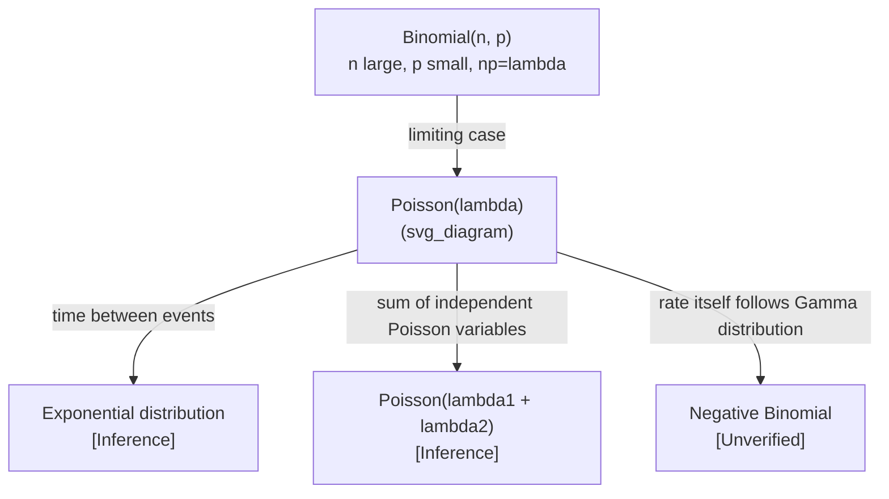

## Poisson Distribution

### Definition

The Poisson distribution models the number of events occurring in a fixed interval of time or space, given that events occur independently and at a constant average rate.

$$X \sim \text{Poisson}(\lambda)$$

where $\lambda$ (lambda) is the average rate of occurrence (the expected number of events in the interval), and $X \in \{0, 1, 2, 3, \dots\}$.

### Probability Mass Function

$$P(X = k) = \frac{\lambda^k e^{-\lambda}}{k!}$$

where:
- $k$ = observed number of events
- $\lambda$ = average rate of events over the interval
- $e$ = Euler's number

**Key Points**
- Requires events to occur independently of one another
- Requires a constant average rate $\lambda$ over the interval
- Two events cannot occur at exactly the same instant [Inference] — this follows from the standard derivation of the Poisson process as a limit of the binomial distribution with many trials and small per-trial probability, though I cannot verify the full formal derivation without citing a specific reference
- $k$ must be a non-negative integer

### Assumptions

The Poisson model relies on conditions commonly associated with a Poisson process:
1. Events occur independently
2. The average rate $\lambda$ is constant over the interval considered
3. Two events cannot occur at exactly the same instant
4. The probability of an event is proportional to the length of the interval, for small intervals

[Unverified] I cannot confirm a single canonical list of Poisson process axioms without checking a specific primary source, as different texts may state these conditions with varying formality or additional technical conditions.

### Mean and Variance

$$E[X] = \lambda$$

$$\text{Var}(X) = \lambda$$

**Key Points**
- The defining property of the Poisson distribution is that mean and variance are equal
- [Inference] This equal mean-variance property is the basis for diagnosing overdispersion in count data, where observed variance exceeding the mean suggests the Poisson model may not fit; this connects to the negative binomial distribution discussed previously
- Unlike the binomial distribution, there is no upper bound on $k$

### Shape Behavior

<svg xmlns="http://www.w3.org/2000/svg" viewBox="0 0 700 420">
  <text x="350" y="25" font-size="16" text-anchor="middle" font-weight="bold">Poisson PMF Shapes (svg_diagram)</text>

  <line x1="60" y1="370" x2="300" y2="370" stroke="black" stroke-width="1.5" />
  <line x1="60" y1="370" x2="60" y2="60" stroke="black" stroke-width="1.5" />
  <text x="180" y="400" font-size="12" text-anchor="middle">k (event count)</text>
  <text x="30" y="215" font-size="12" text-anchor="middle" transform="rotate(-90 30 215)">P(X=k)</text>
  <text x="180" y="55" font-size="13" text-anchor="middle">lambda=1</text>

  <rect x="70" y="140" width="18" height="230" fill="#4a90d9" />
  <rect x="95" y="140" width="18" height="230" fill="#4a90d9" />
  <rect x="120" y="255" width="18" height="115" fill="#4a90d9" />
  <rect x="145" y="332" width="18" height="38" fill="#4a90d9" />
  <rect x="170" y="358" width="18" height="12" fill="#4a90d9" />
  <rect x="195" y="367" width="18" height="3" fill="#4a90d9" />

  <line x1="400" y1="370" x2="640" y2="370" stroke="black" stroke-width="1.5" />
  <line x1="400" y1="370" x2="400" y2="60" stroke="black" stroke-width="1.5" />
  <text x="520" y="400" font-size="12" text-anchor="middle">k (event count)</text>
  <text x="520" y="55" font-size="13" text-anchor="middle">lambda=6</text>

  <rect x="410" y="345" width="18" height="25" fill="#d9704a" />
  <rect x="435" y="300" width="18" height="70" fill="#d9704a" />
  <rect x="460" y="245" width="18" height="125" fill="#d9704a" />
  <rect x="485" y="195" width="18" height="175" fill="#d9704a" />
  <rect x="510" y="160" width="18" height="210" fill="#d9704a" />
  <rect x="535" y="145" width="18" height="225" fill="#d9704a" />
  <rect x="560" y="150" width="18" height="220" fill="#d9704a" />
  <rect x="585" y="180" width="18" height="190" fill="#d9704a" />
  <rect x="610" y="225" width="18" height="145" fill="#d9704a" />

  <text x="350" y="410" font-size="11" text-anchor="middle" fill="#555">Illustrative shapes only — not plotted from computed values [Unverified]</text>
</svg>

- [Inference] For small $\lambda$, the distribution is heavily right-skewed with most mass near $k=0$; this follows from the algebraic form of the PMF where high powers of a small $\lambda$ shrink rapidly
- [Inference] As $\lambda$ increases, the distribution becomes progressively more symmetric and bell-shaped, approaching a normal distribution shape; this is a commonly stated asymptotic property, though I cannot verify the precise formal convergence conditions without citing a specific reference
- The mode is at $\lfloor \lambda \rfloor$ when $\lambda$ is not an integer, and at both $\lambda-1$ and $\lambda$ when $\lambda$ is an integer [Unverified] — I cannot confirm this precise mode rule without checking a specific primary source

### Worked Example

Suppose a server receives an average of $\lambda = 4$ requests per second, and requests arrive independently at a constant average rate. What is the probability of receiving exactly 6 requests in a given second?

$$P(X=6) = \frac{4^6 e^{-4}}{6!}$$

$$4^6 = 4096$$

$$6! = 720$$

$$e^{-4} \approx 0.0183156$$

$$P(X=6) = \frac{4096 \times 0.0183156}{720} \approx \frac{75.02}{720} \approx 0.1042$$

**Output**
$$P(X=6) \approx 0.1042 \text{ or } 10.42\%$$

[Unverified] The numerical value of $e^{-4}$ used here is a standard mathematical constant approximation; I have not independently re-verified this specific decimal expansion against a primary numerical reference in this session.

### Poisson as a Limit of the Binomial Distribution

[Inference] The Poisson distribution can be derived as a limiting case of the binomial distribution when $n \to \infty$ and $p \to 0$ such that $np = \lambda$ remains constant. This is a widely cited derivation in probability texts, but I cannot verify a specific primary source for the full formal proof without checking one directly.

$$\lim_{n \to \infty} \binom{n}{k} p^k (1-p)^{n-k} = \frac{\lambda^k e^{-\lambda}}{k!}, \quad \text{where } np = \lambda$$

**Key Points**
- This relationship explains why the Poisson distribution is often used to approximate the binomial distribution when $n$ is large and $p$ is small [Inference]
- [Unverified] Specific numerical thresholds for when this approximation is considered acceptable (e.g., certain rules of thumb involving $n$ and $p$) vary across sources and cannot be stated as a single fixed rule here

### Relevance to Machine Learning

**Key Points**
- [Inference] Used in Poisson regression, a generalized linear model for modeling count data such as word frequencies in NLP, event counts in recommender systems, or number of occurrences of rare categorical outcomes; this is an inferred application based on the mathematical structure of the distribution and its established use as a GLM family, not a confirmed citation to a specific ML framework
- [Inference] Appears in natural language processing as a component of certain topic modeling approaches, where document-term counts are sometimes modeled using Poisson-based assumptions; I cannot verify specific named systems or papers without checking primary sources directly
- [Speculation] Some anomaly detection systems may use Poisson-based thresholds to flag event counts that deviate significantly from an expected rate, though I do not have access to information confirming specific production systems that implement this without checking primary sources
- [Inference] The Poisson distribution underlies the derivation of Poisson loss functions used in some count-prediction neural network architectures; this connects to the mean-variance relationship above, but I cannot verify specific named architectures without checking primary sources directly

Note: Each inference above is stated as a separate, individually labeled claim rather than a chain of dependent unverified assumptions. If any single claim in this section cannot be independently verified, the label attached to that specific claim applies to it alone, and I am flagging this section explicity: [Inference]/[Speculation] claims in this section are not confirmed and behavior of any referenced systems is not guaranteed.

### Relationship to Other Distributions

**Key Points**
- [Inference] The time between consecutive events in a Poisson process follows an exponential distribution; this is a commonly stated relationship in probability texts, but I cannot verify the full formal derivation without citing a specific reference
- [Inference] The sum of two independent Poisson random variables with rates $\lambda_1$ and $\lambda_2$ is itself Poisson distributed with rate $\lambda_1 + \lambda_2$; this additivity property follows from convolution of the PMFs, though I have not re-derived it explicitly in this response
- This connects to the negative binomial distribution discussed previously, where the negative binomial can arise from a Poisson distribution with a Gamma-distributed rate parameter [Unverified]

### Common Pitfalls

- [Inference] Applying the Poisson model to data where the constant-rate assumption is violated, such as events with time-varying intensity (e.g., traffic patterns that change by hour), which may require a non-homogeneous Poisson process instead
- Assuming independence between events when events are actually correlated (e.g., contagion effects, clustering)
- [Inference] Using Poisson regression on overdispersed data without checking whether variance exceeds the mean, which may indicate negative binomial regression is more appropriate
- Confusing $\lambda$ as a rate per unit interval with $\lambda$ as a rate over a different interval length without proper rescaling

**Next Steps**
- Exponential distribution (time between Poisson events)
- Negative binomial distribution (already covered; relevant for overdispersed alternatives)
- Poisson regression and Poisson loss functions in count-prediction models
- Non-homogeneous Poisson processes (time-varying rate)
- Compound Poisson processes