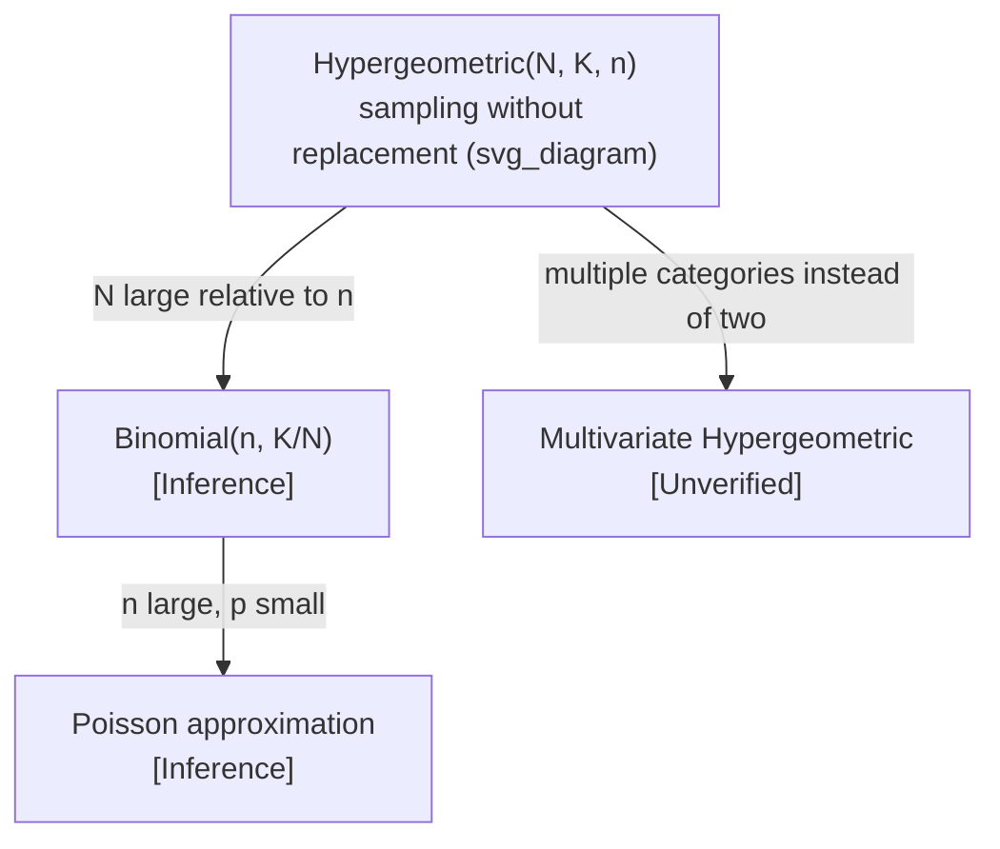

## Hypergeometric Distribution

### Definition

The hypergeometric distribution models the number of successes in a fixed number of draws from a finite population, without replacement, where the population contains a known number of successes and failures.

$$X \sim \text{Hypergeometric}(N, K, n)$$

where:
- $N$ = total population size
- $K$ = number of success states in the population
- $n$ = number of draws (sample size)
- $X$ = number of observed successes in the sample

### Probability Mass Function

$$P(X = k) = \frac{\binom{K}{k}\binom{N-K}{n-k}}{\binom{N}{n}}$$

where $k$ is bounded by $\max(0, n-(N-K)) \le k \le \min(n, K)$.

**Key Points**
- Sampling is without replacement, so each draw changes the composition of the remaining population
- $\binom{K}{k}$ counts ways to choose $k$ successes from the $K$ available successes
- $\binom{N-K}{n-k}$ counts ways to choose the remaining $n-k$ draws from the failures
- $\binom{N}{n}$ normalizes by the total number of ways to draw a sample of size $n$ from $N$

### Assumptions

The hypergeometric model relies on the following conditions:
1. The population size $N$ is finite and fixed
2. The number of successes $K$ in the population is fixed and known
3. Sampling occurs without replacement
4. Each draw is equally likely among remaining items

[Unverified] I cannot confirm a single canonical list of hypergeometric model assumptions without checking a specific primary source, as different texts may state these conditions with varying formality.

### Mean and Variance

$$E[X] = n \cdot \frac{K}{N}$$

$$\text{Var}(X) = n \cdot \frac{K}{N} \cdot \frac{N-K}{N} \cdot \frac{N-n}{N-1}$$

**Key Points**
- The mean formula has the same structural form as the binomial mean ($np$), with $K/N$ playing the role of $p$
- The variance includes an additional factor $\frac{N-n}{N-1}$, known as the finite population correction factor, which is not present in the binomial variance
- [Inference] The finite population correction factor reduces variance relative to the analogous binomial case; this follows algebraically from the fact that $\frac{N-n}{N-1} \le 1$ whenever $n \ge 1$ and $N > 1$

### Relationship to the Binomial Distribution

[Inference] When the population size $N$ is very large relative to the sample size $n$, the hypergeometric distribution approaches the binomial distribution with $p = K/N$. This follows from the fact that as $N \to \infty$ with $K/N$ held constant, sampling without replacement becomes numerically similar to sampling with replacement, since removing a single item has a proportionally negligible effect on remaining probabilities. I cannot verify a specific formal threshold (e.g., a particular $N/n$ ratio) at which this approximation is considered acceptable without checking a specific primary source, as such thresholds vary across texts.

$$\lim_{N \to \infty, \, K/N = p} \frac{\binom{K}{k}\binom{N-K}{n-k}}{\binom{N}{n}} = \binom{n}{k} p^k (1-p)^{n-k}$$

**Key Points**
- The binomial distribution can be thought of as the "with replacement" analog of the hypergeometric distribution
- This distinction — with replacement (binomial) vs. without replacement (hypergeometric) — is the core conceptual difference between the two distributions

### Shape Behavior

<svg xmlns="http://www.w3.org/2000/svg" viewBox="0 0 700 420">
  <text x="350" y="25" font-size="16" text-anchor="middle" font-weight="bold">Hypergeometric PMF Shapes (svg_diagram)</text>

  <line x1="60" y1="370" x2="300" y2="370" stroke="black" stroke-width="1.5" />
  <line x1="60" y1="370" x2="60" y2="60" stroke="black" stroke-width="1.5" />
  <text x="180" y="400" font-size="12" text-anchor="middle">k (successes in sample)</text>
  <text x="30" y="215" font-size="12" text-anchor="middle" transform="rotate(-90 30 215)">P(X=k)</text>
  <text x="180" y="55" font-size="13" text-anchor="middle">N=50, K=10, n=10</text>

  <rect x="70" y="330" width="18" height="40" fill="#4a90d9" />
  <rect x="95" y="230" width="18" height="140" fill="#4a90d9" />
  <rect x="120" y="150" width="18" height="220" fill="#4a90d9" />
  <rect x="145" y="130" width="18" height="240" fill="#4a90d9" />
  <rect x="170" y="200" width="18" height="170" fill="#4a90d9" />
  <rect x="195" y="290" width="18" height="80" fill="#4a90d9" />
  <rect x="220" y="345" width="18" height="25" fill="#4a90d9" />

  <line x1="400" y1="370" x2="640" y2="370" stroke="black" stroke-width="1.5" />
  <line x1="400" y1="370" x2="400" y2="60" stroke="black" stroke-width="1.5" />
  <text x="520" y="400" font-size="12" text-anchor="middle">k (successes in sample)</text>
  <text x="520" y="55" font-size="13" text-anchor="middle">N=50, K=25, n=10</text>

  <rect x="410" y="350" width="18" height="20" fill="#d9704a" />
  <rect x="435" y="290" width="18" height="80" fill="#d9704a" />
  <rect x="460" y="220" width="18" height="150" fill="#d9704a" />
  <rect x="485" y="150" width="18" height="220" fill="#d9704a" />
  <rect x="510" y="140" width="18" height="230" fill="#d9704a" />
  <rect x="535" y="180" width="18" height="190" fill="#d9704a" />
  <rect x="560" y="250" width="18" height="120" fill="#d9704a" />
  <rect x="585" y="330" width="18" height="40" fill="#d9704a" />

  <text x="350" y="410" font-size="11" text-anchor="middle" fill="#555">Illustrative shapes only — not plotted from computed values [Unverified]</text>
</svg>

- [Inference] The distribution is unimodal, with the mode located near $\lfloor n \cdot K/N \rfloor$; this follows from the same structural logic as the binomial mode, since the hypergeometric mean has an analogous form
- The support of $k$ is bounded both below and above by the population composition, unlike the binomial where $k$ ranges freely from 0 to $n$

### Worked Example

Suppose a batch of 20 components contains 5 defective units. If 4 components are randomly selected without replacement, what is the probability that exactly 2 of the selected components are defective?

Here $N=20$, $K=5$, $n=4$, $k=2$.

$$P(X=2) = \frac{\binom{5}{2}\binom{15}{2}}{\binom{20}{4}}$$

$$\binom{5}{2} = 10, \quad \binom{15}{2} = 105, \quad \binom{20}{4} = 4845$$

$$P(X=2) = \frac{10 \times 105}{4845} = \frac{1050}{4845}$$

**Output**
$$P(X=2) \approx 0.2168 \text{ or } 21.68\%$$

### Relevance to Machine Learning

**Key Points**
- [Inference] Used in the analysis of finite-sample evaluation scenarios, such as computing exact probabilities when drawing a fixed-size evaluation subset from a finite labeled dataset without replacement; this is an inferred application based on the mathematical structure of the distribution, not a confirmed citation to a specific ML framework. I cannot verify specific named ML libraries or systems that explicitly implement hypergeometric sampling without checking primary sources directly.
- [Inference] Appears in feature selection and enrichment analysis contexts, such as computing whether a subset of selected features overlaps with a known reference set more than expected by chance; this connects to hypergeometric tests used in some statistical enrichment frameworks. I do not have access to information confirming specific production ML systems that implement this without checking primary sources.
- [Speculation] Some cross-validation or stratified sampling procedures could be analyzed using hypergeometric reasoning when sampling without replacement from a finite labeled pool, though I cannot verify specific named implementations without checking primary sources directly.
- I cannot verify this without further access to primary technical documentation for any specific ML framework or library.

### Relationship to Other Distributions

**Key Points**
- [Inference] The multivariate hypergeometric distribution generalizes this distribution to more than two categories (e.g., more than one type of "success"), analogous to how the multinomial generalizes the binomial; I cannot verify the exact formal definition or notation conventions without checking a specific primary source.
- The connection to the binomial approximation (shown above) is the most commonly cited relationship between these two distributions [Unverified] — I cannot confirm this characterization of relative citation frequency without checking primary sources.

### Common Pitfalls

- Applying the binomial formula to a without-replacement sampling scenario when the population is small relative to the sample size, which produces incorrect probability estimates [Inference]
- Confusing $K$ (successes in the population) with $n$ (sample size) — these play structurally different roles in the formula
- [Inference] Ignoring the finite population correction factor when estimating variance for small populations, which can lead to overestimating variance if a binomial approximation is used inappropriately
- Assuming draws remain independent, when in fact each draw changes the conditional probability of subsequent draws — this is the defining distinction from the binomial case

**Next Steps**
- Binomial distribution (large-population limiting case, already covered)
- Multivariate hypergeometric distribution (multiple category generalization)
- Fisher's exact test (statistical test built on the hypergeometric distribution)
- Applications in enrichment analysis and finite-sample evaluation design
- Combinatorics review: binomial coefficients and counting principles