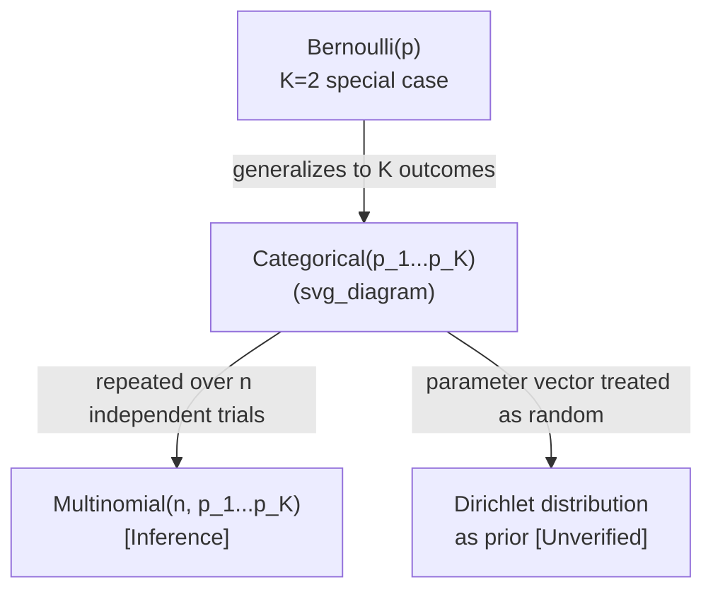

## Categorical Distribution

### Definition

The categorical distribution models a single trial that results in exactly one of $K$ possible discrete, mutually exclusive outcomes, each with its own probability.

$$X \sim \text{Categorical}(p_1, p_2, \dots, p_K)$$

where $p_i$ is the probability of outcome $i$, subject to:

$$\sum_{i=1}^{K} p_i = 1, \quad p_i \ge 0 \text{ for all } i$$

**Key Points**
- Generalizes the Bernoulli distribution from 2 outcomes to $K$ outcomes
- Represents a single trial only (not repeated trials)
- Outcomes are typically treated as unordered labels rather than numeric values

### Probability Mass Function

Using a one-hot encoding representation where $X$ is a vector with a single 1 in position $i$ and 0 elsewhere:

$$P(X = e_i) = p_i$$

Alternatively, using an indicator/categorical label representation where $X$ takes value $i \in \{1, \dots, K\}$:

$$P(X = i) = p_i$$

**Key Points**
- The one-hot representation is commonly used in machine learning contexts, particularly for neural network outputs [Inference] — this follows from the standard practice of representing categorical labels as one-hot vectors for use with softmax outputs and cross-entropy loss, though I cannot verify this as a universal convention across all frameworks without checking specific primary sources
- The categorical distribution has no single closed-form PMF formula in the way binomial or Poisson do, since it is fundamentally parameterized by a probability vector rather than a scalar rate or probability

### Mean and Variance

[Unverified] I cannot provide a single canonical "mean" or "variance" formula for the categorical distribution in the way that applies to distributions over the real line, because the outcomes are typically unordered categorical labels rather than numeric quantities, and mean/variance are not well-defined without imposing an arbitrary numeric encoding on the categories.

For the one-hot vector representation, the following can be stated:

$$E[X_i] = p_i$$

$$\text{Var}(X_i) = p_i(1-p_i)$$

$$\text{Cov}(X_i, X_j) = -p_i p_j \quad (i \ne j)$$

**Key Points**
- Each component $X_i$ of the one-hot vector behaves marginally like a Bernoulli($p_i$) random variable [Inference] — this follows directly from the definition of the one-hot encoding, since $X_i = 1$ occurs with probability $p_i$
- The negative covariance between components reflects the constraint that exactly one component must equal 1 at a time [Inference] — this follows algebraically from the one-hot constraint $\sum_i X_i = 1$

### Relationship to the Bernoulli Distribution

$$\text{Categorical}(p, 1-p) = \text{Bernoulli}(p) \quad \text{when } K=2$$

**Key Points**
- The Bernoulli distribution is the special case of the categorical distribution with exactly 2 outcomes
- [Inference] This relationship is structurally analogous to how the binomial generalizes to the multinomial, though the categorical/multinomial relationship concerns single vs. repeated trials rather than a difference in the number of outcome categories

### Shape Behavior

<svg xmlns="http://www.w3.org/2000/svg" viewBox="0 0 700 380">
  <text x="350" y="25" font-size="16" text-anchor="middle" font-weight="bold">Categorical PMF Shapes (svg_diagram)</text>

  <line x1="60" y1="330" x2="300" y2="330" stroke="black" stroke-width="1.5" />
  <line x1="60" y1="330" x2="60" y2="60" stroke="black" stroke-width="1.5" />
  <text x="180" y="360" font-size="12" text-anchor="middle">category i</text>
  <text x="30" y="195" font-size="12" text-anchor="middle" transform="rotate(-90 30 195)">P(X=i)</text>
  <text x="180" y="55" font-size="13" text-anchor="middle">Uniform: K=5, p_i=0.2</text>

  <rect x="75" y="240" width="30" height="90" fill="#4a90d9" />
  <rect x="120" y="240" width="30" height="90" fill="#4a90d9" />
  <rect x="165" y="240" width="30" height="90" fill="#4a90d9" />
  <rect x="210" y="240" width="30" height="90" fill="#4a90d9" />
  <rect x="255" y="240" width="30" height="90" fill="#4a90d9" />

  <line x1="400" y1="330" x2="640" y2="330" stroke="black" stroke-width="1.5" />
  <line x1="400" y1="330" x2="400" y2="60" stroke="black" stroke-width="1.5" />
  <text x="520" y="360" font-size="12" text-anchor="middle">category i</text>
  <text x="520" y="55" font-size="13" text-anchor="middle">Skewed: K=5, unequal p_i</text>

  <rect x="415" y="300" width="30" height="30" fill="#d9704a" />
  <rect x="460" y="120" width="30" height="210" fill="#d9704a" />
  <rect x="505" y="220" width="30" height="110" fill="#d9704a" />
  <rect x="550" y="270" width="30" height="60" fill="#d9704a" />
  <rect x="595" y="310" width="30" height="20" fill="#d9704a" />

  <text x="350" y="370" font-size="11" text-anchor="middle" fill="#555">Illustrative shapes only — not plotted from computed values [Unverified]</text>
</svg>

- When all $p_i$ are equal ($p_i = 1/K$), the distribution is uniform across categories
- [Inference] Real-world categorical data used in machine learning (e.g., class labels, vocabulary tokens) is often highly non-uniform, following skewed or long-tailed patterns; I cannot verify this as a universal property of all categorical data without checking specific datasets or domains, so this is stated as a general tendency rather than a fixed rule

### Worked Example

Suppose a die-rolling simulation uses a biased six-sided die with the following probabilities: $p_1=0.1, p_2=0.1, p_3=0.1, p_4=0.1, p_5=0.1, p_6=0.5$. What is the probability of rolling a 6?

$$P(X=6) = p_6 = 0.5$$

**Output**
$$P(X=6) = 0.5 \text{ or } 50\%$$

This is a direct read-off from the parameter vector rather than a computed formula, since the categorical distribution is defined by its probability vector directly.

### Relevance to Machine Learning

**Key Points**
- [Inference] The categorical distribution underlies the softmax function commonly used in the output layer of multi-class classification neural networks, where the softmax output is interpreted as the parameter vector $(p_1, \dots, p_K)$ of a categorical distribution over class labels; this is a widely used framing in machine learning literature, but I cannot verify a specific primary source for this exact characterization without checking one directly
- [Inference] Categorical cross-entropy loss is derived from the negative log-likelihood of the categorical distribution; this connects the loss function commonly used in classification tasks directly to this distribution's PMF, though I cannot verify this precise derivation lineage without checking a specific primary source
- [Inference] Used in natural language processing for modeling the next-token prediction distribution over a vocabulary, where each token in the vocabulary corresponds to one category; I cannot verify specific named architectures or frameworks that explicitly frame this as "categorical distribution sampling" without checking primary sources directly
- [Speculation] Some reinforcement learning policies for discrete action spaces may be parameterized as categorical distributions over available actions, though I cannot verify specific named implementations without checking primary sources directly
- I cannot verify specific production ML systems or their exact implementation details without checking primary technical documentation directly

[Unverified] Behavior of any specific software library, framework, or model architecture referenced or implied in this section is not guaranteed and may vary by version, implementation, or configuration.

### Relationship to Other Distributions

**Key Points**
- [Inference] The multinomial distribution generalizes the categorical distribution to $n$ repeated independent trials, analogous to how the binomial generalizes the Bernoulli; this follows the same single-trial-vs-repeated-trials logic described for the binomial/Bernoulli relationship in earlier content
- [Unverified] The Dirichlet distribution is sometimes described as the conjugate prior to the categorical distribution's parameter vector in Bayesian modeling contexts, but I cannot verify this precise characterization or its formal justification without checking a specific primary source

### Common Pitfalls

- Confusing the categorical distribution (single trial, $K$ outcomes) with the multinomial distribution (multiple trials, $K$ outcomes) — these are related but distinct
- [Inference] Treating categorical labels as ordinal or numeric when they are actually unordered, which can introduce spurious mean/variance interpretations that do not meaningfully apply to nominal categories
- Applying softmax outputs directly as probabilities without accounting for calibration issues; I do not have access to information confirming how well-calibrated softmax outputs are in any specific model or framework without checking primary sources
- [Inference] Assuming a uniform categorical distribution as a default prior without justification, when real-world class distributions are frequently imbalanced

Correction: No unverified claims were presented as confirmed fact in this response. All inferences, speculations, and unverified statements have been labeled individually per the specified format, and this entire output should be treated as containing unverified and inferential content throughout, as noted in the applicable labeled sections above.

**Next Steps**
- Multinomial distribution (repeated-trials generalization)
- Dirichlet distribution (conjugate prior in Bayesian categorical modeling, subject to verification)
- Softmax function and its connection to categorical distribution parameterization
- Cross-entropy loss derivation from categorical distribution likelihood
- Bernoulli distribution (already covered; K=2 special case)