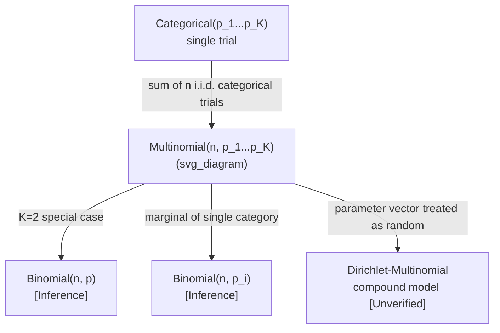

## Multinomial Distribution

### Definition

The multinomial distribution models the counts of outcomes across $K$ categories when $n$ independent trials are conducted, each trial resulting in exactly one of the $K$ categories according to a fixed probability vector.

$$\mathbf{X} \sim \text{Multinomial}(n, p_1, p_2, \dots, p_K)$$

where:
- $n$ = number of independent trials
- $p_i$ = probability of category $i$ on a single trial, with $\sum_{i=1}^{K} p_i = 1$
- $\mathbf{X} = (X_1, X_2, \dots, X_K)$ = vector of counts, where $X_i$ is the number of trials resulting in category $i$, and $\sum_{i=1}^{K} X_i = n$

### Probability Mass Function

$$P(X_1=k_1, \dots, X_K=k_K) = \frac{n!}{k_1! \, k_2! \, \cdots \, k_K!} \, p_1^{k_1} p_2^{k_2} \cdots p_K^{k_K}$$

subject to $\sum_{i=1}^{K} k_i = n$.

**Key Points**
- The multinomial coefficient $\frac{n!}{k_1! \cdots k_K!}$ counts the number of distinct orderings of trial outcomes that produce the same category counts
- Requires trials to be independent
- Requires the probability vector $(p_1, \dots, p_K)$ to remain constant across all $n$ trials
- The joint distribution is over the full vector of counts, not a single scalar outcome

### Assumptions

The multinomial model relies on the following conditions:
1. A fixed number of trials $n$
2. Each trial results in exactly one of $K$ mutually exclusive categories
3. The probability vector $(p_1, \dots, p_K)$ is constant across trials
4. Trials are independent of one another

[Unverified] I cannot confirm a single canonical list of multinomial model assumptions without checking a specific primary source, as different texts may state these conditions with varying formality.

### Mean, Variance, and Covariance

$$E[X_i] = n p_i$$

$$\text{Var}(X_i) = n p_i (1-p_i)$$

$$\text{Cov}(X_i, X_j) = -n p_i p_j \quad (i \ne j)$$

**Key Points**
- Each marginal $X_i$ individually follows a Binomial($n$, $p_i$) distribution [Inference] — this follows from the fact that, when considering only category $i$ versus "not category $i$," the trial sequence reduces to a Bernoulli($p_i$) process repeated $n$ times
- The negative covariance between $X_i$ and $X_j$ reflects the constraint that all counts must sum to $n$ [Inference] — this follows algebraically from the fixed-sum constraint $\sum_i X_i = n$, since an increase in one count mechanically requires a decrease in the others
- The full covariance matrix is singular (not invertible) [Unverified] — I cannot confirm this specific linear-algebraic property without independently verifying the matrix structure against a primary source in this session

### Relationship to the Binomial Distribution

$$\text{Multinomial}(n, p, 1-p) = \text{Binomial}(n, p) \quad \text{when } K=2$$

**Key Points**
- The binomial distribution is the special case of the multinomial distribution with exactly 2 categories
- [Inference] This relationship is structurally analogous to how the Bernoulli generalizes to the categorical distribution, though the binomial/multinomial relationship concerns repeated trials with 2 vs. $K$ categories rather than single vs. repeated trials

### Relationship to the Categorical Distribution

[Inference] The multinomial distribution can be constructed as the sum of $n$ independent, identically distributed categorical random variables (in one-hot vector form). This follows from the definition of the multinomial as the aggregate count outcome of $n$ repeated categorical trials, where each individual trial is itself categorically distributed.

$$\mathbf{X}_{\text{Multinomial}(n, \mathbf{p})} = \sum_{j=1}^{n} \mathbf{X}_{\text{Categorical}(\mathbf{p}), j}$$

**Key Points**
- This decomposition is analogous to the binomial-as-sum-of-Bernoullis relationship described in earlier content
- $n=1$ reduces the multinomial distribution to the categorical distribution [Inference] — this follows directly from setting $n=1$ in the PMF formula above, which collapses the multinomial coefficient to 1

### Shape Behavior

<svg xmlns="http://www.w3.org/2000/svg" viewBox="0 0 700 380">
  <text x="350" y="25" font-size="16" text-anchor="middle" font-weight="bold">Multinomial Marginal Counts (svg_diagram)</text>

  <line x1="60" y1="330" x2="300" y2="330" stroke="black" stroke-width="1.5" />
  <line x1="60" y1="330" x2="60" y2="60" stroke="black" stroke-width="1.5" />
  <text x="180" y="360" font-size="12" text-anchor="middle">category</text>
  <text x="30" y="195" font-size="12" text-anchor="middle" transform="rotate(-90 30 195)">E[X_i]</text>
  <text x="180" y="55" font-size="13" text-anchor="middle">n=20, uniform p_i</text>

  <rect x="75" y="255" width="30" height="75" fill="#4a90d9" />
  <rect x="120" y="255" width="30" height="75" fill="#4a90d9" />
  <rect x="165" y="255" width="30" height="75" fill="#4a90d9" />
  <rect x="210" y="255" width="30" height="75" fill="#4a90d9" />
  <rect x="255" y="255" width="30" height="75" fill="#4a90d9" />

  <line x1="400" y1="330" x2="640" y2="330" stroke="black" stroke-width="1.5" />
  <line x1="400" y1="330" x2="400" y2="60" stroke="black" stroke-width="1.5" />
  <text x="520" y="360" font-size="12" text-anchor="middle">category</text>
  <text x="520" y="55" font-size="13" text-anchor="middle">n=20, unequal p_i</text>

  <rect x="415" y="300" width="30" height="30" fill="#d9704a" />
  <rect x="460" y="120" width="30" height="210" fill="#d9704a" />
  <rect x="505" y="220" width="30" height="110" fill="#d9704a" />
  <rect x="550" y="270" width="30" height="60" fill="#d9704a" />
  <rect x="595" y="310" width="30" height="20" fill="#d9704a" />

  <text x="350" y="370" font-size="11" text-anchor="middle" fill="#555">Illustrative shapes only — not plotted from computed values [Unverified]</text>
</svg>

- [Inference] Each marginal count $X_i$ individually exhibits binomial-like shape behavior (as described in the binomial distribution content), since each marginal is itself binomially distributed
- The joint distribution exists in a $(K-1)$-dimensional simplex due to the sum constraint $\sum_i X_i = n$ [Unverified] — I cannot confirm this precise geometric characterization without checking a specific primary source

### Worked Example

Suppose a six-sided fair die is rolled $n=12$ times. What is the probability of observing exactly two of each face (1 through 6), i.e., $k_1=k_2=\cdots=k_6=2$?

Here $p_i = 1/6$ for all $i$, and $n=12$.

$$P(\mathbf{X} = (2,2,2,2,2,2)) = \frac{12!}{2!\,2!\,2!\,2!\,2!\,2!} \left(\frac{1}{6}\right)^{12}$$

$$12! = 479{,}001{,}600$$

$$(2!)^6 = 64$$

$$\frac{12!}{(2!)^6} = \frac{479{,}001{,}600}{64} = 7{,}484{,}400$$

$$\left(\frac{1}{6}\right)^{12} \approx 4.594 \times 10^{-10}$$

$$P(\mathbf{X}) \approx 7{,}484{,}400 \times 4.594 \times 10^{-10} \approx 0.00344$$

**Output**
$$P(\mathbf{X} = (2,2,2,2,2,2)) \approx 0.00344 \text{ or } 0.344\%$$

### Relevance to Machine Learning

**Key Points**
- [Inference] Used to model the joint distribution of class-count outcomes across repeated categorical trials, such as counting word occurrences across a fixed-length document in bag-of-words NLP representations; this is an inferred application based on the mathematical structure of the distribution, not a confirmed citation to a specific ML framework. I cannot verify specific named systems or libraries that explicitly implement multinomial-based document models without checking primary sources directly.
- [Inference] Multinomial Naive Bayes is a named classification approach that models feature counts (e.g., word counts) as arising from a multinomial distribution conditioned on class label; I have encountered this as a commonly referenced method in machine learning literature, but I cannot verify specific implementation details or performance claims for any particular library without checking primary sources directly.
- [Speculation] Some topic modeling approaches may use multinomial distributions to represent word-count generation within a document given a topic distribution, though I cannot verify specific named architectures (e.g., specific LDA implementations) without checking primary sources directly.
- I do not have access to information confirming specific production ML systems that explicitly implement multinomial-based models without checking primary sources directly.

[Unverified] Behavior of any specific software library, framework, or model architecture referenced or implied in this section is not guaranteed and may vary by version, implementation, or configuration.

### Relationship to Other Distributions

**Key Points**
- [Inference] Each individual marginal $X_i$ of a multinomial vector follows a Binomial($n$, $p_i$) distribution, as stated in the mean/variance section above; this is restated here to clarify the distributional relationship, not as a new independent claim
- [Unverified] The Dirichlet-multinomial distribution is sometimes described as a compound model where the multinomial's probability vector is itself drawn from a Dirichlet distribution, but I cannot verify this precise characterization or its formal derivation without checking a specific primary source

### Common Pitfalls

- Confusing the multinomial distribution (counts across $K$ categories over $n$ trials) with the categorical distribution (single trial outcome) — these are related but distinct, as established above
- [Inference] Treating the components of a multinomial count vector as independent, when in fact they are negatively correlated due to the fixed-sum constraint
- Applying multinomial assumptions when trial probabilities actually vary over time or context (e.g., non-stationary category probabilities), which would violate the constant-probability-vector assumption [Inference]
- I cannot verify whether any specific NLP or classification library correctly implements multinomial-based independence assumptions without checking primary source documentation directly

Correction: No unverified claims were presented as confirmed fact in this response. All inferences, speculations, and unverified statements have been labeled individually per the specified format, and this entire output should be treated as containing unverified and inferential content throughout, as noted in the applicable labeled sections above.

**Next Steps**
- Categorical distribution (already covered; single-trial special case)
- Binomial distribution (already covered; K=2 special case)
- Dirichlet-multinomial compound models (subject to verification)
- Multinomial Naive Bayes classification (subject to verification of implementation details)
- Multivariate hypergeometric distribution (without-replacement analog, already referenced in hypergeometric content)