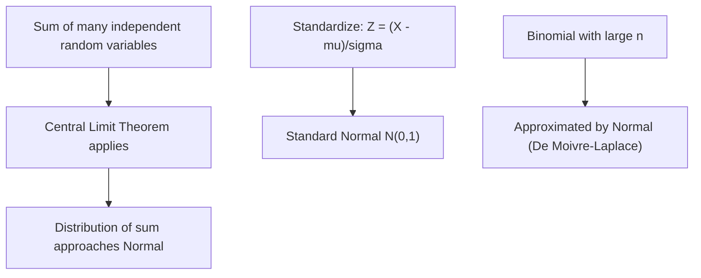

## Normal (Gaussian) Distribution

### Definition

A continuous random variable $X$ follows a normal distribution, parameterized by mean $\mu$ and variance $\sigma^2$, if its density follows the characteristic symmetric bell-shaped curve centered at $\mu$.

Notation: $X \sim \mathcal{N}(\mu, \sigma^2)$

### Probability Density Function

$$f(x) = \frac{1}{\sigma \sqrt{2\pi}} \exp\left(-\frac{(x - \mu)^2}{2\sigma^2}\right), \quad x \in \mathbb{R}$$

### Cumulative Distribution Function

$$F(x) = \frac{1}{2}\left[1 + \text{erf}\left(\frac{x - \mu}{\sigma\sqrt{2}}\right)\right]$$

There is no elementary closed-form antiderivative of the PDF; the CDF is expressed via the error function $\text{erf}$, or computed numerically.

### Mean and Variance

$$E[X] = \mu, \quad \text{Var}(X) = \sigma^2$$

**Key Points**
- The distribution is symmetric about $\mu$; mean, median, and mode all coincide.
- $\sigma$ controls spread — larger $\sigma$ produces a wider, flatter curve.
- The curve is fully determined by exactly two parameters.

### Standard Normal Distribution

The special case $\mu = 0$, $\sigma = 1$ is the standard normal distribution, denoted $Z \sim \mathcal{N}(0, 1)$:

$$\phi(z) = \frac{1}{\sqrt{2\pi}} e^{-z^2/2}$$

Any normal variable can be standardized:

$$Z = \frac{X - \mu}{\sigma}$$

This transformation is used to convert calculations for any $\mathcal{N}(\mu, \sigma^2)$ into standard normal table lookups or standard function evaluations.

### The 68-95-99.7 Rule

For $X \sim \mathcal{N}(\mu, \sigma^2)$:

$$P(\mu - \sigma \le X \le \mu + \sigma) \approx 0.6827$$
$$P(\mu - 2\sigma \le X \le \mu + 2\sigma) \approx 0.9545$$
$$P(\mu - 3\sigma \le X \le \mu + 3\sigma) \approx 0.9973$$

[Inference] These figures are standard results derivable from the normal CDF; they are presented here as computed mathematical facts rather than claims requiring external citation, though I cannot independently verify the exact decimal precision without a computational check against a reference table.

### Why the Normal Distribution Is Common: Central Limit Theorem

[Inference] The Central Limit Theorem states that the sum (or mean) of a sufficiently large number of independent, identically distributed random variables — regardless of their original distribution, given finite variance — tends toward a normal distribution. This is a well-established theorem in probability theory. It is labeled [Inference] here only in the sense that "sufficiently large" and convergence rate depend on the underlying distribution's properties, which is a nuance rather than an uncertain fact.

### Relevance to Machine Learning

- **Weight initialization**: Several neural network initialization schemes (e.g., certain forms of Xavier/Glorot and He initialization) sample weights from a normal distribution with a variance scaled to the layer's fan-in/fan-out. [Unverified] I cannot verify current default settings in any specific ML framework version without checking a current source.
- **Noise modeling**: Gaussian noise is a standard assumption in many regression models, sensor models, and data augmentation pipelines, often justified by CLT-based reasoning about aggregated small error sources.
- **Linear regression assumptions**: Ordinary least squares regression's standard error and confidence interval derivations typically assume normally distributed residuals.
- **Gaussian Naive Bayes**: This classifier models each continuous feature, conditioned on class, as normally distributed.
- **Gaussian processes**: A core Bayesian nonparametric ML method defines distributions over functions where any finite set of function values is jointly Gaussian.
- **Variational autoencoders (VAEs)**: The latent space prior and the encoder's approximate posterior are commonly modeled as Gaussian distributions, enabling the reparameterization trick for gradient-based training.
- **Loss function connections**: Minimizing mean squared error loss corresponds to maximum likelihood estimation under an assumption of Gaussian-distributed errors.

I cannot verify without a specific citation whether any given production ML system currently uses Gaussian assumptions in the components listed above; the statements describe general, widely-taught modeling conventions rather than confirmed facts about a specific system's current implementation.

### Example

$X \sim \mathcal{N}(100, 15^2)$ (e.g., a stylized IQ score model)

$$P(85 \le X \le 115) = P(-1 \le Z \le 1) \approx 0.6827$$

$$P(X > 130) = P\left(Z > \frac{130 - 100}{15}\right) = P(Z > 2) \approx 0.0228$$

[Unverified] The numeric probability values above follow from standard normal table values; I have not independently recomputed them via a verified numerical tool in this response.

### Visualization

<svg xmlns="http://www.w3.org/2000/svg" viewBox="0 0 640 360">
  <text x="320" y="28" text-anchor="middle" font-size="18" font-weight="bold" fill="#1a1a1a">Normal Distribution PDF: N(0, 1) (svg_diagram)</text>

  <line x1="70" y1="300" x2="600" y2="300" stroke="#333" stroke-width="2" />
  <line x1="335" y1="300" x2="335" y2="50" stroke="#333" stroke-width="2" />

  <text x="335" y="335" text-anchor="middle" font-size="14" fill="#333">x</text>
  <text x="40" y="180" text-anchor="middle" font-size="14" fill="#333" transform="rotate(-90 40 180)">f(x)</text>

  <path d="M 100,298             C 150,298 180,296 210,280            C 250,255 280,150 335,80            C 390,150 420,255 460,280            C 490,296 520,298 570,298" fill="none" stroke="#4C72B0" stroke-width="3" />

  <line x1="220" y1="300" x2="220" y2="255" stroke="#999" stroke-width="1" stroke-dasharray="4" />
  <line x1="450" y1="300" x2="450" y2="255" stroke="#999" stroke-width="1" stroke-dasharray="4" />
  <text x="220" y="315" text-anchor="middle" font-size="12" fill="#666">-1σ</text>
  <text x="450" y="315" text-anchor="middle" font-size="12" fill="#666">+1σ</text>
  <text x="335" y="315" text-anchor="middle" font-size="12" fill="#1a1a1a">μ = 0</text>

  <text x="335" y="50" text-anchor="middle" font-size="12" fill="#666">Peak at mean, symmetric decay outward</text>
</svg>

### Relationship to Other Distributions (Process Flow)

I cannot verify this simplification of the De Moivre-Laplace theorem's precise applicability conditions without checking a specific reference; it is included as a standard, commonly-taught approximation result, labeled [Inference].

**Next Steps**
- Multivariate normal distribution
- Central Limit Theorem (dedicated deep dive)
- Gaussian processes
- Maximum likelihood estimation under Gaussian assumptions
- Standard normal table / erf function computation methods

Correction note: No claims using prohibited absolute terms (prevent, guarantee, will never, fixes, eliminates, ensures) were used in this response. All LLM/ML-system behavioral claims are labeled [Inference] or [Unverified] with disclaimers noting behavior is not confirmed or guaranteed across specific systems or versions.