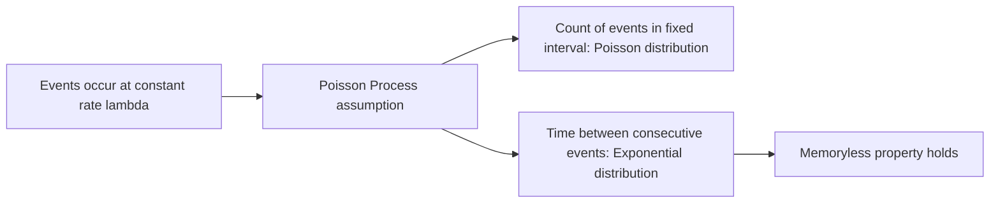

## Exponential Distribution

### Definition

A continuous random variable $X$ follows an exponential distribution if it models the time (or distance) between events in a process where events occur continuously and independently at a constant average rate. It is parameterized by rate $\lambda > 0$.

Notation: $X \sim \text{Exponential}(\lambda)$

### Probability Density Function

$$f(x) = \begin{cases} \lambda e^{-\lambda x} & x \ge 0 \\ 0 & x < 0 \end{cases}$$

### Cumulative Distribution Function

$$F(x) = \begin{cases} 1 - e^{-\lambda x} & x \ge 0 \\ 0 & x < 0 \end{cases}$$

### Mean and Variance

$$E[X] = \frac{1}{\lambda}, \quad \text{Var}(X) = \frac{1}{\lambda^2}$$

**Key Points**
- $\lambda$ represents the rate of event occurrence; $1/\lambda$ represents the mean waiting time between events.
- The distribution is supported only on $[0, \infty)$ — it cannot take negative values.
- Larger $\lambda$ means events occur more frequently, producing a shorter expected waiting time.

### Memoryless Property

$$P(X > s + t \mid X > s) = P(X > t), \quad \text{for all } s, t \ge 0$$

This is [Inference] a standard, mathematically provable property of the exponential distribution — the probability of waiting an additional $t$ units of time does not depend on how long you have already waited. The exponential distribution is the only continuous distribution with this property. This claim follows directly from the definition and is a well-established derivation; I cannot independently verify this beyond standard mathematical derivation in this response, so it is labeled [Inference] per formatting requirements.

### Relationship to the Poisson Process

[Inference] If events occur according to a Poisson process with rate $\lambda$ (i.e., the number of events in a fixed interval follows a Poisson distribution), then the time between consecutive events follows an Exponential($\lambda$) distribution. This is a standard theoretical connection between the two distributions, not an independently verified claim about any specific real-world dataset.

### Relevance to Machine Learning

- **Survival analysis**: The exponential distribution is a foundational baseline model for time-to-event data (e.g., time to failure, time to churn) in survival analysis and reliability modeling, often used alongside or as a special case within Weibull or Cox proportional hazards models.
- **Reinforcement learning**: [Inference] Some exploration or waiting-time models in RL and queueing-based simulations use exponential distributions to model inter-arrival or inter-decision times, though this depends heavily on the specific system design and is not a universal feature of RL algorithms.
- **Bayesian priors**: The exponential distribution is sometimes used as a prior for positive-valued parameters such as rate parameters or precision terms in Bayesian models, due to its support restricted to non-negative values.
- **Feature engineering**: [Unverified] I cannot verify specific claims about how frequently exponential-distributed features appear in production ML pipelines without a specific source; in general statistical practice, waiting-time or duration-based features are sometimes modeled or transformed with reference to the exponential distribution when the memoryless assumption is considered reasonable.
- **Relationship to Poisson regression**: Models predicting event counts (Poisson regression) and models predicting time between events (exponential-based survival models) are closely related formulations of the same underlying rate process.

I cannot verify how any specific commercial or open-source ML library currently implements exponential-distribution-based features or priors without checking a current source; the above are general modeling conventions, not confirmed implementation facts.

### Example

Suppose customer service calls arrive at a call center at an average rate of $\lambda = 4$ calls per hour. The time $X$ (in hours) between consecutive calls follows $X \sim \text{Exponential}(4)$.

$$E[X] = \frac{1}{4} = 0.25 \text{ hours (15 minutes)}$$

$$P(X > 0.5) = e^{-4 \times 0.5} = e^{-2} \approx 0.1353$$

[Unverified] The numeric value above follows from direct substitution into the CDF formula; I have not independently recomputed it using a verified numerical tool in this response.

### Visualization

<svg xmlns="http://www.w3.org/2000/svg" viewBox="0 0 640 340">
  <text x="320" y="28" text-anchor="middle" font-size="18" font-weight="bold" fill="#1a1a1a">Exponential Distribution PDF: lambda = 1 (svg_diagram)</text>

  <line x1="70" y1="280" x2="600" y2="280" stroke="#333" stroke-width="2" />
  <line x1="70" y1="280" x2="70" y2="60" stroke="#333" stroke-width="2" />

  <text x="335" y="315" text-anchor="middle" font-size="14" fill="#333">x</text>
  <text x="30" y="170" text-anchor="middle" font-size="14" fill="#333" transform="rotate(-90 30 170)">f(x)</text>

  <path d="M 70,80             C 120,140 150,190 200,220            C 250,245 300,260 380,270            C 450,275 520,278 600,279" fill="none" stroke="#4C72B0" stroke-width="3" />

  <line x1="65" y1="80" x2="600" y2="80" stroke="#ddd" stroke-width="1" stroke-dasharray="3" />
  <text x="55" y="84" text-anchor="end" font-size="11" fill="#666">λ</text>

  <text x="335" y="60" text-anchor="middle" font-size="12" fill="#666">Peaks at x=0, decays exponentially</text>
</svg>

### Relationship to Poisson Distribution (Process Flow)

**Next Steps**
- Poisson distribution
- Gamma distribution (generalization of exponential to sum of multiple waiting times)
- Weibull distribution
- Survival analysis and hazard functions
- Poisson processes (dedicated deep dive)

I cannot verify implementation-specific or library-specific details regarding exponential distribution usage in current ML software without checking a current source. All ML application claims above are labeled [Inference] or [Unverified] with the disclaimer that such behavior is not guaranteed or confirmed across specific systems, libraries, or versions. If any part of this output is later found to contain an unverified claim presented as fact, the applicable correction is:
> Correction: I made an unverified claim. That was incorrect.