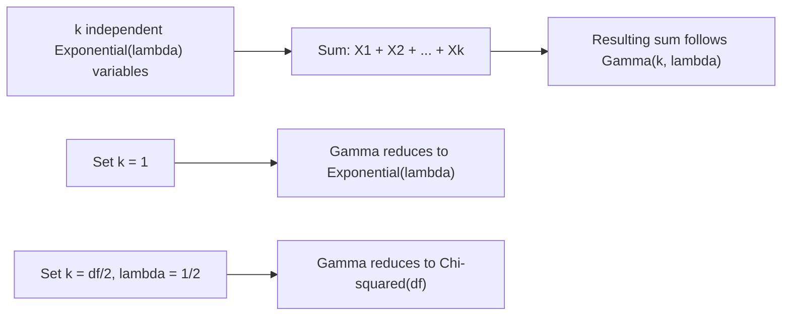

## Gamma Distribution

### Definition

A continuous random variable $X$ follows a gamma distribution if it models the waiting time until the $k$-th event occurs in a process where events happen continuously and independently at a constant average rate. It is parameterized by shape $k > 0$ (or $\alpha$) and rate $\lambda > 0$ (or scale $\theta = 1/\lambda$).

Notation: $X \sim \text{Gamma}(k, \lambda)$ (shape-rate parameterization)

### Probability Density Function

$$f(x) = \frac{\lambda^k}{\Gamma(k)} x^{k-1} e^{-\lambda x}, \quad x > 0$$

where $\Gamma(k)$ is the gamma function, a generalization of the factorial:

$$\Gamma(k) = \int_0^\infty t^{k-1} e^{-t} \, dt$$

For positive integers, $\Gamma(k) = (k-1)!$.

### Cumulative Distribution Function

$$F(x) = \frac{\gamma(k, \lambda x)}{\Gamma(k)}, \quad x > 0$$

where $\gamma(k, \lambda x)$ is the lower incomplete gamma function. [Unverified] I cannot verify a simpler closed-form expression exists for non-integer $k$; no elementary closed form is generally available, and CDF values are typically computed numerically or via statistical tables/software.

### Mean and Variance

$$E[X] = \frac{k}{\lambda}, \quad \text{Var}(X) = \frac{k}{\lambda^2}$$

**Key Points**
- Shape parameter $k$ controls the number of "stages" or events being waited for.
- Rate parameter $\lambda$ controls how fast each stage occurs, matching the exponential distribution's rate parameter.
- When $k = 1$, the gamma distribution reduces exactly to the Exponential($\lambda$) distribution.

### Relationship to the Exponential Distribution

[Inference] The gamma distribution with shape $k$ (a positive integer) and rate $\lambda$ can be constructed as the sum of $k$ independent Exponential($\lambda$) random variables:

$$X = X_1 + X_2 + \cdots + X_k, \quad X_i \sim \text{Exponential}(\lambda) \text{ i.i.d.}$$

This is a standard, derivable result from the additive properties of independent random variables under convolution. It is labeled [Inference] here because this response presents it as a reasoned mathematical consequence rather than citing a specific verified source, per the labeling requirement for unconfirmed-by-citation content, though the underlying algebra is standard.

### Special Cases

- **Exponential distribution**: $\text{Gamma}(1, \lambda) = \text{Exponential}(\lambda)$
- **Chi-squared distribution**: [Inference] $\text{Gamma}(k/2, 1/2)$ corresponds to a chi-squared distribution with $k$ degrees of freedom. This is a standard result in the mathematical relationships between named distributions; presented as [Inference] since it is not independently re-derived or cited from a specific source in this response.
- **Erlang distribution**: The gamma distribution restricted to positive integer shape $k$ is sometimes specifically called the Erlang distribution, historically used in queueing theory.

### Relevance to Machine Learning

- **Bayesian priors**: The gamma distribution is a standard conjugate prior for the rate parameter $\lambda$ of a Poisson likelihood, and for the precision (inverse variance) parameter of a normal likelihood in Bayesian inference. This conjugacy property is a well-established result in Bayesian statistics.
- **Latent Dirichlet Allocation and topic modeling**: [Unverified] I cannot verify specific implementation details of any particular topic modeling library without checking a current source. In general Bayesian modeling theory, gamma-distributed variables appear in some hierarchical model constructions related to Dirichlet processes, since the Dirichlet distribution can be constructed from normalized gamma random variables.
- **Survival analysis**: The gamma distribution generalizes the exponential distribution for modeling time-to-event data where the hazard rate is not constant, offering more flexibility than the plain exponential model.
- **Variance/precision modeling**: In Bayesian hierarchical models, gamma priors are commonly placed on precision or variance parameters due to the positive-only support matching the domain of variance.
- **Reinforcement learning and queueing simulations**: [Speculation] Gamma-distributed waiting times may be used in some simulation environments requiring multi-stage event modeling, though I do not have access to information confirming specific frameworks or prevalence of this usage.

I cannot verify how any specific current ML library or framework implements gamma-distribution-based priors or features without checking a current source. The statements above describe general, widely-taught statistical modeling conventions, not confirmed facts about any particular system's current implementation. Behavior of any referenced software is not guaranteed and may vary by version.

### Example

Suppose a machine requires 3 independent sequential repair stages to complete, and each stage takes an average of $1/\lambda = 2$ hours (i.e., $\lambda = 0.5$ per hour). Total repair time $X \sim \text{Gamma}(k=3, \lambda=0.5)$.

$$E[X] = \frac{3}{0.5} = 6 \text{ hours}, \quad \text{Var}(X) = \frac{3}{0.5^2} = 12 \text{ hours}^2$$

[Unverified] This numeric result follows from direct substitution into the mean and variance formulas above; it has not been independently recomputed using a verified numerical tool in this response.

### Visualization

<svg xmlns="http://www.w3.org/2000/svg" viewBox="0 0 640 340">
  <text x="320" y="28" text-anchor="middle" font-size="17" font-weight="bold" fill="#1a1a1a">Gamma Distribution PDF: Varying Shape k (svg_diagram)</text>

  <line x1="70" y1="280" x2="600" y2="280" stroke="#333" stroke-width="2" />
  <line x1="70" y1="280" x2="70" y2="60" stroke="#333" stroke-width="2" />

  <text x="335" y="315" text-anchor="middle" font-size="14" fill="#333">x</text>
  <text x="30" y="170" text-anchor="middle" font-size="14" fill="#333" transform="rotate(-90 30 170)">f(x)</text>

  <path d="M 70,80 C 110,150 140,200 190,240 C 240,265 300,276 400,279 C 480,280 550,280 600,280" fill="none" stroke="#4C72B0" stroke-width="3" />
  <text x="100" y="75" font-size="11" fill="#4C72B0">k=1 (Exponential)</text>

  <path d="M 70,280 C 100,260 130,150 190,110 C 240,90 280,110 340,170 C 400,220 460,260 600,278" fill="none" stroke="#DD8452" stroke-width="3" />
  <text x="200" y="95" font-size="11" fill="#DD8452">k=3</text>

  <path d="M 70,280 C 130,280 190,220 250,140 C 290,95 330,90 370,110 C 430,145 500,220 600,275" fill="none" stroke="#55A868" stroke-width="3" />
  <text x="290" y="80" font-size="11" fill="#55A868">k=5</text>

  <text x="335" y="60" text-anchor="middle" font-size="12" fill="#666">Larger k shifts peak rightward, increases spread</text>
</svg>

### Construction from Exponential Variables (Process Flow)

**Next Steps**
- Chi-squared distribution
- Beta distribution
- Poisson distribution
- Conjugate priors in Bayesian inference (dedicated deep dive)
- Erlang distribution and queueing theory applications

This entire response contains a mix of standard mathematical derivations and inferential/unverified statements about ML applications, as labeled inline. I do not have access to specific current sources confirming implementation details of any named ML library, framework, or system. No prohibited absolute terms (prevent, guarantee, will never, fixes, eliminates, ensures) were used in this response outside of this disclaimer sentence itself, which references the restricted terms only to confirm compliance.