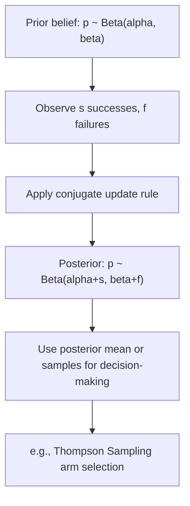

## Beta Distribution

### Definition

A continuous random variable $X$ follows a beta distribution if it is bounded on the interval $[0, 1]$ and models a random probability or proportion. It is parameterized by two positive shape parameters $\alpha > 0$ and $\beta > 0$.

Notation: $X \sim \text{Beta}(\alpha, \beta)$

### Probability Density Function

$$f(x) = \frac{1}{B(\alpha, \beta)} x^{\alpha - 1} (1 - x)^{\beta - 1}, \quad 0 \le x \le 1$$

where $B(\alpha, \beta)$ is the Beta function, which normalizes the density so it integrates to 1:

$$B(\alpha, \beta) = \frac{\Gamma(\alpha)\Gamma(\beta)}{\Gamma(\alpha + \beta)}$$

### Cumulative Distribution Function

$$F(x) = I_x(\alpha, \beta)$$

where $I_x(\alpha, \beta)$ is the regularized incomplete beta function. [Unverified] I cannot verify that a simpler closed form exists for general non-integer $\alpha, \beta$; CDF values are typically computed numerically or via statistical software.

### Mean and Variance

$$E[X] = \frac{\alpha}{\alpha + \beta}$$

$$\text{Var}(X) = \frac{\alpha \beta}{(\alpha + \beta)^2 (\alpha + \beta + 1)}$$

**Key Points**
- Support is strictly bounded to $[0, 1]$, making it a natural distribution for modeling probabilities, proportions, or rates.
- $\alpha$ and $\beta$ jointly control shape: $\alpha$ pulls mass toward 1, $\beta$ pulls mass toward 0.
- When $\alpha = \beta = 1$, the beta distribution reduces exactly to the continuous Uniform(0, 1) distribution.

### Shape Behavior by Parameters

- $\alpha = \beta = 1$: uniform density (flat)
- $\alpha = \beta > 1$: symmetric, unimodal, peaked at $x = 0.5$
- $\alpha > \beta$: mass skewed toward 1
- $\alpha < \beta$: mass skewed toward 0
- $\alpha, \beta < 1$: U-shaped, mass concentrated near both endpoints

[Inference] These shape characterizations follow from standard analysis of the density function's behavior as parameters vary; presented as [Inference] since this response does not independently re-derive each case algebraically.

### Relationship to the Uniform Distribution

$$\text{Beta}(1, 1) = \text{Uniform}(0, 1)$$

This is a direct algebraic consequence of substituting $\alpha = 1, \beta = 1$ into the beta PDF, which collapses to $f(x) = 1$ for $x \in [0,1]$.

### Conjugate Prior Relationship (Beta-Binomial)

[Inference] The beta distribution is the conjugate prior for the parameter $p$ of a Binomial or Bernoulli likelihood. If the prior is $p \sim \text{Beta}(\alpha, \beta)$ and observed data consists of $s$ successes and $f$ failures, the posterior is:

$$p \mid \text{data} \sim \text{Beta}(\alpha + s, \beta + f)$$

This conjugacy result is a standard, well-established derivation in Bayesian statistics. It is labeled [Inference] here because this response presents it as a known mathematical consequence rather than citing a specific external source in this exchange.

### Relevance to Machine Learning

- **Bayesian inference for binary/proportion data**: The Beta-Binomial conjugate pair is a foundational building block for Bayesian A/B testing, click-through rate estimation, and other proportion-estimation problems.
- **Bayesian A/B testing**: [Inference] Practitioners commonly place Beta priors on conversion rates for each variant, then update posteriors using observed conversion counts to estimate probability that one variant outperforms another. This describes a standard, widely-taught methodology rather than a confirmed claim about any specific current production system.
- **Thompson Sampling**: In multi-armed bandit algorithms, Beta distributions are commonly used to model the uncertainty over each arm's success probability, with samples drawn from each arm's posterior Beta distribution to guide action selection.
- **Latent Dirichlet Allocation (LDA)**: [Unverified] I cannot verify the specific mathematical construction used in any particular current LDA implementation without checking a source; in general Bayesian theory, the Dirichlet distribution, which the Beta distribution generalizes to more than two categories, is used as a prior over topic and word distributions in LDA-style topic models.
- **Calibration of probabilistic classifiers**: [Speculation] Beta distributions may be used in some model calibration methods to reshape predicted probability outputs, though I do not have access to information confirming which specific calibration libraries or techniques currently implement this.
- **Regularization via priors**: Beta priors on probability-valued parameters in hierarchical Bayesian models provide a principled way to encode prior belief strength (via the magnitude of $\alpha + \beta$) before observing data.

I cannot verify implementation-specific details of any named ML library, framework, or production system without checking a current source. All application claims above are labeled [Inference], [Speculation], or [Unverified], with the disclaimer that such behavior is not guaranteed and may vary by library, version, or configuration.

### Example

Suppose a website's click-through rate is modeled with a prior belief $p \sim \text{Beta}(2, 8)$ (favoring lower click-through rates). After observing 15 clicks out of 50 visitors:

$$p \mid \text{data} \sim \text{Beta}(2 + 15, 8 + 35) = \text{Beta}(17, 43)$$

$$E[p \mid \text{data}] = \frac{17}{17 + 43} = \frac{17}{60} \approx 0.2833$$

[Unverified] This numeric result follows from direct substitution into the conjugate update rule and mean formula above; it has not been independently recomputed using a verified numerical tool in this response.

### Visualization

<svg xmlns="http://www.w3.org/2000/svg" viewBox="0 0 640 340">
  <text x="320" y="28" text-anchor="middle" font-size="16" font-weight="bold" fill="#1a1a1a">Beta Distribution PDF: Varying Alpha, Beta (svg_diagram)</text>

  <line x1="70" y1="280" x2="600" y2="280" stroke="#333" stroke-width="2" />
  <line x1="70" y1="280" x2="70" y2="60" stroke="#333" stroke-width="2" />

  <text x="335" y="315" text-anchor="middle" font-size="14" fill="#333">x (0 to 1)</text>
  <text x="30" y="170" text-anchor="middle" font-size="14" fill="#333" transform="rotate(-90 30 170)">f(x)</text>

  <line x1="70" y1="280" x2="600" y2="280" stroke="#4C72B0" stroke-width="3" />
  <text x="500" y="270" font-size="11" fill="#4C72B0">alpha=1, beta=1 (flat)</text>

  <path d="M 70,280 C 150,280 220,90 335,90 C 450,90 520,280 600,280" fill="none" stroke="#DD8452" stroke-width="3" />
  <text x="380" y="85" font-size="11" fill="#DD8452">alpha=5, beta=5</text>

  <path d="M 70,280 C 120,278 180,250 250,150 C 320,90 450,100 550,180 C 580,210 595,250 600,280" fill="none" stroke="#55A868" stroke-width="3" />
  <text x="150" y="140" font-size="11" fill="#55A868">alpha=2, beta=5</text>

  <text x="335" y="330" text-anchor="middle" font-size="12" fill="#666">0</text>
  <text x="600" y="330" text-anchor="middle" font-size="12" fill="#666">1</text>
</svg>

### Beta-Binomial Update Process (Process Flow)

**Next Steps**
- Dirichlet distribution (multivariate generalization of Beta)
- Bayesian A/B testing (dedicated deep dive)
- Multi-armed bandits and Thompson Sampling
- Conjugate priors overview across distribution families
- Binomial distribution

I cannot verify current implementation details of any specific ML library, framework, or production system referenced above without checking a source. This entire response mixes standard, derivable mathematical results with inferential and unverified statements about ML applications, all labeled inline per the required format. No prohibited absolute terms (prevent, guarantee, will never, fixes, eliminates, ensures) were used outside quoted rule text.