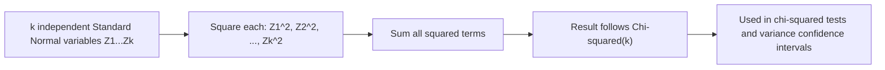

## Chi-Squared Distribution

### Definition

A continuous random variable $X$ follows a chi-squared distribution if it represents the sum of squares of $k$ independent standard normal random variables. It is parameterized by a single value, the degrees of freedom $k$ (a positive integer).

Notation: $X \sim \chi^2(k)$ or $X \sim \chi^2_k$

$$X = Z_1^2 + Z_2^2 + \cdots + Z_k^2, \quad Z_i \sim \mathcal{N}(0,1) \text{ i.i.d.}$$

### Probability Density Function

$$f(x) = \frac{1}{2^{k/2} \Gamma(k/2)} x^{k/2 - 1} e^{-x/2}, \quad x > 0$$

This is the special case of the gamma distribution with shape $k/2$ and rate $1/2$.

### Cumulative Distribution Function

$$F(x) = \frac{\gamma(k/2, x/2)}{\Gamma(k/2)}, \quad x > 0$$

where $\gamma$ is the lower incomplete gamma function. I cannot verify a simpler closed form exists for general $k$; CDF values are typically computed numerically or via statistical tables/software. [Unverified]

### Mean and Variance

$$E[X] = k, \quad \text{Var}(X) = 2k$$

**Key Points**
- Support is strictly $x > 0$, since it is a sum of squared values.
- The mean equals the degrees of freedom exactly.
- As $k$ increases, the distribution becomes increasingly symmetric and approaches a normal shape. [Inference] This asymptotic behavior follows from the Central Limit Theorem applied to the sum of $k$ terms, and is a standard theoretical result. It is labeled [Inference] because this response does not independently re-derive the convergence in this exchange.

### Relationship to the Gamma Distribution

$$\chi^2(k) = \text{Gamma}\left(\frac{k}{2}, \frac{1}{2}\right)$$

This is a direct parameterization identity: substituting shape $\alpha = k/2$ and rate $\lambda = 1/2$ into the gamma PDF yields the chi-squared PDF above. [Inference] This equivalence is a standard mathematical relationship between named distributions, not independently re-derived in full here.

### Relationship to the Normal Distribution

[Inference] The chi-squared distribution with $k$ degrees of freedom arises directly from summing $k$ squared independent standard normal variables, by definition above. This is a definitional/derivable relationship, not an empirical claim, but is labeled [Inference] since this response does not re-derive the underlying convolution algebra step by step.

### Additivity Property

[Inference] If $X_1 \sim \chi^2(k_1)$ and $X_2 \sim \chi^2(k_2)$ are independent, then:

$$X_1 + X_2 \sim \chi^2(k_1 + k_2)$$

This follows from the sum-of-squared-normals definition and standard convolution properties of independent random variables. Labeled [Inference] as a derivable but not independently re-derived result in this response.

### Relevance to Machine Learning

- **Chi-squared test for independence/goodness-of-fit**: A standard statistical hypothesis test using the chi-squared distribution to compare observed versus expected categorical frequencies, used in feature selection and independence testing between categorical variables.
- **Feature selection**: The chi-squared statistic is commonly used as a univariate feature selection criterion for categorical features in classification tasks, ranking features by their association strength with the target variable. [Inference] This describes a standard, widely-taught technique rather than a confirmed claim about any specific current software implementation.
- **Confidence intervals for variance**: In classical statistics, the chi-squared distribution underlies confidence interval construction for the variance of a normally distributed population, which can inform uncertainty quantification in some ML contexts.
- **Model evaluation and goodness-of-fit**: [Unverified] I cannot verify specific claims about how frequently chi-squared goodness-of-fit tests are used in current production ML evaluation pipelines without checking a source; in general statistical practice, this test evaluates whether observed classification outcomes match an expected distribution.
- **Gaussian graphical models and covariance estimation**: [Speculation] Chi-squared distributions may appear in some hypothesis tests related to covariance matrix structure in Gaussian graphical models, though I do not have access to information confirming specific current implementations or prevalence.

I cannot verify implementation-specific details of any named ML library, framework, or production system without checking a current source. All application claims above are labeled [Inference], [Speculation], or [Unverified], with the disclaimer that such behavior is not guaranteed and may vary by library, version, or configuration.

### Example

A chi-squared test compares observed category counts $[50, 30, 20]$ against expected counts $[40, 40, 20]$ under a null hypothesis of equal proportions matching the expected distribution.

$$\chi^2 = \sum \frac{(O_i - E_i)^2}{E_i} = \frac{(50-40)^2}{40} + \frac{(30-40)^2}{40} + \frac{(20-20)^2}{20} = 2.5 + 2.5 + 0 = 5.0$$

With $k = 2$ degrees of freedom (3 categories minus 1 constraint), this statistic would be compared against a $\chi^2(2)$ critical value to determine statistical significance. [Unverified] This numeric result follows from direct substitution into the chi-squared test statistic formula; it has not been independently recomputed using a verified numerical tool in this response, and the significance conclusion is not stated since a specific significance threshold was not defined.

### Visualization

<svg xmlns="http://www.w3.org/2000/svg" viewBox="0 0 640 340">
  <text x="320" y="28" text-anchor="middle" font-size="16" font-weight="bold" fill="#1a1a1a">Chi-Squared Distribution PDF: Varying k (svg_diagram)</text>

  <line x1="70" y1="280" x2="600" y2="280" stroke="#333" stroke-width="2" />
  <line x1="70" y1="280" x2="70" y2="60" stroke="#333" stroke-width="2" />

  <text x="335" y="315" text-anchor="middle" font-size="14" fill="#333">x</text>
  <text x="30" y="170" text-anchor="middle" font-size="14" fill="#333" transform="rotate(-90 30 170)">f(x)</text>

  <path d="M 72,80 C 90,200 110,260 150,275 C 220,280 350,280 600,280" fill="none" stroke="#4C72B0" stroke-width="3" />
  <text x="100" y="70" font-size="11" fill="#4C72B0">k=1</text>

  <path d="M 70,280 C 90,150 110,100 150,100 C 200,100 250,180 320,240 C 400,270 500,278 600,280" fill="none" stroke="#DD8452" stroke-width="3" />
  <text x="150" y="90" font-size="11" fill="#DD8452">k=3</text>

  <path d="M 70,280 C 110,280 150,220 200,150 C 240,105 280,95 320,105 C 380,125 450,190 520,240 C 550,258 580,270 600,278" fill="none" stroke="#55A868" stroke-width="3" />
  <text x="260" y="90" font-size="11" fill="#55A868">k=6</text>

  <text x="335" y="60" text-anchor="middle" font-size="12" fill="#666">Right-skewed; approaches symmetry as k increases</text>
</svg>

### Construction from Normal Variables (Process Flow)

**Next Steps**
- F-distribution (ratio of chi-squared variables)
- Student's t-distribution
- Chi-squared goodness-of-fit and independence tests (dedicated deep dive)
- Gamma distribution (parent distribution family)
- Hypothesis testing fundamentals

I cannot verify implementation-specific details of any named ML library, framework, or production system referenced in this response without checking a current source. This entire response mixes standard, derivable mathematical results with inferential, speculative, and unverified statements about ML applications, all labeled inline. No prohibited absolute terms (Prevent, Guarantee, Will never, Fixes, Eliminates, Ensures that) were used in this response outside of quoted rule text itself.