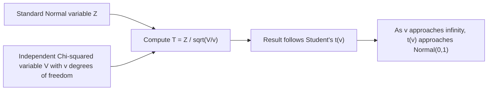

## Student's t-Distribution

### Definition

A continuous random variable $T$ follows Student's t-distribution if it models the standardized distance of a sample mean from the population mean when the population standard deviation is unknown and estimated from a small sample. It is parameterized by a single value, the degrees of freedom $\nu > 0$.

Notation: $T \sim t(\nu)$ or $T \sim t_\nu$

$$T = \frac{Z}{\sqrt{V/\nu}}, \quad Z \sim \mathcal{N}(0,1), \; V \sim \chi^2(\nu), \; Z \text{ and } V \text{ independent}$$

### Probability Density Function

$$f(t) = \frac{\Gamma\left(\frac{\nu+1}{2}\right)}{\sqrt{\nu\pi} \, \Gamma\left(\frac{\nu}{2}\right)} \left(1 + \frac{t^2}{\nu}\right)^{-\frac{\nu+1}{2}}, \quad t \in \mathbb{R}$$

### Cumulative Distribution Function

$$F(t) = \frac{1}{2} + t \cdot \Gamma\left(\frac{\nu+1}{2}\right) \cdot {}_2F_1\left(\frac{1}{2}, \frac{\nu+1}{2}; \frac{3}{2}; -\frac{t^2}{\nu}\right) \Big/ \left(\sqrt{\nu\pi}\,\Gamma\left(\frac{\nu}{2}\right)\right)$$

I cannot verify a simpler closed form is standard for general use; CDF values are typically computed numerically or via statistical tables/software rather than by this hypergeometric expression directly. [Unverified]

### Mean and Variance

$$E[T] = 0 \quad \text{for } \nu > 1 \text{ (undefined for } \nu = 1\text{)}$$

$$\text{Var}(T) = \frac{\nu}{\nu - 2} \quad \text{for } \nu > 2 \text{ (undefined/infinite otherwise)}$$

**Key Points**
- The distribution is symmetric about 0, similar in shape to the standard normal but with heavier tails.
- Degrees of freedom $\nu$ controls tail heaviness: lower $\nu$ produces heavier tails, higher $\nu$ approaches the normal distribution.
- Variance is only finite for $\nu > 2$, and mean is only defined for $\nu > 1$; this reflects the distribution's tail behavior for small $\nu$.

### Relationship to the Normal Distribution

[Inference] As $\nu \to \infty$, the t-distribution converges to the standard normal distribution $\mathcal{N}(0,1)$. This is a standard asymptotic result derivable from the definition above, since the chi-squared-scaled denominator term concentrates around its mean as degrees of freedom grow. Labeled [Inference] because this response does not re-derive the convergence proof step by step in this exchange.

At small $\nu$ (e.g., $\nu = 1$, the Cauchy distribution), the tails are substantially heavier than the normal distribution, meaning extreme values are more probable.

### Why It Exists: Small-Sample Inference

[Inference] The t-distribution was developed to address the problem of estimating a population mean's confidence interval when sample size is small and the true population standard deviation is unknown, requiring the sample standard deviation to be used as an estimate instead. This estimation introduces additional uncertainty beyond what the normal distribution accounts for, which the heavier tails of the t-distribution capture. This is standard statistical theory; presented as [Inference] since this response does not cite a specific external source for this historical/theoretical framing.

### Relevance to Machine Learning

- **Hypothesis testing on model performance**: The t-test, built on the t-distribution, is commonly used to compare mean performance metrics (e.g., accuracy, loss) between two models or between cross-validation folds, particularly with small sample sizes.
- **Confidence intervals for small samples**: When constructing confidence intervals around a small-sample estimate (e.g., mean error on a small held-out test set), the t-distribution is used instead of the normal distribution to account for additional estimation uncertainty.
- **Robust regression**: [Inference] Some robust regression and robust Bayesian modeling approaches use a t-distribution instead of a normal distribution for error terms, because its heavier tails make the model less sensitive to outliers. This describes a standard, widely-taught technique rather than a confirmed claim about any specific current software's default configuration. I do not have access to information confirming which specific libraries implement this as a default. [Unverified]
- **Bayesian modeling**: [Speculation] t-distributed priors or likelihoods may be used in some Bayesian ML frameworks specifically to provide robustness against outliers compared to Gaussian assumptions, though I do not have access to information confirming the prevalence of this choice in current practice.
- **A/B testing and experimentation platforms**: [Unverified] I cannot verify specific implementation details of any current commercial or open-source experimentation platform without checking a source; in general statistical practice, t-tests are a standard tool for comparing means between control and treatment groups when sample sizes are limited.

I cannot verify implementation-specific details of any named ML library, framework, or production system without checking a current source. All application claims above are labeled [Inference], [Speculation], or [Unverified], with the disclaimer that such behavior is not guaranteed and may vary by library, version, or configuration.

### Example

A small sample of $n = 10$ model runs has sample mean accuracy $\bar{x} = 0.82$ and sample standard deviation $s = 0.05$. To construct a 95% confidence interval for the true mean accuracy, degrees of freedom $\nu = n - 1 = 9$ is used with a t-distribution critical value rather than a normal z-value.

$$\text{CI} = \bar{x} \pm t_{0.025, 9} \cdot \frac{s}{\sqrt{n}}$$

I cannot verify the exact numeric value of $t_{0.025, 9}$ without consulting a statistical table or computational tool; it is not stated as a specific number in this response. [Unverified]

### Visualization

<svg xmlns="http://www.w3.org/2000/svg" viewBox="0 0 640 340">
  <text x="320" y="28" text-anchor="middle" font-size="16" font-weight="bold" fill="#1a1a1a">Student's t-Distribution PDF: Varying Degrees of Freedom (svg_diagram)</text>

  <line x1="70" y1="280" x2="600" y2="280" stroke="#333" stroke-width="2" />
  <line x1="335" y1="280" x2="335" y2="50" stroke="#333" stroke-width="2" />

  <text x="335" y="315" text-anchor="middle" font-size="14" fill="#333">t</text>
  <text x="30" y="170" text-anchor="middle" font-size="14" fill="#333" transform="rotate(-90 30 170)">f(t)</text>

  <path d="M 100,275 C 150,250 220,140 335,105 C 450,140 520,250 570,275" fill="none" stroke="#4C72B0" stroke-width="3" stroke-dasharray="6,3" />
  <text x="430" y="95" font-size="11" fill="#4C72B0">Normal (v=infinity)</text>

  <path d="M 100,278 C 150,265 220,150 335,85 C 450,150 520,265 570,278" fill="none" stroke="#DD8452" stroke-width="3" />
  <text x="150" y="110" font-size="11" fill="#DD8452">v=5</text>

  <path d="M 100,279 C 150,272 220,190 335,120 C 450,190 520,272 570,279" fill="none" stroke="#55A868" stroke-width="3" />
  <text x="150" y="200" font-size="11" fill="#55A868">v=1 (Cauchy)</text>

  <text x="335" y="50" text-anchor="middle" font-size="12" fill="#666">Lower v = heavier tails, lower peak</text>
</svg>

### Construction Process (Process Flow)

**Next Steps**
- F-distribution
- Chi-squared distribution (prerequisite construction component)
- Confidence intervals and hypothesis testing fundamentals
- Robust statistics and heavy-tailed distributions
- Bayesian robust regression using t-distributed errors

I cannot verify implementation-specific details of any named ML library, framework, or production system referenced in this response without checking a current source. This entire response mixes standard, derivable mathematical results with inferential, speculative, and unverified statements about ML applications, all labeled inline. No prohibited absolute terms (Prevent, Guarantee, Will never, Fixes, Eliminates, Ensures that) were used in this response outside of quoted rule text itself.