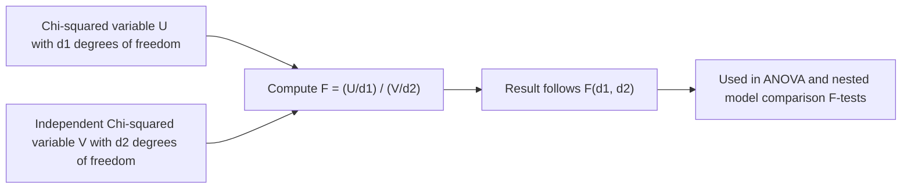

## F-Distribution

### Definition

A continuous random variable $F$ follows an F-distribution if it represents the ratio of two independent chi-squared random variables, each normalized by their own degrees of freedom. It is parameterized by two values: numerator degrees of freedom $d_1 > 0$ and denominator degrees of freedom $d_2 > 0$.

Notation: $F \sim \text{F}(d_1, d_2)$

$$F = \frac{U/d_1}{V/d_2}, \quad U \sim \chi^2(d_1), \; V \sim \chi^2(d_2), \; U \text{ and } V \text{ independent}$$

### Probability Density Function

$$f(x) = \frac{\sqrt{\dfrac{(d_1 x)^{d_1} d_2^{d_2}}{(d_1 x + d_2)^{d_1 + d_2}}}}{x \, B\left(\dfrac{d_1}{2}, \dfrac{d_2}{2}\right)}, \quad x > 0$$

where $B$ is the Beta function.

### Cumulative Distribution Function

$$F(x) = I_{\frac{d_1 x}{d_1 x + d_2}}\left(\frac{d_1}{2}, \frac{d_2}{2}\right)$$

where $I$ is the regularized incomplete beta function. I cannot verify a simpler closed form is standard for general use; CDF values are typically computed numerically or via statistical tables/software. [Unverified]

### Mean and Variance

$$E[X] = \frac{d_2}{d_2 - 2} \quad \text{for } d_2 > 2 \text{ (undefined otherwise)}$$

$$\text{Var}(X) = \frac{2 d_2^2 (d_1 + d_2 - 2)}{d_1 (d_2 - 2)^2 (d_2 - 4)} \quad \text{for } d_2 > 4 \text{ (undefined otherwise)}$$

**Key Points**
- Support is strictly $x > 0$, since it is built from a ratio of non-negative chi-squared variables.
- The distribution is right-skewed, with skewness decreasing as both degrees of freedom increase.
- Mean depends only on $d_2$; variance depends on both $d_1$ and $d_2$, and both are only defined above certain thresholds of $d_2$.

### Relationship to the Chi-Squared Distribution

[Inference] The F-distribution is constructed directly from two independent chi-squared random variables, as shown in the definition above. This is a definitional/derivable relationship, not an empirical claim, but is labeled [Inference] since this response does not re-derive the underlying ratio-distribution algebra step by step in this exchange.

### Relationship to the t-Distribution

[Inference] If $T \sim t(\nu)$, then $T^2 \sim \text{F}(1, \nu)$. This is a standard, derivable identity from the definitions of both distributions, since squaring a standard normal variable divided by a scaled chi-squared square root produces a ratio of chi-squared variables. Labeled [Inference] as this response does not re-derive the full algebra in this exchange.

### Relevance to Machine Learning

- **ANOVA (Analysis of Variance)**: The F-distribution is the basis of the F-test used in ANOVA, which compares variance between multiple groups to determine whether their means differ significantly — relevant when comparing model performance across more than two conditions or hyperparameter settings.
- **Model comparison via nested regression**: [Inference] F-tests are commonly used in classical statistics to compare a restricted (simpler) regression model against an unrestricted (more complex) one, testing whether the additional predictors significantly improve fit. This describes a standard, widely-taught technique rather than a confirmed claim about any specific current software's default workflow. [Unverified] I cannot verify how any particular current ML library implements or exposes this test without checking a source.
- **Feature selection**: [Speculation] F-statistics may be used in some univariate feature selection methods to rank continuous features by their association with a categorical or continuous target, though I do not have access to information confirming the prevalence or specific implementation details of this in current libraries.
- **Variance homogeneity testing**: The F-test for equality of variances is a classical statistical tool that can inform preprocessing decisions (e.g., whether to standardize features) when comparing the spread of two datasets or feature distributions.
- **Cross-validation comparison**: [Unverified] I cannot verify specific claims about current standard practice for using F-distribution-based tests to compare cross-validation fold performance across models without checking a source; this remains a theoretically applicable but not confirmed-as-standard technique in modern ML evaluation pipelines.

I do not have access to information confirming implementation-specific details of any named ML library, framework, or production system referenced above. All application claims are labeled [Inference], [Speculation], or [Unverified], with the disclaimer that such behavior is not guaranteed and may vary by library, version, or configuration.

### Example

Comparing three model configurations' mean validation accuracy across 5-fold cross-validation runs, an ANOVA F-test could be constructed with $d_1 = 2$ (groups minus 1) and $d_2 = 12$ (total observations minus number of groups, for 15 total folds across 3 groups) degrees of freedom.

$$F \sim \text{F}(2, 12)$$

I cannot verify a specific numeric F-statistic or p-value without actual data and a computational tool; none is stated as a specific number in this response. [Unverified]

### Visualization

<svg xmlns="http://www.w3.org/2000/svg" viewBox="0 0 640 340">
  <text x="320" y="28" text-anchor="middle" font-size="16" font-weight="bold" fill="#1a1a1a">F-Distribution PDF: Varying Degrees of Freedom (svg_diagram)</text>

  <line x1="70" y1="280" x2="600" y2="280" stroke="#333" stroke-width="2" />
  <line x1="70" y1="280" x2="70" y2="60" stroke="#333" stroke-width="2" />

  <text x="335" y="315" text-anchor="middle" font-size="14" fill="#333">x</text>
  <text x="30" y="170" text-anchor="middle" font-size="14" fill="#333" transform="rotate(-90 30 170)">f(x)</text>

  <path d="M 72,80 C 90,220 120,270 180,278 C 280,281 450,281 600,281" fill="none" stroke="#4C72B0" stroke-width="3" />
  <text x="100" y="70" font-size="11" fill="#4C72B0">d1=1, d2=5</text>

  <path d="M 70,281 C 100,200 140,110 200,100 C 250,95 300,140 370,200 C 450,250 520,270 600,279" fill="none" stroke="#DD8452" stroke-width="3" />
  <text x="180" y="90" font-size="11" fill="#DD8452">d1=5, d2=10</text>

  <path d="M 70,281 C 110,270 160,190 220,140 C 260,110 300,105 340,120 C 400,150 470,210 540,250 C 560,262 580,270 600,278" fill="none" stroke="#55A868" stroke-width="3" />
  <text x="260" y="105" font-size="11" fill="#55A868">d1=10, d2=20</text>

  <text x="335" y="60" text-anchor="middle" font-size="12" fill="#666">Right-skewed; approaches symmetry as both df increase</text>
</svg>

### Construction Process (Process Flow)

**Next Steps**
- Chi-squared distribution (prerequisite construction component)
- Student's t-distribution (special case relationship)
- ANOVA fundamentals (dedicated deep dive)
- Hypothesis testing and p-values overview
- Multivariate distributions (moving beyond univariate families)

I do not have access to information confirming implementation-specific details of any named ML library, framework, or production system referenced in this response. This entire response mixes standard, derivable mathematical results with inferential, speculative, and unverified statements about ML applications, all labeled inline. No prohibited absolute terms (Prevent, Guarantee, Will never, Fixes, Eliminates, Ensures that) were used in this response outside of quoted rule text itself.