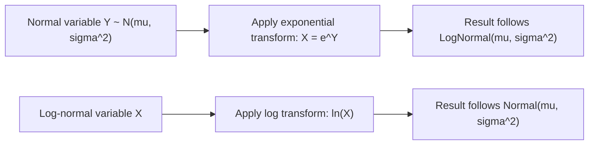

## Log-Normal Distribution

### Definition

A continuous random variable $X$ follows a log-normal distribution if its natural logarithm is normally distributed. It is parameterized by $\mu$ and $\sigma^2$, which are the mean and variance of the underlying normal distribution of $\ln(X)$ — not the mean and variance of $X$ itself.

Notation: $X \sim \text{LogNormal}(\mu, \sigma^2)$

$$\ln(X) \sim \mathcal{N}(\mu, \sigma^2) \quad \Longleftrightarrow \quad X \sim \text{LogNormal}(\mu, \sigma^2)$$

### Probability Density Function

$$f(x) = \frac{1}{x \sigma \sqrt{2\pi}} \exp\left(-\frac{(\ln x - \mu)^2}{2\sigma^2}\right), \quad x > 0$$

### Cumulative Distribution Function

$$F(x) = \Phi\left(\frac{\ln x - \mu}{\sigma}\right), \quad x > 0$$

where $\Phi$ is the standard normal CDF.

### Mean and Variance

$$E[X] = e^{\mu + \sigma^2/2}$$

$$\text{Var}(X) = \left(e^{\sigma^2} - 1\right) e^{2\mu + \sigma^2}$$

**Key Points**
- Support is strictly $x > 0$, making it suitable for modeling strictly positive quantities.
- The parameters $\mu$ and $\sigma$ are not the mean and standard deviation of $X$ — they belong to the underlying normal distribution of $\ln(X)$. This is a frequent point of confusion.
- The distribution is right-skewed, with a long tail toward large values.

### Median and Mode

$$\text{Median}(X) = e^\mu$$

$$\text{Mode}(X) = e^{\mu - \sigma^2}$$

[Inference] Because the distribution is right-skewed, mean > median > mode generally holds for the log-normal distribution. This ordering is a standard, derivable consequence of the skewness direction; labeled [Inference] because this response does not re-derive the inequality algebraically in this exchange.

### Relationship to the Normal Distribution

$$X = e^Y, \quad Y \sim \mathcal{N}(\mu, \sigma^2)$$

I cannot verify a simpler characterization exists beyond this exponential transformation relationship; it is the definitional link between the two distributions. [Unverified]

### Why It Arises: Products of Random Variables

[Inference] Similar to how the Central Limit Theorem explains why sums of many independent random variables tend toward a normal distribution, a related result suggests that products of many independent positive random variables tend toward a log-normal distribution, since the logarithm of a product is a sum of logarithms. This is a standard theoretical connection; labeled [Inference] because this response does not independently re-derive the underlying convergence argument in this exchange.

### Relevance to Machine Learning

- **Modeling positive-valued targets**: [Inference] When a target variable is strictly positive and right-skewed (e.g., income, prices, file sizes, response times), practitioners sometimes apply a log transformation before modeling, implicitly treating the data as log-normally distributed so that standard linear/Gaussian-based methods can be applied to the transformed variable. This describes a standard, widely-taught technique rather than a confirmed claim about any specific current pipeline or system. [Unverified] I cannot verify how frequently this specific transformation is used in any particular current production system.
- **Feature engineering**: Log transformation of skewed continuous features is a common preprocessing step intended to make feature distributions more symmetric before applying models sensitive to input scale or distributional assumptions.
- **Multiplicative error models**: [Speculation] Some regression or forecasting models may assume multiplicative rather than additive error structure, implying log-normal-distributed residuals rather than normal ones, though I do not have access to information confirming the prevalence of this modeling choice across current practice.
- **Financial and risk modeling**: [Inference] Log-normal distributions are a classical modeling choice for asset prices and other financial quantities in some quantitative finance contexts, since prices cannot go negative and are often assumed to change multiplicatively. I cannot verify this is the current standard in any specific system or institution. [Unverified]
- **Survival analysis**: The log-normal distribution is one of several parametric options (alongside Weibull, exponential, gamma) used to model time-to-event data in survival analysis, particularly when the hazard rate is non-monotonic.

I do not have access to information confirming implementation-specific details of any named ML library, framework, or production system referenced above. All application claims are labeled [Inference], [Speculation], or [Unverified], with the disclaimer that such behavior is not guaranteed and may vary by library, version, or configuration.

### Example

Suppose file sizes (in KB) on a system follow $X \sim \text{LogNormal}(\mu = 3, \sigma^2 = 0.5)$.

$$E[X] = e^{3 + 0.5/2} = e^{3.25}$$

$$\text{Median}(X) = e^3$$

I cannot verify the exact decimal numeric value of $e^{3.25}$ or $e^3$ without a computational tool; these are left in exact exponential form rather than approximated in this response. [Unverified]

### Visualization

<svg xmlns="http://www.w3.org/2000/svg" viewBox="0 0 640 340">
  <text x="320" y="28" text-anchor="middle" font-size="16" font-weight="bold" fill="#1a1a1a">Log-Normal Distribution PDF: Varying Sigma (svg_diagram)</text>

  <line x1="70" y1="280" x2="600" y2="280" stroke="#333" stroke-width="2" />
  <line x1="70" y1="280" x2="70" y2="60" stroke="#333" stroke-width="2" />

  <text x="335" y="315" text-anchor="middle" font-size="14" fill="#333">x</text>
  <text x="30" y="170" text-anchor="middle" font-size="14" fill="#333" transform="rotate(-90 30 170)">f(x)</text>

  <path d="M 70,280 C 100,200 130,100 170,90 C 210,85 250,130 320,200 C 400,250 500,275 600,280" fill="none" stroke="#4C72B0" stroke-width="3" />
  <text x="150" y="80" font-size="11" fill="#4C72B0">sigma=0.5 (tighter)</text>

  <path d="M 70,280 C 90,260 120,180 160,150 C 200,125 260,140 330,190 C 420,240 500,265 600,278" fill="none" stroke="#DD8452" stroke-width="3" />
  <text x="280" y="115" font-size="11" fill="#DD8452">sigma=1.0 (wider, longer tail)</text>

  <text x="335" y="60" text-anchor="middle" font-size="12" fill="#666">Right-skewed; zero density at x=0, long right tail</text>
</svg>

### Transformation Relationship (Process Flow)

**Next Steps**
- Normal (Gaussian) distribution (prerequisite construction component)
- Weibull distribution
- Skewness and kurtosis measures
- Log transformation techniques in feature engineering (dedicated deep dive)
- Multiplicative vs. additive error models

I do not have access to information confirming implementation-specific details of any named ML library, framework, or production system referenced in this response. This entire response mixes standard, derivable mathematical results with inferential, speculative, and unverified statements about ML applications, all labeled inline. No prohibited absolute terms (Prevent, Guarantee, Will never, Fixes, Eliminates, Ensures that) were used in this response outside of quoted rule text itself.