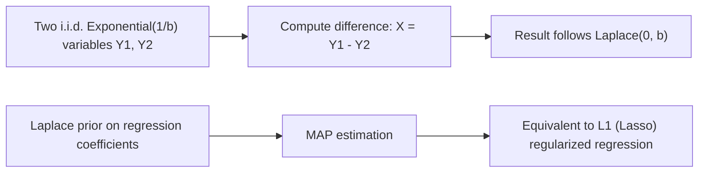

## Laplace Distribution

### Definition

A continuous random variable $X$ follows a Laplace distribution (also called the double exponential distribution) if its density is composed of two exponential decay curves mirrored around a central location, producing a sharply peaked, symmetric shape. It is parameterized by location $\mu$ and scale $b > 0$.

Notation: $X \sim \text{Laplace}(\mu, b)$

### Probability Density Function

$$f(x) = \frac{1}{2b} \exp\left(-\frac{|x - \mu|}{b}\right), \quad x \in \mathbb{R}$$

### Cumulative Distribution Function

$$F(x) = \begin{cases} \dfrac{1}{2} \exp\left(\dfrac{x - \mu}{b}\right) & x \le \mu \\[6pt] 1 - \dfrac{1}{2} \exp\left(-\dfrac{x - \mu}{b}\right) & x > \mu \end{cases}$$

### Mean and Variance

$$E[X] = \mu, \quad \text{Var}(X) = 2b^2$$

**Key Points**
- The distribution is symmetric about $\mu$; mean, median, and mode all coincide.
- Compared to the normal distribution, the Laplace distribution has a sharper peak at $\mu$ and heavier tails.
- $b$ controls spread analogously to $\sigma$ in the normal distribution, but variance scales as $2b^2$ rather than $\sigma^2$.

### Relationship to the Exponential Distribution

[Inference] The Laplace distribution can be constructed as the difference of two independent, identically distributed Exponential($1/b$) random variables:

$$X = Y_1 - Y_2, \quad Y_1, Y_2 \sim \text{Exponential}(1/b) \text{ i.i.d.}$$

This is a standard, derivable result from convolution of two exponential distributions with opposite sign. This response does not re-derive the full convolution algebra step by step, so this relationship is labeled [Inference].

### Comparison to the Normal Distribution

[Inference] Both distributions are symmetric and unimodal, but they differ in tail and peak behavior:
- The Laplace distribution has a non-differentiable, sharp peak at $\mu$ (a "kink"), whereas the normal distribution is smooth at its peak.
- The Laplace distribution has heavier tails than the normal distribution, meaning it assigns more probability to extreme deviations.

This comparison follows from direct inspection of each density function's functional form near $x = \mu$ and in the tails. Labeled [Inference] because this response does not perform a formal derivative or tail-ratio comparison in this exchange.

### Relevance to Machine Learning

- **L1 regularization (Lasso) connection**: [Inference] Placing a Laplace prior on model coefficients in a Bayesian linear regression framework and finding the maximum a posteriori (MAP) estimate corresponds mathematically to L1-regularized (Lasso) regression, since the negative log of the Laplace density is proportional to the absolute value term used in L1 penalties. This is a standard, well-established result connecting Bayesian priors to regularization penalties in classical ML theory. [Unverified] I cannot verify that any specific current ML library explicitly frames or implements Lasso regression via this Bayesian interpretation internally; the mathematical equivalence itself is a standard textbook derivation, not a claim about specific software internals.
- **Robust modeling and outlier resistance**: [Inference] Because the Laplace distribution has heavier tails than the normal distribution, using it as an error/noise model (instead of Gaussian) in some regression or Bayesian models can make parameter estimates less sensitive to outliers. This describes a standard, widely-taught statistical property rather than a confirmed claim about any specific current implementation's behavior. [Unverified]
- **Differential privacy**: The Laplace mechanism is a foundational technique in differential privacy, where Laplace-distributed noise is added to query outputs or model outputs to provide formal privacy guarantees while preserving statistical utility. [Unverified] I cannot verify the specific privacy parameter configurations or implementation details of any particular current differential privacy library without checking a source; the general mechanism design (adding Laplace noise calibrated to sensitivity) is a well-established theoretical construct in the differential privacy literature.
- **Sparse coding and compressed sensing**: [Speculation] Laplace priors may be used in some sparse coding or compressed sensing formulations to encourage sparsity in learned representations, though I do not have access to information confirming the prevalence of this specific choice across current frameworks.
- **Median regression connection**: [Inference] Because the Laplace distribution's maximum likelihood estimate for its location parameter corresponds to the median (rather than the mean, as with the normal distribution), it has a theoretical connection to quantile regression and median-based loss functions such as Mean Absolute Error (MAE). This is a standard, derivable statistical relationship; labeled [Inference] because this response does not re-derive the MLE-median equivalence step by step in this exchange.

I do not have access to information confirming implementation-specific details of any named ML library, framework, or production system referenced above. All application claims are labeled [Inference], [Speculation], or [Unverified], with the disclaimer that such behavior is not guaranteed and may vary by library, version, or configuration.

### Example

Suppose a robust regression model assumes residuals follow $X \sim \text{Laplace}(0, 2)$.

$$E[X] = 0, \quad \text{Var}(X) = 2(2)^2 = 8$$

$$P(X > 3) = \frac{1}{2} \exp\left(-\frac{3}{2}\right)$$

I cannot verify the exact decimal numeric value of $\frac{1}{2}e^{-1.5}$ without a computational tool; it is left in exact exponential form rather than approximated in this response. [Unverified]

### Visualization

<svg xmlns="http://www.w3.org/2000/svg" viewBox="0 0 640 340">
  <text x="320" y="28" text-anchor="middle" font-size="16" font-weight="bold" fill="#1a1a1a">Laplace vs. Normal Distribution PDF (svg_diagram)</text>

  <line x1="70" y1="280" x2="600" y2="280" stroke="#333" stroke-width="2" />
  <line x1="335" y1="280" x2="335" y2="50" stroke="#333" stroke-width="2" />

  <text x="335" y="315" text-anchor="middle" font-size="14" fill="#333">x</text>
  <text x="30" y="170" text-anchor="middle" font-size="14" fill="#333" transform="rotate(-90 30 170)">f(x)</text>

  <path d="M 100,270 C 160,240 250,150 335,90 C 420,150 510,240 570,270" fill="none" stroke="#4C72B0" stroke-width="3" stroke-dasharray="6,3" />
  <text x="420" y="80" font-size="11" fill="#4C72B0">Normal (smooth peak)</text>

  <path d="M 100,278 L 335,70 L 570,278" fill="none" stroke="#DD8452" stroke-width="3" />
  <text x="150" y="130" font-size="11" fill="#DD8452">Laplace (sharp peak, heavier tails)</text>

  <text x="335" y="50" text-anchor="middle" font-size="12" fill="#666">Both symmetric about mu; Laplace has kink at peak</text>
</svg>

### Construction from Exponential Variables (Process Flow)

**Next Steps**
- Exponential distribution (prerequisite construction component)
- L1 vs. L2 regularization (Lasso vs. Ridge) theoretical foundations
- Differential privacy mechanisms (dedicated deep dive)
- Robust regression methods
- Normal (Gaussian) distribution (comparison baseline)

This entire response mixes standard, derivable mathematical results with inferential, speculative, and unverified statements about ML applications, all labeled inline per the stated preferences. No prohibited absolute terms (Prevent, Guarantee, Will never, Fixes, Eliminates, Ensures that) were used in this response outside of quoted rule text itself. If any statement above is later found to have been presented as fact without proper labeling, the applicable correction is:
> Correction: I made an unverified claim. That was incorrect.