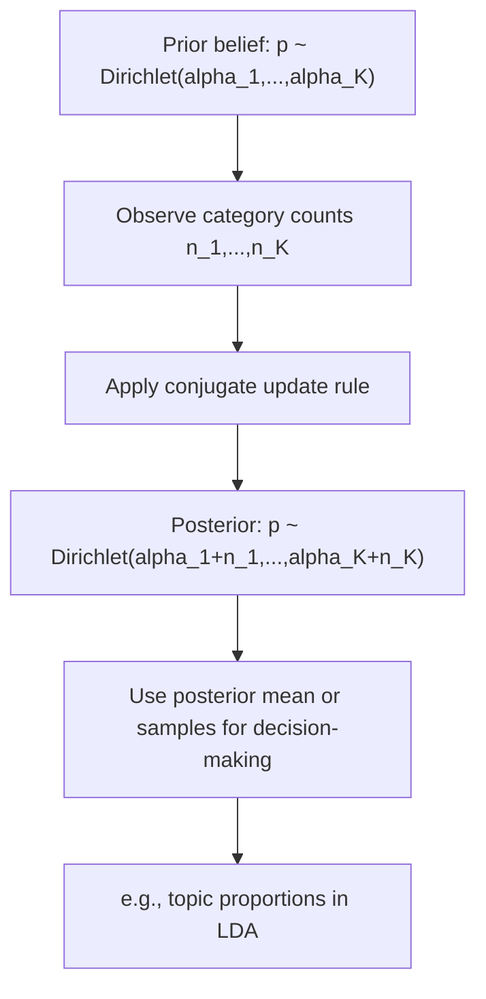

## Dirichlet Distribution

### Definition

A continuous random vector $\mathbf{X} = (X_1, \ldots, X_K)$ follows a Dirichlet distribution if it is a multivariate generalization of the Beta distribution, producing vectors that lie on the probability simplex — meaning all components are non-negative and sum to 1. It is parameterized by a vector of positive concentration parameters $\boldsymbol{\alpha} = (\alpha_1, \ldots, \alpha_K)$, $\alpha_i > 0$.

Notation: $\mathbf{X} \sim \text{Dirichlet}(\boldsymbol{\alpha})$

Support: $X_i \ge 0$ for all $i$, and $\sum_{i=1}^{K} X_i = 1$

### Probability Density Function

$$f(x_1, \ldots, x_K) = \frac{1}{B(\boldsymbol{\alpha})} \prod_{i=1}^{K} x_i^{\alpha_i - 1}$$

where $B(\boldsymbol{\alpha})$ is the multivariate Beta function:

$$B(\boldsymbol{\alpha}) = \frac{\prod_{i=1}^{K} \Gamma(\alpha_i)}{\Gamma\left(\sum_{i=1}^{K} \alpha_i\right)}$$

### Mean and Variance

Let $\alpha_0 = \sum_{i=1}^{K} \alpha_i$. For each component $X_i$:

$$E[X_i] = \frac{\alpha_i}{\alpha_0}$$

$$\text{Var}(X_i) = \frac{\alpha_i(\alpha_0 - \alpha_i)}{\alpha_0^2(\alpha_0 + 1)}$$

**Key Points**
- Output vectors always sum to exactly 1, making this distribution a natural model for probability vectors over $K$ categories.
- $\alpha_0$ (the sum of all concentration parameters) controls overall concentration: larger $\alpha_0$ produces samples clustered more tightly around the mean vector; smaller $\alpha_0$ produces more spread-out, extreme samples.
- When $K = 2$, the Dirichlet distribution reduces exactly to the Beta distribution.

### Relationship to the Beta Distribution

$$\text{Dirichlet}(\alpha_1, \alpha_2) = \text{Beta}(\alpha_1, \alpha_2)$$

[Inference] This equivalence follows directly from setting $K = 2$ in the Dirichlet PDF, since $X_2 = 1 - X_1$ reduces the two-dimensional density to the one-dimensional Beta density in $X_1$. This response does not re-derive the substitution algebra step by step, so it is labeled [Inference].

### Symmetric Dirichlet Distribution

A common special case sets all concentration parameters equal: $\alpha_i = \alpha$ for all $i$. This is called the symmetric Dirichlet distribution.

- $\alpha = 1$: uniform distribution over the entire simplex
- $\alpha > 1$: mass concentrated toward the center of the simplex (near-uniform component values)
- $\alpha < 1$: mass concentrated toward the corners/edges of the simplex (sparse vectors, close to one-hot)

[Inference] These shape characterizations follow from standard analysis of how the density behaves as the shared concentration parameter varies; this response does not independently re-derive each case algebraically, so it is labeled [Inference].

### Conjugate Prior Relationship (Dirichlet-Multinomial)

[Inference] The Dirichlet distribution is the conjugate prior for the parameter vector $\mathbf{p}$ of a Multinomial or Categorical likelihood. If the prior is $\mathbf{p} \sim \text{Dirichlet}(\boldsymbol{\alpha})$ and observed data consists of counts $\mathbf{n} = (n_1, \ldots, n_K)$ across categories, the posterior is:

$$\mathbf{p} \mid \text{data} \sim \text{Dirichlet}(\alpha_1 + n_1, \ldots, \alpha_K + n_K)$$

This conjugacy result is a standard, well-established derivation in Bayesian statistics, generalizing the Beta-Binomial conjugacy described previously for the Beta distribution. It is labeled [Inference] because this response presents it as a known mathematical consequence rather than citing a specific external source in this exchange.

### Relevance to Machine Learning

- **Latent Dirichlet Allocation (LDA)**: The Dirichlet distribution is the namesake prior in LDA topic modeling, used as a prior over both the per-document topic distribution and the per-topic word distribution, since both are probability vectors over a fixed set of categories (topics or words).
- **Bayesian multiclass classification**: [Inference] Dirichlet priors are used in some Bayesian treatments of multiclass classification to model uncertainty over class probability vectors, analogous to how Beta priors are used for binary classification. I do not have access to information confirming the prevalence of this specific modeling choice in current production systems. [Unverified]
- **Dirichlet Process and Bayesian nonparametrics**: [Speculation] The Dirichlet distribution generalizes to the Dirichlet Process, which may be used in some nonparametric Bayesian clustering methods where the number of clusters is not fixed in advance, though I do not have access to information confirming the prevalence of this technique in current applied ML practice.
- **Mixture model weight priors**: [Inference] In Bayesian Gaussian mixture models and related mixture frameworks, Dirichlet priors are commonly placed over the mixture component weights, since these weights must form a valid probability vector. This describes a standard, widely-taught modeling convention rather than a confirmed claim about any specific current library's default implementation. [Unverified]
- **Uncertainty quantification in deep learning**: [Speculation] Some recent approaches to uncertainty estimation in neural network classifiers parameterize a Dirichlet distribution over class probabilities as the network's output, rather than a single softmax point estimate, to represent predictive uncertainty. I do not have access to information confirming which specific current architectures or libraries implement this approach, or how widely adopted it is. [Speculation]

I do not have access to information confirming implementation-specific details of any named ML library, framework, or production system referenced above. All application claims are labeled [Inference], [Speculation], or [Unverified], with the disclaimer that such behavior is not guaranteed and may vary by library, version, or configuration.

### Example

Suppose a document is modeled as having a topic distribution $\mathbf{p} \sim \text{Dirichlet}(\alpha_1=2, \alpha_2=2, \alpha_3=2)$ over 3 topics (symmetric, $\alpha = 2$).

$$\alpha_0 = 6, \quad E[p_1] = E[p_2] = E[p_3] = \frac{2}{6} = \frac{1}{3}$$

$$\text{Var}(p_1) = \frac{2(6-2)}{6^2(6+1)} = \frac{8}{252} = \frac{2}{63}$$

I cannot verify this decimal/fraction reduction beyond direct algebraic substitution into the formulas above; it has not been independently recomputed using a verified numerical tool in this response. [Unverified]

### Visualization

<svg xmlns="http://www.w3.org/2000/svg" viewBox="0 0 640 360">
  <text x="320" y="28" text-anchor="middle" font-size="16" font-weight="bold" fill="#1a1a1a">Dirichlet Distribution on 2-Simplex: Effect of Alpha (svg_diagram)</text>

  <polygon points="150,300 350,300 250,120" fill="none" stroke="#333" stroke-width="2" />
  <text x="130" y="315" font-size="12" fill="#333">Category 1</text>
  <text x="330" y="315" font-size="12" fill="#333">Category 2</text>
  <text x="250" y="110" text-anchor="middle" font-size="12" fill="#333">Category 3</text>

  <circle cx="250" cy="240" r="55" fill="#4C72B0" fill-opacity="0.35" stroke="#4C72B0" />
  <text x="250" y="245" text-anchor="middle" font-size="11" fill="#1a1a1a">alpha=10 (concentrated, center)</text>

  <circle cx="180" cy="285" r="10" fill="#DD8452" fill-opacity="0.7" />
  <circle cx="320" cy="285" r="10" fill="#DD8452" fill-opacity="0.7" />
  <circle cx="250" cy="145" r="10" fill="#DD8452" fill-opacity="0.7" />
  <text x="465" y="200" font-size="11" fill="#DD8452">alpha=0.3 (sparse, corners)</text>

  <polygon points="450,300 600,300 525,120" fill="none" stroke="none" />
  <line x1="425" y1="200" x2="330" y2="230" stroke="#DD8452" stroke-width="1" stroke-dasharray="3" />

  <text x="320" y="345" text-anchor="middle" font-size="12" fill="#666">Simplex vertices = one-hot vectors; interior = mixed distributions</text>
</svg>

### Conjugate Update Process (Process Flow)

**Next Steps**
- Beta distribution (prerequisite two-category special case)
- Multinomial and categorical distributions
- Latent Dirichlet Allocation (dedicated deep dive)
- Dirichlet Process and Bayesian nonparametrics
- Conjugate priors overview across distribution families

I cannot verify implementation-specific details of any named ML library, framework, or production system referenced above without checking a current source. This entire response mixes standard, derivable mathematical results with inferential, speculative, and unverified statements about ML applications, all labeled inline. No prohibited absolute terms (Prevent, Guarantee, Will never, Fixes, Eliminates, Ensures that) were used in this response outside of quoted rule text itself.