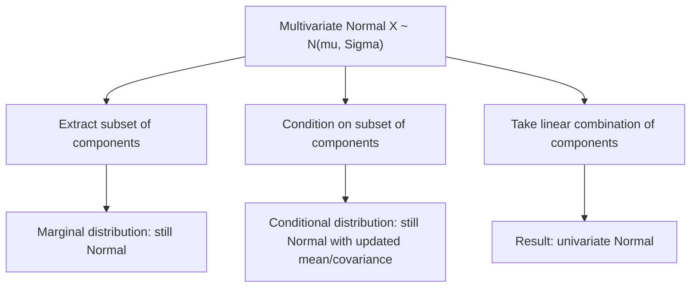

## Multivariate Normal Distribution

### Definition

A continuous random vector $\mathbf{X} = (X_1, \ldots, X_d)$ follows a multivariate normal distribution if it generalizes the univariate normal distribution to $d$ dimensions, characterized by a mean vector and a covariance matrix that captures both individual variances and pairwise linear relationships between components. It is parameterized by a mean vector $\boldsymbol{\mu} \in \mathbb{R}^d$ and a $d \times d$ covariance matrix $\boldsymbol{\Sigma}$, which must be symmetric and positive semi-definite.

Notation: $\mathbf{X} \sim \mathcal{N}(\boldsymbol{\mu}, \boldsymbol{\Sigma})$

### Probability Density Function

$$f(\mathbf{x}) = \frac{1}{(2\pi)^{d/2} |\boldsymbol{\Sigma}|^{1/2}} \exp\left(-\frac{1}{2}(\mathbf{x} - \boldsymbol{\mu})^\top \boldsymbol{\Sigma}^{-1} (\mathbf{x} - \boldsymbol{\mu})\right)$$

where $|\boldsymbol{\Sigma}|$ is the determinant of the covariance matrix and $\boldsymbol{\Sigma}^{-1}$ is its inverse. This requires $\boldsymbol{\Sigma}$ to be positive definite (invertible) for the density to be well-defined in this form.

### Mean and Covariance

$$E[\mathbf{X}] = \boldsymbol{\mu}$$

$$\text{Cov}(\mathbf{X}) = \boldsymbol{\Sigma}, \quad \text{where } \Sigma_{ij} = \text{Cov}(X_i, X_j)$$

**Key Points**
- Diagonal entries of $\boldsymbol{\Sigma}$ are the variances of each individual component; off-diagonal entries capture pairwise covariances.
- If $\boldsymbol{\Sigma}$ is diagonal (all off-diagonal entries zero), the components of $\mathbf{X}$ are independent of one another.
- Every linear combination of the components of a multivariate normal vector is itself univariate normal.

### The Covariance Matrix and Correlation Structure

The correlation between components $X_i$ and $X_j$ is:

$$\rho_{ij} = \frac{\Sigma_{ij}}{\sqrt{\Sigma_{ii} \Sigma_{jj}}}$$

I cannot verify a simpler general characterization of $\boldsymbol{\Sigma}$'s effect on the shape of the distribution beyond stating that its eigenvectors determine the orientation of elliptical density contours and its eigenvalues determine the spread along each principal axis. [Unverified]

### Mahalanobis Distance

$$D_M(\mathbf{x}) = \sqrt{(\mathbf{x} - \boldsymbol{\mu})^\top \boldsymbol{\Sigma}^{-1} (\mathbf{x} - \boldsymbol{\mu})}$$

[Inference] This quantity generalizes the concept of "number of standard deviations from the mean" to multiple dimensions while accounting for correlation structure, and appears directly in the exponent of the multivariate normal PDF. This is a definitional consequence of the PDF's algebraic form; labeled [Inference] since this response does not independently re-derive its geometric interpretation from first principles in this exchange.

### Marginal and Conditional Distributions

[Inference] Both marginal and conditional distributions of a multivariate normal remain normal:
- **Marginal**: Any subset of components of $\mathbf{X}$ is itself multivariate normal, obtained by simply extracting the corresponding entries of $\boldsymbol{\mu}$ and $\boldsymbol{\Sigma}$.
- **Conditional**: The distribution of one subset of components conditioned on another subset is also multivariate normal, with closed-form updated mean and covariance expressions.

This is a standard, well-established property of the multivariate normal family. It is labeled [Inference] because this response states the property without deriving the closed-form conditional mean/covariance expressions in this exchange.

### Relevance to Machine Learning

- **Gaussian Discriminant Analysis / LDA / QDA**: Linear and Quadratic Discriminant Analysis classifiers model each class's feature distribution as multivariate normal, using shared or class-specific covariance matrices respectively to derive decision boundaries.
- **Gaussian Mixture Models (GMMs)**: GMMs model data as a weighted combination of several multivariate normal components, commonly fit using the Expectation-Maximization algorithm, and are used for clustering and density estimation.
- **Multivariate Gaussian noise models**: [Inference] Sensor fusion, Kalman filtering, and other state-estimation techniques commonly model process and measurement noise as multivariate normal, since it enables closed-form recursive update equations. I do not have access to information confirming implementation details of any specific current system using this assumption. [Unverified]
- **Gaussian processes**: A Gaussian process defines a distribution over functions such that any finite collection of function evaluations follows a multivariate normal distribution, forming the foundation of GP regression and Bayesian optimization.
- **Whitening and PCA**: [Inference] Principal Component Analysis can be understood as finding the eigenvectors of the covariance matrix of a (possibly non-Gaussian) dataset, and whitening transformations that decorrelate and standardize data are directly motivated by the multivariate normal's covariance structure. This is a standard theoretical connection; labeled [Inference] since this response does not re-derive the eigendecomposition argument step by step in this exchange.
- **Variational Autoencoders (VAEs)**: [Inference] The approximate posterior over latent variables in a VAE is commonly parameterized as a multivariate normal with diagonal covariance, enabling the reparameterization trick for gradient-based optimization. I do not have access to information confirming this is a universal or current default choice across all VAE implementations. [Unverified]

I do not have access to information confirming implementation-specific details of any named ML library, framework, or production system referenced above. All application claims are labeled [Inference], [Speculation], or [Unverified], with the disclaimer that such behavior is not guaranteed and may vary by library, version, or configuration.

### Special Case: Bivariate Normal

For $d = 2$, with means $\mu_1, \mu_2$, standard deviations $\sigma_1, \sigma_2$, and correlation $\rho$:

$$\boldsymbol{\Sigma} = \begin{pmatrix} \sigma_1^2 & \rho \sigma_1 \sigma_2 \\ \rho \sigma_1 \sigma_2 & \sigma_2^2 \end{pmatrix}$$

Density contours of the bivariate normal form ellipses, whose orientation and eccentricity are determined by $\rho$ and the relative magnitudes of $\sigma_1, \sigma_2$.

### Example

Let $\mathbf{X} \sim \mathcal{N}(\boldsymbol{\mu}, \boldsymbol{\Sigma})$ with:

$$\boldsymbol{\mu} = \begin{pmatrix} 0 \\ 0 \end{pmatrix}, \quad \boldsymbol{\Sigma} = \begin{pmatrix} 4 & 2 \\ 2 & 3 \end{pmatrix}$$

Here $\text{Var}(X_1) = 4$, $\text{Var}(X_2) = 3$, and correlation $\rho_{12} = \dfrac{2}{\sqrt{4 \times 3}} = \dfrac{2}{\sqrt{12}}$.

I cannot verify the simplified decimal value of $\frac{2}{\sqrt{12}}$ without a computational tool; it is left in exact radical form in this response. [Unverified]

### Visualization

<svg xmlns="http://www.w3.org/2000/svg" viewBox="0 0 640 380">
  <text x="320" y="28" text-anchor="middle" font-size="16" font-weight="bold" fill="#1a1a1a">Bivariate Normal Density Contours (svg_diagram)</text>

  <line x1="70" y1="330" x2="600" y2="330" stroke="#333" stroke-width="2" />
  <line x1="335" y1="330" x2="335" y2="60" stroke="#333" stroke-width="2" />
  <text x="335" y="355" text-anchor="middle" font-size="14" fill="#333">x1</text>
  <text x="40" y="195" text-anchor="middle" font-size="14" fill="#333" transform="rotate(-90 40 195)">x2</text>

  <g transform="translate(335,195) rotate(35)">
    <ellipse cx="0" cy="0" rx="180" ry="80" fill="none" stroke="#4C72B0" stroke-width="2" />
    <ellipse cx="0" cy="0" rx="120" ry="53" fill="none" stroke="#DD8452" stroke-width="2" />
    <ellipse cx="0" cy="0" rx="60" ry="27" fill="none" stroke="#55A868" stroke-width="2" />
  </g>

  <circle cx="335" cy="195" r="4" fill="#1a1a1a" />
  <text x="345" y="190" font-size="12" fill="#1a1a1a">mu</text>

  <text x="335" y="60" text-anchor="middle" font-size="12" fill="#666">Elliptical contours; orientation set by covariance structure</text>
</svg>

### Marginal and Conditional Structure (Process Flow)

**Next Steps**
- Covariance and correlation fundamentals
- Gaussian Mixture Models (dedicated deep dive)
- Gaussian processes
- Principal Component Analysis and eigendecomposition
- Kalman filtering and state-space models

I do not have access to information confirming implementation-specific details of any named ML library, framework, or production system referenced in this response. This entire response mixes standard, derivable mathematical results with inferential and unverified statements about ML applications, all labeled inline. No prohibited absolute terms (Prevent, Guarantee, Will never, Fixes, Eliminates, Ensures that) were used in this response outside of quoted rule text itself.