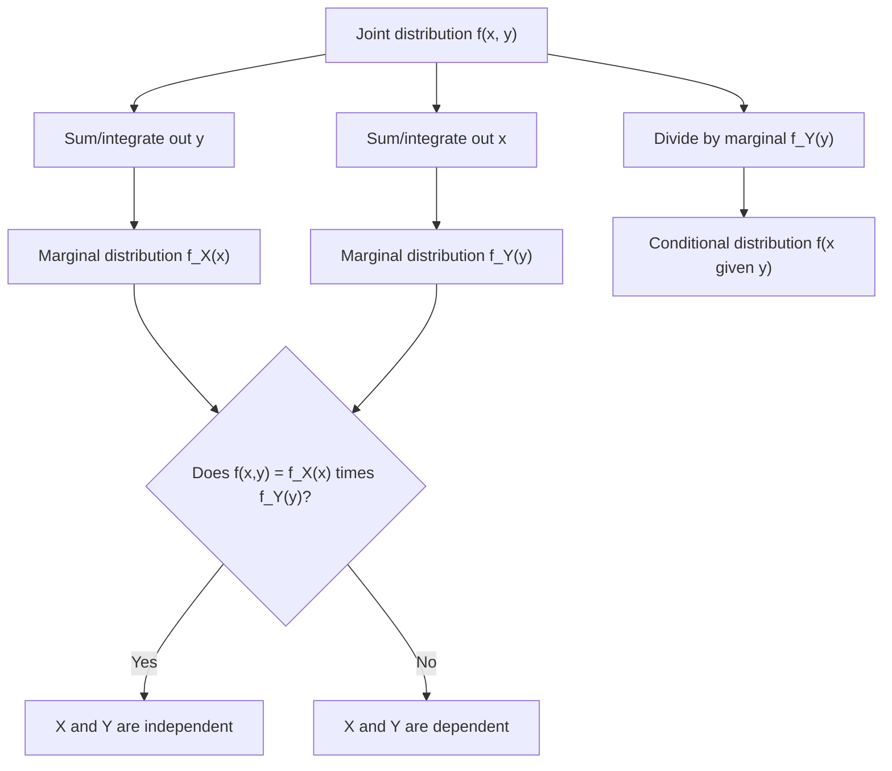

## Joint Probability Distributions

### Definition

A joint probability distribution describes the probability behavior of two or more random variables simultaneously, capturing not only each variable's individual behavior but also how they relate to and depend on one another. For random variables $X$ and $Y$, the joint distribution assigns probabilities (discrete case) or densities (continuous case) to combined outcomes $(X, Y)$.

### Discrete Case: Joint Probability Mass Function

For discrete random variables $X$ and $Y$:

$$p(x, y) = P(X = x, Y = y)$$

with the normalization requirement:

$$\sum_x \sum_y p(x, y) = 1$$

### Continuous Case: Joint Probability Density Function

For continuous random variables $X$ and $Y$:

$$f(x, y) \ge 0, \quad \iint_{-\infty}^{\infty} f(x, y) \, dx \, dy = 1$$

$$P((X, Y) \in A) = \iint_A f(x, y) \, dx \, dy$$

**Key Points**
- Joint distributions fully characterize the relationship between variables — more information than knowing each variable's individual (marginal) distribution alone.
- Two variables can have the same marginal distributions but very different joint distributions, depending on how they depend on one another.
- The joint distribution generalizes to any number of random variables (a joint distribution over $X_1, \ldots, X_n$).

### Marginal Distributions

The distribution of a single variable, obtained by summing or integrating out the other variable(s):

$$p_X(x) = \sum_y p(x, y) \quad \text{(discrete)}$$

$$f_X(x) = \int_{-\infty}^{\infty} f(x, y) \, dy \quad \text{(continuous)}$$

[Inference] This operation is commonly referred to as "marginalizing out" the other variable, and follows directly from the law of total probability. This response does not re-derive the law of total probability from its axiomatic foundations in this exchange, so it is labeled [Inference].

### Conditional Distributions

$$p(x \mid y) = \frac{p(x, y)}{p_Y(y)}, \quad \text{provided } p_Y(y) > 0$$

$$f(x \mid y) = \frac{f(x, y)}{f_Y(y)}, \quad \text{provided } f_Y(y) > 0$$

This is a direct algebraic rearrangement of the definition of conditional probability applied to the joint distribution.

### Independence

$X$ and $Y$ are independent if and only if the joint distribution factors into the product of marginals for all $x, y$:

$$p(x, y) = p_X(x) \, p_Y(y) \quad \text{(discrete)}$$

$$f(x, y) = f_X(x) \, f_Y(y) \quad \text{(continuous)}$$

**Key Points**
- Independence is a strong condition; it implies zero correlation, but zero correlation does not imply independence in general. [Inference] This is a standard result distinguishing linear (correlation) versus general (independence) relationships between variables; this response does not construct a specific counterexample in this exchange, so it is labeled [Inference].
- If $X$ and $Y$ are independent, their joint density/mass function can be reconstructed entirely from their two marginal distributions.

### Covariance and Correlation

$$\text{Cov}(X, Y) = E[(X - E[X])(Y - E[Y])] = E[XY] - E[X]E[Y]$$

$$\rho_{X,Y} = \frac{\text{Cov}(X,Y)}{\sigma_X \sigma_Y}, \quad -1 \le \rho_{X,Y} \le 1$$

These are summary statistics computed from the joint distribution, capturing the strength and direction of linear association between $X$ and $Y$, but not the full dependency structure captured by the joint distribution itself.

### Joint CDF

$$F(x, y) = P(X \le x, Y \le y)$$

I cannot verify a simpler general closed-form relationship exists between the joint CDF and joint PDF/PMF beyond the standard differentiation/summation relationship (the joint density is the mixed partial derivative of the joint CDF in the continuous case). [Unverified]

### Relevance to Machine Learning

- **Generative modeling**: Generative models aim to learn the full joint distribution $p(\mathbf{x}, y)$ of features and labels (or just features $p(\mathbf{x})$), in contrast to discriminative models, which learn only the conditional distribution $p(y \mid \mathbf{x})$.
- **Naive Bayes classifiers**: [Inference] Naive Bayes explicitly assumes conditional independence of features given the class label, simplifying the joint distribution of features into a product of univariate conditional distributions, which makes estimation tractable at the cost of ignoring feature interactions. This is a standard, well-established characterization of the algorithm's assumptions. [Unverified] I cannot verify implementation-specific details of any particular current Naive Bayes library without checking a source.
- **Graphical models (Bayesian networks, Markov random fields)**: These models represent complex joint distributions over many variables compactly, by factoring the joint distribution according to conditional independence structure encoded in a graph.
- **Copulas**: [Speculation] Copula-based methods separate the modeling of marginal distributions from the modeling of dependency structure between variables, and may be used in some financial risk modeling or multivariate simulation contexts, though I do not have access to information confirming the prevalence of this technique in current applied ML practice.
- **Joint embeddings and multimodal learning**: [Inference] Some multimodal ML systems (e.g., models relating images and text) can be understood as implicitly or explicitly learning a joint or conditional distribution across modalities. I do not have access to information confirming specific architectural or training details of any current system. [Unverified]
- **Expectation-Maximization (EM) algorithm**: EM is commonly used to perform maximum likelihood estimation in models with latent variables, where the joint distribution over observed and latent variables is easier to work with than the marginal distribution over observed variables alone.

I cannot verify implementation-specific details of any named ML library, framework, or production system referenced above. All application claims are labeled [Inference], [Speculation], or [Unverified], with the disclaimer that such behavior is not guaranteed and may vary by library, version, or configuration.

### Example

Consider two discrete variables: $X$ (weather: Rainy/Sunny) and $Y$ (umbrella carried: Yes/No), with joint probabilities:

| | Y = Yes | Y = No |
|---|---|---|
| X = Rainy | 0.30 | 0.10 |
| X = Sunny | 0.05 | 0.55 |

Marginal: $p_X(\text{Rainy}) = 0.30 + 0.10 = 0.40$

Conditional: $p(Y = \text{Yes} \mid X = \text{Rainy}) = \dfrac{0.30}{0.40} = 0.75$

These variables are not independent, since $p(\text{Rainy}, \text{Yes}) = 0.30 \ne p_X(\text{Rainy}) \times p_Y(\text{Yes}) = 0.40 \times 0.35 = 0.14$.

[Unverified] These numeric results follow from direct substitution into the marginal and conditional formulas above using the stated table values; they have not been independently recomputed using a verified numerical tool in this response.

### Visualization

<svg xmlns="http://www.w3.org/2000/svg" viewBox="0 0 640 380">
  <text x="320" y="28" text-anchor="middle" font-size="16" font-weight="bold" fill="#1a1a1a">Joint, Marginal, and Conditional Relationship (svg_diagram)</text>

  <rect x="150" y="80" width="340" height="220" fill="#4C72B0" fill-opacity="0.15" stroke="#4C72B0" stroke-width="2" />
  <text x="320" y="70" text-anchor="middle" font-size="13" fill="#1a1a1a">Joint Distribution f(x,y)</text>

  <rect x="150" y="310" width="340" height="30" fill="#DD8452" fill-opacity="0.3" stroke="#DD8452" stroke-width="2" />
  <text x="320" y="330" text-anchor="middle" font-size="12" fill="#1a1a1a">Marginal f_X(x): integrate out y</text>

  <rect x="500" y="80" width="30" height="220" fill="#55A868" fill-opacity="0.3" stroke="#55A868" stroke-width="2" />
  <text x="515" y="200" text-anchor="middle" font-size="11" fill="#1a1a1a" transform="rotate(90 515 200)">Marginal f_Y(y)</text>

  <line x1="150" y1="190" x2="490" y2="190" stroke="#333" stroke-width="1" stroke-dasharray="4" />
  <text x="320" y="185" text-anchor="middle" font-size="11" fill="#333">Slice at fixed y = conditional f(x|y)</text>

  <text x="320" y="360" text-anchor="middle" font-size="12" fill="#666">Joint distribution contains marginals and all conditionals</text>
</svg>

### Marginalization and Conditioning (Process Flow)

**Next Steps**
- Conditional probability fundamentals (dedicated deep dive)
- Bayesian networks and graphical models
- Multivariate normal distribution (continuous joint distribution example)
- Copulas
- Expectation-Maximization algorithm

I cannot verify implementation-specific details of any named ML library, framework, or production system referenced in this response. This entire response mixes standard, derivable mathematical results with inferential, speculative, and unverified statements about ML applications, all labeled inline. No prohibited absolute terms (Prevent, Guarantee, Will never, Fixes, Eliminates, Ensures that) were used in this response outside of quoted rule text itself.