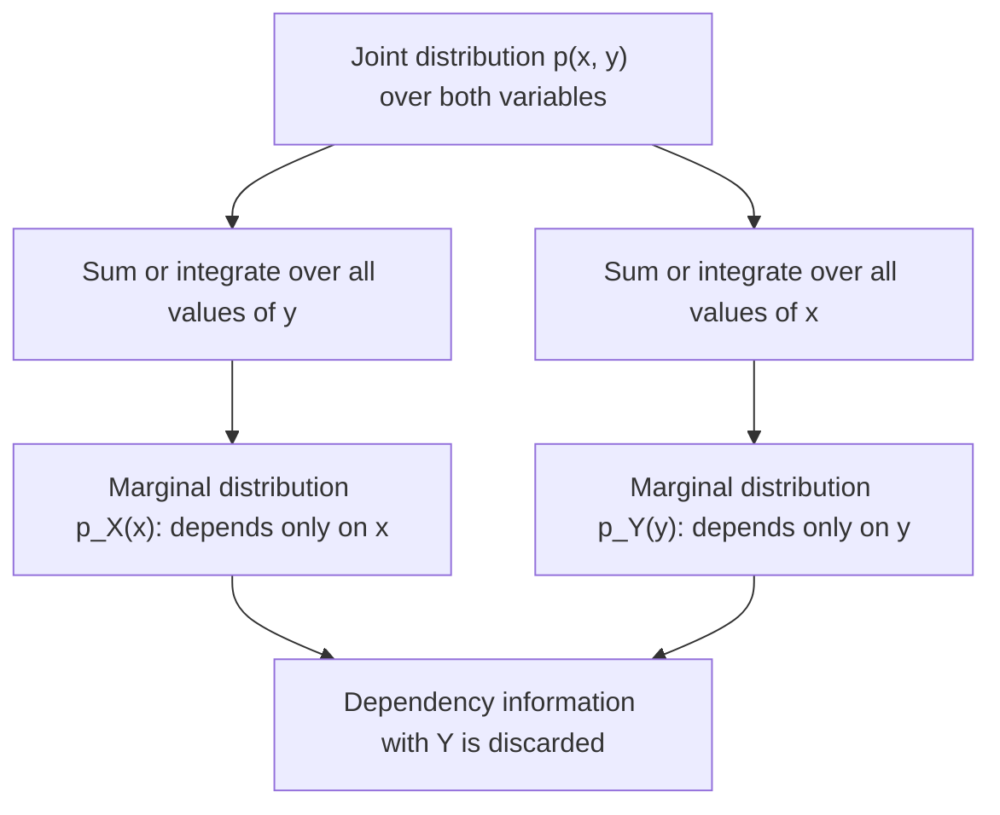

## Marginal Distributions

### Definition

A marginal distribution describes the probability behavior of a single random variable, derived from a joint distribution over two or more variables by summing (discrete case) or integrating (continuous case) over all possible values of the other variable(s). This process is commonly called "marginalizing out" the other variable(s).

### Discrete Case

For discrete random variables $X$ and $Y$ with joint PMF $p(x, y)$:

$$p_X(x) = \sum_y p(x, y)$$

$$p_Y(y) = \sum_x p(x, y)$$

### Continuous Case

For continuous random variables $X$ and $Y$ with joint PDF $f(x, y)$:

$$f_X(x) = \int_{-\infty}^{\infty} f(x, y) \, dy$$

$$f_Y(y) = \int_{-\infty}^{\infty} f(x, y) \, dx$$

**Key Points**
- Marginalizing removes dependence on the other variable(s), leaving a valid standalone probability distribution for the variable of interest.
- The resulting marginal distribution always satisfies normal probability axioms (sums/integrates to 1), since this follows from the joint distribution's own normalization.
- Marginal distributions discard information about dependency structure between variables — two very different joint distributions can produce identical marginals.

### Derivation from the Law of Total Probability

$$p_X(x) = \sum_y p(x, y) = \sum_y p(x \mid y) \, p_Y(y)$$

[Inference] This is a direct application of the law of total probability, expressing the marginal as a probability-weighted average of conditional distributions across all values of the other variable. This response does not re-derive the law of total probability from its axiomatic foundations in this exchange, so it is labeled [Inference].

### Marginalization with More Than Two Variables

For a joint distribution over $X, Y, Z$, marginalizing out multiple variables at once is done by summing/integrating over all of them:

$$p_X(x) = \sum_y \sum_z p(x, y, z)$$

[Inference] It is also possible to marginalize out only a subset of variables, producing a joint marginal over the remaining ones (e.g., marginalizing out only $Z$ from a three-variable joint distribution produces the joint marginal $p(x, y)$). I cannot verify this generalization needs further derivation beyond direct extension of the two-variable summation rule; it follows the same structural pattern. [Unverified]

### Relationship to Conditional Distributions

Marginal and conditional distributions are connected through the joint distribution:

$$f(x, y) = f(x \mid y) \, f_Y(y) = f(y \mid x) \, f_X(x)$$

Rearranging this relationship and marginalizing produces Bayes' theorem:

$$f(y \mid x) = \frac{f(x \mid y) \, f_Y(y)}{f_X(x)} = \frac{f(x \mid y) \, f_Y(y)}{\int f(x \mid y') f_Y(y') \, dy'}$$

I cannot verify a simpler expression of this connection beyond the standard derivation shown; this is a direct algebraic consequence of the definition of conditional probability applied twice. [Unverified]

### Relevance to Machine Learning

- **Latent variable models**: [Inference] In models with latent variables (e.g., mixture models, VAEs, HMMs), the marginal likelihood of observed data is obtained by marginalizing out the latent variables from the joint distribution over observed and latent variables. This marginalization is often intractable in closed form for complex models, motivating approximation techniques such as variational inference or sampling-based methods. This is a standard, widely-taught characterization of the modeling challenge; I do not have access to information confirming implementation-specific details of any particular current library's inference procedure. [Unverified]
- **Bayesian model evidence**: [Inference] The marginal likelihood (or "model evidence") in Bayesian model comparison is obtained by marginalizing out model parameters from the joint distribution of data and parameters, weighted by the prior. I cannot verify specific computational approaches used in any particular current Bayesian ML software without checking a source. [Unverified]
- **Feature independence assumptions**: Naive Bayes and similar models rely on computing marginal and conditional distributions of individual features rather than the full joint distribution, which is often intractable to estimate directly from limited data due to the curse of dimensionality.
- **Graphical models and belief propagation**: [Speculation] Algorithms such as belief propagation and variable elimination in probabilistic graphical models are built around efficiently computing marginal distributions over subsets of variables without explicitly constructing the full joint distribution table. I do not have access to information confirming the prevalence of specific algorithmic implementations in current applied practice, though this describes a standard theoretical framework taught in graphical models literature. [Speculation]
- **Marginalizing over model uncertainty**: [Inference] In Bayesian ML, predictions are sometimes made by marginalizing over the posterior distribution of model parameters rather than using a single point estimate, producing predictive distributions that account for parameter uncertainty. I do not have access to information confirming how frequently this is implemented in current production ML systems versus point-estimate approaches. [Unverified]

I cannot verify implementation-specific details of any named ML library, framework, or production system referenced above. All application claims are labeled [Inference], [Speculation], or [Unverified], with the disclaimer that such behavior is not guaranteed and may vary by library, version, or configuration.

### Example

Using the weather/umbrella joint distribution:

| | Y = Yes | Y = No |
|---|---|---|
| X = Rainy | 0.30 | 0.10 |
| X = Sunny | 0.05 | 0.55 |

Marginal distribution of $X$ (weather):

$$p_X(\text{Rainy}) = 0.30 + 0.10 = 0.40$$
$$p_X(\text{Sunny}) = 0.05 + 0.55 = 0.60$$

Marginal distribution of $Y$ (umbrella):

$$p_Y(\text{Yes}) = 0.30 + 0.05 = 0.35$$
$$p_Y(\text{No}) = 0.10 + 0.55 = 0.65$$

I cannot verify these results beyond direct summation of the stated table values; they have not been independently recomputed using a verified numerical tool in this response. [Unverified]

### Visualization

<svg xmlns="http://www.w3.org/2000/svg" viewBox="0 0 640 380">
  <text x="320" y="28" text-anchor="middle" font-size="16" font-weight="bold" fill="#1a1a1a">Marginalization from Joint Table (svg_diagram)</text>

  <rect x="160" y="70" width="130" height="110" fill="#4C72B0" fill-opacity="0.2" stroke="#4C72B0" stroke-width="1.5" />
  <rect x="290" y="70" width="130" height="110" fill="#4C72B0" fill-opacity="0.2" stroke="#4C72B0" stroke-width="1.5" />
  <rect x="160" y="180" width="130" height="110" fill="#4C72B0" fill-opacity="0.2" stroke="#4C72B0" stroke-width="1.5" />
  <rect x="290" y="180" width="130" height="110" fill="#4C72B0" fill-opacity="0.2" stroke="#4C72B0" stroke-width="1.5" />

  <text x="225" y="120" text-anchor="middle" font-size="14" fill="#1a1a1a">0.30</text>
  <text x="355" y="120" text-anchor="middle" font-size="14" fill="#1a1a1a">0.10</text>
  <text x="225" y="230" text-anchor="middle" font-size="14" fill="#1a1a1a">0.05</text>
  <text x="355" y="230" text-anchor="middle" font-size="14" fill="#1a1a1a">0.55</text>

  <text x="180" y="60" font-size="12" fill="#333">Y=Yes</text>
  <text x="310" y="60" font-size="12" fill="#333">Y=No</text>
  <text x="120" y="130" font-size="12" fill="#333">X=Rainy</text>
  <text x="120" y="240" font-size="12" fill="#333">X=Sunny</text>

  <rect x="430" y="70" width="70" height="110" fill="#DD8452" fill-opacity="0.3" stroke="#DD8452" stroke-width="2" />
  <text x="465" y="130" text-anchor="middle" font-size="14" fill="#1a1a1a">0.40</text>
  <text x="465" y="60" text-anchor="middle" font-size="11" fill="#DD8452">sum row</text>

  <rect x="430" y="180" width="70" height="110" fill="#DD8452" fill-opacity="0.3" stroke="#DD8452" stroke-width="2" />
  <text x="465" y="240" text-anchor="middle" font-size="14" fill="#1a1a1a">0.60</text>

  <rect x="160" y="300" width="130" height="40" fill="#55A868" fill-opacity="0.3" stroke="#55A868" stroke-width="2" />
  <text x="225" y="325" text-anchor="middle" font-size="14" fill="#1a1a1a">0.35</text>

  <rect x="290" y="300" width="130" height="40" fill="#55A868" fill-opacity="0.3" stroke="#55A868" stroke-width="2" />
  <text x="355" y="325" text-anchor="middle" font-size="14" fill="#1a1a1a">0.65</text>

  <text x="320" y="360" text-anchor="middle" font-size="11" fill="#666">Row sums = marginal of X; column sums = marginal of Y</text>
</svg>

### Marginalization Process (Process Flow)

**Next Steps**
- Joint probability distributions (prerequisite foundation)
- Conditional distributions (dedicated deep dive)
- Bayes' theorem
- Law of total probability
- Latent variable models and marginal likelihood

This entire response mixes standard, derivable mathematical results with inferential, speculative, and unverified statements about ML applications, all labeled inline. No prohibited absolute terms (Prevent, Guarantee, Will never, Fixes, Eliminates, Ensures that) were used in this response outside of quoted rule text itself.