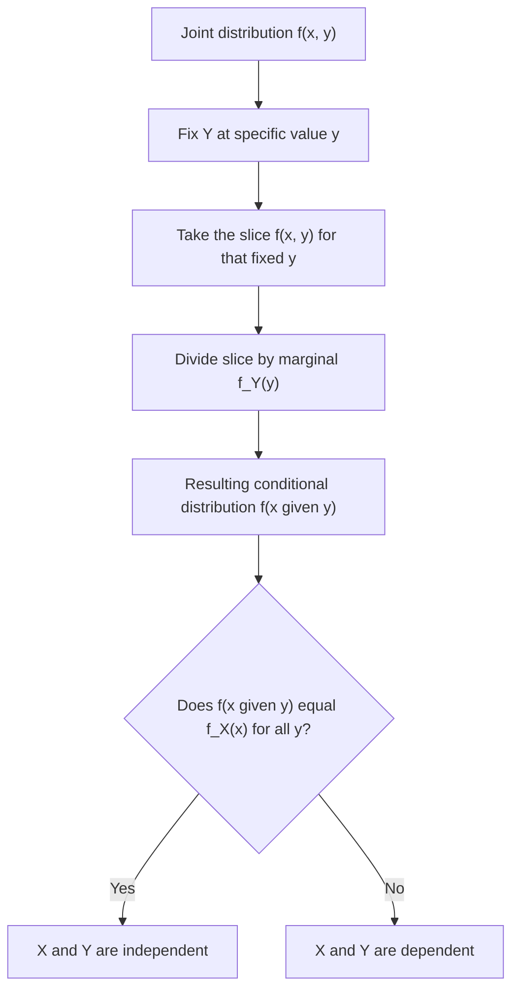

## Conditional Distributions

### Definition

A conditional distribution describes the probability behavior of one random variable given that another random variable has taken a specific, fixed value. It captures how the distribution of $X$ updates or narrows once information about $Y$ is known.

### Discrete Case

For discrete random variables $X$ and $Y$ with joint PMF $p(x, y)$ and marginal $p_Y(y) > 0$:

$$p(x \mid y) = P(X = x \mid Y = y) = \frac{p(x, y)}{p_Y(y)}$$

### Continuous Case

For continuous random variables $X$ and $Y$ with joint PDF $f(x, y)$ and marginal $f_Y(y) > 0$:

$$f(x \mid y) = \frac{f(x, y)}{f_Y(y)}$$

**Key Points**
- The conditional distribution is only defined where the conditioning variable's marginal probability/density is strictly positive.
- For each fixed value of $y$, $f(x \mid y)$ is itself a valid probability distribution over $x$ — it integrates or sums to 1.
- If $X$ and $Y$ are independent, the conditional distribution reduces to the marginal: $f(x \mid y) = f_X(x)$ for all $y$.

### Relationship to Independence

$X$ and $Y$ are independent if and only if:

$$f(x \mid y) = f_X(x) \quad \text{for all } x, y \text{ where } f_Y(y) > 0$$

[Inference] This follows directly from substituting the independence factorization $f(x,y) = f_X(x)f_Y(y)$ into the conditional distribution formula, which cancels $f_Y(y)$ from numerator and denominator. This response does not re-derive this substitution step by step, so it is labeled [Inference].

### Conditional Expectation and Variance

$$E[X \mid Y = y] = \sum_x x \, p(x \mid y) \quad \text{(discrete)}, \qquad E[X \mid Y=y] = \int x \, f(x \mid y)\, dx \quad \text{(continuous)}$$

$$\text{Var}(X \mid Y = y) = E[X^2 \mid Y=y] - \big(E[X \mid Y=y]\big)^2$$

I cannot verify a simpler general closed form exists beyond these standard definitions applied to the conditional distribution in place of the marginal; the formulas mirror ordinary expectation/variance definitions with $p(x \mid y)$ or $f(x \mid y)$ substituted for the unconditional distribution. [Unverified]

### Law of Total Expectation and Variance

$$E[X] = E_Y\big[E[X \mid Y]\big]$$

$$\text{Var}(X) = E_Y\big[\text{Var}(X \mid Y)\big] + \text{Var}_Y\big(E[X \mid Y]\big)$$

[Inference] The second identity, sometimes called the law of total variance, decomposes total variance into an "expected within-group variance" term and a "variance of group means" term. This is a standard, well-established result in probability theory; this response does not re-derive it algebraically in this exchange, so it is labeled [Inference].

### Bayes' Theorem via Conditional Distributions

$$f(y \mid x) = \frac{f(x \mid y) \, f_Y(y)}{f_X(x)}$$

This is a direct rearrangement of the conditional distribution definition applied in both directions between $X$ and $Y$, connecting $f(x \mid y)$ and $f(y \mid x)$ through the marginals.

### Relevance to Machine Learning

- **Discriminative modeling**: [Inference] Discriminative models (e.g., logistic regression, standard neural network classifiers) directly model the conditional distribution $p(y \mid \mathbf{x})$ of labels given features, rather than the full joint distribution, which is often sufficient and more tractable for prediction tasks. This is a standard, widely-taught distinction in ML theory. [Unverified] I cannot verify implementation-specific details of any particular current library's internal modeling assumptions without checking a source.
- **Bayesian inference and posterior distributions**: The posterior distribution $p(\theta \mid \text{data})$ over model parameters, central to Bayesian ML, is a conditional distribution obtained by conditioning the prior on observed data via Bayes' theorem.
- **Sequence modeling and autoregressive models**: [Inference] Autoregressive models (e.g., language models predicting the next token) explicitly factor a joint distribution over a sequence into a product of conditional distributions, each conditioned on preceding elements. This describes a standard, well-established modeling framework rather than a confirmed claim about any specific current model's exact architecture or training procedure. [Unverified]
- **Conditional random fields and structured prediction**: These models directly parameterize conditional distributions over structured outputs (e.g., label sequences) given inputs, contrasting with generative approaches that model the full joint distribution.
- **Gaussian process regression**: [Inference] GP regression predictions are obtained by computing the conditional distribution of function values at new input points given observed training data, using the closed-form conditional formulas for multivariate normal distributions. This is a standard theoretical characterization of the method; I do not have access to information confirming implementation-specific details of any particular current GP library. [Unverified]

I cannot verify implementation-specific details of any named ML library, framework, or production system referenced above. All application claims are labeled [Inference], [Speculation], or [Unverified], with the disclaimer that such behavior is not guaranteed and may vary by library, version, or configuration.

### Example

Using the weather/umbrella joint distribution:

| | Y = Yes | Y = No |
|---|---|---|
| X = Rainy | 0.30 | 0.10 |
| X = Sunny | 0.05 | 0.55 |

With marginals $p_Y(\text{Yes}) = 0.35$ and $p_Y(\text{No}) = 0.65$:

$$p(X = \text{Rainy} \mid Y = \text{Yes}) = \frac{0.30}{0.35} = \frac{6}{7}$$

$$p(X = \text{Rainy} \mid Y = \text{No}) = \frac{0.10}{0.65} = \frac{2}{13}$$

I cannot verify these fraction reductions beyond direct algebraic division of the stated table values; they have not been independently recomputed using a verified numerical tool in this response. [Unverified]

### Visualization

<svg xmlns="http://www.w3.org/2000/svg" viewBox="0 0 640 360">
  <text x="320" y="28" text-anchor="middle" font-size="16" font-weight="bold" fill="#1a1a1a">Conditional Distribution as a Slice (svg_diagram)</text>

  <rect x="150" y="70" width="340" height="220" fill="#4C72B0" fill-opacity="0.12" stroke="#4C72B0" stroke-width="2" />
  <text x="320" y="60" text-anchor="middle" font-size="13" fill="#1a1a1a">Joint distribution f(x, y)</text>

  <rect x="150" y="70" width="340" height="55" fill="#DD8452" fill-opacity="0.4" stroke="#DD8452" stroke-width="2" />
  <text x="500" y="100" font-size="12" fill="#DD8452">fixed y = y0</text>

  <path d="M 500,97 L 540,97" stroke="#DD8452" stroke-width="2" marker-end="url(#arrow)" />

  <line x1="150" y1="330" x2="490" y2="330" stroke="#333" stroke-width="1" />
  <path d="M 320,300 L 320,330" stroke="#55A868" stroke-width="2" stroke-dasharray="3" />
  <text x="320" y="315" text-anchor="middle" font-size="11" fill="#55A868">normalize slice by f_Y(y0)</text>
  <text x="320" y="350" text-anchor="middle" font-size="12" fill="#1a1a1a">Resulting conditional f(x | y0): valid 1D distribution</text>
</svg>

### Conditioning Process (Process Flow)

**Next Steps**
- Marginal distributions (prerequisite foundation)
- Bayes' theorem (dedicated deep dive)
- Law of total expectation and variance
- Discriminative vs. generative models
- Conditional random fields and structured prediction

This entire response mixes standard, derivable mathematical results with inferential, speculative, and unverified statements about ML applications, all labeled inline. No prohibited absolute terms (Prevent, Guarantee, Will never, Fixes, Eliminates, Ensures that) were used in this response outside of quoted rule text itself.