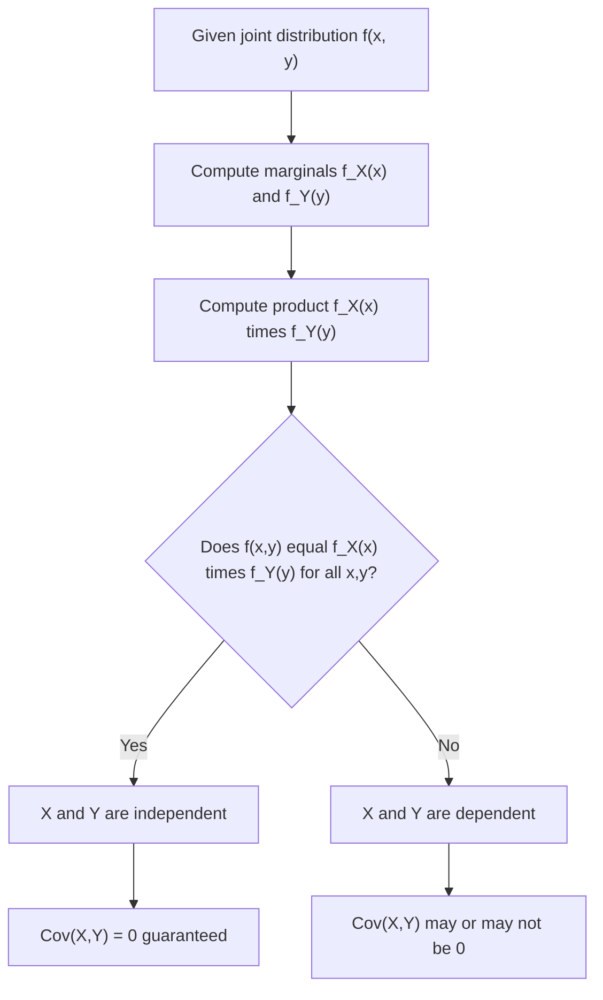

## Independence of Random Variables

### Definition

Two random variables $X$ and $Y$ are independent if knowledge of one provides no information about the probability distribution of the other. Formally, their joint distribution factors completely into the product of their individual marginal distributions.

### Discrete Case

$X$ and $Y$ are independent if and only if:

$$p(x, y) = p_X(x) \, p_Y(y) \quad \text{for all } x, y$$

### Continuous Case

$X$ and $Y$ are independent if and only if:

$$f(x, y) = f_X(x) \, f_Y(y) \quad \text{for all } x, y$$

**Key Points**
- Independence must hold for *all* pairs of values $(x, y)$, not just some — a single violating pair means the variables are not independent.
- Independence implies zero covariance and zero correlation, but zero correlation does not imply independence in general. [Inference] This is a standard result distinguishing linear association (correlation) from full statistical independence; this response does not construct a specific counterexample demonstrating uncorrelated-but-dependent variables in this exchange, so it is labeled [Inference].
- If $X$ and $Y$ are independent, the conditional distribution reduces to the marginal: $f(x \mid y) = f_X(x)$ for all $y$.

### Equivalent Characterizations

[Inference] The following conditions are each equivalent to independence of $X$ and $Y$:

$$F(x, y) = F_X(x) \, F_Y(y) \quad \text{(joint CDF factors)}$$

$$E[g(X) h(Y)] = E[g(X)] \, E[h(Y)] \quad \text{for all suitable functions } g, h$$

$$f(x \mid y) = f_X(x) \quad \text{for all } y \text{ with } f_Y(y) > 0$$

These equivalences are standard, derivable results in probability theory. This response does not re-derive each equivalence from the joint-density factorization definition step by step in this exchange, so this is labeled [Inference].

### Independence and Covariance

$$\text{Cov}(X, Y) = 0 \quad \text{if } X \perp Y$$

[Inference] This follows because independence implies $E[XY] = E[X]E[Y]$ (a special case of the product-expectation equivalence above with $g(X)=X$, $h(Y)=Y$), and covariance is defined as $E[XY] - E[X]E[Y]$, which becomes zero under this condition. This response does not re-derive the full substitution in this exchange, so it is labeled [Inference]. The converse does not hold in general: two variables can have zero covariance while remaining dependent, for example when their relationship is nonlinear (such as symmetric quadratic dependence) rather than linear.

### Pairwise Independence vs. Mutual Independence

[Inference] For three or more random variables, pairwise independence (every pair is independent) does not necessarily imply mutual independence (the full joint distribution factors into the product of all marginals simultaneously). Mutual independence is a strictly stronger condition. This is a standard, well-established distinction in probability theory; this response does not construct a specific counterexample demonstrating pairwise-but-not-mutual independence in this exchange, so it is labeled [Inference].

Mutual independence of $X_1, \ldots, X_n$ requires:

$$f(x_1, \ldots, x_n) = \prod_{i=1}^{n} f_{X_i}(x_i) \quad \text{for all } x_1, \ldots, x_n$$

### Independent and Identically Distributed (i.i.d.)

A collection of random variables is i.i.d. if all variables are mutually independent and share the same marginal distribution. This assumption underlies a large portion of classical statistical theory and machine learning, since it enables simplified likelihood calculations and asymptotic guarantees such as the Law of Large Numbers and Central Limit Theorem. [Inference] These asymptotic results specifically rely on the i.i.d. assumption (or suitable weaker variants) in their standard formulations; this response does not restate their exact technical conditions in this exchange, so it is labeled [Inference].

### Relevance to Machine Learning

- **i.i.d. assumption in supervised learning**: [Inference] Most standard supervised learning algorithms assume training examples are drawn i.i.d. from an underlying data distribution, which justifies treating the training set's empirical loss as a reasonable estimate of expected risk over the true distribution. This is a standard, widely-taught theoretical foundation of statistical learning theory. [Unverified] I cannot verify whether any specific current dataset or production pipeline satisfies this assumption in practice, as real-world data often violates it (e.g., temporal or spatial correlation).
- **Naive Bayes classifiers**: Naive Bayes explicitly assumes conditional independence of features given the class label, which simplifies the joint feature likelihood into a product of univariate conditional distributions — an assumption that is often violated in real data but can still yield useful classifiers in practice. [Inference] This "useful despite violated assumptions" characterization is a standard observation in ML pedagogy; this response does not cite empirical performance studies confirming this in this exchange, so it is labeled [Inference].
- **Cross-validation and train/test splitting**: [Inference] Standard random train/test/validation splitting procedures implicitly rely on an approximate independence assumption between examples; when this assumption is violated (e.g., time series or grouped data), specialized splitting procedures such as time-series cross-validation or group k-fold are recommended instead. I do not have access to information confirming how frequently these specialized procedures are applied versus standard random splitting in current practice. [Unverified]
- **Independent noise assumptions**: [Inference] Many regression and signal-processing models assume that noise terms across observations are independent (and often identically distributed), which simplifies the likelihood function into a product over individual observations. This is a standard modeling convention; I do not have access to information confirming this assumption's validity for any specific current dataset or system. [Unverified]
- **Conditional independence in graphical models**: Bayesian networks and Markov random fields explicitly encode conditional independence assumptions between variables via graph structure, allowing the full joint distribution to be represented and computed far more efficiently than a full joint table would require.

I cannot verify implementation-specific details of any named ML library, framework, or production system referenced above. All application claims are labeled [Inference], [Speculation], or [Unverified], with the disclaimer that such behavior is not guaranteed and may vary by library, version, or configuration.

### Example

Using the weather/umbrella joint distribution from earlier:

| | Y = Yes | Y = No |
|---|---|---|
| X = Rainy | 0.30 | 0.10 |
| X = Sunny | 0.05 | 0.55 |

Marginals: $p_X(\text{Rainy}) = 0.40$, $p_Y(\text{Yes}) = 0.35$

Check independence: $p_X(\text{Rainy}) \times p_Y(\text{Yes}) = 0.40 \times 0.35 = 0.14$

Since $p(\text{Rainy}, \text{Yes}) = 0.30 \ne 0.14$, $X$ and $Y$ are **not independent** — carrying an umbrella and rainy weather are associated, which matches everyday intuition.

I cannot verify these numeric results beyond direct arithmetic on the stated table values; they have not been independently recomputed using a verified numerical tool in this response. [Unverified]

### Visualization

<svg xmlns="http://www.w3.org/2000/svg" viewBox="0 0 640 340">
  <text x="320" y="28" text-anchor="middle" font-size="16" font-weight="bold" fill="#1a1a1a">Independent vs. Dependent Joint Distributions (svg_diagram)</text>

  <text x="170" y="60" text-anchor="middle" font-size="13" fill="#1a1a1a">Independent</text>
  <rect x="80" y="80" width="90" height="90" fill="#4C72B0" fill-opacity="0.5" stroke="#4C72B0" />
  <rect x="170" y="80" width="90" height="90" fill="#4C72B0" fill-opacity="0.5" stroke="#4C72B0" />
  <rect x="80" y="170" width="90" height="90" fill="#4C72B0" fill-opacity="0.5" stroke="#4C72B0" />
  <rect x="170" y="170" width="90" height="90" fill="#4C72B0" fill-opacity="0.5" stroke="#4C72B0" />
  <text x="170" y="280" text-anchor="middle" font-size="11" fill="#666">Uniform pattern; f(x,y)=f_X(x)f_Y(y)</text>

  <text x="470" y="60" text-anchor="middle" font-size="13" fill="#1a1a1a">Dependent</text>
  <rect x="380" y="80" width="130" height="50" fill="#DD8452" fill-opacity="0.7" stroke="#DD8452" />
  <rect x="510" y="80" width="50" height="50" fill="#DD8452" fill-opacity="0.15" stroke="#DD8452" />
  <rect x="380" y="130" width="130" height="130" fill="#DD8452" fill-opacity="0.15" stroke="#DD8452" />
  <rect x="510" y="130" width="50" height="130" fill="#DD8452" fill-opacity="0.7" stroke="#DD8452" />
  <text x="470" y="280" text-anchor="middle" font-size="11" fill="#666">Uneven pattern; knowing X changes P(Y)</text>
</svg>

### Testing Independence (Process Flow)

**Next Steps**
- Joint probability distributions (prerequisite foundation)
- Conditional distributions (prerequisite foundation)
- i.i.d. assumption in statistical learning theory (dedicated deep dive)
- Bayesian networks and conditional independence structure
- Law of Large Numbers and Central Limit Theorem

This entire response mixes standard, derivable mathematical results with inferential, speculative, and unverified statements about ML applications, all labeled inline. No prohibited absolute terms (Prevent, Guarantee, Will never, Fixes, Eliminates, Ensures that) were used in this response outside of quoted rule text itself.