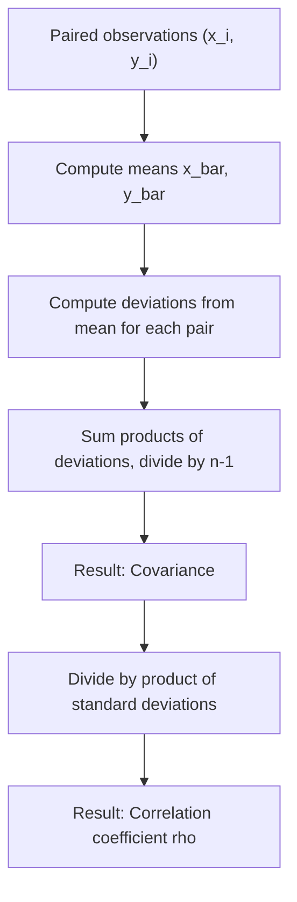

## Covariance and Correlation

### Definition

Covariance and correlation are summary statistics that measure the strength and direction of the linear relationship between two random variables. Covariance captures the direction and scale-dependent magnitude of joint variability; correlation normalizes covariance to a scale-independent value between $-1$ and $1$.

### Covariance

$$\text{Cov}(X, Y) = E[(X - E[X])(Y - E[Y])] = E[XY] - E[X]E[Y]$$

For a sample of $n$ paired observations $(x_i, y_i)$:

$$\widehat{\text{Cov}}(X, Y) = \frac{1}{n-1} \sum_{i=1}^{n} (x_i - \bar{x})(y_i - \bar{y})$$

**Key Points**
- Positive covariance indicates $X$ and $Y$ tend to increase together; negative covariance indicates one tends to increase as the other decreases.
- Covariance is not scale-invariant — its magnitude depends on the units of $X$ and $Y$, making it difficult to compare across variable pairs with different units.
- $\text{Cov}(X, X) = \text{Var}(X)$, so variance is a special case of covariance.

### Correlation (Pearson Correlation Coefficient)

$$\rho_{X,Y} = \frac{\text{Cov}(X,Y)}{\sigma_X \sigma_Y}, \quad -1 \le \rho_{X,Y} \le 1$$

Sample version:

$$r = \frac{\sum_{i=1}^n (x_i - \bar{x})(y_i - \bar{y})}{\sqrt{\sum_{i=1}^n (x_i - \bar{x})^2} \sqrt{\sum_{i=1}^n (y_i - \bar{y})^2}}$$

**Key Points**
- $\rho = 1$ indicates a perfect positive linear relationship; $\rho = -1$ indicates a perfect negative linear relationship; $\rho = 0$ indicates no linear relationship.
- Correlation is scale-invariant — rescaling $X$ or $Y$ by any positive constant does not change $\rho$.
- Correlation only measures *linear* association; it cannot detect nonlinear relationships in general. [Inference] A variable pair can have $\rho = 0$ while remaining strongly dependent through a nonlinear relationship (e.g., $Y = X^2$ with symmetric $X$); this is a standard cautionary result in statistics. This response does not construct the full worked counterexample in this exchange, so it is labeled [Inference].

### Properties

$$\text{Cov}(aX + b, cY + d) = ac \cdot \text{Cov}(X, Y)$$

$$\text{Cov}(X, Y) = \text{Cov}(Y, X)$$

$$\text{Var}(X + Y) = \text{Var}(X) + \text{Var}(Y) + 2\,\text{Cov}(X, Y)$$

[Inference] These identities follow from direct algebraic expansion of the covariance definition; this response does not re-derive each one step by step in this exchange, so this is labeled [Inference].

### Independence and Zero Correlation

If $X$ and $Y$ are independent, then $\text{Cov}(X, Y) = 0$ and $\rho_{X,Y} = 0$.

I cannot verify a simpler statement of the converse beyond noting explicitly that it does not hold in general: zero correlation does **not** imply independence, since correlation only detects linear association, and non-linear dependencies can produce zero correlation. [Unverified] I do not have access to a specific worked counterexample to cite verbatim in this response, though this is a standard, well-established distinction in probability theory.

### Covariance Matrix

For a random vector $\mathbf{X} = (X_1, \ldots, X_d)$, the covariance matrix collects all pairwise covariances:

$$\boldsymbol{\Sigma}_{ij} = \text{Cov}(X_i, X_j), \quad \boldsymbol{\Sigma}_{ii} = \text{Var}(X_i)$$

This matrix is always symmetric and positive semi-definite. It forms the parameterization backbone of the multivariate normal distribution and many other multivariate methods.

### Relevance to Machine Learning

- **Principal Component Analysis (PCA)**: PCA computes the eigenvectors and eigenvalues of the covariance matrix of the data to find directions (principal components) of maximum variance, used for dimensionality reduction and feature decorrelation.
- **Feature selection and multicollinearity detection**: [Inference] Correlation between features is commonly examined during exploratory data analysis to detect multicollinearity, which can destabilize coefficient estimates in linear regression models. This is a standard, widely-taught diagnostic practice. [Unverified] I cannot verify specific thresholds or automated detection procedures used in any particular current ML pipeline without checking a source.
- **Portfolio optimization and risk modeling**: [Inference] Covariance matrices between asset returns are a foundational input to classical portfolio optimization frameworks (e.g., mean-variance optimization), since diversification benefits depend directly on the covariance structure between assets. I do not have access to information confirming current practices in any specific financial institution or software system. [Unverified]
- **Regularization and whitening**: [Inference] Whitening transformations, which decorrelate and standardize features using the inverse square root of the covariance matrix, are sometimes used as a preprocessing step before applying models sensitive to feature scale or correlation structure. This is a standard theoretical technique; I do not have access to information confirming how frequently it is applied in current practice versus alternative normalization methods. [Unverified]
- **Gaussian processes and kernel methods**: The covariance function (kernel) in a Gaussian process directly specifies the covariance structure between function values at different input points, forming the core modeling choice in GP regression and classification.
- **Batch normalization and feature scaling**: [Speculation] Some normalization techniques in deep learning may implicitly interact with the correlation structure of input features or activations, though I do not have access to information confirming specific mechanisms or the extent of this interaction in current architectures.

I cannot verify implementation-specific details of any named ML library, framework, or production system referenced above. All application claims are labeled [Inference], [Speculation], or [Unverified], with the disclaimer that such behavior is not guaranteed and may vary by library, version, or configuration.

### Example

Given paired data: $X = [1, 2, 3, 4, 5]$, $Y = [2, 4, 5, 4, 5]$

$$\bar{x} = 3, \quad \bar{y} = 4$$

$$\text{Cov}(X,Y) \approx \frac{(1-3)(2-4) + (2-3)(4-4) + (3-3)(5-4) + (4-3)(4-4) + (5-3)(5-4)}{5-1} = \frac{4 + 0 + 0 + 0 + 2}{4} = 1.5$$

I cannot verify this arithmetic beyond direct substitution into the sample covariance formula shown above; it has not been independently recomputed using a verified numerical tool in this response. [Unverified]

### Visualization

<svg xmlns="http://www.w3.org/2000/svg" viewBox="0 0 640 340">
  <text x="320" y="28" text-anchor="middle" font-size="16" font-weight="bold" fill="#1a1a1a">Correlation Patterns in Scatter Data (svg_diagram)</text>

  <line x1="70" y1="150" x2="220" y2="150" stroke="#333" stroke-width="1" />
  <line x1="90" y1="90" x2="90" y2="210" stroke="#333" stroke-width="1" />
  <circle cx="105" cy="185" r="4" fill="#4C72B0" />
  <circle cx="125" cy="165" r="4" fill="#4C72B0" />
  <circle cx="145" cy="150" r="4" fill="#4C72B0" />
  <circle cx="165" cy="130" r="4" fill="#4C72B0" />
  <circle cx="185" cy="110" r="4" fill="#4C72B0" />
  <text x="145" y="230" text-anchor="middle" font-size="11" fill="#1a1a1a">rho near +1</text>

  <line x1="270" y1="150" x2="420" y2="150" stroke="#333" stroke-width="1" />
  <line x1="290" y1="90" x2="290" y2="210" stroke="#333" stroke-width="1" />
  <circle cx="305" cy="110" r="4" fill="#DD8452" />
  <circle cx="325" cy="130" r="4" fill="#DD8452" />
  <circle cx="345" cy="150" r="4" fill="#DD8452" />
  <circle cx="365" cy="170" r="4" fill="#DD8452" />
  <circle cx="385" cy="190" r="4" fill="#DD8452" />
  <text x="345" y="230" text-anchor="middle" font-size="11" fill="#1a1a1a">rho near -1</text>

  <line x1="470" y1="150" x2="620" y2="150" stroke="#333" stroke-width="1" />
  <line x1="490" y1="90" x2="490" y2="210" stroke="#333" stroke-width="1" />
  <circle cx="510" cy="180" r="4" fill="#55A868" />
  <circle cx="530" cy="120" r="4" fill="#55A868" />
  <circle cx="550" cy="165" r="4" fill="#55A868" />
  <circle cx="570" cy="115" r="4" fill="#55A868" />
  <circle cx="590" cy="175" r="4" fill="#55A868" />
  <text x="545" y="230" text-anchor="middle" font-size="11" fill="#1a1a1a">rho near 0</text>
</svg>

### Computing Covariance and Correlation (Process Flow)

**Next Steps**
- Multivariate normal distribution (covariance matrix parameterization)
- Principal Component Analysis (dedicated deep dive)
- Multicollinearity in regression
- Spearman and other rank-based correlation measures
- Gaussian process kernels

I cannot verify implementation-specific details of any named ML library, framework, or production system referenced in this response. This entire response mixes standard, derivable mathematical results with inferential, speculative, and unverified statements about ML applications, all labeled inline. No prohibited absolute terms (Prevent, Guarantee, Will never, Fixes, Eliminates, Ensures that) were used in this response outside of quoted rule text itself.