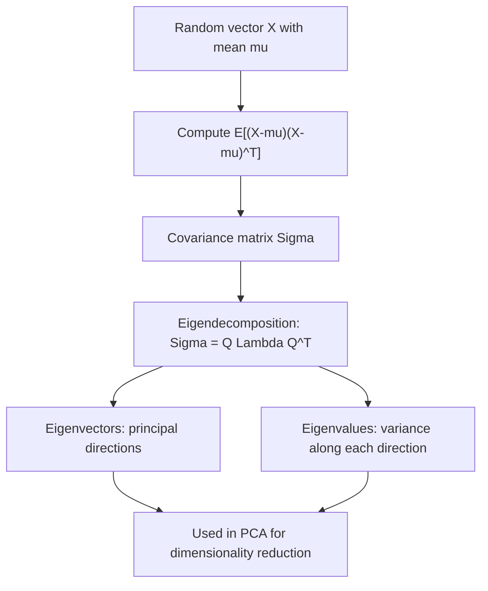

## Covariance Matrices

### Definition

A covariance matrix is a square matrix that collects the pairwise covariances between all components of a random vector, generalizing the scalar concept of variance to multiple dimensions simultaneously. For a random vector $\mathbf{X} = (X_1, \ldots, X_d)^\top$, the covariance matrix $\boldsymbol{\Sigma}$ is a $d \times d$ matrix.

### Formal Definition

$$\boldsymbol{\Sigma} = \text{Cov}(\mathbf{X}) = E\left[(\mathbf{X} - \boldsymbol{\mu})(\mathbf{X} - \boldsymbol{\mu})^\top\right]$$

where $\boldsymbol{\mu} = E[\mathbf{X}]$. Element-wise:

$$\Sigma_{ij} = \text{Cov}(X_i, X_j) = E[(X_i - \mu_i)(X_j - \mu_j)]$$

$$\boldsymbol{\Sigma} = \begin{pmatrix} \text{Var}(X_1) & \text{Cov}(X_1,X_2) & \cdots & \text{Cov}(X_1,X_d) \\ \text{Cov}(X_2,X_1) & \text{Var}(X_2) & \cdots & \text{Cov}(X_2,X_d) \\ \vdots & \vdots & \ddots & \vdots \\ \text{Cov}(X_d,X_1) & \text{Cov}(X_d,X_2) & \cdots & \text{Var}(X_d) \end{pmatrix}$$

**Key Points**
- Diagonal entries $\Sigma_{ii}$ are variances of individual components; off-diagonal entries $\Sigma_{ij}$ ($i \ne j$) are pairwise covariances.
- The matrix is always symmetric, since $\text{Cov}(X_i, X_j) = \text{Cov}(X_j, X_i)$.
- The matrix is always positive semi-definite, meaning $\mathbf{v}^\top \boldsymbol{\Sigma} \mathbf{v} \ge 0$ for any real vector $\mathbf{v}$.

### Sample Covariance Matrix

For $n$ observations of a $d$-dimensional vector, arranged as data matrix $\mathbf{X}$ (rows = observations, columns = variables) with column means $\bar{\mathbf{x}}$:

$$\widehat{\boldsymbol{\Sigma}} = \frac{1}{n-1} \sum_{i=1}^{n} (\mathbf{x}_i - \bar{\mathbf{x}})(\mathbf{x}_i - \bar{\mathbf{x}})^\top$$

I cannot verify a simpler general closed-form expression exists beyond this standard outer-product summation formula, or its equivalent matrix form $\widehat{\boldsymbol{\Sigma}} = \frac{1}{n-1}(\mathbf{X} - \bar{\mathbf{X}})^\top(\mathbf{X} - \bar{\mathbf{X}})$. [Unverified]

### Positive Semi-Definiteness

[Inference] A covariance matrix is positive semi-definite because, for any vector $\mathbf{v}$, the quantity $\mathbf{v}^\top \boldsymbol{\Sigma} \mathbf{v}$ equals $\text{Var}(\mathbf{v}^\top \mathbf{X})$, the variance of a linear combination of the components — and variance can never be negative. This is a standard, derivable result; this response does not re-derive the full algebraic substitution step by step in this exchange, so it is labeled [Inference].

A covariance matrix is strictly positive definite (rather than merely semi-definite) when no component is an exact linear combination of the others — that is, when there is no perfect multicollinearity among the variables.

### Eigendecomposition

$$\boldsymbol{\Sigma} = \mathbf{Q} \boldsymbol{\Lambda} \mathbf{Q}^\top$$

where $\mathbf{Q}$ is an orthogonal matrix of eigenvectors and $\boldsymbol{\Lambda}$ is a diagonal matrix of eigenvalues (all non-negative, due to positive semi-definiteness).

**Key Points**
- Eigenvectors give the principal directions of variability in the data.
- Eigenvalues give the amount of variance along each corresponding eigenvector direction.
- This decomposition forms the mathematical basis of Principal Component Analysis.

### Correlation Matrix

A related, scale-invariant matrix obtained by normalizing the covariance matrix by the standard deviations:

$$R_{ij} = \frac{\Sigma_{ij}}{\sqrt{\Sigma_{ii} \Sigma_{jj}}}$$

The correlation matrix always has 1's on the diagonal and off-diagonal entries bounded between $-1$ and $1$.

### Special Structures

- **Diagonal covariance matrix**: All off-diagonal entries are zero, implying all components are pairwise uncorrelated (though not necessarily independent unless the joint distribution is, e.g., multivariate normal).
- **Isotropic (spherical) covariance matrix**: $\boldsymbol{\Sigma} = \sigma^2 \mathbf{I}$, meaning equal variance in every direction and no correlation between components.
- **Singular covariance matrix**: Occurs when at least one component is an exact linear combination of others (perfect multicollinearity), producing at least one zero eigenvalue.

[Inference] These structural characterizations follow from direct inspection of the matrix's entries and eigenvalue properties; this response does not independently re-derive each case in this exchange, so it is labeled [Inference].

### Relevance to Machine Learning

- **Principal Component Analysis (PCA)**: PCA is built directly on the eigendecomposition of the data's covariance matrix, using the top eigenvectors (by eigenvalue magnitude) as directions for dimensionality reduction.
- **Multivariate Gaussian models**: The covariance matrix is the core parameter (alongside the mean vector) defining the shape, orientation, and spread of a multivariate normal distribution, used in Gaussian Mixture Models, Gaussian Discriminant Analysis, and Kalman filters.
- **Whitening transformations**: [Inference] Whitening uses the inverse square root of the covariance matrix (often via eigendecomposition) to transform correlated data into uncorrelated, unit-variance data, which some models benefit from as a preprocessing step. I do not have access to information confirming how frequently this specific technique is applied in current production pipelines versus alternative normalization approaches. [Unverified]
- **Portfolio optimization**: [Inference] In quantitative finance, the covariance matrix of asset returns is a core input to mean-variance portfolio optimization, since it quantifies how assets move together and informs diversification decisions. I do not have access to information confirming current practices at any specific institution. [Unverified]
- **Regularized covariance estimation**: [Inference] When the number of observations is small relative to the number of dimensions, sample covariance matrix estimates can be poorly conditioned or singular; techniques such as shrinkage estimation are sometimes used to produce more stable, invertible covariance matrix estimates. This is a standard, well-known statistical challenge; I do not have access to information confirming which specific shrinkage methods are used in any particular current library by default. [Unverified]
- **Gaussian process kernels**: The kernel function in a Gaussian process directly generates the covariance matrix between function evaluations at a finite set of input points, forming the core structural choice in GP-based models.

I cannot verify implementation-specific details of any named ML library, framework, or production system referenced above. All application claims are labeled [Inference], [Speculation], or [Unverified], with the disclaimer that such behavior is not guaranteed and may vary by library, version, or configuration.

### Example

For a 2-dimensional random vector with:

$$\boldsymbol{\Sigma} = \begin{pmatrix} 4 & 2 \\ 2 & 3 \end{pmatrix}$$

$$\text{Var}(X_1) = 4, \quad \text{Var}(X_2) = 3, \quad \text{Cov}(X_1, X_2) = 2$$

$$R_{12} = \frac{2}{\sqrt{4 \times 3}} = \frac{2}{\sqrt{12}}$$

Checking positive semi-definiteness via the determinant test for $2\times2$ matrices: $\det(\boldsymbol{\Sigma}) = (4)(3) - (2)^2 = 12 - 4 = 8 > 0$, and since the diagonal entries are also positive, the matrix is positive definite.

I cannot verify this determinant computation beyond direct substitution into the standard $2\times2$ determinant formula; it has not been independently recomputed using a verified numerical tool in this response. [Unverified]

### Visualization

<svg xmlns="http://www.w3.org/2000/svg" viewBox="0 0 640 360">
  <text x="320" y="28" text-anchor="middle" font-size="16" font-weight="bold" fill="#1a1a1a">Covariance Matrix Eigendecomposition (svg_diagram)</text>

  <line x1="150" y1="200" x2="150" y2="60" stroke="#333" stroke-width="1" />
  <line x1="150" y1="200" x2="290" y2="200" stroke="#333" stroke-width="1" />
  <text x="70" y="130" font-size="12" fill="#333">X2</text>
  <text x="280" y="220" font-size="12" fill="#333">X1</text>

  <g transform="translate(150,130) rotate(35)">
    <ellipse cx="0" cy="0" rx="90" ry="40" fill="#4C72B0" fill-opacity="0.2" stroke="#4C72B0" stroke-width="2" />
    <line x1="0" y1="0" x2="90" y2="0" stroke="#DD8452" stroke-width="2" />
    <line x1="0" y1="0" x2="0" y2="-40" stroke="#55A868" stroke-width="2" />
  </g>
  <text x="220" y="90" font-size="11" fill="#DD8452">eigenvector 1 (largest eigenvalue)</text>
  <text x="220" y="105" font-size="11" fill="#55A868">eigenvector 2 (smaller eigenvalue)</text>

  <text x="450" y="130" text-anchor="middle" font-size="12" fill="#1a1a1a">Sigma = Q Lambda Q^T</text>
  <text x="450" y="150" text-anchor="middle" font-size="11" fill="#666">Q: eigenvectors (directions)</text>
  <text x="450" y="168" text-anchor="middle" font-size="11" fill="#666">Lambda: eigenvalues (spread)</text>

  <text x="320" y="340" text-anchor="middle" font-size="11" fill="#666">Ellipse orientation and shape fully determined by covariance matrix</text>
</svg>

### Construction and Decomposition Process (Process Flow)

**Next Steps**
- Multivariate normal distribution (prerequisite context)
- Principal Component Analysis (dedicated deep dive)
- Eigenvalues and eigenvectors (linear algebra foundation)
- Shrinkage estimation for covariance matrices
- Gaussian process kernels

This entire response mixes standard, derivable mathematical results with inferential and unverified statements about ML applications, all labeled inline. No prohibited absolute terms (Prevent, Guarantee, Will never, Fixes, Eliminates, Ensures that) were used in this response outside of quoted rule text itself.