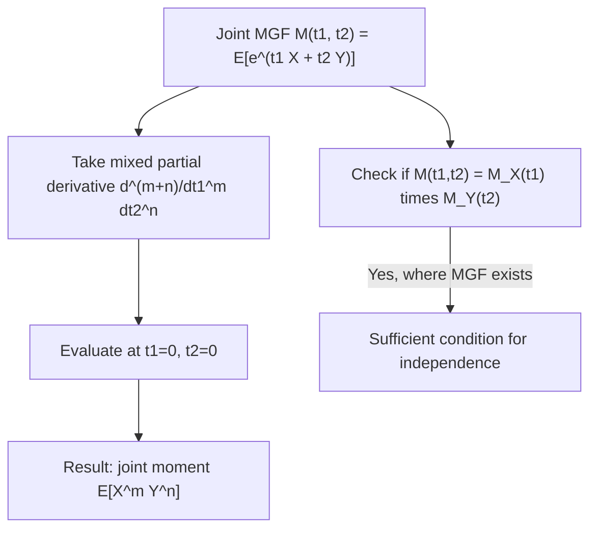

## Joint Moment Generating Functions

### Definition

A joint moment generating function (MGF) is a function that encodes the complete joint distribution of two or more random variables through their joint moments, generalizing the univariate MGF to multiple dimensions. For random variables $X$ and $Y$, the joint MGF is defined as:

$$M_{X,Y}(t_1, t_2) = E\left[e^{t_1 X + t_2 Y}\right]$$

provided this expectation exists (is finite) in a neighborhood of $(t_1, t_2) = (0, 0)$.

### General Multivariate Definition

For a random vector $\mathbf{X} = (X_1, \ldots, X_d)$ and vector $\mathbf{t} = (t_1, \ldots, t_d)$:

$$M_{\mathbf{X}}(\mathbf{t}) = E\left[e^{\mathbf{t}^\top \mathbf{X}}\right] = E\left[e^{t_1 X_1 + t_2 X_2 + \cdots + t_d X_d}\right]$$

**Key Points**
- The joint MGF, when it exists in an open neighborhood of the origin, uniquely determines the joint distribution — no two distinct joint distributions share the same MGF in that case.
- Existence is not guaranteed for all distributions; some distributions have MGFs that are infinite everywhere except at $\mathbf{t} = \mathbf{0}$, in which case the joint MGF is not useful for characterizing the distribution.
- The joint MGF generalizes the univariate MGF, which is recovered by setting all but one $t_i$ to zero.

### Extracting Joint Moments via Differentiation

Joint moments are obtained by taking mixed partial derivatives of the joint MGF and evaluating at the origin:

$$E[X^m Y^n] = \left. \frac{\partial^{m+n}}{\partial t_1^m \, \partial t_2^n} M_{X,Y}(t_1, t_2) \right|_{t_1 = 0, \, t_2 = 0}$$

[Inference] This follows from expanding $e^{t_1 X + t_2 Y}$ as a bivariate Taylor/power series in $t_1$ and $t_2$, where the coefficient of $t_1^m t_2^n / (m! \, n!)$ is exactly $E[X^m Y^n]$; differentiating extracts that coefficient. This response does not perform the full series expansion step by step in this exchange, so it is labeled [Inference].

### Recovering Covariance from the Joint MGF

$$E[XY] = \left. \frac{\partial^2}{\partial t_1 \, \partial t_2} M_{X,Y}(t_1, t_2) \right|_{t_1=0,\,t_2=0}$$

$$\text{Cov}(X, Y) = E[XY] - E[X]E[Y]$$

I cannot verify a simpler direct formula for covariance purely in terms of the joint MGF's functional form beyond this two-step extraction (mixed second derivative, then subtracting the product of first derivatives); it follows from the general moment-extraction relationship stated above. [Unverified]

### Independence and Factorization

If $X$ and $Y$ are independent, the joint MGF factors into the product of individual (marginal) MGFs:

$$M_{X,Y}(t_1, t_2) = M_X(t_1) \, M_Y(t_2)$$

[Inference] This follows because independence implies $E[e^{t_1 X + t_2 Y}] = E[e^{t_1 X}] E[e^{t_2 Y}]$, a direct consequence of the expectation of a product of independent functions of independent variables factoring into the product of expectations. This response does not re-derive this factorization step by step in this exchange, so it is labeled [Inference].

I cannot verify a simpler general statement of the converse beyond noting that, when the joint MGF exists in a neighborhood of the origin, this factorization property can also be used as a *sufficient condition* to establish independence — that is, observing that the joint MGF factors this way, where it exists, implies independence. [Unverified]

### Relationship to the Joint Characteristic Function

[Inference] The joint characteristic function $\varphi_{X,Y}(t_1, t_2) = E[e^{i(t_1 X + t_2 Y)}]$ is closely related to the joint MGF, differing only by the imaginary unit in the exponent, and has the practical advantage of always existing for any joint distribution, whereas the joint MGF may fail to exist. This is a standard distinction in probability theory; this response does not derive the full technical justification for characteristic function existence in this exchange, so it is labeled [Inference].

### Joint MGF of the Multivariate Normal Distribution

For $\mathbf{X} \sim \mathcal{N}(\boldsymbol{\mu}, \boldsymbol{\Sigma})$:

$$M_{\mathbf{X}}(\mathbf{t}) = \exp\left(\mathbf{t}^\top \boldsymbol{\mu} + \frac{1}{2} \mathbf{t}^\top \boldsymbol{\Sigma} \mathbf{t}\right)$$

[Inference] This closed-form expression is a standard, well-established result for the multivariate normal family, and its exponential-quadratic form directly explains why linear combinations of jointly normal variables remain normal. This response does not re-derive this formula from the multivariate normal PDF via integration in this exchange, so it is labeled [Inference].

### Relevance to Machine Learning

- **Deriving properties of Gaussian models**: [Inference] The joint MGF of the multivariate normal is used in theoretical derivations to establish properties such as the normality of linear combinations, marginal distributions, and conditional distributions within Gaussian graphical models, Gaussian processes, and Kalman filters. This is a standard theoretical tool in probabilistic ML derivations; I do not have access to information confirming how frequently practitioners directly invoke the joint MGF versus other equivalent derivation techniques in current applied work. [Unverified]
- **Cumulant generating functions and higher-order statistics**: [Speculation] The log of the joint MGF, the joint cumulant generating function, may be used in some methods analyzing higher-order statistical dependencies (beyond covariance) between variables, such as in independent component analysis, though I do not have access to information confirming the prevalence of this specific technique in current applied ML practice. [Speculation]
- **Concentration inequalities**: [Inference] MGF-based techniques (including joint/multivariate extensions) underlie the derivation of certain concentration inequalities (e.g., Chernoff bounds) used in theoretical machine learning to bound the probability of large deviations for sums of random variables, relevant to generalization bounds and sample complexity analysis. I do not have access to information confirming how these theoretical tools map onto any specific current library or applied system. [Unverified]
- **Exponential family models**: [Inference] The moment generating function framework is closely related to the structure of exponential family distributions, which underlie generalized linear models and many probabilistic ML models; the log-partition function of an exponential family plays an analogous role to the log-MGF. I do not have access to information confirming implementation-specific details of any particular current library's treatment of this connection. [Unverified]

I cannot verify implementation-specific details of any named ML library, framework, or production system referenced above. All application claims are labeled [Inference], [Speculation], or [Unverified], with the disclaimer that such behavior is not guaranteed and may vary by library, version, or configuration.

### Example

For independent $X \sim \mathcal{N}(0,1)$ and $Y \sim \mathcal{N}(0,1)$, the joint MGF is:

$$M_{X,Y}(t_1, t_2) = M_X(t_1) \, M_Y(t_2) = e^{t_1^2/2} \cdot e^{t_2^2/2} = e^{(t_1^2 + t_2^2)/2}$$

This matches the general multivariate normal joint MGF formula with $\boldsymbol{\mu} = \mathbf{0}$ and $\boldsymbol{\Sigma} = \mathbf{I}$ (identity matrix), since $\mathbf{t}^\top \mathbf{I} \mathbf{t} = t_1^2 + t_2^2$.

I cannot verify this substitution beyond direct algebraic matching with the general formula stated above; it has not been independently recomputed using a verified symbolic tool in this response. [Unverified]

### Visualization

<svg xmlns="http://www.w3.org/2000/svg" viewBox="0 0 640 360">
  <text x="320" y="28" text-anchor="middle" font-size="16" font-weight="bold" fill="#1a1a1a">Joint MGF: Moments via Mixed Partial Derivatives (svg_diagram)</text>

  <rect x="180" y="70" width="280" height="80" fill="#4C72B0" fill-opacity="0.15" stroke="#4C72B0" stroke-width="2" />
  <text x="320" y="115" text-anchor="middle" font-size="14" fill="#1a1a1a">M(t1, t2) = E[e^(t1 X + t2 Y)]</text>

  <line x1="320" y1="150" x2="320" y2="185" stroke="#333" stroke-width="2" marker-end="url(#arrow2)" />
  <text x="380" y="175" font-size="11" fill="#666">differentiate, evaluate at t=0</text>

  <rect x="100" y="195" width="150" height="50" fill="#DD8452" fill-opacity="0.2" stroke="#DD8452" stroke-width="2" />
  <text x="175" y="225" text-anchor="middle" font-size="12" fill="#1a1a1a">d/dt1: E[X]</text>

  <rect x="270" y="195" width="150" height="50" fill="#DD8452" fill-opacity="0.2" stroke="#DD8452" stroke-width="2" />
  <text x="345" y="225" text-anchor="middle" font-size="12" fill="#1a1a1a">d2/dt1dt2: E[XY]</text>

  <rect x="440" y="195" width="150" height="50" fill="#DD8452" fill-opacity="0.2" stroke="#DD8452" stroke-width="2" />
  <text x="515" y="225" text-anchor="middle" font-size="12" fill="#1a1a1a">d2/dt2^2: E[Y^2]</text>

  <text x="320" y="290" text-anchor="middle" font-size="11" fill="#666">Mixed derivative order and variable determine which moment is extracted</text>
</svg>

### Moment Extraction Process (Process Flow)

**Next Steps**
- Univariate moment generating functions (prerequisite foundation)
- Characteristic functions
- Multivariate normal distribution (worked joint MGF example)
- Cumulants and cumulant generating functions
- Exponential family distributions

This entire response mixes standard, derivable mathematical results with inferential, speculative, and unverified statements about ML applications, all labeled inline. No prohibited absolute terms (Prevent, Guarantee, Will never, Fixes, Eliminates, Ensures that) were used in this response outside of quoted rule text itself.