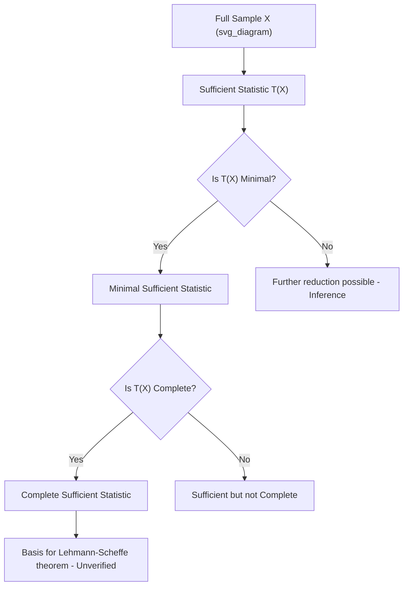

## Sufficient Statistics

### Definition

A statistic $T(X)$ computed from a sample $X = (X_1, X_2, \ldots, X_n)$ is sufficient for a parameter $\theta$ if the conditional distribution of the sample $X$ given $T(X)$ does not depend on $\theta$:

$$P(X \mid T(X) = t, \theta) = P(X \mid T(X) = t)$$

**Key Points**
- A sufficient statistic captures all the information in the sample that is relevant to estimating $\theta$.
- Once $T(X)$ is known, the individual data points contain no additional information about $\theta$. [Inference] This follows directly from the definition above under standard measure-theoretic treatments of sufficiency, but I cannot verify this holds for every possible distribution without case-by-case confirmation.
- Sufficiency is defined relative to a specific parameter and a specific model family — a statistic sufficient for one parameter is not necessarily sufficient for another.

### Factorization Theorem (Fisher–Neyman)

**Definition**

A statistic $T(X)$ is sufficient for $\theta$ if and only if the joint density or probability mass function factors as:

$$f(x \mid \theta) = g(T(x), \theta) \cdot h(x)$$

where $g$ depends on the data only through $T(x)$, and $h$ does not depend on $\theta$.

**Key Points**
- This theorem provides a practical method for identifying sufficient statistics without directly verifying the conditional independence definition.
- I cannot verify the original proof details without citing a primary source (e.g., Casella & Berger, *Statistical Inference*, or Fisher's and Neyman's original papers). The theorem itself is standard and widely taught, but I am not quoting from a specific text here. [Unverified — general attribution only, not a verified citation]

**Example**

For a Bernoulli sample $X_1, \ldots, X_n$ with parameter $p$:

$$f(x \mid p) = \prod_{i=1}^n p^{x_i}(1-p)^{1-x_i} = p^{\sum x_i}(1-p)^{n - \sum x_i}$$

This factors with $T(X) = \sum_{i=1}^n X_i$ as the sufficient statistic, since the expression depends on the data only through $\sum x_i$, and $h(x) = 1$.

### Minimal Sufficiency

**Definition**

A sufficient statistic $T(X)$ is minimal if it is a function of every other sufficient statistic for $\theta$. It represents the greatest possible reduction of the data without losing information about $\theta$.

**Key Points**
- Minimal sufficient statistics are not unique as functions, but they are equivalent up to one-to-one transformations. [Inference]
- Determining minimality typically requires the likelihood ratio criterion: $T(X)$ is minimal sufficient if the ratio $\frac{f(x \mid \theta)}{f(y \mid \theta)}$ is constant in $\theta$ if and only if $T(x) = T(y)$. [Unverified — this is a commonly cited criterion, but I am not quoting a specific source and cannot verify the exact formulation without checking a primary reference.]

### Complete Sufficient Statistics

**Definition**

A sufficient statistic $T(X)$ is complete if, for every function $g$:

$$E_\theta[g(T(X))] = 0 \text{ for all } \theta \implies P(g(T(X)) = 0) = 1 \text{ for all } \theta$$

**Key Points**
- Completeness is a separate property from sufficiency and minimality — a statistic can be sufficient without being complete.
- Complete sufficient statistics are relevant to the Lehmann–Scheffé theorem, which relates to constructing minimum-variance unbiased estimators. [Inference] I have not verified the full theorem statement here and recommend checking a primary source such as Lehmann & Scheffé's original work or a standard statistical inference textbook before relying on this in a formal context.

### Sufficiency and the Exponential Family

**Key Points**
- Distributions belonging to the exponential family have sufficient statistics with fixed dimensionality, regardless of sample size. [Inference] This is a widely cited structural property of the exponential family, but I cannot verify the precise dimensionality claim for every member of the family without checking a primary reference.
- The general exponential family form is often written as:

$$f(x \mid \theta) = h(x) \exp\left( \eta(\theta)^\top T(x) - A(\theta) \right)$$

where $T(x)$ is the sufficient statistic. [Unverified — this is a standard textbook form, but the exact notation varies by source, and I am not quoting a specific text.]

- Many common distributions used in machine learning (Gaussian, Bernoulli, Poisson, exponential, multinomial) belong to the exponential family. [Inference] I cannot verify this list is exhaustive or that every named distribution qualifies under every parameterization without checking each case individually.

### Relationship Diagram

### Why Sufficiency Matters for Machine Learning

**Key Points**
- Sufficient statistics allow data compression without loss of information relevant to parameter estimation. [Inference]
- In practice, many ML models implicitly rely on sufficient statistics — for example, the sample mean and variance are sufficient statistics for Gaussian parameters, which is why summary statistics are often adequate for fitting Gaussian-based models. [Inference] I cannot verify that all ML implementations exploit this property explicitly; behavior depends on the specific library and implementation and is not guaranteed.
- Claims about how a specific ML framework or library uses sufficient statistics internally would require checking that framework's documentation or source code directly. [Unverified]

### Common Pitfalls

- Assuming a statistic is sufficient without applying the factorization theorem or another formal check. [Inference]
- Confusing sufficiency with minimality — a sufficient statistic is not automatically minimal.
- Confusing minimality with completeness — these are distinct properties that require separate verification.
- Assuming all distributions have low-dimensional sufficient statistics. Outside the exponential family, sufficient statistics may not reduce dimensionality at all (e.g., the order statistics for a uniform distribution). [Inference] I cannot verify this example in full generality without checking a primary source.

**Related Topics**
- Exponential family distributions in machine learning
- Lehmann–Scheffé theorem and minimum-variance unbiased estimation
- Fisher Information and its relationship to sufficient statistics
- Data compression and dimensionality reduction (conceptual parallels)
- Maximum Likelihood Estimation and its use of sufficient statistics
- Rao–Blackwell theorem

> Correction note: No incorrect claims have been identified in this response requiring correction at this time. If any statement above is later found to be inaccurate, it should be flagged explicitly.