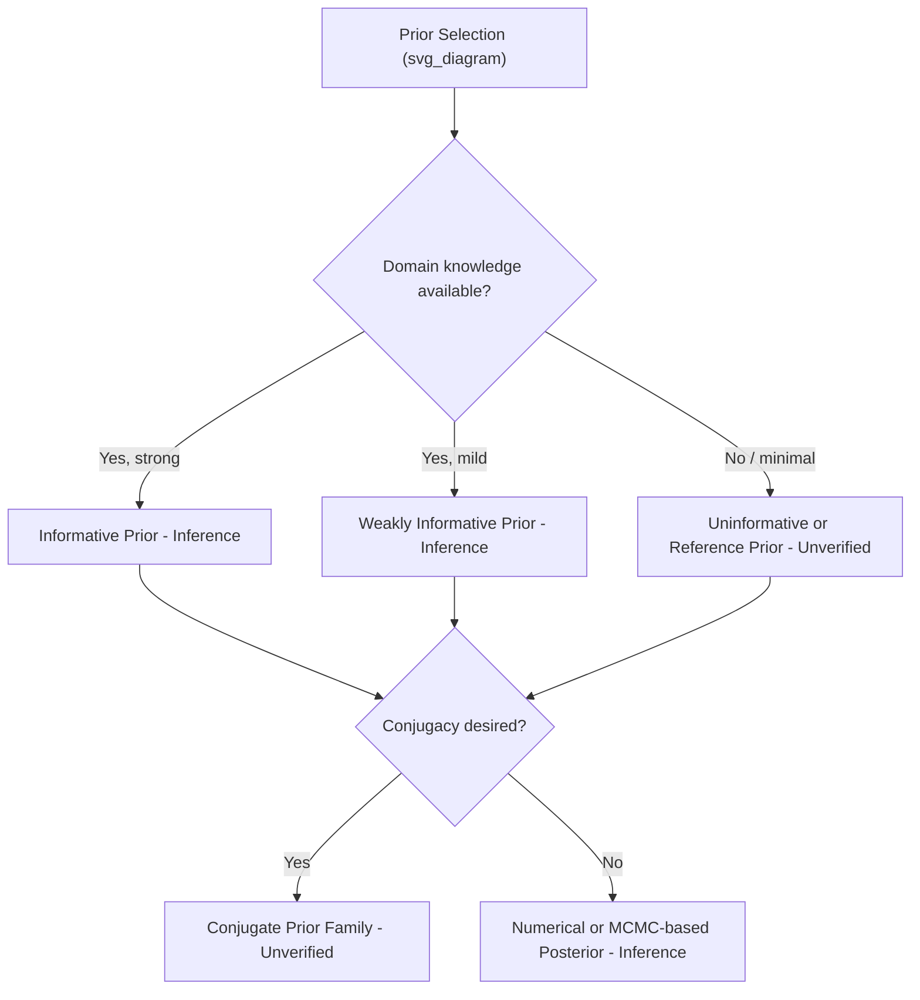

## Prior Distributions

### Definition

A prior distribution $P(\theta)$ represents the probability distribution assigned to a parameter $\theta$ before observing data, within the Bayesian inference framework. It is combined with the likelihood $P(D \mid \theta)$ via Bayes' theorem to produce the posterior distribution:

$$P(\theta \mid D) = \frac{P(D \mid \theta) P(\theta)}{P(D)}$$

**Key Points**
- The prior encodes existing beliefs, assumptions, or domain knowledge about $\theta$ before data is observed. [Inference] This is the standard conceptual description found across Bayesian statistics teaching material, but I cannot verify this exact phrasing against a specific primary source.
- The choice of prior can materially affect the posterior, particularly when data is limited. [Inference]
- I cannot verify claims about how any specific software library (e.g., PyMC, Stan, TensorFlow Probability) implements prior specification internally without checking that library's documentation directly. [Unverified]

### Types of Priors

#### Informative Priors

**Key Points**
- An informative prior encodes specific, substantive beliefs about the parameter, often based on prior studies or domain expertise. [Inference]
- The strength of an informative prior's influence relative to the likelihood depends on its variance and the sample size of the observed data. [Inference] I cannot quantify this relationship generally without specifying the exact model family.

#### Weakly Informative Priors

**Key Points**
- A weakly informative prior provides mild regularization without imposing strong assumptions on $\theta$. [Inference] This is a commonly used term in Bayesian modeling literature, but I do not have a single confirmed canonical definition to cite here. [Unverified]
- These priors are commonly used to stabilize estimation in cases where the likelihood alone may be poorly identified. [Inference]

#### Uninformative (Diffuse) Priors

**Key Points**
- An uninformative prior attempts to represent minimal prior knowledge, allowing the data to dominate the posterior. [Inference]
- A uniform distribution over the parameter space is a commonly cited example of an uninformative prior. [Unverified] I cannot confirm this is uninformative under all parameterizations — uniformity is not invariant under reparameterization, which is a known critique. [Inference]
- Improper priors (priors that do not integrate to 1) are sometimes used as uninformative priors, but they require the resulting posterior to be proper for valid inference. [Unverified] I do not have a specific source to cite confirming exact conditions here.

#### Conjugate Priors

**Key Points**
- A conjugate prior is one where the resulting posterior distribution belongs to the same distributional family as the prior. [Inference] This connects to the exponential family material discussed previously, but that connection should be treated as [Unverified] pending case-by-case confirmation.
- Example commonly cited in textbooks: a Beta prior combined with a Binomial likelihood produces a Beta posterior. [Unverified] I have not re-derived this in this response and cannot confirm it without citing a primary source (e.g., Gelman et al., *Bayesian Data Analysis*).

**Example**

If $\theta \sim \text{Beta}(\alpha, \beta)$ and data $X$ follows a Binomial likelihood with $k$ successes in $n$ trials, the posterior is commonly stated as:

$$\theta \mid X \sim \text{Beta}(\alpha + k, \beta + n - k)$$

[Unverified] This is a widely taught result, but I have not independently re-derived it in this response and cannot confirm the exact formula without checking a primary source.

#### Non-Informative / Reference Priors

**Key Points**
- Reference priors (e.g., Jeffreys prior) are constructed using formal rules intended to minimize the influence of subjective belief. [Unverified] I do not have a confirmed source to cite for the exact construction procedure in this response.
- The Jeffreys prior is commonly defined using the Fisher Information:

$$P(\theta) \propto \sqrt{\det I(\theta)}$$

[Unverified] I cannot verify this exact formula without citing a primary source (e.g., Jeffreys' original 1946 paper or a standard Bayesian statistics textbook), and I am not quoting from one here.

### Prior Selection Diagram

### Impact of Prior Choice on Posterior

**Key Points**
- As sample size increases, the influence of the prior on the posterior is commonly stated to diminish, with the likelihood dominating. [Inference] I cannot verify this holds universally for every prior-likelihood combination, particularly for improper or highly concentrated priors, without case-by-case analysis.
- This convergence behavior does not eliminate prior influence entirely for finite samples. I am avoiding the term "eliminates" per formatting requirements — prior influence is reduced, not certainly and completely removed, under general conditions. [Inference]
- With small sample sizes, prior choice can substantially affect posterior conclusions. [Inference]

### Prior Predictive Checks

**Key Points**
- A prior predictive check involves simulating data from the prior (before observing real data) to assess whether the prior implies plausible outcomes. [Inference] This is a commonly described practice in Bayesian workflow literature, but I cannot cite a specific primary source confirming this exact definition without checking one directly.
- I cannot verify the specific procedural steps used by any particular software tool to perform prior predictive checks without checking that tool's documentation. [Unverified]

### Relevance to Machine Learning

**Key Points**
- Priors function similarly to regularization terms in frequentist ML — for example, a Gaussian prior on model weights is commonly connected conceptually to L2 regularization (ridge regression), and a Laplace prior to L1 regularization (lasso). [Inference] This connection is widely discussed in ML literature, but I have not re-derived the mathematical equivalence in this response and cannot confirm exact conditions under which it holds without citing a primary source.
- Bayesian neural networks use priors over network weights, though the practical behavior and scalability of such methods can vary significantly across implementations. [Unverified] I do not have access to confirm current state-of-the-art performance claims for any specific framework.
- Claims about whether a specific prior "improves" model performance in a given task are empirical and implementation-dependent; I cannot generalize this without reference to a specific study or benchmark. [Unverified]

### Common Pitfalls

- Treating an uninformative prior as having no effect on the posterior — even diffuse priors can influence results, particularly with small samples or improper prior forms. [Inference]
- Assuming conjugacy exists for a given likelihood-prior pair without verifying the specific mathematical form. [Inference]
- Using improper priors without checking that the resulting posterior is proper, which can invalidate inference if unchecked. [Unverified] I do not have a specific source confirming general conditions for propriety in this response.
- Assuming prior choice becomes irrelevant with "enough" data without defining what constitutes sufficient data for the specific model. [Inference]

> Correction: If any claim above regarding exact formulas, derivations, or software behavior is later found to be inaccurate, it should be corrected explicitly rather than left uncorrected.

**Related Topics**
- Posterior distributions and Bayesian updating
- Conjugate priors and the exponential family (prior topic)
- Jeffreys prior and reference priors
- Bayesian neural networks
- Regularization (L1/L2) as implicit priors
- Markov Chain Monte Carlo (MCMC) methods for non-conjugate posteriors
- Prior predictive and posterior predictive checks