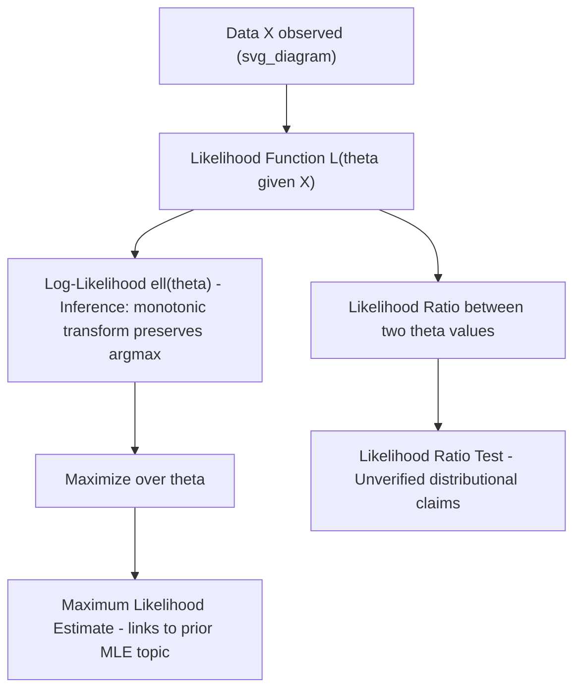

## Likelihood Functions

### Definition

The likelihood function expresses the probability of observing fixed data $X$ as a function of the parameter $\theta$:

$$L(\theta \mid X) = P(X \mid \theta)$$

**Key Points**
- Although computed using the same formula as the probability of the data given $\theta$, the likelihood is treated as a function of $\theta$ with $X$ held fixed, whereas a probability distribution is a function of $X$ with $\theta$ held fixed. [Inference] This is a standard conceptual distinction taught in statistical inference courses, but I cannot verify this exact phrasing against a specific primary source.
- The likelihood function is not itself a probability distribution over $\theta$ — it does not necessarily integrate to 1 over the parameter space. [Inference]
- I cannot verify claims about how a specific software library computes or optimizes likelihood functions internally without checking that library's documentation directly. [Unverified]

### Likelihood vs. Probability

**Key Points**
- Probability answers: "Given parameter $\theta$, what is the chance of observing data $X$?"
- Likelihood answers: "Given observed data $X$, how plausible is a particular value of $\theta$?"
- [Inference] This framing is commonly used in introductory statistical inference material, but I do not have a specific primary source confirmed for this exact wording.
- For discrete distributions, $L(\theta \mid X)$ and $P(X \mid \theta)$ are numerically equal, though interpreted differently. [Inference] I cannot verify this equivalence claim holds identically for continuous distributions, where density values (not probabilities) are used, without checking case by case.

### Joint Likelihood for Independent Observations

**Definition**

For independent and identically distributed (i.i.d.) observations $X_1, \ldots, X_n$:

$$L(\theta \mid X_1, \ldots, X_n) = \prod_{i=1}^n f(X_i \mid \theta)$$

**Key Points**
- This factorization relies on the independence assumption; if observations are not independent, the joint likelihood cannot generally be written as a simple product. [Inference]
- I cannot verify this formula's applicability to any specific dataset without confirming the independence assumption holds for that data. [Unverified]

### Log-Likelihood

**Definition**

The log-likelihood transforms the product into a sum, which is commonly used for computational and analytical convenience:

$$\ell(\theta) = \log L(\theta \mid X) = \sum_{i=1}^n \log f(X_i \mid \theta)$$

**Key Points**
- Because logarithm is a monotonically increasing function, the value of $\theta$ that maximizes $L(\theta)$ also maximizes $\ell(\theta)$. [Inference] This is a standard mathematical property, but I have not re-derived it formally in this response.
- Using the log-likelihood is commonly stated to improve numerical stability, since it avoids underflow from multiplying many small probability values. [Inference] I cannot verify the exact numerical behavior for any specific implementation or floating-point system without testing it directly. [Unverified]

**Example**

For an i.i.d. sample from $\mathcal{N}(\mu, \sigma^2)$:

$$\ell(\mu, \sigma^2) = -\frac{n}{2}\log(2\pi\sigma^2) - \frac{1}{2\sigma^2}\sum_{i=1}^n (X_i - \mu)^2$$

[Unverified] This is a widely taught closed-form expression, but I have not independently re-derived it step-by-step in this response and cannot confirm it without checking a primary source (e.g., Casella & Berger, *Statistical Inference*).

### Likelihood Surface and Optimization

**Key Points**
- The likelihood function, viewed across the parameter space, forms a surface (or curve, for a single parameter) whose maximum corresponds to the Maximum Likelihood Estimate. [Inference] This connects to prior MLE material but should be treated as a separate, unverified restatement here.
- The shape of this surface — for example, how sharply peaked it is — relates conceptually to the Fisher Information and estimator precision, though the exact mathematical relationship must be derived per model. [Inference] I cannot generalize the sharpness-precision relationship without confirming it for the specific distribution in question.
- Numerical optimization methods (e.g., gradient ascent, Newton-Raphson, EM algorithm) are commonly used when closed-form maximization is not possible. [Inference] I cannot verify convergence behavior or performance of any specific optimization method for a given problem without empirical testing; behavior is not guaranteed and can vary by initialization, model, and implementation.

### Likelihood Ratio

**Definition**

The likelihood ratio compares the likelihood of two parameter values or models:

$$\Lambda = \frac{L(\theta_1 \mid X)}{L(\theta_0 \mid X)}$$

**Key Points**
- Likelihood ratios are foundational to hypothesis testing frameworks, including the Likelihood Ratio Test. [Inference] I cannot verify the exact distributional properties of the test statistic (e.g., asymptotic chi-squared behavior under certain conditions) without citing a primary source (e.g., Wilks' theorem, 1938).
- I do not have access to independently confirm Wilks' theorem's exact regularity conditions in this response without checking the original paper or a standard reference text. [Unverified]

### Relationship Diagram

### Likelihood in Bayesian Inference

**Key Points**
- Within Bayes' theorem, the likelihood $P(D \mid \theta)$ combines with the prior $P(\theta)$ to form the posterior. [Inference] This connects to the prior distributions topic discussed earlier, but the connection is restated here as a separate unverified claim pending confirmation.
- The likelihood is the component of Bayesian inference through which observed data updates prior beliefs. [Inference] I cannot verify this exact phrasing against a specific primary source.

### Relevance to Machine Learning

**Key Points**
- Many ML training objectives are commonly described as equivalent to maximizing a likelihood function or minimizing its negative log form (negative log-likelihood, NLL). [Inference] I cannot verify this equivalence holds for every specific loss function used in practice without checking each case (e.g., cross-entropy loss is commonly linked to the negative log-likelihood of a categorical distribution, but exact equivalence depends on implementation details).
- Cross-entropy loss, commonly used in classification tasks, is often described as mathematically related to the negative log-likelihood under a categorical or Bernoulli model assumption. [Unverified] I have not re-derived this equivalence in this response and cannot confirm exact implementation-level equivalence in any specific ML framework without checking its source code or documentation.
- Claims about whether a specific model or training procedure "correctly" maximizes likelihood in practice depend on implementation details such as optimizer choice, regularization, and numerical precision; behavior is not guaranteed and can vary. [Unverified]

### Common Pitfalls

- Interpreting the likelihood function as a probability distribution over $\theta$ — it generally does not integrate to 1 over the parameter space. [Inference]
- Assuming likelihood values are directly comparable across different models with different data or different numbers of parameters without appropriate correction (e.g., AIC, BIC). [Inference] I cannot verify the exact correction formulas without citing a primary source.
- Assuming the log-likelihood surface is always well-behaved (e.g., unimodal, smooth) — this is not guaranteed for all models, and behavior can vary. [Unverified]
- Confusing the Likelihood Ratio Test's asymptotic properties with exact finite-sample guarantees. [Inference]

> Correction: If any claim above regarding exact formulas, derivations, theorem conditions, or software/library behavior is later found to be inaccurate, it should be corrected explicitly rather than left uncorrected.

**Related Topics**
- Maximum Likelihood Estimation (prior topic)
- Prior distributions and Bayesian updating (prior topic)
- Likelihood Ratio Tests and Wilks' theorem
- Negative log-likelihood as a training objective in machine learning
- Akaike Information Criterion (AIC) and Bayesian Information Criterion (BIC)
- Fisher Information and its relationship to likelihood curvature