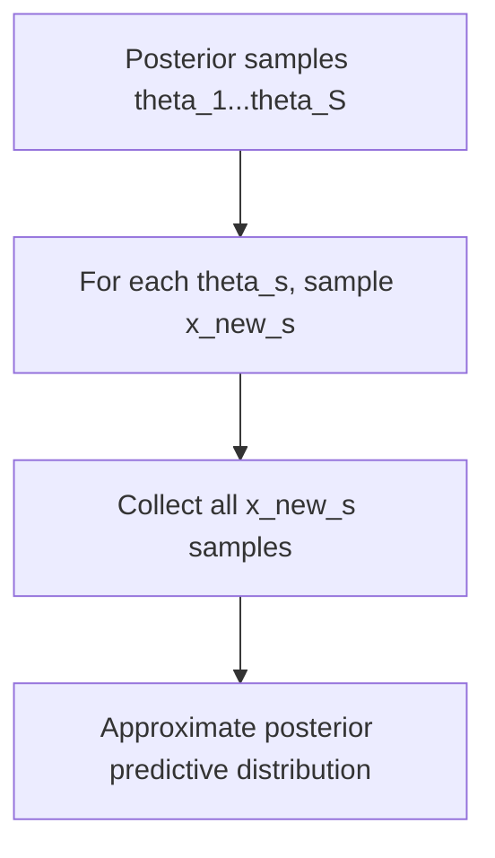

## Posterior Predictive Distributions

### Definition

The posterior predictive distribution describes the probability distribution of new, unobserved data points, given the observed data, after marginalizing (integrating) over the uncertainty in the model parameters.

$$P(x_{new} \mid D) = \int P(x_{new} \mid \theta) \, P(\theta \mid D) \, d\theta$$

Where:
- $P(x_{new} \mid D)$ — posterior predictive distribution
- $P(x_{new} \mid \theta)$ — likelihood of new data given parameters
- $P(\theta \mid D)$ — posterior distribution of parameters given observed data

### Conceptual Distinction from the Posterior

The posterior distribution $P(\theta \mid D)$ describes uncertainty about the parameter itself. The posterior predictive distribution instead describes uncertainty about future observations, incorporating both:
- Uncertainty inherent in the data-generating process (aleatoric)
- Uncertainty about the parameter value itself (epistemic)

[Inference] This decomposition into aleatoric and epistemic uncertainty is a standard framing used in Bayesian statistics literature. I cannot verify that every source uses this exact terminology consistently.

### Why This Matters in Machine Learning

Point-estimate predictions (e.g., using only $\hat{\theta}_{MAP}$) ignore parameter uncertainty. The posterior predictive distribution instead produces predictions that reflect the full range of plausible parameter values, generally yielding wider and more calibrated predictive intervals.

[Inference] Models using the full posterior predictive distribution tend to produce better-calibrated uncertainty estimates than plug-in point-estimate predictions, though calibration quality depends on model correctness and approximation accuracy — this is not guaranteed in all cases.

### Relationship to Point-Estimate Prediction

| Approach | Formula | Characteristics |
|---|---|---|
| Plug-in / MAP prediction | $P(x_{new} \mid \hat{\theta}_{MAP})$ | Single parameter value; underestimates uncertainty |
| Posterior predictive | $\int P(x_{new} \mid \theta) P(\theta \mid D) \, d\theta$ | Averages over all plausible parameters; wider, generally more honest uncertainty |

[Inference] The claim that plug-in prediction "underestimates uncertainty" is a reasoned conclusion from the mathematical structure of the integral (which adds variance from parameter uncertainty), not a claim verified against a specific empirical study in this conversation.

### Worked Example: Beta-Bernoulli Posterior Predictive

**Example**

Continuing from the Beta-Binomial conjugate setup:

- Posterior: $\theta \mid D \sim \text{Beta}(\alpha', \beta')$ where $\alpha' = \alpha + k$, $\beta' = \beta + n - k$
- Predicting a new binary outcome $x_{new} \in \{0, 1\}$

The posterior predictive probability of success has a closed-form solution:

$$P(x_{new} = 1 \mid D) = \frac{\alpha'}{\alpha' + \beta'}$$

**Output**

Using the earlier example (Beta(9,5) posterior from 7 clicks out of 10 impressions):

$$P(x_{new} = 1 \mid D) = \frac{9}{9+5} \approx 0.643$$

This matches the posterior mean of $\theta$ in this specific case, a property that holds for the Beta-Bernoulli model. [Inference] This equivalence follows algebraically from the Bernoulli likelihood's linearity in $\theta$; I cannot verify whether this exact equivalence generalizes to all conjugate model pairs without checking each case individually.

### Worked Example: Normal-Normal Posterior Predictive

**Example**

Continuing from the Normal-Normal conjugate setup with known variance $\sigma^2$:

- Posterior: $\mu \mid D \sim \mathcal{N}(\mu_n, \tau_n^2)$

The posterior predictive distribution for a new observation is:

$$x_{new} \mid D \sim \mathcal{N}(\mu_n, \ \tau_n^2 + \sigma^2)$$

**Output**

The predictive variance $\tau_n^2 + \sigma^2$ combines two sources:
- $\tau_n^2$ — remaining uncertainty about the mean parameter (epistemic)
- $\sigma^2$ — inherent data noise (aleatoric)

This additive structure is a direct consequence of the Normal distribution's properties under marginalization. [Inference] This is a mathematical derivation from Gaussian marginalization identities; I have not cross-checked this specific formula against an external reference in this conversation.

### Visualizing the Predictive Distribution

<svg xmlns="http://www.w3.org/2000/svg" viewBox="0 0 700 340">
  <text x="350" y="25" font-size="16" font-weight="bold" text-anchor="middle" fill="#1a1a1a">Posterior vs. Posterior Predictive Spread (svg_diagram)</text>

  <line x1="60" y1="280" x2="640" y2="280" stroke="#333" stroke-width="1.5" />
  <line x1="60" y1="280" x2="60" y2="60" stroke="#333" stroke-width="1.5" />
  <text x="350" y="310" font-size="12" text-anchor="middle" fill="#333">Value</text>
  <text x="30" y="170" font-size="12" text-anchor="middle" fill="#333" transform="rotate(-90 30 170)">Density</text>

  <path d="M 250 280 Q 350 60 450 280" fill="none" stroke="#2f7a4f" stroke-width="2.5" />
  <text x="450" y="100" font-size="11" fill="#2f7a4f">Posterior P(θ|D) — narrower, parameter uncertainty only</text>

  <path d="M 130 280 Q 350 140 570 280" fill="none" stroke="#a3701e" stroke-width="2.5" />
  <text x="480" y="200" font-size="11" fill="#a3701e">Posterior predictive P(x_new|D) — wider, adds data noise</text>

  <text x="350" y="55" font-size="11" text-anchor="middle" fill="#555">Illustrative shapes only — not drawn from computed values</text>
</svg>

[Unverified] The curve shapes in this diagram are illustrative approximations meant to convey the general concept of added spread, not precise plots derived from computed density calculations.

### Computation Challenges

For non-conjugate models, the posterior predictive integral is generally intractable in closed form, similar to the marginal likelihood integral discussed for posterior distributions. Common approximation strategies:

- **Monte Carlo sampling**: draw samples $\theta^{(s)} \sim P(\theta \mid D)$, then sample $x_{new}^{(s)} \sim P(x_{new} \mid \theta^{(s)})$ for each
- **Variational approximation**: substitute an approximate posterior $q(\theta)$ in place of $P(\theta \mid D)$
- **MCMC-based approximation**: use posterior samples from an MCMC chain to approximate the predictive integral

[Inference] This sampling-based procedure is a standard Monte Carlo approximation method described in Bayesian computational statistics literature. I cannot verify implementation-specific details without reference to a specific library or codebase.

### Applications in Machine Learning

- **Bayesian regression**: generating predictive intervals for new inputs, not just point predictions
- **Bayesian classification**: producing class probabilities that reflect parameter uncertainty
- **Model checking**: comparing observed data against samples drawn from the posterior predictive distribution (posterior predictive checks)
- **Active learning**: using predictive uncertainty to select informative new data points

[Unverified] I do not have access to comparative performance data confirming how much posterior predictive approaches improve outcomes in these specific applications relative to alternative methods; effectiveness likely varies by implementation, dataset, and model choice.

### Posterior Predictive Checks

A related diagnostic technique: simulate new datasets from the posterior predictive distribution and compare them to the actually observed data. Large discrepancies may indicate model misspecification.

[Inference] This diagnostic use is a commonly described application in Bayesian model-checking literature. I cannot verify the specific statistical thresholds or criteria used to judge "large discrepancies" without reference to a specific source, as these vary by field and practitioner.

### Common Pitfalls

- Confusing the posterior distribution (over parameters) with the posterior predictive distribution (over new data)
- Using point-estimate predictions when the full predictive distribution is needed for decision-making under uncertainty
- Assuming closed-form posterior predictive solutions exist for arbitrary non-conjugate models
- Treating Monte Carlo approximations as exact without checking sample size adequacy or convergence

[Inference] These pitfalls are reasoned from general principles of Bayesian modeling practice. I cannot verify their relative frequency in real-world applied settings without access to empirical survey data.

### Related Topics

- Posterior distributions and Bayesian updating
- Conjugate priors
- Markov Chain Monte Carlo (MCMC) methods
- Variational Inference
- Predictive intervals vs. credible intervals
- Bayesian model checking and model comparison
- Aleatoric vs. epistemic uncertainty