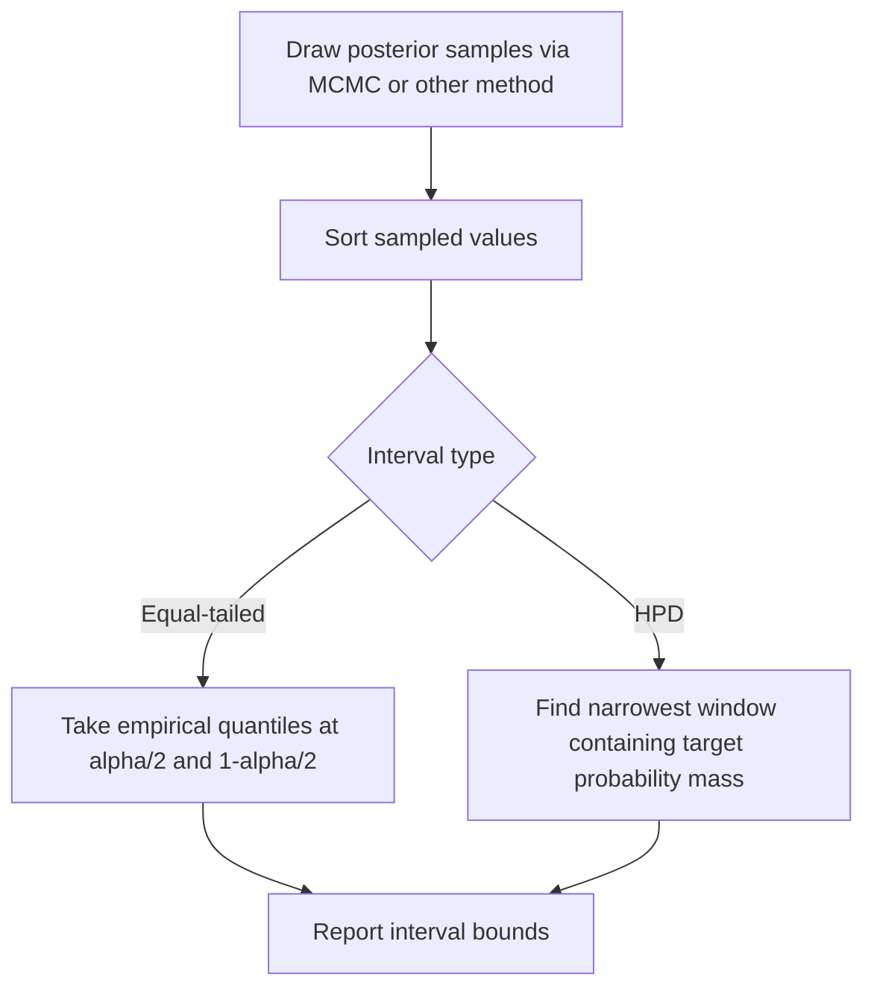

## Credible Intervals

### Definition

A credible interval is a range of values within which a parameter is believed to lie with a specified posterior probability, computed directly from the posterior distribution.

$$P(\theta_{low} \le \theta \le \theta_{high} \mid D) = 1 - \alpha$$

Where $1 - \alpha$ is the credibility level (e.g., 0.95 for a 95% credible interval).

### Distinction from Confidence Intervals

Credible intervals are a Bayesian concept and differ conceptually from frequentist confidence intervals, even though both are often reported at similar levels (e.g., 95%).

| Aspect | Credible Interval (Bayesian) | Confidence Interval (Frequentist) |
|---|---|---|
| Interpretation | Probability statement about the parameter directly | Statement about long-run procedure coverage |
| What varies | The parameter is treated as random; data is fixed | The interval is treated as random across repeated sampling; parameter is fixed |
| Requires | A posterior distribution (prior + likelihood) | A sampling distribution of an estimator |
| Direct statement | "There is a 95% probability the parameter lies in this range" | "95% of intervals constructed this way would contain the true parameter" |

[Inference] This is a standard conceptual distinction described in Bayesian and frequentist statistics literature. I cannot verify that all practitioners or all textbooks phrase this distinction identically, as terminology and emphasis can vary by source.

### Types of Credible Intervals

**Equal-Tailed Interval (ETI)**

Constructed by taking the $\alpha/2$ and $1-\alpha/2$ quantiles of the posterior distribution.

$$[\theta_{\alpha/2}, \ \theta_{1-\alpha/2}]$$

This places equal probability mass in each tail outside the interval.

**Highest Posterior Density (HPD) Interval**

The narrowest possible interval containing the specified probability mass, such that every point inside the interval has higher posterior density than every point outside it.

[Inference] HPD intervals are generally narrower than equal-tailed intervals for skewed posterior distributions, and equivalent for symmetric unimodal distributions. This follows from the definition of HPD as the minimum-width interval at a given probability level, but I cannot verify this holds in every possible edge case (e.g., multimodal posteriors) without checking specific examples.

### Worked Example: Beta Posterior

**Example**

Using the earlier Beta-Bernoulli posterior: $\theta \mid D \sim \text{Beta}(9, 5)$

**Equal-tailed 95% credible interval:**

Computed using the 2.5th and 97.5th percentiles of the Beta(9,5) distribution.

$$[\theta_{0.025}, \ \theta_{0.975}]$$

[Unverified] I do not have a computational tool active in this response to calculate the exact numeric percentile values for Beta(9,5), so I cannot state precise bounds here without risk of error. Exact values would typically require numerical computation (e.g., via a statistical software function such as `qbeta` in R or `scipy.stats.beta.ppf` in Python).

**Output**

Conceptually, the interval would be centered near the posterior mean of approximately 0.643 (as computed in the prior posterior distribution topic), with bounds determined by the spread of the Beta(9,5) distribution. The exact numeric bounds are not stated here, as they were not verified through computation in this response.

### Visualizing Credible Interval Types

<svg xmlns="http://www.w3.org/2000/svg" viewBox="0 0 700 340">
  <text x="350" y="25" font-size="16" font-weight="bold" text-anchor="middle" fill="#1a1a1a">Equal-Tailed vs. HPD Interval (svg_diagram)</text>

  <line x1="60" y1="280" x2="640" y2="280" stroke="#333" stroke-width="1.5" />
  <line x1="60" y1="280" x2="60" y2="60" stroke="#333" stroke-width="1.5" />
  <text x="350" y="310" font-size="12" text-anchor="middle" fill="#333">θ</text>
  <text x="30" y="170" font-size="12" text-anchor="middle" fill="#333" transform="rotate(-90 30 170)">Density</text>

  <path d="M 100 280 Q 200 260 280 100 Q 340 60 400 130 Q 500 260 600 280" fill="none" stroke="#555" stroke-width="2" />
  <text x="480" y="90" font-size="11" fill="#555">Skewed posterior density</text>

  <line x1="230" y1="280" x2="230" y2="150" stroke="#3a5a8c" stroke-width="1.5" stroke-dasharray="3,2" />
  <line x1="430" y1="280" x2="430" y2="115" stroke="#3a5a8c" stroke-width="1.5" stroke-dasharray="3,2" />
  <text x="330" y="300" font-size="10" fill="#3a5a8c" text-anchor="middle">Equal-tailed interval (wider here)</text>

  <line x1="260" y1="280" x2="260" y2="95" stroke="#a3701e" stroke-width="1.5" />
  <line x1="400" y1="280" x2="400" y2="140" stroke="#a3701e" stroke-width="1.5" />
  <text x="330" y="330" font-size="10" fill="#a3701e" text-anchor="middle">HPD interval (narrower here)</text>
</svg>

[Unverified] This diagram is an illustrative conceptual approximation of how ETI and HPD intervals can differ on a skewed distribution. It is not generated from computed numerical density values and should not be used to infer exact interval widths.

### Computation for Non-Conjugate Posteriors

When the posterior lacks a closed form, credible intervals are generally approximated using samples from MCMC or variational methods:

- Sort posterior samples
- For equal-tailed intervals: take empirical quantiles at $\alpha/2$ and $1-\alpha/2$
- For HPD intervals: identify the narrowest interval containing the target probability mass among the sorted samples

[Inference] This sample-based procedure is a standard approach described in Bayesian computational statistics literature. I cannot verify implementation-specific details (e.g., exact algorithm used by a particular software package) without reference to that package's documentation.

### Interpretation Caveats

- A credible interval is valid only relative to the specified prior and model; a different prior generally yields a different interval
- Credible intervals do not make claims about long-run frequency properties across repeated experiments
- Misinterpreting a frequentist confidence interval as if it were a credible interval is a common conceptual error

[Inference] This misinterpretation is frequently discussed as a common source of confusion in statistics education literature. I cannot verify how frequently this specific error occurs in practice without access to empirical survey data on the topic.

### Applications in Machine Learning

- Reporting uncertainty ranges around predicted parameter values in Bayesian regression
- Communicating uncertainty in model outputs for decision-making contexts (e.g., risk assessment)
- Comparing credible intervals across models as part of Bayesian model evaluation

[Unverified] I do not have access to comparative data confirming the extent to which credible intervals improve decision-making outcomes relative to alternative uncertainty reporting methods in specific applied ML contexts.

### Common Pitfalls

- Interpreting a credible interval as a frequentist confidence interval (or vice versa)
- Reporting only the equal-tailed interval without considering whether HPD is more appropriate for skewed posteriors
- Assuming credible interval bounds are prior-independent
- Treating MCMC-derived intervals as exact without checking sample convergence and adequacy

[Inference] These pitfalls are reasoned from general principles of Bayesian modeling practice described in standard statistical literature. I cannot verify their relative frequency in real-world applied settings without access to empirical data.

### Related Topics

- Posterior distributions and Bayesian updating
- Conjugate priors
- Posterior predictive distributions
- Markov Chain Monte Carlo (MCMC) methods
- Highest Posterior Density regions in multimodal distributions
- Bayesian model comparison