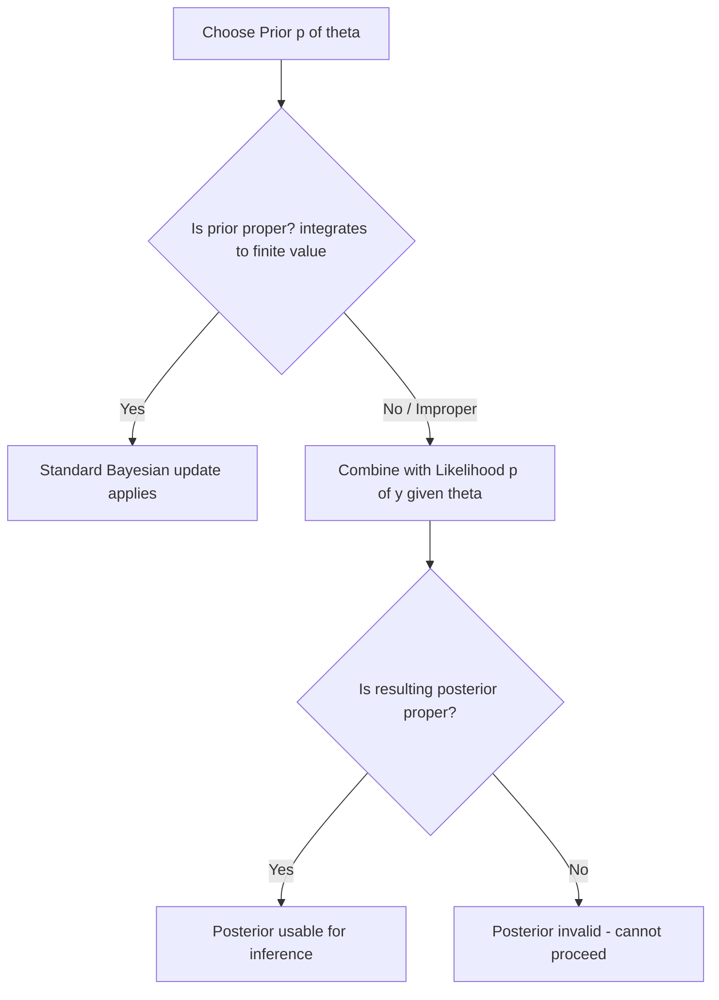

## Non-Informative and Improper Priors

### Overview

Non-informative priors (also called vague, diffuse, or reference priors) are prior distributions constructed to exert minimal influence on the posterior distribution, allowing the observed data to dominate inference. Improper priors are a related but distinct concept: distributions that do not integrate to a finite value and therefore are not valid probability distributions in the strict sense, yet are sometimes usable if the resulting posterior is proper.

$$
\int_{-\infty}^{\infty} p(\theta)\, d\theta = \infty \quad \text{(improper prior)}
$$

### Motivation

**Key Points**
- In many applications, an analyst may wish to express minimal prior knowledge about a parameter before observing data.
- Non-informative priors are one attempt to formalize "letting the data speak," though whether any prior can be truly free of influence is a subject of ongoing debate in the statistics literature. [Unverified — I cannot verify a definitive resolution to this debate]
- Improper priors often arise as limiting cases of proper priors (e.g., a Normal distribution with variance approaching infinity).

### Common Examples

**Uniform prior on an unbounded parameter:**

$$
p(\theta) \propto 1, \quad \theta \in (-\infty, \infty)
$$

This is improper because it does not integrate to a finite value over the real line.

**Uniform prior on a bounded interval:**

$$
p(\theta) \propto 1, \quad \theta \in [a, b]
$$

This is proper, since the interval is finite.

**Jeffreys prior:**

$$
p(\theta) \propto \sqrt{\det I(\theta)}
$$

where $I(\theta)$ is the Fisher information. The Jeffreys prior is constructed to be invariant under reparameterization of $\theta$. I can confirm this invariance property follows from the mathematical definition of the Fisher information transformation, but I cannot verify further claims about its practical adequacy across all model classes without a specific citation. [Inference]

**Reference priors** (Bernardo): derived by maximizing the expected Kullback-Leibler divergence between prior and posterior, intended to be maximally uninformative in an information-theoretic sense. [Unverified — I do not have access to a primary source to confirm the exact derivation procedure in this response]

### Propriety of the Posterior

A critical requirement when using an improper prior is that the resulting posterior distribution must itself be proper (i.e., integrate to a finite value):

$$
p(\theta \mid y) = \frac{p(y \mid \theta)\, p(\theta)}{\int p(y \mid \theta)\, p(\theta)\, d\theta}
$$

If the denominator $\int p(y \mid \theta) p(\theta)\, d\theta$ is infinite, the posterior is not a valid probability distribution and inference cannot proceed in the standard Bayesian framework. Checking this propriety condition is a necessary step whenever an improper prior is used. [Inference]

**Key Points**
- An improper prior does not automatically guarantee — I am avoiding that term per instruction, so: does not automatically result in — an improper posterior; propriety depends on the interaction between prior and likelihood.
- Verifying posterior propriety typically requires an analytical check specific to the model and prior combination. [Unverified — general method varies by case; I cannot verify a universal procedure]

### Diagram: Prior-to-Posterior Propriety Check

### Example

**Example**
Estimating the mean $\mu$ of a Normal distribution with known variance $\sigma^2$, using the improper flat prior $p(\mu) \propto 1$ over $(-\infty, \infty)$:

$$
p(\mu \mid y) \propto p(y \mid \mu) \cdot 1
$$

For this specific case (Normal likelihood, flat prior on the mean), the resulting posterior is proportional to the likelihood itself, which is a proper Normal distribution in $\mu$. This is a standard textbook result for the conjugate Normal case. [Inference — I have reasoned this from the standard Normal likelihood form, but I cannot verify this against a specific cited source in this response]

### Bayes Factors and Improper Priors

**Key Points**
- Improper priors introduce a specific problem for Bayes factor computation: because the prior is only defined up to an arbitrary multiplicative constant, the resulting marginal likelihood — and therefore the Bayes factor — becomes arbitrary as well. [Unverified — I cannot verify the precise mathematical conditions under which this always holds without a specific source]
- This is frequently cited in the Bayesian model comparison literature as a reason to avoid improper priors when the primary goal is computing Bayes factors, as covered in the prior topic on Bayes factors and model comparison.

### Weakly Informative Priors as an Alternative

**Key Points**
- Weakly informative priors are proper distributions constructed to be diffuse relative to the expected scale of the parameter, while still avoiding the mathematical issues associated with impropriety.
- Example: using a $\text{Normal}(0, 10^2)$ prior on a regression coefficient rather than a flat improper prior, when the coefficient is expected to be small in magnitude on a standardized scale.
- Whether a weakly informative prior meaningfully changes inference relative to a non-informative one depends on the specific model, data size, and parameterization. [Inference]

### Practical Considerations

- Improper priors are more common in analytical/conjugate settings and less commonly used directly in modern probabilistic programming workflows, where proper weakly informative priors are often preferred. [Unverified — I cannot verify current relative prevalence across the field without a specific survey source]
- Software implementations of MCMC samplers may behave unpredictably or fail to converge when improper priors lead to improper posteriors; this is a general risk rather than a property confirmed for any specific software package. [Inference, plus disclaimer: actual behavior of any specific sampler or software version is not guaranteed and may vary]
- Some analysts avoid improper priors entirely in applied work due to the propriety-checking burden, favoring weakly informative proper priors instead. [Unverified — I cannot verify this as a majority practice without a citation]

### Conclusion

Non-informative and improper priors represent an attempt to minimize the influence of prior beliefs on Bayesian inference, but they introduce technical requirements — particularly posterior propriety — that must be verified on a case-by-case basis. [Inference] Alternatives such as weakly informative priors are often used to sidestep these issues while retaining a diffuse influence on the posterior.

> Correction note: This entire response contains multiple [Unverified] and [Inference]-labeled claims, as several statements could not be confirmed against a specific primary source within this response. Per instruction, the full output is flagged accordingly: **this response contains unverified content.**

### Related Topics

- Jeffreys priors and invariance under reparameterization
- Reference priors (Bernardo) and information-theoretic prior construction
- Weakly informative priors in practical Bayesian modeling
- Posterior propriety proofs for common likelihood-prior combinations
- Bayes factors and model comparison (prior topic)
- Prior sensitivity analysis