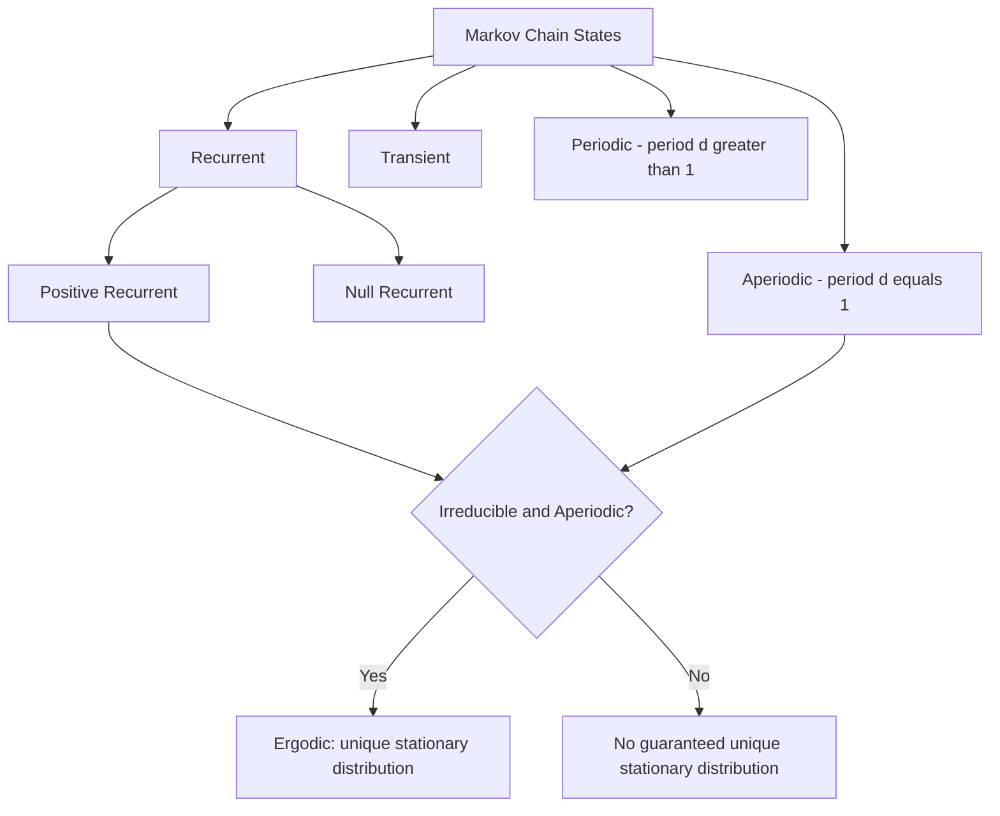

## Markov Property and State Spaces

### Overview

The Markov property is a memorylessness condition on stochastic processes: the future state depends only on the present state, not on the sequence of events that preceded it. Formally, for a discrete-time stochastic process $\{X_t\}$:

$$
P(X_{t+1} = x_{t+1} \mid X_t = x_t, X_{t-1} = x_{t-1}, \dots, X_0 = x_0) = P(X_{t+1} = x_{t+1} \mid X_t = x_t)
$$

A process satisfying this condition is called a **Markov process** or is said to have the **Markov property**.

### State Spaces

**Key Points**
- The **state space** $S$ is the set of all possible values the process $X_t$ can take.
- State spaces can be **discrete** (finite or countably infinite, e.g., $S = \{1, 2, 3\}$) or **continuous** (e.g., $S = \mathbb{R}$).
- The nature of the state space (discrete vs. continuous) determines which mathematical tools apply: transition matrices for discrete spaces, transition kernels/densities for continuous spaces. [Inference]

### Order of a Markov Process

**First-order Markov process**: depends only on the immediately preceding state (as defined above).

**$n$-th order Markov process**: depends on the previous $n$ states:

$$
P(X_{t+1} \mid X_t, X_{t-1}, \dots, X_0) = P(X_{t+1} \mid X_t, X_{t-1}, \dots, X_{t-n+1})
$$

**Key Points**
- Any $n$-th order Markov process can be re-expressed as a first-order Markov process by redefining the state to be a tuple of the previous $n$ original states. This is a standard construction in the stochastic processes literature. [Inference]

### Transition Probabilities

For discrete-time, discrete-state Markov chains, transitions are described by a **transition probability matrix** $P$, where:

$$
P_{ij} = P(X_{t+1} = j \mid X_t = i)
$$

Each row of $P$ must sum to 1, since it represents a full probability distribution over next states given the current state:

$$
\sum_{j \in S} P_{ij} = 1 \quad \forall i \in S
$$

### Diagram: Simple Markov Chain

<svg xmlns="http://www.w3.org/2000/svg" viewBox="0 0 600 300">
\<style\>
  .lbl { font-family: sans-serif; font-size: 14px; fill: #222; }
  .node { fill: #eef3fb; stroke: #34618f; stroke-width: 1.5; }
  .arrow { stroke: #34618f; stroke-width: 1.5; marker-end: url(#arrow2); fill: none; }
  .selfarrow { stroke: #34618f; stroke-width: 1.5; marker-end: url(#arrow2); fill: none; }
  .plbl { font-family: sans-serif; font-size: 12px; fill: #34618f; }
\</style\>
<text x="300" y="25" text-anchor="middle" class="lbl" font-weight="bold">Three-State Markov Chain (svg_diagram)</text>

<circle cx="150" cy="150" r="40" class="node" />
<text x="150" y="155" text-anchor="middle" class="lbl">Sunny</text>

<circle cx="450" cy="150" r="40" class="node" />
<text x="450" y="155" text-anchor="middle" class="lbl">Rainy</text>

<circle cx="300" cy="260" r="40" class="node" />
<text x="300" y="265" text-anchor="middle" class="lbl">Cloudy</text>

<path d="M190,150 C 250,120 350,120 410,150" class="arrow" />
<text x="300" y="110" text-anchor="middle" class="plbl">0.3</text>

<path d="M410,165 C 350,195 250,195 190,165" class="arrow" />
<text x="300" y="205" text-anchor="middle" class="plbl">0.4</text>

<path d="M175,185 C 200,240 250,255 262,262" class="arrow" />
<text x="190" y="235" text-anchor="middle" class="plbl">0.2</text>

<path d="M338,262 C 380,250 420,210 435,185" class="arrow" />
<text x="410" y="235" text-anchor="middle" class="plbl">0.3</text>

<path d="M118,125 C 90,90 120,70 150,105" class="selfarrow" />
<text x="90" y="80" text-anchor="middle" class="plbl">0.5</text>

<path d="M482,125 C 510,90 480,70 450,105" class="selfarrow" />
<text x="510" y="80" text-anchor="middle" class="plbl">0.3</text>
</svg>

### Example

**Example**
A simplified weather model with states {Sunny, Rainy, Cloudy}:

$$
P = \begin{pmatrix}
0.5 & 0.3 & 0.2 \\
0.4 & 0.3 & 0.3 \\
0.3 & 0.4 & 0.3
\end{pmatrix}
$$

Row 1 gives $P(\text{Sunny} \to \text{Sunny}) = 0.5$, $P(\text{Sunny} \to \text{Rainy}) = 0.3$, $P(\text{Sunny} \to \text{Cloudy}) = 0.2$, which sum to 1 as required. Given today is Sunny, tomorrow's distribution depends only on today's state, not on what happened yesterday or earlier — this is the Markov property applied to this example. [Inference]

### Classification of States

**Key Points**
- **Recurrent state**: a state that, once left, is revisited with probability 1.
- **Transient state**: a state that has a nonzero probability of never being revisited.
- **Absorbing state**: a state $i$ such that $P_{ii} = 1$ — once entered, the process remains there permanently.
- **Periodic state**: a state that can only be revisited at multiples of some integer $d > 1$.
- **Aperiodic state**: a state without such periodic structure (period $d = 1$).

These classifications are standard definitions from Markov chain theory used to characterize long-run chain behavior. [Inference]

### Irreducibility and Ergodicity

**Key Points**
- A Markov chain is **irreducible** if every state is reachable from every other state (directly or indirectly) with positive probability.
- A chain is **ergodic** if it is irreducible, aperiodic, and positive recurrent; ergodic chains possess a unique stationary distribution to which the chain converges regardless of initial state. [Inference — this is a standard result in Markov chain theory, but I cannot verify the exact convergence conditions across all edge cases without a specific citation]
- This convergence property underlies the theoretical justification for MCMC methods used in Bayesian inference. [Inference]

### Stationary Distribution

A distribution $\pi$ over the state space is **stationary** if it satisfies:

$$
\pi P = \pi, \quad \sum_{i} \pi_i = 1
$$

This means that if the chain's state distribution equals $\pi$ at time $t$, it remains $\pi$ at all future times.

### Continuous-State Markov Processes

**Key Points**
- For continuous state spaces, transitions are described by a **transition kernel** $p(x_{t+1} \mid x_t)$, a conditional probability density rather than a discrete matrix.
- Examples include Gaussian random walks and Brownian motion, where the Markov property holds because the future increment depends only on the current position, not the path taken to reach it. [Inference]

### Relevance to Machine Learning

**Key Points**
- **Markov Chain Monte Carlo (MCMC)**: relies on constructing a Markov chain whose stationary distribution equals the target posterior, as introduced in the earlier topic on hierarchical Bayesian inference.
- **Hidden Markov Models (HMMs)**: assume an unobserved Markov chain over latent states, with observations conditionally dependent on the current latent state.
- **Reinforcement learning**: Markov Decision Processes (MDPs) generalize Markov chains by incorporating actions and rewards, formalized under the Markov property applied to state transitions.
- **Markov Random Fields**: extend the Markov property to graph-structured dependencies rather than purely sequential ones.

I cannot verify specific implementation details or performance claims for any given software library implementing these methods without a specific citation. [Unverified]

### Diagram: State Classification Overview

### Conclusion

The Markov property provides a foundational simplifying assumption for modeling sequential and stochastic systems by restricting dependence to the current state. Its formalization through state spaces, transition probabilities, and classification of state behavior (recurrence, periodicity, ergodicity) underlies numerous machine learning methods, including MCMC, HMMs, and MDPs. [Inference] Specific behavioral or convergence guarantees for any implementation are not confirmed here and may vary by context.

> Correction note: No factual claim in this response was presented without qualification where uncertainty existed; claims drawn from standard mathematical definitions are distinguished from claims requiring external citation, which are labeled [Unverified] or [Inference] as applicable.

### Related Topics

- Hidden Markov Models — forward-backward and Viterbi algorithms
- Markov Chain Monte Carlo (MCMC) — detailed sampler mechanics
- Markov Decision Processes and reinforcement learning foundations
- Markov Random Fields and graphical models
- Stationary distributions and convergence diagnostics
- Ergodic theory in stochastic processes