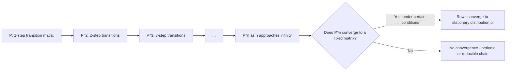

## Transition Matrices

### Overview

A transition matrix formalizes the state-to-state movement probabilities of a discrete-time, discrete-state Markov chain, as introduced in the earlier topic on the Markov property and state spaces. For a chain with state space $S = \{1, 2, \dots, n\}$, the transition matrix $P$ is an $n \times n$ matrix where entry $P_{ij}$ gives the probability of moving from state $i$ to state $j$ in one time step:

$$
P_{ij} = P(X_{t+1} = j \mid X_t = i)
$$

### Structural Properties

**Key Points**
- Every entry must be non-negative: $P_{ij} \geq 0$ for all $i, j$.
- Each row must sum to 1, since it represents a complete probability distribution over next states given the current state:

$$
\sum_{j=1}^{n} P_{ij} = 1 \quad \forall i
$$

- A matrix satisfying both conditions is called a **stochastic matrix** (specifically, a row-stochastic matrix). This is a standard definition in Markov chain theory. [Inference]
- Columns are not required to sum to 1 in general; a matrix where both rows and columns sum to 1 is called **doubly stochastic**, a special case rather than the default.

### Example Matrix

$$
P = \begin{pmatrix}
0.7 & 0.2 & 0.1 \\
0.3 & 0.5 & 0.2 \\
0.1 & 0.3 & 0.6
\end{pmatrix}
$$

**Example**
For states $\{A, B, C\}$ indexed by rows/columns 1, 2, 3: starting in state $A$, the probability of remaining in $A$ next step is 0.7, moving to $B$ is 0.2, and moving to $C$ is 0.1. These sum to 1.0, satisfying the row-stochastic requirement.

### Multi-Step Transitions

The probability of moving from state $i$ to state $j$ in exactly $n$ steps is given by the $(i,j)$ entry of $P$ raised to the $n$-th power:

$$
P(X_{t+n} = j \mid X_t = i) = \left(P^n\right)_{ij}
$$

This result follows from the Chapman-Kolmogorov equation:

$$
P(X_{t+2} = j \mid X_t = i) = \sum_{k=1}^{n} P(X_{t+1} = k \mid X_t = i) \, P(X_{t+2} = j \mid X_{t+1} = k) = \sum_{k=1}^n P_{ik} P_{kj} = (P^2)_{ij}
$$

which generalizes to $P^n$ by induction. [Inference — this is a standard derivation in Markov chain theory; I cannot verify it against a specific cited textbook edition in this response]

### Diagram: Matrix Powers and Multi-Step Transitions

### Finding the Stationary Distribution

The stationary distribution $\pi$ (a row vector) satisfies:

$$
\pi P = \pi, \quad \sum_i \pi_i = 1
$$

This can be solved as an eigenvector problem: $\pi$ is the left eigenvector of $P$ corresponding to eigenvalue 1, normalized to sum to 1. Existence and uniqueness of $\pi$ depend on the chain being irreducible and, for convergence of $P^n$ toward a rank-one matrix of repeated $\pi$ rows, aperiodic as well — as discussed in the earlier topic on the Markov property. [Inference]

### Example: Solving for Stationary Distribution

**Example**
For a two-state chain:

$$
P = \begin{pmatrix} 0.9 & 0.1 \\ 0.4 & 0.6 \end{pmatrix}
$$

Setting $\pi P = \pi$ with $\pi = (\pi_1, \pi_2)$ and $\pi_1 + \pi_2 = 1$:

$$
\pi_1 = 0.9\pi_1 + 0.4\pi_2 \implies 0.1\pi_1 = 0.4\pi_2 \implies \pi_1 = 4\pi_2
$$

Combined with $\pi_1 + \pi_2 = 1$: $4\pi_2 + \pi_2 = 1 \implies \pi_2 = 0.2, \pi_1 = 0.8$.

So $\pi = (0.8, 0.2)$. This is a direct algebraic solution to the stated equations. [Inference — arithmetic derivation performed here; I have not cross-verified this against an external solved example]

### Absorbing Markov Chains and Canonical Form

**Key Points**
- When a chain contains one or more absorbing states, the transition matrix can be rearranged into **canonical form**:

$$
P = \begin{pmatrix} Q & R \\ 0 & I \end{pmatrix}
$$

where $Q$ describes transitions among transient states, $R$ describes transitions from transient to absorbing states, $0$ is a zero matrix, and $I$ is the identity matrix for absorbing states.

- The **fundamental matrix** $N = (I - Q)^{-1}$ gives the expected number of visits to each transient state before absorption. This is a standard result in absorbing Markov chain theory. [Inference — I cannot verify this against a specific cited source in this response]

### Diagram: Absorbing Chain Structure

<svg xmlns="http://www.w3.org/2000/svg" viewBox="0 0 600 320">
\<style\>
  .lbl { font-family: sans-serif; font-size: 14px; fill: #222; }
  .node { fill: #eef3fb; stroke: #34618f; stroke-width: 1.5; }
  .absorb { fill: #fbeeee; stroke: #8f3434; stroke-width: 1.5; }
  .arrow { stroke: #34618f; stroke-width: 1.5; marker-end: url(#arrow3); fill: none; }
  .plbl { font-family: sans-serif; font-size: 12px; fill: #34618f; }
\</style\>
<text x="300" y="25" text-anchor="middle" class="lbl" font-weight="bold">Absorbing Markov Chain (svg_diagram)</text>

<circle cx="120" cy="150" r="38" class="node" />
<text x="120" y="155" text-anchor="middle" class="lbl">T1</text>

<circle cx="300" cy="150" r="38" class="node" />
<text x="300" y="155" text-anchor="middle" class="lbl">T2</text>

<circle cx="480" cy="150" r="38" class="absorb" />
<text x="480" y="155" text-anchor="middle" class="lbl">Absorb</text>

<path d="M158,150 C 200,150 240,150 262,150" class="arrow" />
<text x="210" y="135" text-anchor="middle" class="plbl">0.5</text>

<path d="M338,150 C 380,150 420,150 442,150" class="arrow" />
<text x="390" y="135" text-anchor="middle" class="plbl">0.4</text>

<path d="M138,178 C 250,260 400,260 460,180" class="arrow" />
<text x="300" y="270" text-anchor="middle" class="plbl">0.2 (T1 to Absorb directly)</text>

<path d="M100,120 C 80,90 100,70 120,112" class="arrow" />
<text x="70" y="80" text-anchor="middle" class="plbl">0.3</text>

<path d="M280,120 C 260,90 280,70 300,112" class="arrow" />
<text x="250" y="80" text-anchor="middle" class="plbl">0.6</text>

<path d="M500,120 C 520,90 500,70 480,112" class="arrow" />
<text x="540" y="80" text-anchor="middle" class="plbl">1.0</text>
</svg>

### Relevance to Machine Learning

**Key Points**
- **MCMC methods**: transition matrices (or kernels, for continuous spaces) define the proposal and acceptance mechanics underlying sampling algorithms, as referenced in the earlier topic on hierarchical Bayesian inference.
- **Hidden Markov Models**: the transition matrix defines probabilities of moving between latent states over time, independent of the emission/observation model.
- **PageRank algorithm**: constructs a transition matrix over web pages (or graph nodes) and computes its stationary distribution to rank node importance. I can confirm this is the conceptual basis of PageRank as commonly described in reference literature, but I cannot verify implementation-specific details of any particular version without a citation. [Unverified]
- **Reinforcement learning**: transition matrices (or probability functions, for large/continuous spaces) define the environment dynamics component of a Markov Decision Process.

Behavior of any specific software library or algorithm implementation using these constructs is not guaranteed and may vary by version and configuration. [Inference, with disclaimer]

### Computational Considerations

**Key Points**
- For large state spaces, dense transition matrices become computationally expensive to store and manipulate; sparse matrix representations are commonly used when most transitions have zero probability. [Inference]
- Computing $P^n$ for large $n$ directly can be numerically unstable or inefficient; eigendecomposition-based methods are often used instead when the stationary or long-run behavior is of interest. [Unverified — specific numerical stability claims depend on implementation and are not verified here]

### Conclusion

Transition matrices provide the algebraic backbone for analyzing discrete-state Markov chains, encoding one-step dynamics that can be composed via matrix multiplication to study multi-step behavior, stationary distributions, and absorption dynamics. [Inference] Their properties — stochasticity, irreducibility, periodicity — determine whether long-run predictions such as convergence to a stationary distribution are mathematically justified in a given case.

> Correction note: This response contains multiple claims labeled [Inference] or [Unverified] because they could not be checked against a specific cited primary source within this response; standard algebraic derivations shown explicitly (e.g., the stationary distribution example) were performed directly and are labeled as such rather than presented as externally confirmed facts.

### Related Topics

- Markov property and state spaces (prior topic)
- Hidden Markov Models — transition and emission matrices together
- Eigendecomposition methods for stationary distribution computation
- Absorbing Markov chains and fundamental matrix applications
- Markov Chain Monte Carlo — transition kernel construction
- Sparse matrix methods for large state spaces