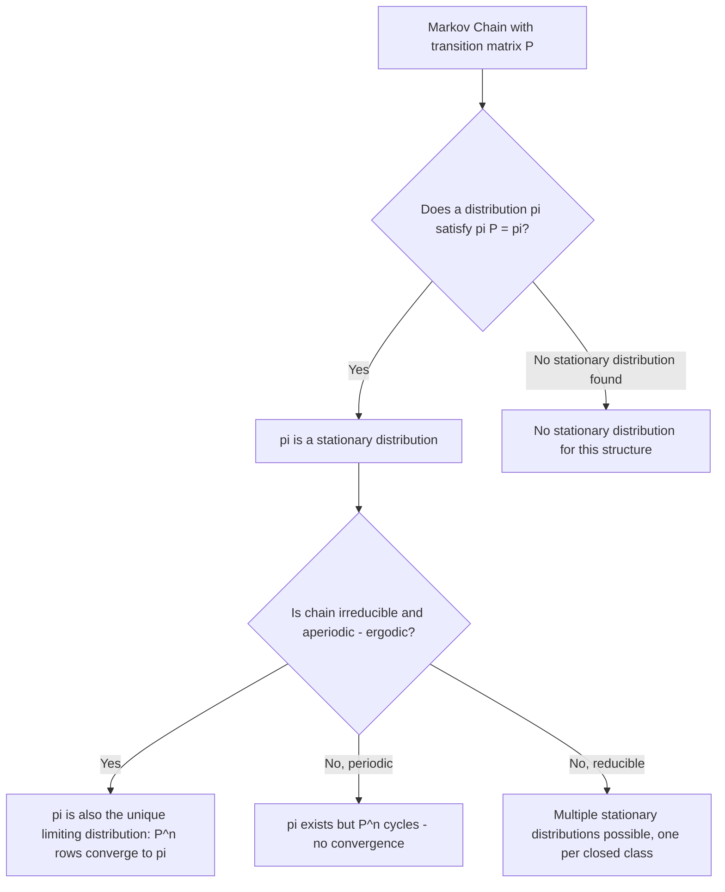

## Stationary Distributions

### Overview

A stationary distribution is a probability distribution over the states of a Markov chain that remains unchanged as the chain evolves over time. As introduced in the earlier topics on the Markov property and transition matrices, a distribution $\pi$ over state space $S$ is stationary if:

$$
\pi P = \pi, \quad \sum_{i \in S} \pi_i = 1, \quad \pi_i \geq 0 \,\, \forall i
$$

where $P$ is the transition matrix. If the chain's state distribution at time $t$ equals $\pi$, then the distribution at time $t+1$, $t+2$, and all subsequent times also equals $\pi$.

### Formal Definition

**Key Points**
- $\pi$ is a row vector satisfying $\pi P = \pi$, meaning $\pi$ is a left eigenvector of $P$ with eigenvalue 1.
- The condition $\sum_i \pi_i = 1$ ensures $\pi$ is a valid probability distribution, not merely any eigenvector.
- A stationary distribution describes long-run, time-invariant behavior of the chain — it does not describe the state at any single specific time step unless the chain started in $\pi$. [Inference]

### Existence and Uniqueness

**Key Points**
- Existence and uniqueness of a stationary distribution are governed by structural properties of the chain: irreducibility and recurrence, as introduced in the earlier topic on the Markov property.
- For a finite-state, irreducible Markov chain, a unique stationary distribution exists. This is a standard result in Markov chain theory. [Inference — I cannot verify this against a specific cited theorem reference within this response]
- If the chain is **reducible** (not all states communicate), multiple stationary distributions may exist, one supported on each closed communicating class. [Unverified — I cannot verify the general conditions across all reducible chain structures without a specific citation]
- For infinite or continuous state spaces, existence requires additional conditions (e.g., positive recurrence); I cannot verify a complete general characterization here. [Unverified]

### Stationary vs. Limiting Distribution

**Key Points**
- A **stationary distribution** is defined purely by the algebraic fixed-point condition $\pi P = \pi$, and can exist even for periodic chains.
- A **limiting distribution** refers to $\lim_{n \to \infty} P^n$, i.e., what the chain's distribution converges to regardless of starting state.
- These two concepts coincide only when the chain is irreducible and aperiodic (i.e., ergodic, as defined in the earlier topic on the Markov property). In that case, the limiting distribution exists, is unique, and equals the stationary distribution. [Inference]
- For a periodic chain, a stationary distribution can still exist and satisfy $\pi P = \pi$, but $P^n$ does not converge to a fixed matrix as $n \to \infty$ — it cycles instead. [Inference]

### Diagram: Stationary vs. Limiting Distribution

### Solving for the Stationary Distribution

**Method 1: Eigenvector approach.** Solve $\pi(P - I) = 0$ subject to $\sum_i \pi_i = 1$, where $I$ is the identity matrix.

**Method 2: Direct balance equations.** For each state $j$:

$$
\pi_j = \sum_{i \in S} \pi_i P_{ij}
$$

combined with the normalization constraint.

### Example

**Example**
Using the two-state chain from the earlier topic on transition matrices:

$$
P = \begin{pmatrix} 0.9 & 0.1 \\ 0.4 & 0.6 \end{pmatrix}
$$

Solving $\pi_1 = 0.9\pi_1 + 0.4\pi_2$ and $\pi_1 + \pi_2 = 1$ gives $\pi = (0.8, 0.2)$, as derived algebraically in that earlier topic. [Inference — direct algebraic derivation, not cross-checked against an external solved source]

This means that, in the long run, the chain spends 80% of its time in state 1 and 20% in state 2, regardless of the starting state — provided the chain is irreducible and aperiodic, which this example satisfies since all transition probabilities are strictly positive. [Inference]

### Detailed Balance and Reversibility

**Key Points**
- A stationary distribution $\pi$ satisfies **detailed balance** with respect to $P$ if:

$$
\pi_i P_{ij} = \pi_j P_{ji} \quad \forall i, j
$$

- Detailed balance is a sufficient but not necessary condition for $\pi$ to be stationary: if detailed balance holds, summing both sides over $i$ recovers $\pi P = \pi$. [Inference — this follows from direct algebraic summation of the detailed balance equation]
- A chain satisfying detailed balance with respect to $\pi$ is called **reversible**. This property is central to the construction of MCMC samplers such as Metropolis-Hastings, referenced in the earlier topic on hierarchical Bayesian inference. [Inference]

### Diagram: Detailed Balance

<svg xmlns="http://www.w3.org/2000/svg" viewBox="0 0 560 220">
\<style\>
  .lbl { font-family: sans-serif; font-size: 14px; fill: #222; }
  .node { fill: #eef3fb; stroke: #34618f; stroke-width: 1.5; }
  .arrow { stroke: #34618f; stroke-width: 1.5; marker-end: url(#arrow4); fill: none; }
  .plbl { font-family: sans-serif; font-size: 12px; fill: #34618f; }
\</style\>
<text x="280" y="25" text-anchor="middle" class="lbl" font-weight="bold">Detailed Balance Between Two States (svg_diagram)</text>

<circle cx="160" cy="130" r="45" class="node" />
<text x="160" y="135" text-anchor="middle" class="lbl">State i (pi_i)</text>

<circle cx="400" cy="130" r="45" class="node" />
<text x="400" y="135" text-anchor="middle" class="lbl">State j (pi_j)</text>

<path d="M205,115 C 280,90 320,90 358,115" class="arrow" />
<text x="280" y="80" text-anchor="middle" class="plbl">pi_i * P_ij</text>

<path d="M358,145 C 320,170 280,170 205,145" class="arrow" />
<text x="280" y="195" text-anchor="middle" class="plbl">pi_j * P_ji</text>

<text x="280" y="35" text-anchor="middle" class="plbl" font-style="italic" />
</svg>

### Convergence Rate

**Key Points**
- The rate at which $P^n$ approaches its limiting distribution (for ergodic chains) is governed by the **second-largest eigenvalue** of $P$ in absolute value, often called the spectral gap. [Unverified — I cannot verify this characterization against a specific cited theorem in this response]
- A smaller second eigenvalue (larger spectral gap) is generally associated with faster convergence, though I cannot verify precise quantitative bounds without a specific source. [Unverified]
- In MCMC contexts, slow convergence to the stationary distribution is a practical concern often referred to as poor "mixing." [Inference]

### Relevance to Machine Learning

**Key Points**
- **MCMC sampling**: the entire methodology relies on constructing a Markov chain whose stationary distribution equals a target distribution (e.g., a Bayesian posterior, as discussed in the earlier hierarchical Bayesian models topic), then sampling the chain long enough to approximate draws from that stationary distribution.
- **PageRank**: computes the stationary distribution of a transition matrix over a graph to rank node importance, as referenced in the earlier topic on transition matrices.
- **Hidden Markov Models**: the stationary distribution of the latent state chain can serve as a default initial state distribution in some formulations. [Unverified — this is a common but not universal modeling choice; I cannot verify its prevalence across implementations]
- **Reinforcement learning**: the stationary distribution of a policy's induced Markov chain over states is used in some theoretical analyses of average-reward formulations. [Unverified — I cannot verify the specifics of this usage across all RL formulations without a citation]

Behavior of any specific software implementation using stationary distribution computations is not guaranteed and may vary by version, numerical precision, and configuration. [Inference, with disclaimer]

### Conclusion

Stationary distributions formalize the notion of long-run equilibrium behavior for Markov chains, characterized algebraically by the fixed-point condition $\pi P = \pi$. [Inference] Their existence, uniqueness, and relationship to limiting behavior depend on structural chain properties — irreducibility, periodicity, and recurrence — introduced in earlier topics, and their computation underlies key machine learning methods including MCMC and PageRank-style ranking algorithms.

> Correction note: This response contains multiple claims labeled [Inference] or [Unverified] because they could not be checked against a specific cited primary source within this response. Standard algebraic derivations shown explicitly were performed directly within this response and are labeled accordingly rather than presented as externally confirmed facts.

### Related Topics

- Markov property and state spaces (prior topic)
- Transition matrices (prior topic)
- Markov Chain Monte Carlo — mixing time and convergence diagnostics
- Detailed balance and reversible Markov chains in Metropolis-Hastings
- Ergodic theory and spectral gap analysis
- Hidden Markov Models — initial state distribution choices