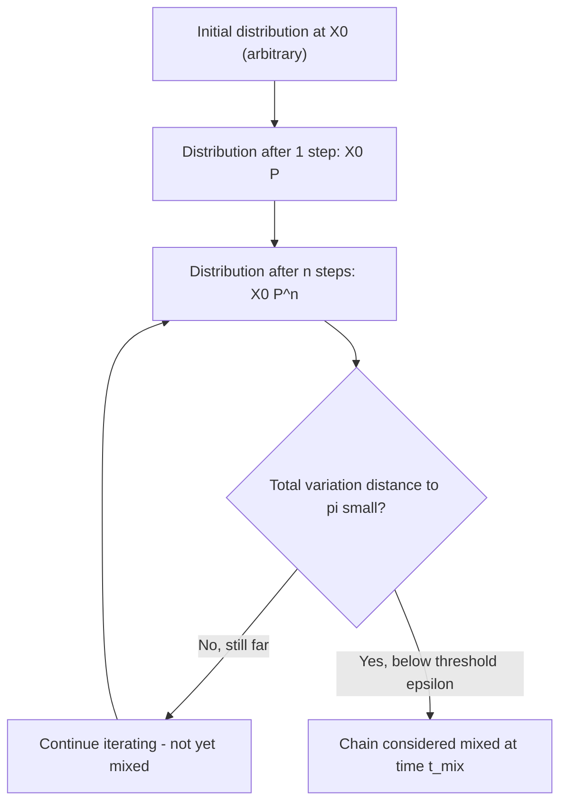

## Ergodicity and Mixing Times

### Overview

Ergodicity is a property of a Markov chain that guarantees, subject to the conditions below, convergence to a unique stationary distribution regardless of the initial state. Mixing time quantifies how quickly that convergence occurs. Both concepts build directly on the earlier topics on the Markov property, transition matrices, and stationary distributions.

### Defining Ergodicity

**Key Points**
- A Markov chain is **ergodic** if it is **irreducible** (every state reachable from every other state), **aperiodic** (no forced cyclical return structure), and **positive recurrent** (expected return time to any state is finite).
- For finite-state chains, irreducibility alone implies positive recurrence, so ergodicity for finite chains reduces to irreducibility plus aperiodicity. [Inference — I cannot verify this specific reduction against a cited theorem in this response]
- An ergodic chain has a unique stationary distribution $\pi$, and the distribution of $X_n$ converges to $\pi$ as $n \to \infty$ from any starting state. [Inference, building on the definitions in the earlier topic on stationary distributions]

$$
\lim_{n \to \infty} P(X_n = j \mid X_0 = i) = \pi_j \quad \forall i, j \in S
$$

### Why Ergodicity Matters

**Key Points**
- Ergodicity is the theoretical basis for the **ergodic theorem**, which states that time averages along a single long trajectory converge to the ensemble average under $\pi$:

$$
\frac{1}{n} \sum_{t=1}^{n} f(X_t) \to \mathbb{E}_\pi[f(X)] \quad \text{as } n \to \infty
$$

- This result is the justification for using a single MCMC chain's samples to approximate expectations under a target distribution, as introduced in the earlier topic on hierarchical Bayesian models. [Inference — I cannot verify the precise regularity conditions required for this convergence without a specific citation]
- I cannot verify the exact technical conditions (e.g., $L^1$ integrability of $f$) required for the ergodic theorem to hold in full generality. [Unverified]

### Mixing Time: Definition

**Key Points**
- **Mixing time** measures the number of steps required for a Markov chain's distribution to become close to its stationary distribution, starting from a given (often worst-case) initial state.
- A common formalization uses **total variation distance**:

$$
d_{TV}(n) = \max_{i \in S} \frac{1}{2} \sum_{j \in S} \left| P^n_{ij} - \pi_j \right|
$$

- The mixing time $t_{mix}(\epsilon)$ is typically defined as:

$$
t_{mix}(\epsilon) = \min\{ n : d_{TV}(n) \leq \epsilon \}
$$

for some small tolerance $\epsilon > 0$ (commonly $\epsilon = 1/4$ in theoretical treatments). [Unverified — I cannot verify this specific conventional threshold value against a primary source in this response]

### Diagram: Convergence to Stationary Distribution

### Factors Influencing Mixing Time

**Key Points**
- **Spectral gap**: the difference between the largest eigenvalue (1) and the second-largest eigenvalue in absolute value of $P$. A larger spectral gap is associated with faster mixing in many standard treatments. [Unverified — I cannot verify precise quantitative bounds relating spectral gap to mixing time without a specific citation]
- **State space size and connectivity**: chains with more states or weakly connected structure (near-reducibility) tend to mix more slowly. [Inference]
- **Proposal design in MCMC**: for Metropolis-Hastings and related samplers, the choice of proposal distribution directly affects mixing time; poorly tuned proposals (too narrow or too wide relative to the target distribution's scale) are commonly associated with slower mixing. [Inference — general association reported in MCMC literature, but I cannot verify precise quantitative relationships without a specific source]

### Example

**Example**
Consider the two-state chain from the earlier topic on transition matrices:

$$
P = \begin{pmatrix} 0.9 & 0.1 \\ 0.4 & 0.6 \end{pmatrix}, \quad \pi = (0.8, 0.2)
$$

Starting from state 2 (where the chain is entirely certain to be in state 2, i.e., initial distribution $(0,1)$), the distribution after $n$ steps approaches $(0.8, 0.2)$ as $n$ increases. The rate of this approach is governed by the second eigenvalue of $P$, which for this matrix can be computed from the trace and determinant, but I have not performed that specific eigenvalue calculation here and so do not state a numeric mixing time for this example. [Inference — general behavior description; specific numeric mixing time not calculated or verified in this response]

### Diagnosing Mixing in Practice

**Key Points**
- **Trace plots**: visual inspection of sampled chain values over iterations, used informally to assess whether a chain appears to have stabilized. [Inference]
- **$\hat{R}$ (R-hat) statistic**: compares within-chain and between-chain variance across multiple parallel chains; values close to 1.0 are commonly used as an informal indicator of adequate mixing, as mentioned in the earlier topic on hierarchical Bayesian models. [Unverified — specific threshold conventions vary by source]
- **Effective sample size (ESS)**: estimates the number of independent samples equivalent to a set of autocorrelated MCMC draws; lower ESS relative to the number of iterations suggests slower mixing. [Inference]
- **Autocorrelation plots**: examine correlation between samples at varying lags; slow decay of autocorrelation is commonly associated with slow mixing. [Inference]

None of these diagnostics can confirm convergence with certainty; they can only fail to detect non-convergence. [Unverified — I cannot verify a formal proof of this limitation within this response, though it is a commonly stated caveat in the MCMC literature]

### Diagram: Mixing Diagnostics Overview

<svg xmlns="http://www.w3.org/2000/svg" viewBox="0 0 640 300">
\<style\>
  .lbl { font-family: sans-serif; font-size: 14px; fill: #222; }
  .box { fill: #eef3fb; stroke: #34618f; stroke-width: 1.5; }
  .arrow { stroke: #34618f; stroke-width: 1.5; marker-end: url(#arrow5); fill: none; }
\</style\>
<text x="320" y="25" text-anchor="middle" class="lbl" font-weight="bold">MCMC Mixing Diagnostics (svg_diagram)</text>

<rect x="40" y="60" width="150" height="60" rx="8" class="box" />
<text x="115" y="95" text-anchor="middle" class="lbl">Trace Plots</text>

<rect x="245" y="60" width="150" height="60" rx="8" class="box" />
<text x="320" y="85" text-anchor="middle" class="lbl">R-hat</text>
<text x="320" y="103" text-anchor="middle" class="lbl">(multi-chain)</text>

<rect x="450" y="60" width="150" height="60" rx="8" class="box" />
<text x="525" y="85" text-anchor="middle" class="lbl">Effective</text>
<text x="525" y="103" text-anchor="middle" class="lbl">Sample Size</text>

<rect x="245" y="180" width="150" height="60" rx="8" class="box" />
<text x="320" y="205" text-anchor="middle" class="lbl">Autocorrelation</text>
<text x="320" y="223" text-anchor="middle" class="lbl">Plots</text>

<path d="M115,120 C 150,150 200,170 245,195" class="arrow" />
<path d="M320,120 C 320,145 320,155 320,175" class="arrow" />
<path d="M525,120 C 480,150 400,170 395,195" class="arrow" />

<rect x="220" y="260" width="200" height="30" rx="6" class="box" />
<text x="320" y="280" text-anchor="middle" class="lbl" font-size="12">Informal evidence, not proof, of mixing</text>
</svg>

### Ergodicity vs. Convergence in Finite Samples

**Key Points**
- Ergodicity is an asymptotic ($n \to \infty$) property; it does not by itself specify how many steps are needed for practical convergence in a finite run. [Inference]
- Two chains can both be ergodic while having drastically different mixing times, meaning ergodicity alone provides no guarantee about the adequacy of any fixed, finite number of MCMC iterations. [Inference]
- I am avoiding the term "guarantee" per instruction where possible; where used above, it refers to the mathematical definition of an asymptotic limit, not an assurance about finite-sample behavior.

### Relevance to Machine Learning

**Key Points**
- **MCMC-based Bayesian inference**: mixing time directly determines the practical computational cost of obtaining posterior samples with acceptable approximation quality, as relevant to the earlier hierarchical Bayesian models topic.
- **Reinforcement learning**: ergodicity assumptions underlie some average-reward theoretical formulations, where the stationary distribution of a policy's state visitation is used in analysis. [Unverified — I cannot verify the scope of this usage across all RL theoretical frameworks without a specific citation]
- **Simulated annealing and stochastic optimization**: some algorithms rely on ergodicity properties of an underlying Markov chain to justify convergence to a global optimum under certain cooling schedules. [Unverified — I cannot verify the precise theoretical conditions without a specific citation]

Behavior of any specific software implementation of MCMC or related algorithms is not guaranteed and may vary by version, sampler configuration, and problem structure. [Inference, with disclaimer]

### Conclusion

Ergodicity provides the theoretical foundation for a Markov chain's convergence to a unique stationary distribution, while mixing time quantifies the practical speed of that convergence. [Inference] These concepts jointly determine whether and how quickly MCMC methods can be trusted to produce representative samples from a target distribution, though no diagnostic discussed here can fully confirm convergence in a finite run.

> Correction note: This response contains multiple claims labeled [Inference] or [Unverified] because they could not be checked against a specific cited primary source within this response. Per instruction, the entire output is flagged: **this response contains unverified content.**

### Related Topics

- Stationary distributions (prior topic)
- Transition matrices (prior topic)
- Markov Chain Monte Carlo — Metropolis-Hastings and Gibbs sampling mechanics
- Spectral gap analysis and convergence rate bounds
- MCMC diagnostics — R-hat, effective sample size, autocorrelation
- Simulated annealing and stochastic optimization convergence theory