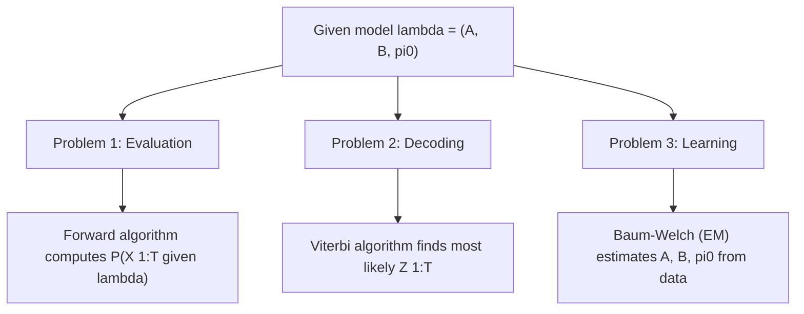

## Hidden Markov Models

### Overview

A Hidden Markov Model (HMM) extends the Markov chain framework, introduced in earlier topics, to settings where the underlying state sequence is not directly observed. Instead, each hidden state generates an observable output according to an emission distribution, and inference must recover information about the hidden states from these observations.

An HMM is defined by:
- A hidden state sequence $\{Z_t\}$ satisfying the Markov property over state space $S$.
- An observation sequence $\{X_t\}$ where each $X_t$ depends only on the current hidden state $Z_t$.

$$
P(Z_t \mid Z_{t-1}, Z_{t-2}, \dots, Z_1) = P(Z_t \mid Z_{t-1})
$$

$$
P(X_t \mid Z_1, \dots, Z_T, X_1, \dots, X_{t-1}, X_{t+1}, \dots, X_T) = P(X_t \mid Z_t)
$$

### Model Components

**Key Points**
- **Transition matrix** $A$: $A_{ij} = P(Z_t = j \mid Z_{t-1} = i)$, as defined in the earlier topic on transition matrices.
- **Emission distribution** $B$: $B_j(x) = P(X_t = x \mid Z_t = j)$, which can be discrete (a probability table) or continuous (e.g., a Gaussian per state).
- **Initial state distribution** $\pi_0$: $\pi_{0,i} = P(Z_1 = i)$.
- The full model is often denoted $\lambda = (A, B, \pi_0)$. This notation is a common convention in HMM literature. [Unverified — I cannot verify this exact notation against a specific primary source in this response]

### Diagram: HMM Structure

<svg xmlns="http://www.w3.org/2000/svg" viewBox="0 0 640 260">
\<style\>
  .lbl { font-family: sans-serif; font-size: 14px; fill: #222; }
  .hidden { fill: #eef3fb; stroke: #34618f; stroke-width: 1.5; }
  .obs { fill: #f5eef3; stroke: #8f3474; stroke-width: 1.5; }
  .arrow { stroke: #34618f; stroke-width: 1.5; marker-end: url(#arrow6); fill: none; }
  .emitarrow { stroke: #8f3474; stroke-width: 1.5; marker-end: url(#arrow7); fill: none; }
\</style\>
<text x="320" y="25" text-anchor="middle" class="lbl" font-weight="bold">Hidden Markov Model Structure (svg_diagram)</text>

<circle cx="120" cy="90" r="35" class="hidden" />
<text x="120" y="95" text-anchor="middle" class="lbl">Z1</text>
<circle cx="320" cy="90" r="35" class="hidden" />
<text x="320" y="95" text-anchor="middle" class="lbl">Z2</text>
<circle cx="520" cy="90" r="35" class="hidden" />
<text x="520" y="95" text-anchor="middle" class="lbl">Z3</text>

<rect x="90" y="190" width="60" height="45" rx="6" class="obs" />
<text x="120" y="217" text-anchor="middle" class="lbl">X1</text>
<rect x="290" y="190" width="60" height="45" rx="6" class="obs" />
<text x="320" y="217" text-anchor="middle" class="lbl">X2</text>
<rect x="490" y="190" width="60" height="45" rx="6" class="obs" />
<text x="520" y="217" text-anchor="middle" class="lbl">X3</text>

<path d="M155,90 L285,90" class="arrow" />
<path d="M355,90 L485,90" class="arrow" />

<path d="M120,125 L120,185" class="emitarrow" />
<path d="M320,125 L320,185" class="emitarrow" />
<path d="M520,125 L520,185" class="emitarrow" />
</svg>

### The Three Canonical HMM Problems

**Key Points**
1. **Evaluation**: given model $\lambda$ and observation sequence $X_{1:T}$, compute $P(X_{1:T} \mid \lambda)$ — solved via the **Forward algorithm** (or Forward-Backward).
2. **Decoding**: given $\lambda$ and $X_{1:T}$, find the most likely hidden state sequence $Z_{1:T}$ — solved via the **Viterbi algorithm**.
3. **Learning**: given only $X_{1:T}$ (and a chosen model structure), estimate the parameters $\lambda = (A, B, \pi_0)$ — solved via the **Baum-Welch algorithm**, a specific instance of Expectation-Maximization (EM).

This three-problem framing is a widely used organizing convention in HMM literature. [Unverified — I cannot verify its exact origin or universality across all textbook treatments without a specific citation]

### Forward Algorithm

Defines the forward variable $\alpha_t(j) = P(X_1, \dots, X_t, Z_t = j \mid \lambda)$, computed recursively:

$$
\alpha_1(j) = \pi_{0,j} B_j(X_1)
$$

$$
\alpha_{t+1}(j) = \left[ \sum_{i=1}^{n} \alpha_t(i) A_{ij} \right] B_j(X_{t+1})
$$

The total likelihood is then $P(X_{1:T} \mid \lambda) = \sum_j \alpha_T(j)$. This recursive structure reduces computational complexity from exponential (naive enumeration over all state sequences) to polynomial in $T$ and the number of states. [Inference — this complexity reduction is a standard claim in the algorithms literature; I cannot verify the precise complexity bound against a specific cited source in this response]

### Viterbi Algorithm

Finds the single most probable hidden state sequence using a similar dynamic programming recursion, replacing the sum with a maximum:

$$
\delta_1(j) = \pi_{0,j} B_j(X_1)
$$

$$
\delta_{t+1}(j) = \max_i \left[ \delta_t(i) A_{ij} \right] B_j(X_{t+1})
$$

Backtracking through stored argmax choices recovers the optimal state path $Z_1^*, \dots, Z_T^*$. [Inference — standard dynamic programming description; I cannot verify implementation-specific details against a specific cited source]

### Diagram: Three HMM Problems

### Baum-Welch Algorithm (Parameter Learning)

**Key Points**
- Baum-Welch is an Expectation-Maximization procedure specific to HMMs.
- **E-step**: compute expected state occupancies and transition counts using the Forward-Backward algorithm, given current parameter estimates.
- **M-step**: update $A$, $B$, $\pi_0$ to maximize expected complete-data log-likelihood given those expectations.
- Like general EM, Baum-Welch is known to converge to a local optimum of the likelihood, not necessarily a global optimum. [Inference — this is a commonly stated property of EM-based methods; I cannot verify it holds under all initialization and model conditions without a specific citation]
- Results can be sensitive to parameter initialization; multiple random restarts are a commonly used mitigation strategy. [Unverified — I cannot verify the general effectiveness of this strategy across all HMM applications]

### Example

**Example**
A simplified part-of-speech tagging scenario: hidden states $\{Noun, Verb\}$, observations are words in a sentence. The transition matrix $A$ captures grammatical tendencies (e.g., a Noun is often followed by a Verb), while the emission distribution $B$ captures the probability of specific words given a tag (e.g., $P(\text{"run"} \mid \text{Verb})$ is relatively high). Given an observed sentence, the Viterbi algorithm can be used to infer the most likely tag sequence. This is a commonly cited illustrative use case for HMMs in natural language processing. [Unverified — I cannot verify this exact framing against a specific cited source, though it is a widely referenced example type in NLP literature]

### Types of Emission Distributions

**Key Points**
- **Discrete HMM**: emissions drawn from a categorical distribution over a finite observation alphabet.
- **Gaussian HMM**: emissions drawn from a Gaussian distribution (or Gaussian Mixture Model) parameterized per hidden state, used for continuous-valued observations.
- **Left-to-right HMM**: a structural constraint where transitions only allow moving forward (or staying) in a fixed state ordering, commonly referenced in speech recognition applications. [Unverified — I cannot verify the prevalence of this specific structural variant across current applications without a citation]

### Relevance to Machine Learning

**Key Points**
- **Speech recognition**: historically a major application area for HMMs, using acoustic observations to infer phoneme or word sequences. [Unverified — I cannot verify the current relative prevalence of HMMs versus neural sequence models in this domain without a specific up-to-date source]
- **Bioinformatics**: HMMs are used in gene prediction and sequence alignment tasks (e.g., profile HMMs). [Unverified — I cannot verify current specific tool usage without a citation]
- **Natural language processing**: part-of-speech tagging and named entity recognition, as illustrated above, though modern NLP has largely shifted toward neural architectures for many of these tasks. [Unverified — I cannot verify the precise current extent of this shift without a specific up-to-date source]
- **Relation to Markov Chain Monte Carlo**: HMMs are a distinct modeling framework from MCMC (introduced in the earlier hierarchical Bayesian topic), though Bayesian approaches to HMM parameter estimation can use MCMC or variational inference as alternatives to Baum-Welch. [Inference]

Behavior, accuracy, and current adoption levels of any specific HMM software implementation or its comparison to alternative methods are not confirmed here and may vary. [Inference, with disclaimer]

### Limitations

**Key Points**
- The first-order Markov assumption on hidden states may not capture longer-range dependencies present in real data, a known structural limitation of standard HMMs. [Inference]
- The assumption that observations depend only on the current hidden state (conditional independence given $Z_t$) can be restrictive for data with more complex dependency structures. [Inference]
- These limitations have motivated extensions such as higher-order HMMs and alternative sequence models, though I cannot verify comparative performance claims for any specific alternative without a citation. [Unverified]

### Conclusion

Hidden Markov Models provide a structured probabilistic framework for sequential data with unobserved state dynamics, built on the Markov property and transition matrix concepts from earlier topics. [Inference] Their three canonical problems — evaluation, decoding, and learning — are addressed respectively by the Forward, Viterbi, and Baum-Welch algorithms, each relying on dynamic programming to achieve tractable computation over what would otherwise be an exponentially large state sequence space.

> Correction note: This response contains multiple claims labeled [Inference] or [Unverified] because they could not be checked against a specific cited primary source within this response. Per instruction, the entire output is flagged: **this response contains unverified content.**

### Related Topics

- Markov property and state spaces (prior topic)
- Transition matrices and stationary distributions (prior topics)
- Expectation-Maximization algorithm (general framework)
- Conditional Random Fields as a discriminative alternative to HMMs
- Kalman filters as a continuous-state analog to HMMs
- Sequence modeling with recurrent neural networks and transformers