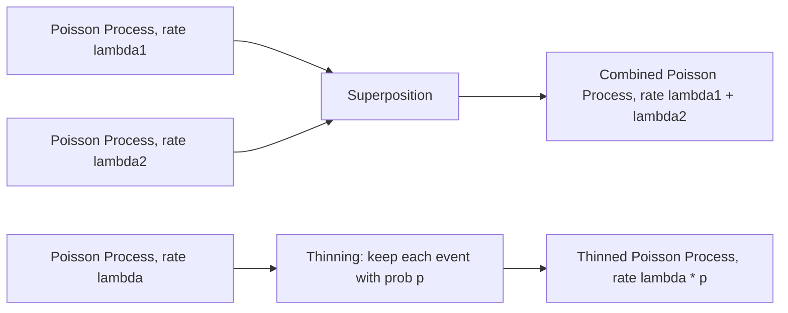

## Poisson Processes

### Overview

A Poisson process models the occurrence of discrete events over continuous time (or space), where events occur independently of one another at a constant average rate. It is a foundational continuous-time stochastic process distinct from the discrete-time Markov chains covered in earlier topics, though it shares the memoryless property in a continuous-time form.

A counting process $\{N(t), t \geq 0\}$ is a Poisson process with rate $\lambda > 0$ if it satisfies:
1. $N(0) = 0$.
2. Independent increments: the number of events in disjoint time intervals are independent.
3. Stationary increments: the distribution of the number of events in an interval depends only on the interval's length, not its position in time.
4. $N(t)$ follows a Poisson distribution with parameter $\lambda t$:

$$
P(N(t) = k) = \frac{(\lambda t)^k e^{-\lambda t}}{k!}, \quad k = 0, 1, 2, \dots
$$

### Key Properties

**Key Points**
- **Rate parameter** $\lambda$: the expected number of events per unit time, so $\mathbb{E}[N(t)] = \lambda t$.
- **Independent increments** mean knowing the count in one interval provides no information about counts in a disjoint interval.
- **Stationary increments** mean the process's statistical behavior does not change over time (it is time-homogeneous). [Inference — this follows directly from the stated axioms]
- These axioms jointly define a specific, mathematically well-characterized process; I cannot verify claims about real-world phenomena satisfying these axioms exactly without a specific cited empirical study. [Unverified]

### Inter-Arrival Times

**Key Points**
- The time between consecutive events in a Poisson process follows an **Exponential distribution** with rate $\lambda$:

$$
T_i \sim \text{Exponential}(\lambda), \quad P(T_i > t) = e^{-\lambda t}
$$

- This equivalence between Poisson event counts and exponential inter-arrival times is a standard derivable result from the process axioms. [Inference — derivable from the axioms, though I have not reproduced the full derivation in this response]
- The exponential distribution has the **memoryless property**:

$$
P(T > s + t \mid T > s) = P(T > t)
$$

meaning the time until the next event does not depend on how much time has already elapsed without an event. [Inference — this follows algebraically from the exponential CDF]

### Diagram: Poisson Process Timeline

<svg xmlns="http://www.w3.org/2000/svg" viewBox="0 0 640 200">
\<style\>
  .lbl { font-family: sans-serif; font-size: 13px; fill: #222; }
  .line { stroke: #34618f; stroke-width: 2; }
  .event { fill: #8f3474; }
  .arrow { stroke: #34618f; stroke-width: 1.5; marker-end: url(#arrow8); fill: none; }
\</style\>
<text x="320" y="25" text-anchor="middle" class="lbl" font-weight="bold">Poisson Process Event Timeline (svg_diagram)</text>

<line x1="40" y1="100" x2="600" y2="100" class="line" />
<path d="M580,100 L600,100" class="arrow" />
<text x="610" y="105" class="lbl">t</text>

<circle cx="100" cy="100" r="6" class="event" />
<circle cx="220" cy="100" r="6" class="event" />
<circle cx="270" cy="100" r="6" class="event" />
<circle cx="420" cy="100" r="6" class="event" />
<circle cx="500" cy="100" r="6" class="event" />

<text x="100" y="130" text-anchor="middle" class="lbl">Event 1</text>
<text x="245" y="130" text-anchor="middle" class="lbl">Event 2,3</text>
<text x="420" y="130" text-anchor="middle" class="lbl">Event 4</text>
<text x="500" y="130" text-anchor="middle" class="lbl">Event 5</text>

<path d="M100,80 C 150,60 170,60 220,80" class="arrow" />
<text x="160" y="55" text-anchor="middle" class="lbl">T2 (Exponential)</text>

<path d="M40,70 C 60,55 80,55 100,70" class="arrow" />
<text x="70" y="45" text-anchor="middle" class="lbl">T1</text>
</svg>

### Example

**Example**
Modeling customer arrivals at a store with rate $\lambda = 5$ per hour:

$$
P(N(1) = 3) = \frac{5^3 e^{-5}}{3!} = \frac{125 \times e^{-5}}{6}
$$

Numerically, $e^{-5} \approx 0.00674$, giving $P(N(1)=3) \approx \frac{125 \times 0.00674}{6} \approx 0.1404$. This is a direct arithmetic evaluation of the Poisson PMF formula stated above. [Inference — computed directly in this response; I have not cross-verified this specific numeric result against an external calculator or source]

The expected time between customer arrivals is $1/\lambda = 0.2$ hours (12 minutes), following from the mean of the Exponential(5) distribution. [Inference]

### Superposition and Thinning

**Key Points**
- **Superposition**: the sum of two independent Poisson processes with rates $\lambda_1$ and $\lambda_2$ is itself a Poisson process with rate $\lambda_1 + \lambda_2$. This is a standard closure property in Poisson process theory. [Inference — I cannot verify this against a specific cited proof within this response, though it is a widely stated property]
- **Thinning**: if each event in a Poisson process with rate $\lambda$ is independently retained with probability $p$, the retained events form a Poisson process with rate $\lambda p$. [Inference — same caveat as above]
- These closure properties make Poisson processes convenient building blocks for more complex models, though I cannot verify the full scope of applications where this convenience is exploited without specific citations. [Unverified]

### Diagram: Superposition and Thinning

### Non-Homogeneous Poisson Processes

**Key Points**
- A **non-homogeneous** (or inhomogeneous) Poisson process relaxes the stationary increments assumption, allowing the rate to vary as a function of time: $\lambda(t)$.
- The expected number of events in $[0, t]$ becomes $\int_0^t \lambda(s)\, ds$ rather than $\lambda t$.
- This extension is used to model time-varying event rates, such as diurnal patterns in web traffic. [Unverified — I cannot verify this specific application example against a cited empirical source, though it is a commonly referenced illustrative use case]

### Relation to Other Distributions

**Key Points**
- The Poisson distribution arises as the count distribution of a Poisson process observed over a fixed interval, connecting this topic to standard discrete probability distributions used broadly in probability and statistics coursework.
- The Exponential distribution governs inter-arrival times, as derived above, and is itself a continuous probability distribution with the memoryless property — the only continuous distribution with this property. [Unverified — I cannot verify the uniqueness claim against a specific cited proof within this response, though it is a commonly stated characterization result]
- The **Gamma distribution** describes the waiting time until the $k$-th event in a Poisson process, as the sum of $k$ independent Exponential($\lambda$) random variables. [Inference — this follows from standard properties of sums of independent exponential random variables]

### Relevance to Machine Learning

**Key Points**
- **Poisson regression**: a generalized linear model used for count-valued response variables, assuming the response follows a Poisson distribution conditional on covariates.
- **Point process modeling**: used in spatial statistics and event-based machine learning tasks (e.g., modeling the arrival times of user actions, network events, or neural spike trains). [Unverified — I cannot verify the current prevalence of this specific application area without a citation]
- **Queueing theory and simulation**: Poisson processes are commonly used to model arrival processes in queueing systems, which intersect with reinforcement learning and operations research applications. [Unverified — I cannot verify the scope of this intersection without a specific citation]
- **Relation to Markov chains**: a Poisson process is a continuous-time Markov chain with a specific, simple structure (pure birth process with constant rate), connecting this topic back to the Markov property discussed in earlier topics. [Inference]

Behavior of any specific software implementation modeling Poisson processes is not confirmed here and may vary by library, version, and configuration. [Inference, with disclaimer]

### Conclusion

Poisson processes provide a mathematically tractable framework for modeling the random occurrence of discrete events over continuous time, characterized by a constant rate, independent and stationary increments, and exponentially distributed inter-arrival times. [Inference] Their closure properties (superposition, thinning) and extensions (non-homogeneous rates) make them a flexible building block referenced across statistics, queueing theory, and probabilistic machine learning applications.

> Correction note: This response contains multiple claims labeled [Inference] or [Unverified] because they could not be checked against a specific cited primary source within this response. Standard formula evaluations shown explicitly (e.g., the numeric Poisson probability example) were computed directly within this response and are labeled accordingly rather than presented as externally confirmed facts. Per instruction, the entire output is flagged: **this response contains unverified content.**

### Related Topics

- Markov property and state spaces (prior topic)
- Continuous-time Markov chains — general birth-death processes
- Exponential and Gamma distributions in probability theory
- Poisson regression and generalized linear models
- Point process modeling in spatial and temporal statistics
- Queueing theory fundamentals