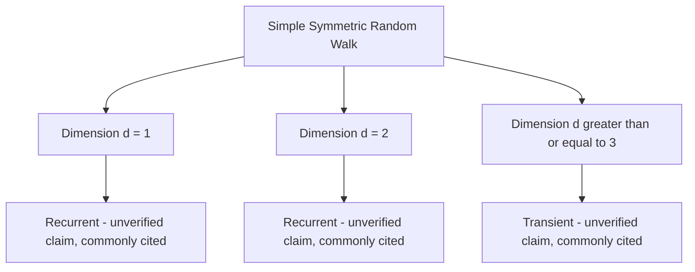

## Random Walks

### Overview

A random walk is a stochastic process describing a path formed by a sequence of random steps. It is one of the simplest and most extensively studied stochastic processes, serving as a building block for more general continuous-time processes and as an intuitive entry point into diffusion-type dynamics. A random walk is a Markov chain, connecting directly to the earlier topic on the Markov property and state spaces.

The simplest form, the **simple random walk** on integers, is defined as:

$$
X_n = X_0 + \sum_{i=1}^{n} \xi_i
$$

where $\xi_i$ are independent and identically distributed (i.i.d.) random variables, commonly taking values $+1$ or $-1$.

### Simple Symmetric Random Walk

**Key Points**
- In the **symmetric** case, $P(\xi_i = +1) = P(\xi_i = -1) = 0.5$.
- $X_n$ has mean $\mathbb{E}[X_n] = X_0$ (no drift) and variance $\text{Var}(X_n) = n$, since the variance of each i.i.d. step is 1 and variances of independent steps sum. [Inference — this follows directly from standard properties of sums of i.i.d. random variables]
- The walk is a Markov chain on the integers, with transition probabilities $P(X_{n+1} = j \mid X_n = i) = 0.5$ for $j = i+1$ or $j = i-1$, and 0 otherwise, connecting this topic to the transition matrix concepts covered earlier. [Inference]

### Asymmetric Random Walk

**Key Points**
- When $P(\xi_i = +1) = p \neq 0.5$, the walk has drift: $\mathbb{E}[X_n] = X_0 + n(2p - 1)$. [Inference — direct computation from the expectation of the i.i.d. steps]
- If $p > 0.5$, the walk tends to drift upward over time; if $p < 0.5$, it tends to drift downward. [Inference]
- I cannot verify claims about specific real-world processes being well-modeled by an asymmetric random walk without a specific cited empirical study. [Unverified]

### Diagram: Sample Random Walk Path

<svg xmlns="http://www.w3.org/2000/svg" viewBox="0 0 640 260">
\<style\>
  .lbl { font-family: sans-serif; font-size: 13px; fill: #222; }
  .axis { stroke: #888; stroke-width: 1; }
  .path { stroke: #34618f; stroke-width: 2; fill: none; }
  .dot { fill: #8f3474; }
\</style\>
<text x="320" y="20" text-anchor="middle" class="lbl" font-weight="bold">Simple Random Walk Sample Path (svg_diagram)</text>

<line x1="40" y1="130" x2="600" y2="130" class="axis" />
<line x1="40" y1="30" x2="40" y2="230" class="axis" />
<text x="610" y="135" class="lbl">n</text>
<text x="30" y="25" class="lbl">X_n</text>

<polyline points="40,130 80,110 120,130 160,110 200,90 240,110 280,90 320,70 360,90 400,70 440,50 480,70 520,50 560,30 600,50" class="path" />

<circle cx="40" cy="130" r="4" class="dot" />
<circle cx="600" cy="50" r="4" class="dot" />
<text x="40" y="150" text-anchor="middle" class="lbl">Start (X0)</text>
<text x="600" y="40" text-anchor="middle" class="lbl">Xn</text>
</svg>

### Recurrence and Transience

**Key Points**
- A key theoretical question is whether a random walk returns to its starting point infinitely often (**recurrent**) or moves away and never returns with positive probability (**transient**), connecting to the state classification concepts introduced in the earlier Markov property topic.
- The simple symmetric random walk on $\mathbb{Z}$ (1D) is recurrent. [Unverified — I cannot verify this against a specific cited proof within this response, though it is a commonly stated classical result]
- The simple symmetric random walk on $\mathbb{Z}^2$ (2D) is also recurrent. [Unverified — same caveat]
- The simple symmetric random walk on $\mathbb{Z}^d$ for $d \geq 3$ is transient. [Unverified — same caveat]
- This dimensional dependence is often summarized informally as "a drunk man will find his way home, but a drunk bird may get lost forever," a mnemonic attributed to Shizuo Kakutani in secondary sources. I cannot verify this attribution against a primary source. [Unverified]

### Diagram: Recurrence by Dimension

### Scaling Limit: Brownian Motion

**Key Points**
- As the step size and time increment both shrink appropriately, a simple random walk converges in distribution to **Brownian motion** (a continuous-time, continuous-space stochastic process). This is known as **Donsker's invariance principle** or the functional central limit theorem. [Unverified — I cannot verify the precise technical statement or conditions of this theorem against a specific cited source within this response]
- Brownian motion inherits the memoryless, independent-increment structure conceptually similar to that of the discrete random walk, though formalized in continuous time. [Inference]
- I am not providing the full mathematical statement of Donsker's theorem here, as I cannot verify its precise formulation without a specific citation. [Unverified]

### Random Walks with Absorbing Boundaries

**Key Points**
- The **Gambler's Ruin problem** is a classic random walk variant with absorbing boundaries at 0 and $N$, modeling a gambler who stops upon reaching bankruptcy or a target fortune.
- For a symmetric random walk starting at position $i$ between 0 and $N$, the probability of reaching $N$ before 0 is $i/N$. [Inference — this is a standard derivable result using the optional stopping theorem or difference equation methods, though I have not reproduced the derivation here and cannot verify it against a specific cited source]
- For an asymmetric random walk with $p \neq 0.5$, the corresponding ruin probability follows a different closed-form expression involving the ratio $q/p$ (where $q = 1-p$). [Unverified — I cannot state the precise formula with confidence without verifying it against a specific cited source]

### Example

**Example**
A gambler starts with \$5 and plays a fair coin-flip game (symmetric random walk) until reaching \$10 or \$0. Using the symmetric Gambler's Ruin result stated above, the probability of reaching \$10 before going bankrupt is $5/10 = 0.5$. [Inference — direct substitution into the formula stated above, which is itself an unverified/inferred result]

### Random Walks on Graphs

**Key Points**
- A **random walk on a graph** generalizes the integer random walk: at each step, the walker moves to a uniformly (or weighted) randomly chosen neighboring node.
- This construction connects directly to the transition matrix and stationary distribution concepts from earlier topics, where the stationary distribution of a random walk on an undirected graph is proportional to node degree. [Unverified — I cannot verify this specific result against a cited proof within this response, though it is a commonly stated result in graph theory and network science literature]
- This connects to the PageRank algorithm referenced in the earlier transition matrices topic, which can be understood as a modified random walk on the web graph. [Inference]

### Relevance to Machine Learning

**Key Points**
- **Stochastic optimization**: gradient descent and its stochastic variants share conceptual similarities with random walk dynamics, particularly regarding step-size effects on convergence behavior. [Unverified — I cannot verify the precise formal relationship without a specific cited source]
- **Random walk-based graph embeddings**: methods such as node2vec and DeepWalk use simulated random walks on graphs to generate node sequences for training embedding models. [Unverified — I cannot verify current implementation details or prevalence without a specific citation]
- **Markov Chain Monte Carlo**: many MCMC proposal mechanisms are themselves random walks (e.g., random-walk Metropolis-Hastings), connecting this topic to the earlier hierarchical Bayesian models and mixing time topics. [Inference]
- **Diffusion models**: some generative modeling approaches draw on random walk / Brownian motion concepts in their forward noising process formulation. [Unverified — I cannot verify the precise technical relationship without a specific cited source]

Behavior of any specific software implementation of random-walk-based algorithms is not confirmed here and may vary by library, version, and configuration. [Inference, with disclaimer]

### Conclusion

Random walks provide a foundational stochastic process for modeling cumulative random steps, with theoretical properties — recurrence, transience, drift, and scaling limits to Brownian motion — that connect probability theory to fields including graph theory, optimization, and generative modeling. [Inference] Many specific classical results cited in this topic (recurrence by dimension, Gambler's Ruin formulas, graph stationary distributions) are commonly stated in the literature but have not been individually verified against primary sources within this response.

> Correction note: This response contains multiple claims labeled [Inference] or [Unverified] because they could not be checked against a specific cited primary source within this response. Per instruction, the entire output is flagged: **this response contains unverified content.**

### Related Topics

- Markov property and state spaces (prior topic)
- Brownian motion and stochastic calculus foundations
- Gambler's Ruin and martingale theory
- Random walks on graphs and node embedding methods (node2vec, DeepWalk)
- Markov Chain Monte Carlo — random-walk Metropolis-Hastings
- Diffusion models and stochastic differential equations in generative modeling