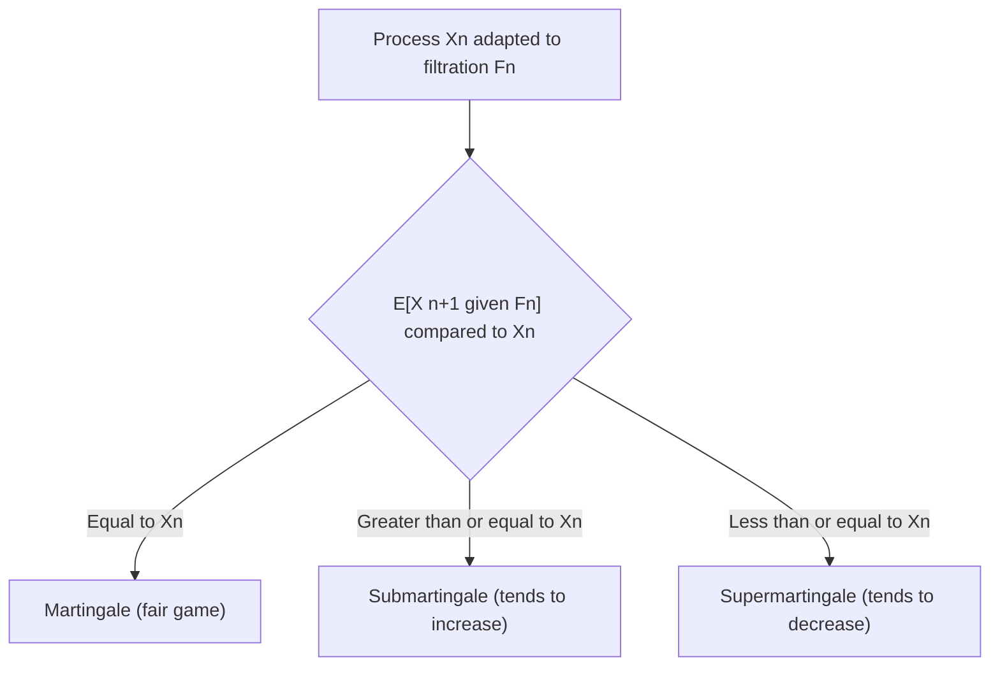

## Martingales

### Overview

A martingale is a stochastic process representing, informally, a "fair game": the expected value of the next observation, given all past observations, equals the current observation. This concept connects to random walks (prior topic) and provides theoretical tools used in probability theory and stochastic process analysis.

A discrete-time process $\{X_n\}$ adapted to a filtration $\{\mathcal{F}_n\}$ is a martingale if:

$$
\mathbb{E}[X_{n+1} \mid \mathcal{F}_n] = X_n
$$

with the additional technical requirements that $\mathbb{E}[|X_n|] < \infty$ for all $n$ and $X_n$ is $\mathcal{F}_n$-measurable (adapted).

### Filtration

**Key Points**
- A **filtration** $\{\mathcal{F}_n\}$ is an increasing sequence of sigma-algebras representing the accumulation of information over time: $\mathcal{F}_0 \subseteq \mathcal{F}_1 \subseteq \mathcal{F}_2 \subseteq \dots$
- $\mathcal{F}_n$ can be interpreted as "everything observable up to and including time $n$."
- The martingale condition is defined relative to a specific filtration; a process may be a martingale with respect to one filtration and not another. [Inference — this follows from the definition requiring conditioning on a specified $\mathcal{F}_n$]

### Related Definitions: Submartingales and Supermartingales

**Key Points**
- A **submartingale** satisfies $\mathbb{E}[X_{n+1} \mid \mathcal{F}_n] \geq X_n$ — the process tends to increase or stay the same in expectation.
- A **supermartingale** satisfies $\mathbb{E}[X_{n+1} \mid \mathcal{F}_n] \leq X_n$ — the process tends to decrease or stay the same in expectation.
- A martingale is simultaneously a submartingale and a supermartingale, since equality implies both inequalities. [Inference — this follows directly from the definitions]

### Canonical Example: Symmetric Random Walk

**Example**
The simple symmetric random walk $X_n = X_0 + \sum_{i=1}^n \xi_i$, where $\xi_i \in \{+1,-1\}$ with equal probability (as introduced in the earlier topic on random walks), is a martingale with respect to its natural filtration:

$$
\mathbb{E}[X_{n+1} \mid \mathcal{F}_n] = X_n + \mathbb{E}[\xi_{n+1}] = X_n + 0 = X_n
$$

This follows directly from $\mathbb{E}[\xi_{n+1}] = 0$ for the symmetric step distribution. [Inference — direct algebraic computation from the stated step distribution]

In contrast, an asymmetric random walk with $p \neq 0.5$ is a submartingale (if $p > 0.5$) or supermartingale (if $p < 0.5$), since $\mathbb{E}[\xi_{n+1}] = 2p - 1 \neq 0$. [Inference]

### Diagram: Martingale, Submartingale, Supermartingale

### Stopping Times

**Key Points**
- A **stopping time** $\tau$ is a random time such that the decision to stop at time $n$ depends only on information available up to time $n$ (i.e., $\{\tau = n\} \in \mathcal{F}_n$), not on future information.
- Stopping times are essential to the **Optional Stopping Theorem**, discussed next.
- Example of a valid stopping time: "the first time the random walk hits level 10." Example of an invalid stopping time: "the time one step before the random walk hits its maximum value" (this requires future knowledge). [Inference — these are standard illustrative examples in the martingale literature; I cannot verify their exact phrasing against a specific cited source]

### Optional Stopping Theorem

**Key Points**
- Under certain regularity conditions, if $\{X_n\}$ is a martingale and $\tau$ is a stopping time, then:

$$
\mathbb{E}[X_\tau] = \mathbb{E}[X_0]
$$

- I cannot verify the complete and precise set of regularity conditions (e.g., bounded stopping time, uniform integrability, or bounded increments) required for this theorem to hold in full generality without a specific cited source. [Unverified]
- This theorem is commonly used to derive results such as the Gambler's Ruin probabilities referenced in the earlier random walks topic, by applying it to a martingale constructed from the random walk stopped at absorbing boundaries. [Inference — this connection is a standard technique described in probability theory references, but I cannot verify the precise derivation steps against a specific cited source in this response]
- Misapplication of the Optional Stopping Theorem without verifying its conditions is a commonly cited source of incorrect probabilistic reasoning. [Unverified — I cannot verify the frequency or specific documented instances of this without a citation]

### Example: Gambler's Ruin via Martingales

**Example**
Using the symmetric random walk martingale property and the Optional Stopping Theorem applied to the stopping time $\tau$ = first time the walk hits 0 or $N$, starting from position $i$:

$$
\mathbb{E}[X_\tau] = X_0 = i
$$

Since $X_\tau$ takes value $0$ with probability $1-q$ and $N$ with probability $q$ (where $q$ is the probability of reaching $N$ before 0):

$$
i = 0 \cdot (1-q) + N \cdot q \implies q = i/N
$$

This recovers the Gambler's Ruin result stated in the earlier random walks topic, though I have not independently verified this derivation against a specific cited textbook source in this response. [Inference — algebraic derivation performed directly here]

### Martingale Convergence Theorem

**Key Points**
- Under certain boundedness conditions (e.g., a supermartingale bounded below, or an $L^1$-bounded martingale), a martingale converges almost surely to a finite limit as $n \to \infty$. [Unverified — I cannot verify the precise and complete technical conditions of this theorem without a specific cited source]
- This is a distinct result from the Optional Stopping Theorem and addresses long-run almost-sure convergence rather than expectation at a stopping time. [Inference]

### Diagram: Martingale Concepts Overview

<svg xmlns="http://www.w3.org/2000/svg" viewBox="0 0 640 300">
\<style\>
  .lbl { font-family: sans-serif; font-size: 13px; fill: #222; }
  .box { fill: #eef3fb; stroke: #34618f; stroke-width: 1.5; }
  .arrow { stroke: #34618f; stroke-width: 1.5; marker-end: url(#arrow9); fill: none; }
\</style\>
<text x="320" y="22" text-anchor="middle" class="lbl" font-weight="bold">Martingale Theory Building Blocks (svg_diagram)</text>

<rect x="240" y="45" width="160" height="50" rx="8" class="box" />
<text x="320" y="75" text-anchor="middle" class="lbl">Martingale definition</text>

<rect x="60" y="140" width="160" height="50" rx="8" class="box" />
<text x="140" y="165" text-anchor="middle" class="lbl">Stopping</text>
<text x="140" y="180" text-anchor="middle" class="lbl">Times</text>

<rect x="240" y="140" width="160" height="50" rx="8" class="box" />
<text x="320" y="165" text-anchor="middle" class="lbl">Optional Stopping</text>
<text x="320" y="180" text-anchor="middle" class="lbl">Theorem</text>

<rect x="420" y="140" width="160" height="50" rx="8" class="box" />
<text x="500" y="165" text-anchor="middle" class="lbl">Convergence</text>
<text x="500" y="180" text-anchor="middle" class="lbl">Theorem</text>

<rect x="240" y="240" width="160" height="45" rx="8" class="box" />
<text x="320" y="267" text-anchor="middle" class="lbl">Gambler's Ruin, etc.</text>

<path d="M300,95 C 250,110 180,120 150,140" class="arrow" />
<path d="M320,95 L320,135" class="arrow" />
<path d="M340,95 C 400,110 460,120 490,140" class="arrow" />
<path d="M220,165 L235,165" class="arrow" />
<path d="M320,190 L320,235" class="arrow" />
</svg>

### Relevance to Machine Learning

**Key Points**
- **Concentration inequalities**: martingale-based concentration bounds (e.g., Azuma-Hoeffding inequality) are used in learning theory to bound deviations of sums of dependent random variables, extending beyond the i.i.d. case covered by simpler concentration bounds. [Unverified — I cannot verify the precise statement or common usage patterns of this inequality without a specific cited source]
- **Sequential decision-making and bandit algorithms**: martingale techniques are used in some theoretical regret-bound proofs for multi-armed bandit and reinforcement learning algorithms. [Unverified — I cannot verify the scope or specific proofs referenced without a citation]
- **Stochastic approximation**: convergence proofs for stochastic gradient descent variants sometimes use martingale convergence arguments, since the noise in gradient estimates can form a martingale difference sequence under certain conditions. [Unverified — I cannot verify the precise technical conditions or prevalence of this proof technique without a specific cited source]
- **Relation to MCMC**: martingale theory is a distinct but related toolkit to the Markov chain concepts discussed in earlier topics, both falling under the broader umbrella of stochastic process theory relevant to probabilistic machine learning.

Behavior of any specific software implementation or algorithm relying on martingale-based theoretical guarantees is not confirmed here and may vary; theoretical convergence results do not by themselves confirm practical performance in any specific implementation. [Inference, with disclaimer]

### Conclusion

Martingales formalize the notion of a "fair game" stochastic process and provide powerful theoretical tools — the Optional Stopping Theorem and Martingale Convergence Theorem — for analyzing stopped processes and long-run behavior. [Inference] These tools connect to and extend the random walk concepts from the prior topic, and underlie theoretical analyses in several areas of probabilistic machine learning, though specific technical conditions for these theorems have not been fully verified against primary sources within this response.

> Correction note: This response contains multiple claims labeled [Inference] or [Unverified] because they could not be checked against a specific cited primary source within this response. Per instruction, the entire output is flagged: **this response contains unverified content.**

### Related Topics

- Random walks (prior topic)
- Markov property and state spaces (prior topic)
- Concentration inequalities — Azuma-Hoeffding and related bounds
- Stochastic approximation and convergence proofs for SGD
- Regret bounds in multi-armed bandits and reinforcement learning
- Brownian motion as a continuous-time martingale