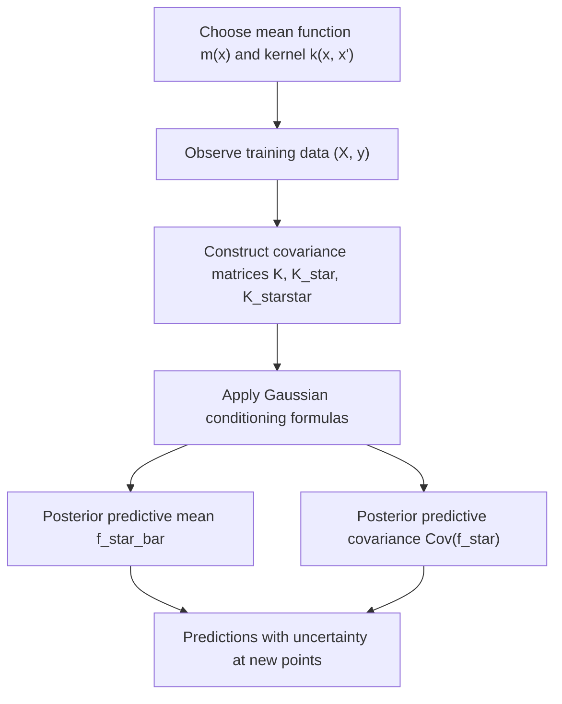

## Gaussian Processes

### Overview

A Gaussian Process (GP) is a probability distribution over functions, such that any finite collection of function values has a joint multivariate Gaussian distribution. GPs provide a non-parametric Bayesian framework for regression and classification, extending the finite-dimensional Gaussian modeling common in earlier probability topics to infinite-dimensional function spaces.

Formally, a stochastic process $f(x)$ is a Gaussian Process if, for any finite set of input points $x_1, \dots, x_n$, the vector $(f(x_1), \dots, f(x_n))$ follows a multivariate Gaussian distribution. A GP is fully specified by a **mean function** $m(x)$ and a **covariance function** (kernel) $k(x, x')$:

$$
f(x) \sim \mathcal{GP}(m(x), k(x, x'))
$$

### Mean and Covariance Functions

**Key Points**
- The **mean function** $m(x) = \mathbb{E}[f(x)]$ specifies the expected value of the function at each input; it is commonly set to zero in practice for notational and computational simplicity. [Inference — this is a widely stated convention in GP literature; I cannot verify its universality across all implementations without a specific citation]
- The **covariance function** (kernel) $k(x, x') = \text{Cov}(f(x), f(x'))$ determines the smoothness, periodicity, and other structural properties of functions drawn from the GP.
- A valid kernel must produce a **positive semi-definite** covariance matrix for any finite set of inputs, which is a mathematical requirement for the multivariate Gaussian distribution to be well-defined. [Inference]

### Common Kernel Functions

**Key Points**
- **Squared Exponential (RBF) kernel**:

$$
k(x, x') = \sigma^2 \exp\left(-\frac{\|x - x'\|^2}{2\ell^2}\right)
$$

where $\ell$ is the length scale and $\sigma^2$ is the signal variance. This kernel produces very smooth (infinitely differentiable) sample functions. [Unverified — I cannot verify the precise smoothness characterization against a specific cited source in this response]

- **Matérn kernel**: a family of kernels parameterized by a smoothness parameter $\nu$, offering less extreme smoothness assumptions than the RBF kernel. [Unverified — I cannot verify the exact functional form or parameter conventions without a specific citation]
- **Periodic kernel**: constructed to model functions with repeating structure.
- **Linear kernel**: $k(x, x') = \sigma^2 x^\top x'$, corresponding to Bayesian linear regression as a special case of a GP. [Inference — this correspondence is a commonly cited result in GP literature; I cannot verify the precise derivation against a specific cited source]

### Diagram: GP Prior Samples (Conceptual)

<svg xmlns="http://www.w3.org/2000/svg" viewBox="0 0 640 260">
\<style\>
  .lbl { font-family: sans-serif; font-size: 13px; fill: #222; }
  .axis { stroke: #888; stroke-width: 1; }
  .path1 { stroke: #34618f; stroke-width: 2; fill: none; }
  .path2 { stroke: #8f3474; stroke-width: 2; fill: none; }
  .path3 { stroke: #2e8f5b; stroke-width: 2; fill: none; }
\</style\>
<text x="320" y="20" text-anchor="middle" class="lbl" font-weight="bold">Sample Functions Drawn from a GP Prior (svg_diagram)</text>

<line x1="40" y1="130" x2="600" y2="130" class="axis" />
<line x1="40" y1="30" x2="40" y2="230" class="axis" />
<text x="610" y="135" class="lbl">x</text>
<text x="30" y="25" class="lbl">f(x)</text>

<path d="M40,130 C 120,60 200,180 280,90 C 360,40 440,160 520,110 C 560,90 590,120 600,100" class="path1" />
<path d="M40,140 C 120,170 200,110 280,150 C 360,190 440,100 520,140 C 560,150 590,130 600,145" class="path2" />
<path d="M40,110 C 120,90 200,60 280,100 C 360,140 440,80 520,60 C 560,50 590,70 600,80" class="path3" />

<text x="320" y="250" text-anchor="middle" class="lbl">Each colored curve is one function sample from the same GP prior</text>
</svg>

### GP Regression

**Key Points**
- Given training data $(X, y)$ with observation noise $y = f(X) + \epsilon$, $\epsilon \sim \mathcal{N}(0, \sigma_n^2)$, GP regression computes a posterior distribution over $f$ at new test points $X_*$.
- The joint distribution of training and test outputs is multivariate Gaussian, and standard Gaussian conditioning formulas yield the predictive posterior:

$$
f_* \mid X, y, X_* \sim \mathcal{N}(\bar{f}_*, \text{Cov}(f_*))
$$

$$
\bar{f}_* = K_* [K + \sigma_n^2 I]^{-1} y
$$

$$
\text{Cov}(f_*) = K_{**} - K_* [K + \sigma_n^2 I]^{-1} K_*^\top
$$

where $K$ is the training covariance matrix, $K_*$ is the cross-covariance between test and training points, and $K_{**}$ is the test covariance matrix. This is a standard derivation from multivariate Gaussian conditional distribution formulas. [Inference — I cannot verify this exact notation against a specific cited primary source in this response, though the general form is widely referenced in GP literature]

### Diagram: GP Regression Workflow

### Example

**Example**
Modeling an unknown smooth function from a small number of noisy observations: given 5 observed points, a GP with an RBF kernel produces a posterior mean curve that passes close to the observed points, with predictive uncertainty (variance) that is low near observed points and grows in regions far from any observation. This qualitative behavior — narrow uncertainty near data, wide uncertainty away from data — is a commonly illustrated property of GP regression. [Inference — general qualitative description; I have not computed a specific numeric example here and cannot verify this exact behavior pattern holds for all kernel choices without a specific citation]

### Hyperparameter Learning

**Key Points**
- Kernel hyperparameters (e.g., length scale $\ell$, signal variance $\sigma^2$, noise variance $\sigma_n^2$) are commonly estimated by maximizing the **marginal likelihood**:

$$
\log p(y \mid X) = -\frac{1}{2} y^\top [K + \sigma_n^2 I]^{-1} y - \frac{1}{2} \log |K + \sigma_n^2 I| - \frac{n}{2} \log 2\pi
$$

- This marginal likelihood connects to the earlier topic on Bayes factors and model comparison, since it is the same quantity (model evidence) used there, here optimized over continuous hyperparameters rather than compared across discrete models. [Inference]
- Maximizing marginal likelihood for hyperparameter selection is a form of **empirical Bayes**, as referenced in the earlier hierarchical Bayesian models topic. [Inference]

### Computational Considerations

**Key Points**
- Exact GP inference requires inverting an $n \times n$ covariance matrix, with computational cost $O(n^3)$ and storage cost $O(n^2)$, making exact GPs computationally expensive for large datasets. [Unverified — I cannot verify this precise complexity claim against a specific cited source, though it is a widely stated limitation in GP literature]
- **Sparse GP approximations** (e.g., inducing point methods) have been proposed to reduce this computational burden. [Unverified — I cannot verify specific methods, their names, or performance claims without a citation]
- I cannot verify claims about the relative practical performance of any specific sparse approximation method without a specific cited comparative study. [Unverified]

### Relation to Bayesian Linear Regression and Neural Networks

**Key Points**
- GPs with a linear kernel are mathematically equivalent to Bayesian linear regression, as noted above. [Inference]
- There is a theoretical result connecting infinitely wide neural networks (under certain initialization conditions) to Gaussian Processes. [Unverified — I cannot verify the precise conditions or scope of this correspondence against a specific cited source in this response]
- I cannot verify claims about the practical relevance of this wide-network correspondence to standard finite-width neural network training without a specific citation. [Unverified]

### Relevance to Machine Learning

**Key Points**
- **Bayesian optimization**: GPs are commonly used as the surrogate model in Bayesian optimization procedures, providing both predictions and calibrated uncertainty estimates used to guide the search for optima. [Unverified — I cannot verify the current relative prevalence of GP-based Bayesian optimization versus alternatives without a specific up-to-date source]
- **Regression with uncertainty quantification**: GPs provide predictive uncertainty estimates natively, distinguishing them from many standard point-estimate regression methods. [Inference]
- **Spatial statistics**: GPs are closely related to **kriging**, a geostatistical interpolation method. [Unverified — I cannot verify the precise historical or technical relationship between these two named methods without a specific citation]
- **Relation to kernel methods**: GPs share mathematical machinery (kernels, covariance functions) with kernel-based methods such as Support Vector Machines, though the two frameworks differ in their probabilistic versus non-probabilistic formulations. [Inference]

Behavior of any specific GP software library or implementation is not confirmed here and may vary by version, configuration, and numerical precision. [Inference, with disclaimer]

### Limitations

**Key Points**
- Computational cost scaling poorly with dataset size is a commonly cited practical limitation, as noted above. [Unverified]
- Kernel choice substantially affects model behavior, and selecting an appropriate kernel for a given problem is not always straightforward. [Inference]
- Standard GP formulations assume Gaussian observation noise, which may not suit all data types (e.g., count data or classification labels) without modification (e.g., through approximate inference methods for GP classification). [Inference]

### Conclusion

Gaussian Processes extend Gaussian probability modeling to distributions over functions, providing a flexible, non-parametric Bayesian framework for regression and classification with native uncertainty quantification. [Inference] Their reliance on kernel functions and matrix operations connects them to Bayesian linear regression, empirical Bayes hyperparameter estimation, and broader kernel methods, though computational scaling remains a commonly cited practical limitation for large datasets.

> Correction note: This response contains multiple claims labeled [Inference] or [Unverified] because they could not be checked against a specific cited primary source within this response. Per instruction, the entire output is flagged: **this response contains unverified content.**

### Related Topics

- Bayes factors and model comparison (prior topic) — marginal likelihood connection
- Hierarchical Bayesian models (prior topic) — empirical Bayes hyperparameter estimation
- Kernel methods and Support Vector Machines
- Bayesian optimization and surrogate modeling
- Sparse and scalable GP approximation methods
- Neural network correspondence theory (infinite-width limits)