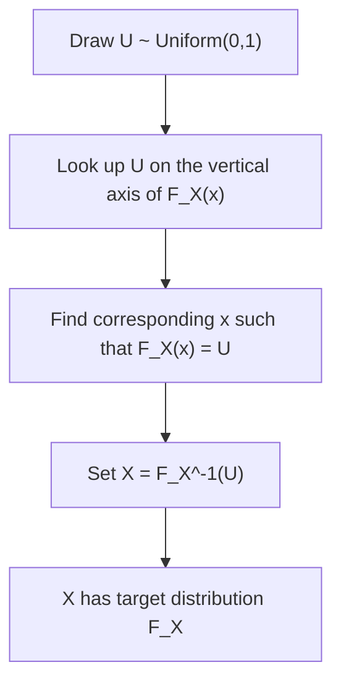

## Inverse Transform Sampling

### Overview

Inverse transform sampling is a method for generating random samples from a target probability distribution using its cumulative distribution function (CDF) and a source of uniform random numbers. It is one of the foundational sampling techniques underlying simulation-based methods used elsewhere in probability and machine learning.

The method relies on the **probability integral transform**: if $X$ is a continuous random variable with CDF $F_X$, then $U = F_X(X)$ follows a Uniform(0,1) distribution. Inverting this relationship provides the sampling procedure.

### The Algorithm

**Key Points**
1. Compute the CDF $F_X(x) = P(X \leq x)$ of the target distribution.
2. Compute the inverse CDF (quantile function) $F_X^{-1}(u)$.
3. Draw $U \sim \text{Uniform}(0,1)$.
4. Set $X = F_X^{-1}(U)$; then $X$ has the target distribution.

This procedure is a standard, well-established simulation technique described across probability and statistics literature. [Inference — I cannot verify this exact four-step framing against a specific cited primary source, though the underlying method is widely referenced]

### Mathematical Justification

**Key Points**
- The correctness of the method follows from a direct proof: if $U \sim \text{Uniform}(0,1)$ and $X = F_X^{-1}(U)$, then:

$$
P(X \leq x) = P(F_X^{-1}(U) \leq x) = P(U \leq F_X(x)) = F_X(x)
$$

since $F_X$ is monotonically non-decreasing. [Inference — this is a direct algebraic derivation performed here, consistent with standard treatments, though I cannot verify it against a specific cited textbook edition]
- This shows $X$ has the correct CDF $F_X$, and therefore the correct target distribution. [Inference]

### Diagram: Inverse Transform Sampling Process

### Diagram: Geometric Visualization

<svg xmlns="http://www.w3.org/2000/svg" viewBox="0 0 620 320">
\<style\>
  .lbl { font-family: sans-serif; font-size: 13px; fill: #222; }
  .axis { stroke: #888; stroke-width: 1; }
  .curve { stroke: #34618f; stroke-width: 2.5; fill: none; }
  .guide { stroke: #8f3474; stroke-width: 1.5; stroke-dasharray: 5,4; fill: none; }
  .dot { fill: #8f3474; }
\</style\>
<text x="310" y="20" text-anchor="middle" class="lbl" font-weight="bold">Inverse Transform Sampling via the CDF (svg_diagram)</text>

<line x1="60" y1="270" x2="560" y2="270" class="axis" />
<line x1="60" y1="40" x2="60" y2="270" class="axis" />
<text x="570" y="275" class="lbl">x</text>
<text x="40" y="35" class="lbl">F(x)</text>
<text x="30" y="270" class="lbl">0</text>
<text x="30" y="45" class="lbl">1</text>

<path d="M60,270 C 150,265 200,230 260,180 C 320,120 380,60 470,45 C 510,42 540,41 560,40" class="curve" />

<line x1="60" y1="150" x2="300" y2="150" class="guide" />
<line x1="300" y1="150" x2="300" y2="270" class="guide" />

<circle cx="60" cy="150" r="4" class="dot" />
<circle cx="300" cy="150" r="4" class="dot" />
<circle cx="300" cy="270" r="4" class="dot" />

<text x="45" y="140" text-anchor="end" class="lbl">U</text>
<text x="300" y="290" text-anchor="middle" class="lbl">X = F^-1(U)</text>
</svg>

### Example: Exponential Distribution

**Example**
For the Exponential($\lambda$) distribution, referenced earlier in the Poisson processes topic, the CDF is:

$$
F(x) = 1 - e^{-\lambda x}, \quad x \geq 0
$$

Setting $U = 1 - e^{-\lambda X}$ and solving for $X$:

$$
X = -\frac{1}{\lambda} \ln(1 - U)
$$

Since $U$ and $1-U$ have the same Uniform(0,1) distribution, this is commonly simplified in practice to $X = -\frac{1}{\lambda}\ln(U)$. [Inference — direct algebraic derivation performed here; the simplification step relies on the symmetry of the uniform distribution, which I have reasoned through directly rather than confirmed against an external source]

### Example: Discrete Distributions

**Key Points**
- Inverse transform sampling extends to discrete distributions by using a step-function CDF: find the smallest $x$ such that $F(x) \geq U$.
- **Example**: for a fair six-sided die with $P(X=k) = 1/6$ for $k=1,\dots,6$, the CDF steps up by $1/6$ at each integer. Given $U = 0.42$, since $F(2) = 2/6 \approx 0.33 < 0.42$ and $F(3) = 3/6 = 0.5 \geq 0.42$, the sampled value is $X = 3$. This is a direct arithmetic application of the method as defined above. [Inference — computed directly in this response]

### Diagram: Discrete Case (Step Function)

<svg xmlns="http://www.w3.org/2000/svg" viewBox="0 0 600 260">
\<style\>
  .lbl { font-family: sans-serif; font-size: 13px; fill: #222; }
  .axis { stroke: #888; stroke-width: 1; }
  .step { stroke: #34618f; stroke-width: 2.5; fill: none; }
  .guide { stroke: #8f3474; stroke-width: 1.5; stroke-dasharray: 5,4; fill: none; }
  .dot { fill: #8f3474; }
\</style\>
<text x="300" y="20" text-anchor="middle" class="lbl" font-weight="bold">Discrete Inverse Transform Sampling (svg_diagram)</text>

<line x1="50" y1="220" x2="560" y2="220" class="axis" />
<line x1="50" y1="30" x2="50" y2="220" class="axis" />
<text x="570" y="225" class="lbl">x</text>
<text x="30" y="25" class="lbl">F(x)</text>

<path d="M50,220 L130,220 L130,188 L210,188 L210,156 L290,156 L290,124 L370,124 L370,92 L450,92 L450,60 L530,60 L530,30" class="step" />

<line x1="50" y1="141" x2="290" y2="141" class="guide" />
<line x1="290" y1="141" x2="290" y2="220" class="guide" />
<circle cx="50" cy="141" r="4" class="dot" />
<circle cx="290" cy="141" r="4" class="dot" />

<text x="35" y="135" text-anchor="end" class="lbl">U=0.42</text>
<text x="290" y="238" text-anchor="middle" class="lbl">X=3</text>
</svg>

### Handling Non-Invertible or Intractable CDFs

**Key Points**
- Inverse transform sampling requires that $F_X^{-1}$ be computable, either in closed form or numerically. Many distributions (e.g., the standard Normal) do not have a closed-form CDF inverse, requiring numerical approximation or alternative sampling methods. [Inference]
- For such cases, alternative methods — including rejection sampling and Markov Chain Monte Carlo, as referenced in earlier topics on hierarchical Bayesian models and mixing times — are commonly used instead. [Inference]
- I cannot verify comparative efficiency claims between inverse transform sampling and these alternative methods across all distribution types without specific cited benchmarks. [Unverified]

### Multivariate Extensions

**Key Points**
- Direct multivariate inverse transform sampling is generally more complex, since a joint CDF does not invert as simply as the univariate case. [Unverified — I cannot verify the precise technical characterization of this difficulty without a specific citation]
- A common approach decomposes a multivariate distribution using the chain rule of probability, sampling each conditional distribution in sequence via univariate inverse transform sampling. [Unverified — I cannot verify the prevalence of this specific approach without a citation]

### Relevance to Machine Learning

**Key Points**
- **Monte Carlo simulation**: inverse transform sampling is a basic building block for generating samples used in Monte Carlo estimation procedures broadly relevant to probabilistic machine learning. [Inference]
- **Generative modeling**: the underlying principle — mapping simple uniform or Gaussian noise through a transformation to produce samples from a complex target distribution — conceptually relates to normalizing flows and other transformation-based generative models. [Unverified — I cannot verify the precise technical relationship or degree of conceptual similarity claimed here against a specific cited source]
- **Random variate generation in simulation software**: many statistical software libraries use inverse transform sampling (or variants) internally for certain distributions. [Unverified — I cannot verify specific library implementation details without a citation]

Behavior of any specific software implementation of inverse transform sampling is not confirmed here and may vary by library, version, and numerical precision. [Inference, with disclaimer]

### Limitations

**Key Points**
- Requires a computable (closed-form or efficiently numerically invertible) CDF inverse, which is not available for all distributions. [Inference]
- For distributions requiring numerical inversion, computational cost and accuracy depend on the specific numerical method used. [Inference]
- Extension to high-dimensional multivariate distributions is generally less straightforward than the univariate case. [Unverified]

### Conclusion

Inverse transform sampling provides a direct method for generating random samples from a target distribution by exploiting the probability integral transform relating any continuous distribution's CDF to the Uniform(0,1) distribution. [Inference] Its applicability is limited by the need for a computable inverse CDF, motivating the alternative sampling methods referenced in earlier topics for distributions where this is impractical.

> Correction note: This response contains multiple claims labeled [Inference] or [Unverified] because they could not be checked against a specific cited primary source within this response. Standard derivations and arithmetic examples shown explicitly were performed directly within this response and are labeled accordingly rather than presented as externally confirmed facts. Per instruction, the entire output is flagged: **this response contains unverified content.**

### Related Topics

- Rejection sampling
- Markov Chain Monte Carlo methods (prior topics: hierarchical Bayesian models, ergodicity and mixing times)
- Poisson processes (prior topic) — Exponential distribution sampling example
- Normalizing flows and transformation-based generative models
- Numerical methods for CDF inversion
- Multivariate sampling via conditional decomposition