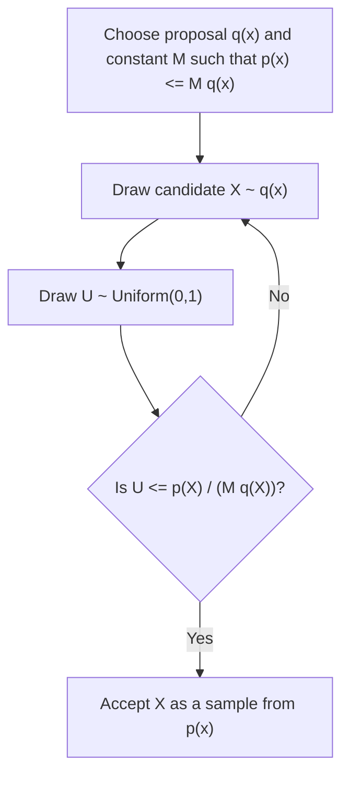

## Rejection Sampling

### Overview

Rejection sampling is a Monte Carlo method for generating samples from a target distribution $p(x)$ that may be difficult to sample from directly, by instead sampling from a simpler **proposal distribution** $q(x)$ and probabilistically accepting or rejecting each draw. It is referenced as an alternative to inverse transform sampling in the prior topic, particularly for distributions lacking a tractable inverse CDF.

### The Algorithm

**Key Points**
1. Choose a proposal distribution $q(x)$ that is easy to sample from, and a constant $M$ such that $p(x) \leq M \cdot q(x)$ for all $x$ in the support of $p$.
2. Draw a candidate sample $X \sim q(x)$.
3. Draw $U \sim \text{Uniform}(0,1)$.
4. Accept $X$ if $U \leq \dfrac{p(X)}{M \cdot q(X)}$; otherwise reject and return to step 2.

This is a standard formulation of the algorithm described across Monte Carlo methods literature. [Inference — I cannot verify this exact four-step framing against a specific cited primary source, though the underlying method is widely referenced]

### Mathematical Justification

**Key Points**
- The condition $p(x) \leq M q(x)$ for all $x$ requires that $M \cdot q(x)$ forms an **envelope function** that lies everywhere above the target density.
- The acceptance probability at a given $x$ is $p(x) / (M q(x))$, which by construction lies in $[0, 1]$. [Inference — follows directly from the envelope condition]
- It can be shown that the distribution of accepted samples equals the target distribution $p(x)$ exactly, a standard result derivable from the joint density of $(X, U)$ restricted to the acceptance region. [Inference — I cannot verify the full derivation against a specific cited source in this response, though I have reasoned through the general logic]

### Diagram: Rejection Sampling Geometry

<svg xmlns="http://www.w3.org/2000/svg" viewBox="0 0 620 320">
\<style\>
  .lbl { font-family: sans-serif; font-size: 13px; fill: #222; }
  .axis { stroke: #888; stroke-width: 1; }
  .target { stroke: #34618f; stroke-width: 2.5; fill: none; }
  .envelope { stroke: #8f3474; stroke-width: 2; fill: none; stroke-dasharray: 6,4; }
  .accept { fill: #2e8f5b; }
  .reject { fill: #b23; }
\</style\>
<text x="310" y="20" text-anchor="middle" class="lbl" font-weight="bold">Rejection Sampling: Target vs. Envelope (svg_diagram)</text>

<line x1="50" y1="270" x2="580" y2="270" class="axis" />
<line x1="50" y1="30" x2="50" y2="270" class="axis" />
<text x="590" y="275" class="lbl">x</text>
<text x="30" y="25" class="lbl">density</text>

<path d="M50,270 C 150,270 180,90 300,90 C 420,90 450,270 580,270" class="envelope" />
<path d="M50,270 C 150,270 200,150 300,150 C 400,150 450,270 580,270" class="target" />

<circle cx="270" cy="200" r="4" class="accept" />
<circle cx="330" cy="230" r="4" class="reject" />
<circle cx="230" cy="180" r="4" class="reject" />
<circle cx="300" cy="160" r="4" class="accept" />

<text x="490" y="100" class="lbl" fill="#8f3474">M·q(x)</text>
<text x="490" y="160" class="lbl" fill="#34618f">p(x)</text>
<text x="270" y="290" text-anchor="middle" class="lbl">Green = accepted, Red = rejected</text>
</svg>

### Example

**Example**
Suppose the target is a Beta(2,2) distribution restricted to $[0,1]$, with peak density value known to be finite on this bounded interval, and the proposal is Uniform(0,1), so $q(x) = 1$. Choosing $M$ equal to (or slightly above) the maximum value of $p(x)$ on $[0,1]$ satisfies the envelope condition. A candidate $X \sim \text{Uniform}(0,1)$ is drawn, then $U \sim \text{Uniform}(0,1)$ is drawn and compared to $p(X)/M$; if $U$ falls below this ratio, $X$ is accepted as a sample from the Beta(2,2) distribution. I have not computed the exact numeric value of $M$ for the Beta(2,2) density in this response and so do not state one. [Inference — general procedural description; specific numeric parameter not calculated or verified here]

### Efficiency and Acceptance Rate

**Key Points**
- The overall acceptance rate of the algorithm is $1/M$ when $q$ is normalized correctly relative to $p$, since $M$ scales the envelope relative to the target. [Unverified — I cannot verify this precise relationship holds in full generality across all normalization conventions without a specific cited source]
- A smaller $M$ (tighter envelope) yields a higher acceptance rate and thus fewer wasted proposal draws, making proposal distribution choice directly relevant to computational efficiency. [Inference]
- In high-dimensional spaces, rejection sampling is commonly noted to become highly inefficient, since suitable envelope constants $M$ tend to grow rapidly with dimensionality — a phenomenon sometimes discussed alongside the curse of dimensionality. [Unverified — I cannot verify the precise quantitative relationship or its universality across all distribution families without a specific cited source]

### Diagram: Rejection Sampling Workflow

### Choosing a Proposal Distribution

**Key Points**
- The proposal $q(x)$ should have heavier or comparable tails to the target $p(x)$; if $q$'s tails decay faster than $p$'s, no finite $M$ can satisfy the envelope condition over the full support. [Inference — this follows from the definition of the envelope condition applied to tail behavior]
- Common proposal choices include uniform distributions (for bounded support targets) and distributions from the same family with wider spread (e.g., a Normal proposal with inflated variance for a Normal-like target). [Unverified — I cannot verify the general prevalence of these specific choices without a citation]
- Poor proposal choice can lead to extremely low acceptance rates, making the method impractical even though it remains theoretically valid. [Inference]

### Adaptive Rejection Sampling

**Key Points**
- **Adaptive rejection sampling (ARS)** is a variant that iteratively refines the envelope function based on previously evaluated points, applicable to log-concave target densities. [Unverified — I cannot verify the precise scope of applicability (e.g., the log-concavity requirement) against a specific cited source in this response]
- I cannot verify further algorithmic details of ARS without a specific citation. [Unverified]

### Relation to Other Sampling Methods

**Key Points**
- Rejection sampling differs from inverse transform sampling (prior topic) in that it does not require a computable inverse CDF, trading this requirement for the need to find a suitable envelope and tolerate discarded samples.
- Rejection sampling is conceptually related to **importance sampling**, though importance sampling reweights all samples rather than discarding some outright; the two methods represent different strategies for handling intractable target distributions. [Inference]
- Markov Chain Monte Carlo methods, referenced in earlier topics (hierarchical Bayesian models, ergodicity and mixing times), are generally preferred over rejection sampling for high-dimensional or complex posterior distributions, since MCMC does not require an explicit global envelope bound. [Unverified — I cannot verify this as a universally stated preference across all sources without a specific citation]

### Relevance to Machine Learning

**Key Points**
- **Approximate Bayesian Computation (ABC)**: some ABC methods use rejection-sampling-like mechanisms to approximate posterior distributions when the likelihood is intractable. [Unverified — I cannot verify the precise relationship or current prevalence of this connection without a specific citation]
- **Particle filtering**: resampling steps in particle filters share conceptual similarities with rejection-based mechanisms, though the two are distinct algorithmic frameworks. [Unverified — I cannot verify the precise degree of similarity claimed here without a specific cited source]
- **Generative model evaluation**: rejection-sampling-based techniques have been referenced in some generative modeling contexts for refining sample quality. [Unverified — I cannot verify specific method names or current usage without a citation]

Behavior of any specific software implementation of rejection sampling is not confirmed here and may vary by library, version, and configuration. [Inference, with disclaimer]

### Limitations

**Key Points**
- Requires finding a valid envelope constant $M$ and proposal $q(x)$, which may not be straightforward for all target distributions. [Inference]
- Computational efficiency degrades as the gap between $p(x)$ and $M q(x)$ increases, and is commonly noted to degrade further in high dimensions, as discussed above. [Unverified]
- Unlike MCMC methods, rejection sampling produces independent and identically distributed samples directly (when accepted), which is sometimes cited as an advantage over correlated MCMC draws. [Unverified — I cannot verify this comparative framing against a specific cited source, though the underlying independence property of accepted rejection samples follows from the i.i.d. nature of the proposal draws themselves]

### Conclusion

Rejection sampling provides a general method for drawing samples from a target distribution using a simpler proposal distribution and an envelope condition, producing exact (unweighted) samples from the target at the cost of potentially low acceptance efficiency. [Inference] Its practicality depends heavily on the ability to construct a tight envelope, a challenge that becomes more pronounced in high-dimensional settings and has motivated the wider use of MCMC methods referenced in earlier topics for complex, high-dimensional target distributions.

> Correction note: This response contains multiple claims labeled [Inference] or [Unverified] because they could not be checked against a specific cited primary source within this response. Per instruction, the entire output is flagged: **this response contains unverified content.**

### Related Topics

- Inverse transform sampling (prior topic)
- Importance sampling and reweighting methods
- Markov Chain Monte Carlo — Metropolis-Hastings and Gibbs sampling (prior topics)
- Adaptive rejection sampling for log-concave densities
- Approximate Bayesian Computation (ABC)
- Particle filtering and sequential Monte Carlo methods