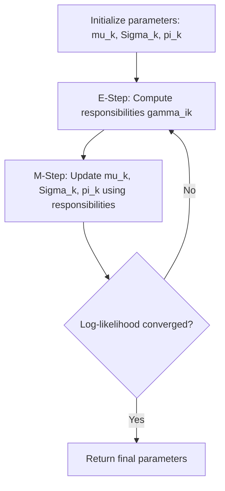

## Gaussian Mixture Models

### Overview

A Gaussian Mixture Model (GMM) is a probabilistic model that represents a distribution as a weighted combination of multiple Gaussian (normal) component distributions. GMMs are used for density estimation, clustering, and as generative models for data assumed to arise from several underlying subpopulations, each modeled as Gaussian. Unlike hard-assignment clustering methods, GMMs provide a probabilistic (soft) assignment of data points to clusters.

### Mathematical Formulation

A GMM defines the probability density of a data point $\mathbf{x}$ as a weighted sum of $K$ Gaussian components:

$$
p(\mathbf{x}) = \sum_{k=1}^{K} \pi_k \, \mathcal{N}(\mathbf{x} \mid \mu_k, \Sigma_k)
$$

where:
- $K$ is the number of mixture components
- $\pi_k$ is the **mixing coefficient** (weight) of component $k$, satisfying $\sum_{k=1}^{K} \pi_k = 1$ and $\pi_k \geq 0$
- $\mathcal{N}(\mathbf{x} \mid \mu_k, \Sigma_k)$ is the multivariate Gaussian density with mean $\mu_k$ and covariance $\Sigma_k$

The multivariate Gaussian component itself is defined as:

$$
\mathcal{N}(\mathbf{x} \mid \mu_k, \Sigma_k) = \frac{1}{(2\pi)^{d/2} |\Sigma_k|^{1/2}} \exp\left(-\frac{1}{2}(\mathbf{x} - \mu_k)^\top \Sigma_k^{-1} (\mathbf{x} - \mu_k)\right)
$$

where $d$ is the dimensionality of $\mathbf{x}$.

**Key Points**
- The mixing coefficients $\pi_k$ can be interpreted as the prior probability that a randomly drawn data point belongs to component $k$: $\pi_k = P(z = k)$, where $z$ is a latent (unobserved) component-assignment variable.
- The total number of free parameters grows with $K$ and $d$, particularly for full covariance matrices, which scale as $O(d^2)$ per component.

### Latent Variable Interpretation

GMMs are formally described using a latent variable $z$ that indicates which component generated a given observation. This is expressed hierarchically:

$$
P(z = k) = \pi_k
$$

$$
P(\mathbf{x} \mid z = k) = \mathcal{N}(\mathbf{x} \mid \mu_k, \Sigma_k)
$$

The marginal distribution of $\mathbf{x}$ is recovered by summing over the latent variable:

$$
p(\mathbf{x}) = \sum_{k=1}^{K} P(z=k) \, P(\mathbf{x} \mid z=k)
$$

<svg xmlns="http://www.w3.org/2000/svg" viewBox="0 0 640 340">
  <text x="320" y="28" text-anchor="middle" font-size="16" font-weight="bold" fill="#1a1a1a">GMM as a Latent Variable Model (svg_diagram)</text>

  <circle cx="320" cy="90" r="35" fill="#dbeafe" stroke="#2563eb" stroke-width="2" />
  <text x="320" y="95" text-anchor="middle" font-size="14" fill="#1e3a8a">z</text>

  <circle cx="320" cy="230" r="35" fill="#fce7f3" stroke="#be185d" stroke-width="2" />
  <text x="320" y="235" text-anchor="middle" font-size="14" fill="#831843">x</text>

  <line x1="320" y1="125" x2="320" y2="195" stroke="#555" stroke-width="1.5" marker-end="url(#arrow2)" />

  <text x="120" y="90" font-size="12" fill="#444" text-anchor="middle">P(z=k) = πₖ</text>
  <text x="500" y="230" font-size="12" fill="#444" text-anchor="middle">P(x|z=k) = N(μₖ,Σₖ)</text>

  <text x="320" y="300" text-anchor="middle" font-size="12" fill="#444">z is unobserved (latent); only x is observed</text>
</svg>

**Key Points**
- The latent variable $z$ is not observed in the training data; only $\mathbf{x}$ is observed. This is what makes parameter estimation nontrivial and motivates the use of the Expectation-Maximization algorithm.
- This structure formally makes GMMs a special case of a broader class of latent variable models.

### Relationship to K-Means Clustering

**Key Points**
- K-means clustering can be viewed as a special-case limit of a GMM where all components share equal, isotropic (spherical) covariance and cluster assignment is hard (each point assigned fully to one cluster) rather than soft (probabilistic). [Inference] This characterization is a commonly cited theoretical connection in machine learning literature, but I cannot verify the precise derivation conditions without checking a specific source, so this should be treated as [Unverified] beyond the general shape of the claim.
- GMMs generalize k-means by allowing elliptical cluster shapes (via full covariance matrices) and soft probabilistic membership rather than hard assignment.

### Parameter Estimation: The Expectation-Maximization (EM) Algorithm

Because the latent variable $z$ is unobserved, direct maximum likelihood estimation of $\pi_k, \mu_k, \Sigma_k$ has no closed-form solution. The Expectation-Maximization (EM) algorithm is the standard iterative method used to estimate these parameters.

#### E-Step (Expectation)

Given current parameter estimates, compute the posterior probability (**responsibility**) that component $k$ generated data point $\mathbf{x}_i$:

$$
\gamma_{ik} = P(z_i = k \mid \mathbf{x}_i) = \frac{\pi_k \, \mathcal{N}(\mathbf{x}_i \mid \mu_k, \Sigma_k)}{\sum_{j=1}^{K} \pi_j \, \mathcal{N}(\mathbf{x}_i \mid \mu_j, \Sigma_j)}
$$

This is a direct application of Bayes' theorem, treating $\pi_k$ as the prior and $\mathcal{N}(\mathbf{x}_i \mid \mu_k, \Sigma_k)$ as the likelihood.

#### M-Step (Maximization)

Update the parameters using the responsibilities computed in the E-step, weighted by how much each point is attributed to each component:

$$
N_k = \sum_{i=1}^{n} \gamma_{ik}
$$

$$
\mu_k^{\text{new}} = \frac{1}{N_k} \sum_{i=1}^{n} \gamma_{ik} \, \mathbf{x}_i
$$

$$
\Sigma_k^{\text{new}} = \frac{1}{N_k} \sum_{i=1}^{n} \gamma_{ik} (\mathbf{x}_i - \mu_k^{\text{new}})(\mathbf{x}_i - \mu_k^{\text{new}})^\top
$$

$$
\pi_k^{\text{new}} = \frac{N_k}{n}
$$

**Key Points**
- $N_k$ can be interpreted as the "effective number" of points softly assigned to component $k$.
- The E-step and M-step are repeated iteratively until convergence, typically measured by the change in log-likelihood falling below a threshold.

### Convergence Properties of EM

**Key Points**
- Each iteration of EM is [Inference] generally understood, based on the standard theoretical derivation of the algorithm, to not decrease the log-likelihood of the data; this is a mathematical property of the EM algorithm's construction as described in standard statistical literature, though I cannot independently verify a specific proof here without citing a specific source, so this should be treated as [Unverified] as a precise guarantee for all implementations.
- EM converges to a local maximum (or saddle point) of the likelihood function, not necessarily the global maximum. Results depend on parameter initialization.
- Behavior regarding convergence speed and final solution quality may vary depending on initialization strategy, number of components, and data characteristics. This is [Unverified] as a general claim without reference to a specific implementation or benchmark.

### Initialization Strategies

**Key Points**
- Random initialization of means and covariances is common but can lead to convergence at poor local optima.
- K-means initialization (running k-means first, then using cluster centers as initial GMM means) is a widely used practical heuristic. [Inference] This is commonly described as improving convergence behavior in applied machine learning resources, but I do not have a specific benchmark to cite confirming this for all datasets, so this remains [Unverified] as a universal claim.
- Multiple random restarts with different initializations, keeping the result with the highest final log-likelihood, is a common practical mitigation strategy for the local optima problem.

### Choosing the Number of Components (K)

**Key Points**
- Unlike some clustering methods, GMMs provide a likelihood value, enabling use of formal model selection criteria.
- **Akaike Information Criterion (AIC)**: $\text{AIC} = 2p - 2\ln(\hat{L})$, where $p$ is the number of free parameters and $\hat{L}$ is the maximized likelihood.
- **Bayesian Information Criterion (BIC)**: $\text{BIC} = p \ln(n) - 2\ln(\hat{L})$, where $n$ is the number of data points. BIC penalizes model complexity more heavily than AIC for larger sample sizes.
- Lower AIC/BIC values are generally preferred when comparing models with different $K$. [Inference] This is a standard model selection convention described in statistical literature, but the specific tradeoffs of AIC vs. BIC in a given application are context-dependent and not something this response can guarantee as optimal without empirical testing.

### Soft Clustering and Cluster Assignment

Once trained, a data point can be assigned to clusters in two ways:

**Soft assignment**: report the full responsibility vector $(\gamma_{i1}, \gamma_{i2}, \ldots, \gamma_{iK})$, representing the probability distribution over cluster membership.

**Hard assignment**: assign the point to the single most probable component:

$$
\hat{z}_i = \arg\max_{k} \gamma_{ik}
$$

**Key Points**
- Soft assignment preserves uncertainty information, which can be valuable when cluster boundaries are ambiguous or overlapping.
- Hard assignment discards this uncertainty in favor of a simpler, discrete cluster label, useful when a definitive grouping decision is required downstream.

### Worked Example

**Example**

Consider a one-dimensional GMM with two components fitted to a dataset, with estimated parameters:
- $\pi_1 = 0.3$, $\mu_1 = 2.0$, $\sigma_1^2 = 1.0$
- $\pi_2 = 0.7$, $\mu_2 = 8.0$, $\sigma_2^2 = 2.0$

For a new point $x = 3.0$, compute the density under each component:

$$
\mathcal{N}(3.0 \mid 2.0, 1.0) = \frac{1}{\sqrt{2\pi}} \exp\left(-\frac{(3-2)^2}{2}\right) \approx 0.242
$$

$$
\mathcal{N}(3.0 \mid 8.0, 2.0) = \frac{1}{\sqrt{2\pi \cdot 2}} \exp\left(-\frac{(3-8)^2}{4}\right) \approx 0.282 \times 10^{-2} \approx 0.00282
$$

Weighted terms:

$$
0.3 \times 0.242 = 0.0726
$$
$$
0.7 \times 0.00282 \approx 0.00197
$$

Responsibility of component 1:

$$
\gamma_{1} = \frac{0.0726}{0.0726 + 0.00197} \approx 0.9736
$$

**Output**

For $x = 3.0$, the point is assigned a responsibility of approximately $97.4\%$ to component 1 and approximately $2.6\%$ to component 2. Under hard assignment, this point would be classified as belonging to cluster 1, consistent with $x = 3.0$ being much closer to $\mu_1 = 2.0$ than to $\mu_2 = 8.0$.

### Covariance Structure Variants

**Key Points**
- **Full covariance**: each component has its own general covariance matrix $\Sigma_k$, allowing arbitrary elliptical shapes and orientations. Most flexible, but most parameters to estimate.
- **Diagonal covariance**: off-diagonal covariance terms are constrained to zero, meaning features are treated as uncorrelated within each component. Reduces parameter count substantially.
- **Spherical (isotropic) covariance**: $\Sigma_k = \sigma_k^2 I$, meaning each component is a hypersphere of uniform variance across all dimensions. Fewest parameters, most restrictive shape assumption.
- **Tied covariance**: all components share a single common covariance matrix $\Sigma$, differing only in mean location.
- Choice among these variants involves a bias-variance tradeoff: more flexible covariance structures fit training data better but risk overfitting with limited data. [Inference] This is a standard statistical modeling tradeoff described in the literature, but the practical impact depends on dataset size and dimensionality, and I cannot quantify it generally without a specific benchmark being cited.

### Applications

**Key Points**
- **Clustering**: an unsupervised alternative to k-means when cluster shapes are non-spherical or cluster membership is inherently probabilistic.
- **Density estimation**: GMMs can approximate complex, multimodal probability distributions as a weighted sum of simpler unimodal Gaussians.
- **Anomaly detection**: points with low density under the fitted mixture model can be flagged as potential outliers, though what constitutes a suitable density threshold is application-specific.
- **Generative modeling**: new synthetic samples can be drawn by first sampling a component according to $\pi_k$, then sampling from the corresponding Gaussian.
- Historically referenced in speech recognition (e.g., Gaussian Mixture Model-Hidden Markov Model, or GMM-HMM systems) for acoustic modeling. [Unverified] I do not have a specific source confirmed in this session describing the current prevalence of this technique relative to modern neural approaches, so its present-day usage extent should not be assumed from this statement alone.

### Limitations

**Key Points**
- The number of components $K$ must be chosen in advance (or selected via a criterion like BIC), unlike some nonparametric alternatives (e.g., Dirichlet Process Mixture Models).
- GMMs assume the underlying subpopulations are Gaussian-shaped; if true clusters have non-Gaussian shapes (e.g., non-convex or ring-shaped), the model may fit poorly regardless of $K$.
- Full covariance GMMs scale poorly in high dimensions due to the $O(d^2)$ parameter growth per component, which can lead to numerically singular covariance estimates with limited data per component.
- Sensitive to initialization, as noted above, since EM only guarantees convergence to a local optimum.

### Conclusion

Gaussian Mixture Models provide a flexible, probabilistically grounded framework for representing multimodal data as a weighted combination of Gaussian components. Through the latent variable formulation and the Expectation-Maximization algorithm, GMMs enable soft clustering and density estimation beyond what hard-assignment methods like k-means can offer. Their effectiveness depends on appropriate choice of component count, covariance structure, and initialization strategy, all of which are context-dependent and should be validated empirically rather than assumed.

### Related Topics

- Expectation-Maximization algorithm: general theory and convergence proofs
- Dirichlet Process Mixture Models (infinite mixture models)
- Hidden Markov Models and their relationship to mixture models
- Model selection criteria: AIC, BIC, and cross-validation approaches
- K-means clustering as a constrained special case of GMM
- Multivariate Gaussian distributions and covariance matrix properties
- Variational inference as an alternative to EM for mixture models