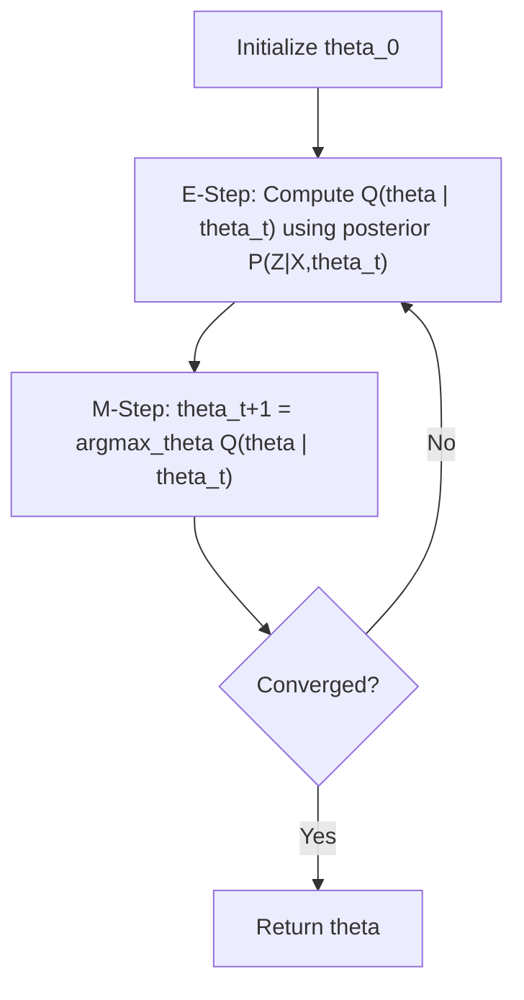

## Expectation-Maximization Algorithm

### Overview

The Expectation-Maximization (EM) algorithm is a general iterative method for finding maximum likelihood (or maximum a posteriori) estimates of parameters in probabilistic models that involve unobserved latent variables. Rather than optimizing an intractable likelihood directly, EM alternates between estimating the distribution over latent variables given current parameters (E-step) and updating parameters to maximize an expected likelihood given that distribution (M-step). EM is foundational to many machine learning models, including Gaussian Mixture Models, Hidden Markov Models, and certain formulations of missing-data problems.

### The Core Problem: Incomplete Data

EM addresses situations where the observed data $\mathbf{X}$ is considered "incomplete" because it is generated jointly with unobserved latent variables $\mathbf{Z}$. The full **complete-data likelihood** would be $P(\mathbf{X}, \mathbf{Z} \mid \theta)$, but since $\mathbf{Z}$ is unobserved, only the **marginal likelihood** is directly computable:

$$
P(\mathbf{X} \mid \theta) = \sum_{\mathbf{Z}} P(\mathbf{X}, \mathbf{Z} \mid \theta)
$$

**Key Points**
- Direct maximization of $\log P(\mathbf{X} \mid \theta)$ with respect to $\theta$ is often analytically intractable because the log of a sum (over latent states) does not decompose nicely, unlike the log of a product.
- If $\mathbf{Z}$ were observed, maximizing the complete-data log-likelihood $\log P(\mathbf{X}, \mathbf{Z} \mid \theta)$ would typically be straightforward, often having closed-form solutions.
- EM exploits this by working with expectations of the complete-data log-likelihood rather than the intractable marginal log-likelihood directly.

### The Two Steps

#### E-Step (Expectation)

Given the current parameter estimate $\theta^{(t)}$, compute the posterior distribution of the latent variables given the observed data:

$$
Q(\theta \mid \theta^{(t)}) = \mathbb{E}_{\mathbf{Z} \mid \mathbf{X}, \theta^{(t)}} \left[ \log P(\mathbf{X}, \mathbf{Z} \mid \theta) \right]
$$

This defines a function $Q(\theta \mid \theta^{(t)})$, sometimes called the **expected complete-data log-likelihood**, which is computed using the posterior $P(\mathbf{Z} \mid \mathbf{X}, \theta^{(t)})$ derived from the current parameters.

#### M-Step (Maximization)

Update the parameters by maximizing the $Q$ function with respect to $\theta$:

$$
\theta^{(t+1)} = \arg\max_{\theta} \; Q(\theta \mid \theta^{(t)})
$$

**Key Points**
- The E-step does not produce new parameter values directly; it produces the function to be maximized in the M-step.
- The M-step is often tractable precisely because $Q$ involves the complete-data log-likelihood, which is typically simpler in form than the marginal log-likelihood.

### Why EM Works: The Lower Bound Argument

**Key Points**
- [Inference] EM can be derived by constructing a lower bound on the marginal log-likelihood $\log P(\mathbf{X} \mid \theta)$ using Jensen's inequality applied to the concavity of the logarithm function, and then iteratively tightening and maximizing that bound. This derivation is presented in standard statistical machine learning references, but I cannot verify the exact presentation or notation of any specific textbook without a citation being checked in this session, so the detailed derivation steps beyond this general description should be treated as [Unverified].
- The bound is constructed as:

$$
\log P(\mathbf{X} \mid \theta) \geq \mathbb{E}_{\mathbf{Z} \sim q(\mathbf{Z})} \left[ \log P(\mathbf{X}, \mathbf{Z} \mid \theta) \right] - \mathbb{E}_{\mathbf{Z} \sim q(\mathbf{Z})} \left[ \log q(\mathbf{Z}) \right]
$$

for any distribution $q(\mathbf{Z})$ over the latent variables, where the right-hand side is often called the **Evidence Lower Bound (ELBO)**.

- [Inference] Setting $q(\mathbf{Z}) = P(\mathbf{Z} \mid \mathbf{X}, \theta^{(t)})$ in the E-step makes the bound tight at $\theta = \theta^{(t)}$, meaning the ELBO equals the true log-likelihood at that specific parameter value. This is a standard result described in variational inference and EM literature, but I do not have a specific proof verified in this session, so this should be treated as [Unverified] beyond the general shape of the claim.
- The M-step then maximizes this lower bound with respect to $\theta$, which [Inference] is generally understood to not decrease the true marginal log-likelihood, since the bound touches the true likelihood at the current parameter and the M-step cannot make the bound worse than its starting value. I cannot independently verify this monotonicity proof within this session without citing a specific source, so this should be treated as [Unverified] as a rigorous guarantee, though it is a widely stated property of EM in the literature.

<svg xmlns="http://www.w3.org/2000/svg" viewBox="0 0 640 360">
  <text x="320" y="28" text-anchor="middle" font-size="16" font-weight="bold" fill="#1a1a1a">EM as Lower Bound Maximization (svg_diagram)</text>

  <line x1="70" y1="310" x2="590" y2="310" stroke="#333" stroke-width="1.5" />
  <line x1="70" y1="310" x2="70" y2="60" stroke="#333" stroke-width="1.5" />
  <text x="590" y="330" font-size="12" fill="#333">theta</text>
  <text x="50" y="65" font-size="12" fill="#333">log-likelihood</text>

  <path d="M 90 260 C 200 100, 400 90, 560 200" fill="none" stroke="#2563eb" stroke-width="2.5" />
  <text x="560" y="190" font-size="11" fill="#2563eb">log P(X|theta)</text>

  <path d="M 150 240 C 220 190, 280 180, 330 195" fill="none" stroke="#dc2626" stroke-width="2" stroke-dasharray="5,3" />
  <text x="335" y="198" font-size="11" fill="#dc2626">ELBO at theta_t</text>

  <circle cx="230" cy="205" r="4" fill="#dc2626" />
  <text x="180" y="225" font-size="10" fill="#dc2626">theta_t (bound touches curve)</text>

  <path d="M 230 205 C 280 170, 330 150, 380 155" fill="none" stroke="#16a34a" stroke-width="2" stroke-dasharray="5,3" />
  <circle cx="380" cy="155" r="4" fill="#16a34a" />
  <text x="385" y="150" font-size="10" fill="#16a34a">theta_t+1 (new bound maximum)</text>

  <text x="320" y="350" text-anchor="middle" font-size="11" fill="#444">Each M-step maximizes a tight lower bound, raising the true likelihood</text>
</svg>

### General EM Algorithm Statement

**Key Points**
- **Step 1**: Initialize parameters $\theta^{(0)}$, often randomly or via a heuristic such as k-means for mixture models.
- **Step 2 (E-step)**: Compute $Q(\theta \mid \theta^{(t)}) = \mathbb{E}_{\mathbf{Z} \mid \mathbf{X}, \theta^{(t)}}[\log P(\mathbf{X}, \mathbf{Z} \mid \theta)]$.
- **Step 3 (M-step)**: Set $\theta^{(t+1)} = \arg\max_{\theta} Q(\theta \mid \theta^{(t)})$.
- **Step 4**: Check convergence, typically via the change in log-likelihood or parameter values falling below a threshold; if not converged, increment $t$ and return to Step 2.

### Convergence Properties

**Key Points**
- [Inference] EM is generally described in the literature as producing a sequence of parameter estimates with non-decreasing marginal log-likelihood at each iteration, following from the lower-bound argument above. I cannot independently re-derive or verify this proof within this session without citing a specific mathematical reference, so this should be treated as [Unverified] as a rigorous guarantee for all cases, though it is a standard and widely repeated claim in statistical learning literature.
- EM does not guarantee convergence to the global maximum of the likelihood function; it can converge to a local maximum or a saddle point, depending on initialization and the shape of the likelihood surface.
- The rate of convergence and the quality of the final solution may vary depending on initialization, the specific model structure, and data characteristics. This is [Unverified] as a general, quantifiable claim without reference to a specific implementation or benchmark study.
- Because of sensitivity to initialization, multiple random restarts are a common practical mitigation, retaining the run with the highest final log-likelihood.

### Relationship to Maximum Likelihood Estimation

**Key Points**
- EM is not a different estimation objective from MLE; it is a computational strategy for performing MLE (or MAP estimation, if a prior is included) when direct optimization of the marginal likelihood is intractable due to latent variables.
- When latent variables are absent (i.e., all data are fully observed), standard direct maximum likelihood techniques are typically used instead, since EM's iterative machinery is not required in that setting.

### Example Application: Gaussian Mixture Models

**Example**

In a GMM with $K$ components, the latent variable $z_i$ indicates which component generated data point $\mathbf{x}_i$. The complete-data log-likelihood is:

$$
\log P(\mathbf{X}, \mathbf{Z} \mid \theta) = \sum_{i=1}^{n} \log \left[ \pi_{z_i} \, \mathcal{N}(\mathbf{x}_i \mid \mu_{z_i}, \Sigma_{z_i}) \right]
$$

**E-step**: Compute the responsibility of component $k$ for point $i$:

$$
\gamma_{ik} = P(z_i = k \mid \mathbf{x}_i, \theta^{(t)}) = \frac{\pi_k^{(t)} \, \mathcal{N}(\mathbf{x}_i \mid \mu_k^{(t)}, \Sigma_k^{(t)})}{\sum_{j=1}^{K} \pi_j^{(t)} \, \mathcal{N}(\mathbf{x}_i \mid \mu_j^{(t)}, \Sigma_j^{(t)})}
$$

**M-step**: Update parameters using responsibility-weighted averages:

$$
\mu_k^{(t+1)} = \frac{\sum_{i=1}^{n} \gamma_{ik} \, \mathbf{x}_i}{\sum_{i=1}^{n} \gamma_{ik}}
$$

**Output**

This shows the general EM framework specialized to GMMs: the E-step computes soft component memberships (responsibilities), and the M-step recomputes means, covariances, and mixing coefficients as weighted statistics using those responsibilities, exactly matching the update equations used in GMM training.

### Example Application: Missing Data Problems

**Key Points**
- EM is also applied outside of mixture models, in settings where some feature values are missing at random. The "latent variable" in this case is the missing data value itself.
- [Inference] The E-step computes the expected value of the missing data (or sufficient statistics involving it) under the current model parameters, and the M-step re-estimates parameters as if the expected values were observed. This is a standard characterization of EM-based missing data imputation described in statistical literature, but the exact algorithmic details vary by application, so this general description should be treated as [Unverified] for any specific missing-data method without a cited source.

### Practical Considerations

**Key Points**
- **Computational cost**: each iteration requires a full pass over the data for both the E-step and M-step, which can be costly for large datasets or complex models; actual runtime behavior depends on implementation and hardware, and is [Unverified] as a general quantitative claim without a specific benchmark.
- **Local optima**: as discussed above, EM's sensitivity to initialization is a well-documented practical concern requiring mitigation strategies such as multiple restarts or informed initialization.
- **Stopping criteria**: convergence is typically assessed via a small change in log-likelihood or parameter values between iterations, though the specific threshold chosen is application-dependent and not standardized.
- **Model degeneracies**: in models like GMMs, EM can drive a component's variance toward zero if it collapses onto a single data point, causing the likelihood to become unbounded; regularization or variance floors are common mitigations, though their effectiveness is [Unverified] as a general guarantee across all datasets.

### Relationship to Variational Inference

**Key Points**
- [Inference] EM can be viewed as a special case of a broader variational inference framework, where the E-step corresponds to exact posterior inference over latent variables and the M-step corresponds to a point-estimate (rather than fully Bayesian) update of parameters. This connection is described in machine learning literature on variational methods, but I cannot verify the precise scope of this equivalence without checking a specific source in this session, so it should be treated as [Unverified] beyond this general description.
- When exact posterior computation in the E-step is itself intractable (as in many complex models), variational EM or fully variational Bayesian methods approximate the E-step using a restricted family of distributions, trading exactness for tractability.

### Conclusion

The Expectation-Maximization algorithm provides a general iterative framework for maximum likelihood estimation in the presence of latent variables, alternating between computing posterior expectations over unobserved variables (E-step) and maximizing the resulting expected complete-data likelihood (M-step). While widely used and described in the literature as monotonically improving the likelihood at each step, EM's convergence to a global optimum is not guaranteed, and practical performance depends on initialization, model structure, and data characteristics. Its application spans Gaussian Mixture Models, Hidden Markov Models, and general missing-data problems.

### Related Topics

- Gaussian Mixture Models: detailed E-step and M-step derivations
- Variational inference and the Evidence Lower Bound (ELBO)
- Hidden Markov Models and the Baum-Welch algorithm as an EM instance
- Jensen's inequality and its role in bounding log-likelihood
- Maximum a posteriori (MAP) estimation via EM with priors
- Missing data mechanisms: MCAR, MAR, and MNAR
- K-means as a hard-assignment approximation to EM in GMMs