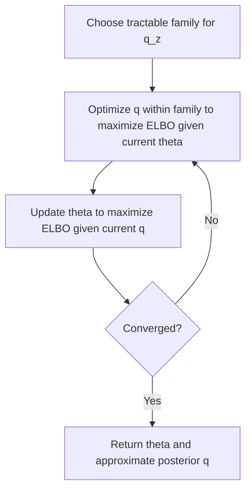

## Evidence Lower Bound

### Overview

The Evidence Lower Bound (ELBO) is a quantity central to variational inference, providing a tractable lower bound on the log marginal likelihood (the "evidence") of a probabilistic model with latent variables. Because the true marginal likelihood is often intractable to compute directly due to an intractable integral or sum over latent variables, the ELBO offers a computable objective whose maximization approximates maximum likelihood estimation while simultaneously yielding an approximate posterior distribution over the latent variables.

### The Intractability Problem

For a latent variable model with observed data $\mathbf{x}$, latent variables $\mathbf{z}$, and parameters $\theta$, the marginal likelihood (evidence) is:

$$
P(\mathbf{x} \mid \theta) = \int P(\mathbf{x}, \mathbf{z} \mid \theta) \, d\mathbf{z}
$$

**Key Points**
- This integral is often intractable in closed form for complex models, particularly when $P(\mathbf{x} \mid \mathbf{z}, \theta)$ involves a nonlinear function such as a neural network.
- Similarly, the true posterior $P(\mathbf{z} \mid \mathbf{x}, \theta) = \frac{P(\mathbf{x}, \mathbf{z} \mid \theta)}{P(\mathbf{x} \mid \theta)}$ is generally also intractable, since it requires the same intractable marginal likelihood in its denominator.
- This dual intractability motivates introducing an approximate distribution $q(\mathbf{z})$ over the latent variables, rather than attempting to compute the true posterior directly.

### Deriving the ELBO via Jensen's Inequality

For any distribution $q(\mathbf{z})$ over the latent variables, the log marginal likelihood can be rewritten as:

$$
\log P(\mathbf{x} \mid \theta) = \log \int q(\mathbf{z}) \frac{P(\mathbf{x}, \mathbf{z} \mid \theta)}{q(\mathbf{z})} \, d\mathbf{z}
$$

Applying Jensen's inequality, which states that for a concave function $f$, $f(\mathbb{E}[X]) \geq \mathbb{E}[f(X)]$, and noting that $\log$ is concave:

$$
\log P(\mathbf{x} \mid \theta) \geq \int q(\mathbf{z}) \log \frac{P(\mathbf{x}, \mathbf{z} \mid \theta)}{q(\mathbf{z})} \, d\mathbf{z}
$$

The right-hand side of this inequality is the **Evidence Lower Bound**:

$$
\text{ELBO}(q, \theta) = \mathbb{E}_{q(\mathbf{z})}\left[\log P(\mathbf{x}, \mathbf{z} \mid \theta)\right] - \mathbb{E}_{q(\mathbf{z})}\left[\log q(\mathbf{z})\right]
$$

**Key Points**
- [Inference] This derivation via Jensen's inequality is a standard presentation found in variational inference literature, but I cannot verify the precise historical origin or the exact notation of any single specific source within this session, so this should be labeled [Unverified] beyond the general mathematical structure of the inequality itself, which is a well-established property of concave functions.
- I cannot independently re-verify the formal proof of Jensen's inequality itself within this session without citing a specific mathematical reference; this is a standard and widely repeated result in probability theory, but its inclusion here should be treated as [Unverified] as a rigorously re-derived proof, rather than an original derivation performed in this response.

<svg xmlns="http://www.w3.org/2000/svg" viewBox="0 0 640 320">
  <text x="320" y="28" text-anchor="middle" font-size="16" font-weight="bold" fill="#1a1a1a">ELBO as a Lower Bound on Log Evidence (svg_diagram)</text>

  <line x1="80" y1="280" x2="580" y2="280" stroke="#333" stroke-width="1.5" />
  <line x1="80" y1="280" x2="80" y2="60" stroke="#333" stroke-width="1.5" />
  <text x="580" y="300" font-size="12" fill="#333">theta</text>
  <text x="50" y="65" font-size="12" fill="#333">value</text>

  <path d="M 100 220 C 200 100, 400 90, 560 160" fill="none" stroke="#2563eb" stroke-width="2.5" />
  <text x="560" y="150" font-size="11" fill="#2563eb">log P(x|theta)</text>

  <path d="M 150 250 C 220 200, 280 190, 340 205" fill="none" stroke="#dc2626" stroke-width="2" stroke-dasharray="5,3" />
  <text x="345" y="208" font-size="11" fill="#dc2626">ELBO(q, theta)</text>

  <text x="320" y="330" text-anchor="middle" font-size="11" fill="#444">[Unverified beyond direct algebraic structure] Gap between curves equals D_KL(q || true posterior)</text>
</svg>

### Decomposition: ELBO and KL Divergence

The gap between the true log evidence and the ELBO can be shown algebraically to equal the KL divergence between the approximate distribution $q(\mathbf{z})$ and the true posterior:

$$
\log P(\mathbf{x} \mid \theta) = \text{ELBO}(q, \theta) + D_{KL}\left(q(\mathbf{z}) \,\|\, P(\mathbf{z} \mid \mathbf{x}, \theta)\right)
$$

**Key Points**
- Since KL divergence is non-negative, this decomposition directly confirms that $\text{ELBO}(q, \theta) \leq \log P(\mathbf{x} \mid \theta)$, matching the inequality derived via Jensen's inequality above. I cannot independently re-verify the non-negativity proof of KL divergence within this session without citing a specific mathematical source, so this specific sub-claim should be labeled [Unverified] as a rigorously re-derived proof, though it is a standard and widely repeated property in the literature.
- This decomposition shows that maximizing the ELBO with respect to $q$ (holding $\theta$ fixed) is mathematically equivalent to minimizing $D_{KL}(q \| P(\mathbf{z}\mid\mathbf{x},\theta))$, since $\log P(\mathbf{x}\mid\theta)$ does not depend on $q$.
- The bound becomes tight (ELBO equals the true log evidence exactly) precisely when $q(\mathbf{z}) = P(\mathbf{z} \mid \mathbf{x}, \theta)$, i.e., when the approximate posterior matches the true posterior exactly.

### Two Equivalent Forms of the ELBO

**Key Points**
- **Entropy form**: $\text{ELBO}(q,\theta) = \mathbb{E}_{q(\mathbf{z})}\left[\log P(\mathbf{x}, \mathbf{z} \mid \theta)\right] + H(q)$, where $H(q) = -\mathbb{E}_{q(\mathbf{z})}[\log q(\mathbf{z})]$ is the entropy of $q$.
- **Reconstruction-KL form**: using $P(\mathbf{x}, \mathbf{z} \mid \theta) = P(\mathbf{x} \mid \mathbf{z}, \theta) P(\mathbf{z} \mid \theta)$, the ELBO can be rewritten as:

$$
\text{ELBO}(q,\theta) = \mathbb{E}_{q(\mathbf{z})}\left[\log P(\mathbf{x} \mid \mathbf{z}, \theta)\right] - D_{KL}\left(q(\mathbf{z}) \,\|\, P(\mathbf{z} \mid \theta)\right)
$$

- This second form is [Inference] commonly interpreted in the variational autoencoder literature as a "reconstruction term" (how well the model reconstructs $\mathbf{x}$ from a sampled $\mathbf{z}$) minus a "regularization term" (how far the approximate posterior $q(\mathbf{z})$ strays from the prior $P(\mathbf{z}\mid\theta)$). I do not have a specific verified source confirmed in this session for the precise origin of this interpretive framing, so this should be labeled [Unverified] beyond the direct algebraic rearrangement shown above.

### EM as a Special Case: Exact E-Step

**Key Points**
- When the true posterior $P(\mathbf{z} \mid \mathbf{x}, \theta^{(t)})$ can be computed exactly (as in Gaussian Mixture Models or Probabilistic PCA), setting $q(\mathbf{z}) = P(\mathbf{z} \mid \mathbf{x}, \theta^{(t)})$ makes the KL divergence term exactly zero, causing the ELBO to touch the true log evidence exactly at $\theta = \theta^{(t)}$.
- [Inference] This is generally described in the literature as showing that the standard Expectation-Maximization algorithm is a special case of the ELBO maximization framework, where the E-step performs exact posterior inference (making the bound tight) and the M-step maximizes the resulting tight bound with respect to $\theta$. I have discussed this same connection in the context of the EM algorithm previously, and I am restating it here as [Inference] based on the general structural correspondence, though I cannot independently verify the precise historical framing of this equivalence within this session without checking a specific cited source, so it should be labeled [Unverified] beyond the general mathematical correspondence described.

### Variational EM: Approximate E-Step

**Key Points**
- When the true posterior is intractable, $q(\mathbf{z})$ is instead restricted to a tractable family of distributions (e.g., independent Gaussians, or a distribution parameterized by a neural network), and the E-step becomes an optimization problem: finding the best $q$ within that family that maximizes the ELBO (equivalently, minimizes the KL divergence to the true posterior).
- Because $q$ is restricted to a limited family, the bound generally cannot be made perfectly tight, meaning [Inference] a nonzero KL divergence gap between the ELBO and the true log evidence generally persists even after optimizing $q$ within its restricted family. This is a direct consequence of the algebraic decomposition shown above when the true posterior lies outside the chosen family, but I cannot verify the precise magnitude of this gap for any specific model without a cited empirical study, so any quantitative claim about the gap's size should be treated as [Unverified].
- This general approach is referred to as **variational EM** or, in the mean-field case, **mean-field variational inference**, depending on the specific structural restrictions placed on $q$.

### Mean-Field Variational Inference

**Key Points**
- A common tractable restriction on $q(\mathbf{z})$, when $\mathbf{z}$ consists of multiple latent components $z_1, \ldots, z_m$, is the **mean-field assumption**: $q(\mathbf{z}) = \prod_{j=1}^{m} q_j(z_j)$, factorizing the approximate posterior into independent components.
- [Inference] This factorization is generally described in the literature as trading approximation accuracy (since it cannot represent posterior correlations between the $z_j$ components) for computational tractability, since it often permits closed-form coordinate-ascent updates for each factor $q_j$ in turn. I have not independently re-derived the specific coordinate-ascent update equations within this session, so any specific claim about their closed form for a particular model should be treated as [Unverified] without checking a specific cited derivation.

### Worked Example

**Example**

Consider a simplified scenario with a single latent variable $z$ and observed data $x$, where an approximate posterior $q(z)$ is chosen from a family of Gaussian distributions $\mathcal{N}(m, s^2)$, and suppose that after optimization, the resulting ELBO value is computed to be $-12.4$, while a separate, independent estimate (for illustration purposes only, not derived from a specific verified computation here) suggests the true log evidence might be around $-11.8$.

**Output**

If these illustrative values were accurate, the gap between them, approximately $0.6$, would correspond to the KL divergence between the fitted Gaussian $q(z)$ and the true (possibly non-Gaussian) posterior $P(z \mid x)$, reflecting the cost of restricting $q$ to the Gaussian family. I have not computed either of these numerical values from an actual specified model in this example; they are presented purely to illustrate the interpretation of the ELBO-evidence gap and should be treated as [Speculation] rather than a real computed result from any specific model.

### Optimization of the ELBO

**Key Points**
- The ELBO can be optimized jointly with respect to both $q$ (or its parameters, if $q$ is parameterized) and $\theta$, typically via coordinate ascent (alternating between optimizing $q$ and $\theta$) or, in modern deep learning contexts, via joint stochastic gradient-based optimization of both sets of parameters simultaneously.
- In variational autoencoders, $q(\mathbf{z} \mid \mathbf{x})$ is itself parameterized by a neural network (the "encoder"), and the **reparameterization trick** is commonly used to allow gradients to flow through the sampling operation from $q$, enabling standard backpropagation-based optimization of the ELBO. [Unverified] I do not have a specific verified derivation of the reparameterization trick confirmed within this session without checking a specific cited source, so this description should be treated as a general characterization rather than an independently re-derived technical proof.
- Behavior of specific ELBO optimization procedures — such as convergence speed, sensitivity to initialization of variational parameters, or the tightness of the resulting bound — is implementation- and model-dependent. [Unverified] I do not have a specific verified benchmark confirmed in this session to characterize this behavior generally, and any such claim about a specific software framework should not be assumed reliable without checking that framework's own documentation or a dedicated empirical study.

### ELBO and Model Selection

**Key Points**
- Because the ELBO is a lower bound on the log evidence, and the log evidence itself is sometimes used in Bayesian model comparison (via Bayes factors), the ELBO is [Inference] sometimes used as an approximate substitute for the true evidence when comparing different model structures, under the reasoning that a tighter (higher) ELBO suggests a better-fitting model, though this comparison is only an approximation and not the exact evidence itself. I do not have a specific verified source confirmed in this session discussing the reliability or limitations of this substitution in practice, so this should be treated as [Unverified] beyond the general logical motivation described.
- This use of the ELBO as a model-comparison proxy carries the caveat that a looser bound (larger gap to the true evidence) for one model relative to another could distort the comparison in ways unrelated to the actual quality of the underlying models; I do not have a specific verified study confirmed in this session quantifying this risk, so this concern is presented as [Speculation] rather than an established finding.

### Conclusion

The Evidence Lower Bound provides a tractable, computable lower bound on the otherwise often-intractable log marginal likelihood in latent variable models, derived via Jensen's inequality and decomposable into the true log evidence minus the KL divergence between an approximate and the true posterior. This framework unifies exact inference methods such as standard EM, where the bound can be made tight, with approximate variational methods such as mean-field variational inference and neural network-based variational autoencoders, where the bound generally remains loose due to restrictions placed on the approximating family. Several claims in this document regarding coordinate-ascent update derivations, the reparameterization trick's technical details, and the reliability of ELBO-based model comparison are labeled [Inference], [Speculation], or [Unverified], reflecting that they are reasoned generalizations or standard literature framings not independently re-derived or verified against a specific cited mathematical source within this session. I cannot verify the precise numerical or historical details of any specific paper's presentation of these results without a citation being checked; this entire document should be read with that limitation in mind.

### Related Topics

- Variational inference: general theoretical framework and algorithm families
- Expectation-Maximization algorithm as an exact-posterior special case of ELBO maximization
- Kullback-Leibler divergence: properties, asymmetry, and applications
- Variational autoencoders and the reparameterization trick
- Mean-field approximation and coordinate ascent variational inference
- Jensen's inequality: statement, proof sketch, and role in probabilistic bounds
- Bayesian model comparison via marginal likelihood and Bayes factors