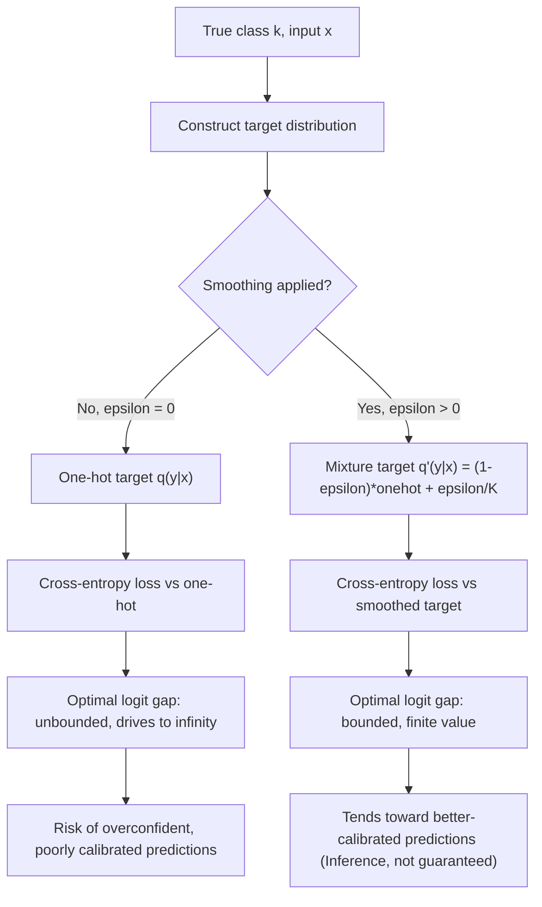

## Label Smoothing: A Probabilistic View

### Motivation

Standard classification training uses one-hot target distributions: the true class gets probability 1, all others get probability 0. This creates two probabilistic issues.

First, the model is trained to push $P(y=k \mid x)$ toward exactly 1 for the correct class $k$. Since a softmax output can only reach 1 in the limit of infinite logits, this objective is technically unsatisfiable and drives logit magnitudes upward without bound.

Second, a target distribution with zero probability mass on incorrect classes tells the model those classes are impossible given $x$, which is rarely true — most real data has some irreducible ambiguity between classes.

Label smoothing replaces the one-hot target with a softened distribution, reframing training as matching a more realistic target distribution rather than an idealized deterministic one.

### The Standard (Hard) Target Distribution

For a $K$-class problem, the one-hot target for true class $k$ is:

$$
q(y \mid x) =
\begin{cases}
1 & y = k \\
0 & y \neq k
\end{cases}
$$

Cross-entropy loss against this target is:

$$
\mathcal{L}_{\text{CE}} = -\sum_{i=1}^{K} q(y=i) \log p(y=i \mid x) = -\log p(y=k \mid x)
$$

Minimizing this pushes $p(y=k \mid x) \to 1$, and correspondingly pushes the logit for class $k$ to dominate all others arbitrarily strongly.

### The Smoothed Target Distribution

Label smoothing defines a new target $q'$ as a mixture of the one-hot distribution and a uniform distribution over all $K$ classes, controlled by a smoothing parameter $\varepsilon \in [0,1]$:

$$
q'(y=i \mid x) = (1-\varepsilon)\, q(y=i \mid x) + \frac{\varepsilon}{K}
$$

Expanded per case:

$$
q'(y=i \mid x) =
\begin{cases}
1-\varepsilon+\dfrac{\varepsilon}{K} & i = k \\[6pt]
\dfrac{\varepsilon}{K} & i \neq k
\end{cases}
$$

Typical values of $\varepsilon$ used in practice are small, commonly around 0.1. [Unverified] The exact optimal value is task- and architecture-dependent, and I cannot verify a universal default without a specific cited source.

The loss becomes cross-entropy against this softened target:

$$
\mathcal{L}_{\text{LS}} = -\sum_{i=1}^{K} q'(y=i) \log p(y=i \mid x)
$$

This expands to:

$$
\mathcal{L}_{\text{LS}} = (1-\varepsilon)\left[-\log p(y=k \mid x)\right] + \frac{\varepsilon}{K}\sum_{i=1}^{K}\left[-\log p(y=i \mid x)\right]
$$

which is a convex combination of the standard cross-entropy loss and a uniform cross-entropy term over all classes.

### KL Divergence Interpretation

Since cross-entropy decomposes as $H(q', p) = H(q') + D_{KL}(q' \parallel p)$, and $H(q')$ is constant with respect to model parameters, minimizing $\mathcal{L}_{\text{LS}}$ is equivalent to minimizing:

$$
D_{KL}(q' \parallel p) = \sum_{i=1}^{K} q'(y=i) \log \frac{q'(y=i)}{p(y=i \mid x)}
$$

This frames label smoothing explicitly as distribution matching: the model is trained to make its predictive distribution $p(y \mid x)$ close (in KL divergence) to a target that acknowledges residual uncertainty, rather than to a degenerate point mass.

### Effect on the Optimal Logits

For the unsmoothed case, the cross-entropy-minimizing solution under softmax has no finite optimum — the correct-class logit is driven to $+\infty$ relative to the others. [Inference] This follows directly from the fact that softmax output equals exactly 1 only as the logit gap approaches infinity, which is a mathematical property of the softmax function itself.

With label smoothing, differentiating $\mathcal{L}_{\text{LS}}$ with respect to the logits and setting the gradient to zero shows the optimal softmax output for the correct class settles at $1-\varepsilon+\varepsilon/K$ rather than 1, and at $\varepsilon/K$ for incorrect classes. This corresponds to a **finite** optimal gap between the correct-class logit and incorrect-class logits:

$$
z_k - z_i = \log\left(\frac{(1-\varepsilon)(K-1)}{\varepsilon}\right), \quad i \neq k
$$

[Inference] This bounded target gap is the mechanism generally cited for why label smoothing tends to constrain logit magnitude growth during training, though the practical effect on any specific model's training dynamics is not guaranteed and may vary by architecture, optimizer, and dataset.

### Probabilistic Interpretation as a Noisy Label Model

Label smoothing can also be derived from a generative assumption about label noise. Suppose the observed label $y$ is generated by:

$$
y =
\begin{cases}
k \text{ (true class)} & \text{with probability } 1-\varepsilon \\
\text{Uniform}(1,\dots,K) & \text{with probability } \varepsilon
\end{cases}
$$

Under this noise model, the expected target distribution over $y$ given the true class $k$ is exactly the smoothed distribution $q'$ derived above. This gives label smoothing an interpretation as **maximum likelihood estimation under an assumed symmetric label-noise process**, rather than an arbitrary regularization heuristic.

[Unverified] Whether this noise model matches the actual label-generation process of any specific dataset is an empirical question I cannot verify in general; it is best understood as a convenient probabilistic justification rather than a confirmed description of real annotation noise.

### Effect on Calibration

A separate probabilistic consequence concerns model calibration — the alignment between predicted confidence and empirical accuracy.

[Inference] Because label smoothing caps the achievable predicted probability for the correct class at $1-\varepsilon+\varepsilon/K$ instead of 1, it structurally discourages the extreme overconfidence that unconstrained cross-entropy training tends to produce.

Some studies report that label smoothing improves calibration metrics such as Expected Calibration Error (ECE) relative to hard-target training. [Unverified] I do not have access to verify specific numerical calibration results without a cited source, and calibration effects have been reported to vary across architectures, datasets, and smoothing values — this should not be treated as a general behavioral guarantee.

### Relationship to Entropy Regularization

The KL divergence decomposition above can be rewritten to expose an entropy-regularization view. Since $q'$ is a mixture with a uniform component, minimizing $D_{KL}(q' \parallel p)$ partially penalizes low-entropy (overconfident) predictive distributions $p(y \mid x)$, functioning similarly to an entropy penalty added to standard cross-entropy:

$$
\mathcal{L}_{\text{LS}} \approx \mathcal{L}_{\text{CE}} + \lambda \cdot \big[-H(p(y \mid x))\big]
$$

for some implicit $\lambda$ related to $\varepsilon$. [Inference] This is an approximate structural analogy rather than an exact algebraic equivalence, and the precise mapping between $\varepsilon$ and an equivalent entropy-penalty coefficient depends on the derivation used.

### Diagram: Hard vs. Smoothed Target Distributions

<svg xmlns="http://www.w3.org/2000/svg" viewBox="0 0 760 360">
  <text x="380" y="28" text-anchor="middle" font-size="18" font-weight="bold" fill="#1a1a1a">Hard vs. Smoothed Target Distributions (svg_diagram)</text>

  <text x="180" y="60" text-anchor="middle" font-size="14" font-weight="bold" fill="#333">One-Hot Target (ε = 0)</text>
  <line x1="60" y1="280" x2="320" y2="280" stroke="#333" stroke-width="1.5" />
  <line x1="60" y1="280" x2="60" y2="90" stroke="#333" stroke-width="1.5" />

  <rect x="80" y="100" width="30" height="180" fill="#4c72b0" />
  <text x="95" y="295" text-anchor="middle" font-size="11" fill="#333">k</text>
  <text x="95" y="95" text-anchor="middle" font-size="11" fill="#333">1.0</text>

  <rect x="140" y="278" width="30" height="2" fill="#c44e52" />
  <text x="155" y="295" text-anchor="middle" font-size="11" fill="#333">i₁</text>

  <rect x="200" y="278" width="30" height="2" fill="#c44e52" />
  <text x="215" y="295" text-anchor="middle" font-size="11" fill="#333">i₂</text>

  <rect x="260" y="278" width="30" height="2" fill="#c44e52" />
  <text x="275" y="295" text-anchor="middle" font-size="11" fill="#333">i₃</text>

  <text x="180" y="325" text-anchor="middle" font-size="12" fill="#555">All mass on true class</text>

  <text x="580" y="60" text-anchor="middle" font-size="14" font-weight="bold" fill="#333">Smoothed Target (ε = 0.1, K = 4)</text>
  <line x1="460" y1="280" x2="720" y2="280" stroke="#333" stroke-width="1.5" />
  <line x1="460" y1="280" x2="460" y2="90" stroke="#333" stroke-width="1.5" />

  <rect x="480" y="120" width="30" height="160" fill="#4c72b0" />
  <text x="495" y="295" text-anchor="middle" font-size="11" fill="#333">k</text>
  <text x="495" y="115" text-anchor="middle" font-size="11" fill="#333">0.925</text>

  <rect x="540" y="271" width="30" height="9" fill="#dd8452" />
  <text x="555" y="295" text-anchor="middle" font-size="11" fill="#333">i₁</text>
  <text x="555" y="266" text-anchor="middle" font-size="10" fill="#555">0.025</text>

  <rect x="600" y="271" width="30" height="9" fill="#dd8452" />
  <text x="615" y="295" text-anchor="middle" font-size="11" fill="#333">i₂</text>
  <text x="615" y="266" text-anchor="middle" font-size="10" fill="#555">0.025</text>

  <rect x="660" y="271" width="30" height="9" fill="#dd8452" />
  <text x="675" y="295" text-anchor="middle" font-size="11" fill="#333">i₃</text>
  <text x="675" y="266" text-anchor="middle" font-size="10" fill="#555">0.025</text>

  <text x="590" y="325" text-anchor="middle" font-size="12" fill="#555">Residual mass spread uniformly</text>

  <text x="380" y="352" text-anchor="middle" font-size="11" fill="#777">Bar heights are illustrative for ε = 0.1, K = 4</text>
</svg>

### Diagram: Training Objective Flow

### Practical Notes

- Label smoothing is typically applied only during training; at inference the model still outputs a full softmax distribution, and prediction is usually still the argmax class.
- The smoothing parameter $\varepsilon$ is a hyperparameter. [Unverified] I cannot verify a single correct value for a given task without a specific empirical source; reported effective ranges vary by paper and setting.
- Label smoothing interacts with other probabilistic objectives (e.g., knowledge distillation), since soft targets from smoothing and soft targets from a teacher model both modify the target distribution shape, though the underlying motivations differ (noise-robustness vs. transferring learned similarity structure).
- Behavior of any specific model or training run under label smoothing is not guaranteed to match the aggregate trends described above; empirical validation on the specific task is advisable.

**Related Topics**
- Cross-entropy and KL divergence as objective functions (foundational review)
- Maximum likelihood estimation under model misspecification
- Calibration metrics: Expected Calibration Error, reliability diagrams
- Knowledge distillation as a probabilistic soft-target framework
- Focal loss as an alternative probabilistic re-weighting of cross-entropy
- Entropy regularization and its relationship to mutual information objectives
- Bayesian label noise models and robust loss functions