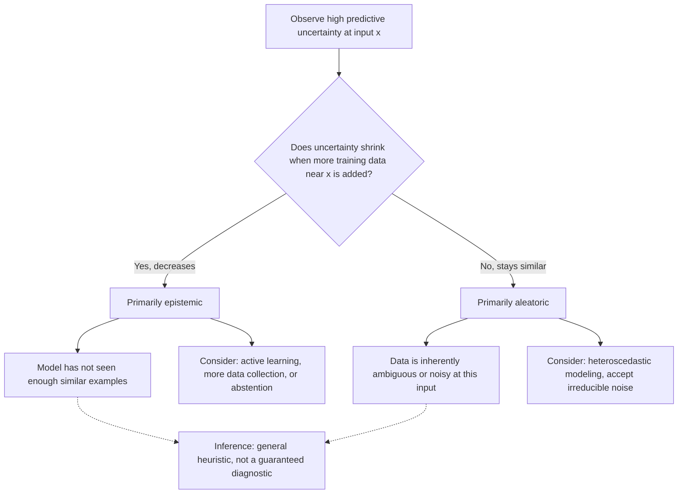

## Aleatoric vs. Epistemic Uncertainty

### Overview

Uncertainty in machine learning predictions arises from two distinct sources that require different mathematical treatment and different mitigation strategies. Aleatoric uncertainty stems from inherent randomness in the data-generating process itself. Epistemic uncertainty stems from the model's incomplete knowledge due to limited data or limited capacity. Distinguishing between them matters because they imply different responses: aleatoric uncertainty cannot be reduced by collecting more data, while epistemic uncertainty generally can.

### Formal Definitions

Consider a predictive model that outputs a distribution over outcomes $y$ given input $x$ and model parameters $\theta$. The total predictive uncertainty can be decomposed using the law of total variance (for continuous outcomes) or an analogous entropy decomposition (for discrete outcomes).

**Aleatoric uncertainty** is the uncertainty in $y$ given a *fixed, fully known* $\theta$:

$$
\text{Aleatoric} = \mathbb{E}_{\theta \sim p(\theta \mid D)}\left[\text{Var}(y \mid x, \theta)\right]
$$

This is the expected spread of outcomes the model would predict even if its parameters were certain — it reflects noise intrinsic to the data.

**Epistemic uncertainty** is the uncertainty in $y$ that arises specifically from *not knowing* $\theta$ — i.e., variability across plausible parameter settings consistent with the observed data:

$$
\text{Epistemic} = \text{Var}_{\theta \sim p(\theta \mid D)}\left[\mathbb{E}(y \mid x, \theta)\right]
$$

The total predictive variance decomposes as the sum of these two terms:

$$
\text{Var}(y \mid x, D) = \underbrace{\mathbb{E}_{\theta}\left[\text{Var}(y \mid x, \theta)\right]}_{\text{Aleatoric}} + \underbrace{\text{Var}_{\theta}\left[\mathbb{E}(y \mid x, \theta)\right]}_{\text{Epistemic}}
$$

This is a standard law-of-total-variance identity applied to a Bayesian predictive distribution.

### Entropy-Based Decomposition (Classification Case)

For classification, an analogous decomposition uses mutual information. Given a Bayesian posterior $p(\theta \mid D)$ over model parameters, the predictive distribution is:

$$
p(y \mid x, D) = \int p(y \mid x, \theta)\, p(\theta \mid D)\, d\theta
$$

Total uncertainty is the entropy of this predictive distribution:

$$
H\big[p(y \mid x, D)\big] = -\sum_{y} p(y \mid x, D) \log p(y \mid x, D)
$$

This decomposes as:

$$
\underbrace{H\big[p(y \mid x, D)\big]}_{\text{Total}} = \underbrace{\mathbb{E}_{\theta \sim p(\theta \mid D)}\big[H[p(y \mid x, \theta)]\big]}_{\text{Aleatoric}} + \underbrace{I(y; \theta \mid x, D)}_{\text{Epistemic (mutual information)}}
$$

Here $I(y; \theta \mid x, D)$ is the mutual information between the prediction and the parameters — it captures how much predictions would change if $\theta$ were known exactly, which is the defining signature of epistemic uncertainty.

[Inference] This entropy decomposition is a standard formulation used in Bayesian deep learning literature on uncertainty estimation, but I cannot verify without a specific citation which paper should be treated as the canonical source for this exact formulation.

### Aleatoric Uncertainty in Practice

Aleatoric uncertainty is typically modeled by having the network output distribution parameters rather than a point estimate. For regression, a common approach has the network output both a mean and a variance:

$$
p(y \mid x, \theta) = \mathcal{N}\big(y;\, \mu_\theta(x),\, \sigma_\theta^2(x)\big)
$$

and the network is trained via the corresponding negative log-likelihood:

$$
\mathcal{L}(\theta) = \frac{1}{2}\log \sigma_\theta^2(x) + \frac{(y - \mu_\theta(x))^2}{2\sigma_\theta^2(x)} + \text{const.}
$$

This loss lets the model assign higher predicted variance $\sigma_\theta^2(x)$ to inputs where the target is inherently noisier, without requiring an ensemble or Bayesian posterior over $\theta$.

For classification, aleatoric uncertainty corresponds to the entropy of the predicted class distribution for a single, fixed model — high entropy at a given fixed $\theta$ indicates the classes are genuinely ambiguous given that input (e.g., a blurry digit that plausibly resembles two classes).

[Inference] Aleatoric uncertainty is often described as "irreducible" in the sense that no additional training data at the same $x$ will change the true conditional distribution $p(y \mid x)$. This description follows directly from the definition of aleatoric uncertainty as a property of the data-generating process rather than of the model's knowledge state, so it is a definitional consequence rather than an empirical finding.

### Epistemic Uncertainty in Practice

Epistemic uncertainty requires some representation of a distribution — or at least a set of plausible values — over model parameters $\theta$, since it is defined as variability *across* parameter settings. Standard approaches include:

- **Bayesian neural networks**: maintain an explicit posterior $p(\theta \mid D)$, often approximated variationally.
- **Deep ensembles**: train multiple independently initialized networks and treat the spread of their predictions as a proxy for epistemic uncertainty. [Unverified] Whether ensemble disagreement is a reliable proxy for true epistemic uncertainty in the Bayesian sense is a subject of ongoing research; I do not have access to a specific source to confirm this equivalence holds generally.
- **Monte Carlo Dropout**: apply dropout at inference time and treat the variance across stochastic forward passes as an approximate epistemic signal. [Unverified] The theoretical justification connecting MC Dropout to a specific Bayesian approximation has been disputed in some later literature; I cannot verify the current state of consensus on this without a citation.

A defining practical signature of epistemic uncertainty is that it should shrink as training data covering a given region of input space increases, since more data constrains the plausible range of $\theta$. Aleatoric uncertainty, by contrast, should not shrink with more data at the same $x$.

### Why the Distinction Matters

| Property | Aleatoric | Epistemic |
|---|---|---|
| Source | Inherent data noise | Limited data / model knowledge |
| Reducible with more data? | No | Generally yes |
| Present with infinite training data? | Yes | Tends toward zero |
| Typical modeling approach | Predicted variance / distribution output | Posterior over parameters, ensembles, MC Dropout |
| Relevant for | Noise-aware loss weighting | Out-of-distribution detection, active learning, safety-critical abstention |

[Inference] This table reflects standard framing found in Bayesian deep learning uncertainty literature. I cannot verify that every listed use-case (e.g., active learning) is the single correct application area without checking a specific source, and practical performance of any of these methods for a given downstream task is not guaranteed.

### Diagram: Uncertainty Decomposition

<svg xmlns="http://www.w3.org/2000/svg" viewBox="0 0 720 380">
  <text x="360" y="28" text-anchor="middle" font-size="18" font-weight="bold" fill="#1a1a1a">Aleatoric vs. Epistemic Decomposition (svg_diagram)</text>

  <rect x="60" y="60" width="600" height="50" rx="6" fill="#e8e8e8" stroke="#999" />
  <text x="360" y="90" text-anchor="middle" font-size="14" fill="#222">Total Predictive Uncertainty: H[p(y|x,D)]</text>

  <line x1="220" y1="110" x2="140" y2="150" stroke="#666" stroke-width="1.5" />
  <line x1="500" y1="110" x2="580" y2="150" stroke="#666" stroke-width="1.5" />

  <rect x="40" y="150" width="220" height="90" rx="6" fill="#cde3f7" stroke="#4c72b0" />
  <text x="150" y="175" text-anchor="middle" font-size="13" font-weight="bold" fill="#1a1a1a">Aleatoric</text>
  <text x="150" y="195" text-anchor="middle" font-size="11" fill="#333">Data noise, fixed θ</text>
  <text x="150" y="212" text-anchor="middle" font-size="11" fill="#333">E_θ[Var(y|x,θ)]</text>
  <text x="150" y="229" text-anchor="middle" font-size="11" fill="#555">Irreducible by more data</text>

  <rect x="460" y="150" width="220" height="90" rx="6" fill="#f7d8c4" stroke="#dd8452" />
  <text x="570" y="175" text-anchor="middle" font-size="13" font-weight="bold" fill="#1a1a1a">Epistemic</text>
  <text x="570" y="195" text-anchor="middle" font-size="11" fill="#333">Parameter uncertainty</text>
  <text x="570" y="212" text-anchor="middle" font-size="11" fill="#333">Var_θ[E(y|x,θ)]</text>
  <text x="570" y="229" text-anchor="middle" font-size="11" fill="#555">Shrinks with more data</text>

  <rect x="40" y="270" width="220" height="70" rx="6" fill="#fff" stroke="#4c72b0" stroke-dasharray="4,3" />
  <text x="150" y="292" text-anchor="middle" font-size="11" fill="#333">Modeled via:</text>
  <text x="150" y="310" text-anchor="middle" font-size="11" fill="#333">predicted variance head</text>
  <text x="150" y="326" text-anchor="middle" font-size="11" fill="#333">(heteroscedastic loss)</text>

  <rect x="460" y="270" width="220" height="70" rx="6" fill="#fff" stroke="#dd8452" stroke-dasharray="4,3" />
  <text x="570" y="292" text-anchor="middle" font-size="11" fill="#333">Modeled via:</text>
  <text x="570" y="310" text-anchor="middle" font-size="11" fill="#333">ensembles, MC Dropout,</text>
  <text x="570" y="326" text-anchor="middle" font-size="11" fill="#333">Bayesian posteriors</text>
</svg>

### Diagram: Decision Flow for Uncertainty Type

### Common Pitfalls

- Treating a single softmax output's entropy as pure epistemic uncertainty. [Inference] A single deterministic network's softmax entropy conflates both sources, since it reflects neither an explicit noise model nor a distribution over parameters — this follows from the definitions above rather than from an empirical study I can cite.
- Assuming ensemble variance is a clean, theoretically exact measure of epistemic uncertainty. [Unverified] I cannot verify the precise conditions under which ensemble disagreement equals the Bayesian epistemic term without a specific source.
- Assuming predicted-variance outputs (heteroscedastic heads) are measuring only aleatoric uncertainty in practice. [Unverified] In practice these outputs can absorb some epistemic effects depending on training setup and data coverage; I do not have a specific source to confirm how reliably this separation holds across architectures.

Behavior of any specific uncertainty-estimation method on a specific dataset or architecture is not guaranteed and may vary; empirical validation on the task at hand is advisable before relying on these estimates for downstream decisions.

**Related Topics**
- Bayesian neural networks and variational posterior approximation
- Deep ensembles as an approximate Bayesian method
- Monte Carlo Dropout: derivation and criticisms
- Heteroscedastic regression and predicted-variance loss functions
- Out-of-distribution detection using epistemic uncertainty
- Active learning strategies driven by uncertainty estimates
- Calibration versus uncertainty decomposition (related but distinct concepts)