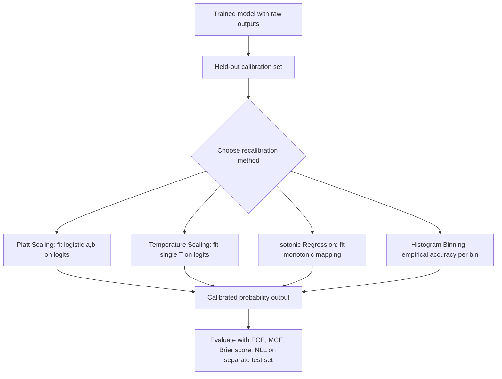

## Calibration of Probabilistic Predictions

### Definition

A probabilistic classifier is calibrated if, among all instances where the model predicts a probability of $p$ for a given class, the true empirical frequency of that class occurring is also $p$. Formally, for a binary classifier outputting confidence $\hat{p}(x)$ for the predicted class:

$$
\mathbb{P}(y = 1 \mid \hat{p}(x) = p) = p, \quad \forall p \in [0,1]
$$

This is a distinct property from accuracy. A model can be highly accurate but poorly calibrated (e.g., consistently outputting 0.99 confidence when true accuracy at that confidence level is 0.85), and a model can be well calibrated but have low accuracy (e.g., a model that correctly outputs 0.5 confidence on genuinely ambiguous cases where it is right half the time).

### Why Calibration Matters

Calibrated probabilities are required whenever downstream decisions depend on the probability value itself rather than just the predicted class label — for example, risk-based thresholds in medical diagnosis, expected-value calculations in finance, or confidence-based routing in automated systems. An uncalibrated model may produce the correct ranking of predictions (good for accuracy or AUC) while producing probability values that do not correspond to real frequencies, which can lead to poor decisions in any application that uses the raw probability rather than just the argmax class.

[Inference] Modern deep neural networks trained with cross-entropy loss have been widely reported in the literature to be poorly calibrated, typically overconfident, especially as model capacity increases. I cannot verify the specific magnitude of this effect for any particular architecture without a specific cited source, and this should not be treated as a universal property of all networks in all training regimes.

### Reliability Diagrams

The standard visual tool for assessing calibration is the reliability diagram. Predictions are grouped into bins by predicted confidence (e.g., $[0, 0.1), [0.1, 0.2), \dots, [0.9, 1.0]$), and for each bin the empirical accuracy is plotted against the mean predicted confidence in that bin. A perfectly calibrated model produces a diagonal line where empirical accuracy equals predicted confidence in every bin.

### Diagram: Reliability Diagram Concept

<svg xmlns="http://www.w3.org/2000/svg" viewBox="0 0 480 460">
  <text x="240" y="28" text-anchor="middle" font-size="17" font-weight="bold" fill="#1a1a1a">Reliability Diagram (svg_diagram)</text>

  <line x1="70" y1="400" x2="420" y2="400" stroke="#333" stroke-width="1.5" />
  <line x1="70" y1="400" x2="70" y2="60" stroke="#333" stroke-width="1.5" />

  <text x="240" y="430" text-anchor="middle" font-size="12" fill="#333">Predicted Confidence</text>
  <text x="30" y="230" text-anchor="middle" font-size="12" fill="#333" transform="rotate(-90 30 230)">Empirical Accuracy</text>

  <text x="70" y="415" text-anchor="middle" font-size="10" fill="#555">0.0</text>
  <text x="420" y="415" text-anchor="middle" font-size="10" fill="#555">1.0</text>
  <text x="60" y="404" text-anchor="end" font-size="10" fill="#555">0.0</text>
  <text x="60" y="65" text-anchor="end" font-size="10" fill="#555">1.0</text>

  <line x1="70" y1="400" x2="420" y2="60" stroke="#999" stroke-width="1.5" stroke-dasharray="5,4" />
  <text x="320" y="120" font-size="11" fill="#777">Perfect calibration</text>

  <polyline points="90,395 130,370 170,330 210,285 250,235 290,190 330,150 370,115 410,95" fill="none" stroke="#c44e52" stroke-width="2.5" />
  <text x="150" y="440" font-size="11" fill="#c44e52">Example: overconfident model (curve below diagonal)</text>

  <circle cx="90" cy="395" r="3.5" fill="#c44e52" />
  <circle cx="130" cy="370" r="3.5" fill="#c44e52" />
  <circle cx="170" cy="330" r="3.5" fill="#c44e52" />
  <circle cx="210" cy="285" r="3.5" fill="#c44e52" />
  <circle cx="250" cy="235" r="3.5" fill="#c44e52" />
  <circle cx="290" cy="190" r="3.5" fill="#c44e52" />
  <circle cx="330" cy="150" r="3.5" fill="#c44e52" />
  <circle cx="370" cy="115" r="3.5" fill="#c44e52" />
  <circle cx="410" cy="95" r="3.5" fill="#c44e52" />
</svg>

The illustrated curve, where empirical accuracy falls below predicted confidence at high-confidence bins, is the typical qualitative shape [Inference] reported for overconfident models in calibration literature. I cannot verify that this exact curve shape holds for any specific model without direct evaluation on that model's outputs.

### Expected Calibration Error (ECE)

ECE quantifies the average gap between confidence and accuracy across bins, weighted by bin population. With $M$ bins $B_1, \dots, B_M$ and $n$ total samples:

$$
\text{ECE} = \sum_{m=1}^{M} \frac{|B_m|}{n} \left| \text{acc}(B_m) - \text{conf}(B_m) \right|
$$

where $\text{acc}(B_m)$ is the empirical accuracy of samples falling in bin $m$, and $\text{conf}(B_m)$ is the average predicted confidence in that bin.

A related metric, **Maximum Calibration Error (MCE)**, takes the maximum gap over bins rather than the weighted average:

$$
\text{MCE} = \max_{m \in \{1,\dots,M\}} \left| \text{acc}(B_m) - \text{conf}(B_m) \right|
$$

[Unverified] ECE is sensitive to the choice of binning scheme (number of bins, equal-width vs. equal-count bins), and I do not have access to a specific source confirming a universally recommended bin count for all use cases. Different binning choices can produce different ECE values for the same model.

### Brier Score

An alternative, bin-free calibration-sensitive metric is the Brier score, defined for binary outcomes as the mean squared error between predicted probability and the actual outcome:

$$
\text{Brier} = \frac{1}{n}\sum_{i=1}^{n} \left(\hat{p}_i - y_i\right)^2
$$

The Brier score decomposes into three components:

$$
\text{Brier} = \text{Reliability} - \text{Resolution} + \text{Uncertainty}
$$

where reliability measures calibration error (lower is better), resolution measures how much predictions vary meaningfully across different inputs (higher is better), and uncertainty is a property of the data itself, independent of the model. [Inference] This decomposition is a standard result from forecasting theory; I cannot verify the specific original source without a citation, though the algebraic identity itself follows from expanding the squared-error term by conditioning on prediction bins.

### Negative Log-Likelihood as a Calibration-Sensitive Metric

The negative log-likelihood (NLL) of held-out data under the model's predicted distribution is also sensitive to calibration, since it penalizes confident wrong predictions much more heavily than a proper scoring rule like accuracy would:

$$
\text{NLL} = -\frac{1}{n}\sum_{i=1}^{n} \log p_\theta(y_i \mid x_i)
$$

Both Brier score and NLL are examples of **proper scoring rules** — metrics for which the expected score is minimized precisely when the predicted distribution matches the true underlying distribution. This property is what makes them theoretically meaningful for assessing calibration rather than just accuracy.

### Recalibration Methods

Several post-hoc methods adjust a trained model's output probabilities to improve calibration without retraining the underlying model:

**Platt Scaling** fits a logistic regression on top of the model's raw output scores $z$ (typically pre-softmax logits for binary classification):

$$
p_{\text{calibrated}} = \sigma(a \cdot z + b)
$$

where $a$ and $b$ are learned on a held-out calibration set.

**Temperature Scaling** is a simplified single-parameter variant, applied to multi-class logits before the softmax:

$$
p_{\text{calibrated}} = \text{softmax}\left(\frac{z}{T}\right)
$$

where $T > 1$ softens (flattens) an overconfident distribution, and $T < 1$ sharpens an underconfident one. $T$ is fit by minimizing NLL on a held-out validation set while keeping the underlying logits $z$ fixed.

[Inference] Temperature scaling has been reported in some literature as effective at reducing ECE for certain modern deep networks while preserving the model's original ranking of predictions (since dividing all logits by a constant does not change the argmax). I do not have access to a specific source to confirm the magnitude of this effect for any particular model family, and behavior may differ across architectures and datasets.

**Isotonic Regression** fits a non-parametric, monotonic step function mapping raw scores to calibrated probabilities. It is more flexible than Platt scaling but [Unverified] I cannot verify without a specific source the precise data-size threshold at which isotonic regression's flexibility becomes an overfitting risk versus a benefit relative to Platt scaling.

**Histogram Binning** directly estimates calibrated probability as the empirical accuracy within each confidence bin from a held-out calibration set, then applies this mapping at inference.

### Diagram: Recalibration Pipeline

### Calibration in the Multi-Class Setting

The binary calibration definition extends to multi-class settings in at least two common ways: **confidence calibration**, which considers only the predicted (highest-probability) class and checks whether its confidence matches the empirical accuracy of that top prediction, and **full (classwise) calibration**, which requires every class's predicted probability to match its empirical frequency, not just the top class.

[Unverified] Full classwise calibration is a substantially stronger requirement than top-label confidence calibration, and I do not have access to a specific source confirming how commonly each definition is used across current applied literature versus theoretical work.

### Common Pitfalls

- Evaluating calibration on the training set rather than a held-out set, which can produce misleadingly good calibration metrics due to overfitting.
- Using a very small number of bins for ECE, which can mask miscalibration by averaging over too coarse a range.
- Assuming a model with high accuracy is automatically well calibrated. [Inference] These are mathematically distinct properties, as demonstrated by the fact that ECE and accuracy can be computed independently and do not have a fixed mathematical relationship — a model can achieve arbitrarily high accuracy while displaying nonzero calibration error, depending on the confidence values it assigns to correct predictions.
- Applying temperature scaling or other recalibration methods fit on one data distribution and assuming the calibration transfers to a shifted test distribution. [Unverified] I do not have access to a specific source quantifying how calibration degrades under distribution shift for any particular method, and this is likely to vary by the type and magnitude of shift involved.

Behavior of any specific model, dataset, or recalibration method described above is not guaranteed and may vary depending on architecture, training procedure, and data characteristics; empirical evaluation on the specific task is advisable before relying on these techniques in a deployed system.

**Related Topics**
- Temperature scaling: derivation and connection to the Boltzmann distribution
- Proper scoring rules: theoretical foundations (Brier score, log score, CRPS)
- Conformal prediction as a distribution-free alternative to calibration
- Calibration under distribution shift and domain adaptation
- Bayesian model averaging and its relationship to calibrated uncertainty
- Aleatoric vs. epistemic uncertainty (prerequisite / related concept)
- Selective prediction and confidence-based abstention