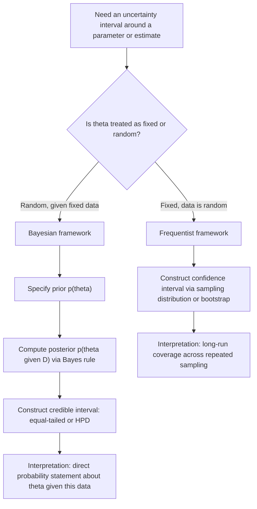

## Confidence Intervals vs. Credible Intervals

### Overview

Confidence intervals and credible intervals both attempt to quantify uncertainty around an estimated quantity, and both are often reported as a range such as "[lower, upper]" at a stated level like 95%. Despite the superficial similarity, they arise from different statistical frameworks — frequentist and Bayesian, respectively — and answer different questions. Conflating the two is a common source of misinterpretation in applied machine learning.

### Confidence Intervals (Frequentist)

A confidence interval treats the true parameter $\theta$ as a fixed, unknown constant, and treats the interval bounds as random variables that depend on the sampled data. A $(1-\alpha)$ confidence interval is constructed such that, under repeated sampling of new datasets from the same true data-generating process, the interval would contain the true fixed parameter $\theta$ in a proportion $(1-\alpha)$ of those repetitions:

$$
\mathbb{P}\big(L(X) \le \theta \le U(X)\big) = 1 - \alpha
$$

Here the probability statement is over the randomness of the data $X$ (and therefore over the randomness of $L(X)$ and $U(X)$), **not** over $\theta$, since $\theta$ is treated as fixed rather than random in the frequentist framework.

This has a specific and often misunderstood consequence: once a particular interval has been computed from a particular dataset (e.g., $[2.1, 3.4]$), it is **not** correct under strict frequentist interpretation to say "there is a 95% probability that $\theta$ lies in $[2.1, 3.4]$." That specific interval either contains $\theta$ or it does not — there is no remaining randomness once the data is fixed. The 95% figure describes the long-run behavior of the procedure across hypothetical repeated samples, not a probability statement about this specific interval.

[Inference] This distinction between "the procedure has 95% coverage over repeated sampling" and "this specific interval has 95% probability of containing the parameter" is the standard textbook explanation of confidence interval interpretation in frequentist statistics. I cannot verify a single canonical source for this explanation without a specific citation, though it follows directly from the definition of a confidence interval as constructed above.

### Credible Intervals (Bayesian)

A credible interval treats the parameter $\theta$ itself as a random variable with a posterior distribution $p(\theta \mid D)$, derived via Bayes' rule from a prior $p(\theta)$ and the likelihood of the observed data $D$:

$$
p(\theta \mid D) = \frac{p(D \mid \theta)\, p(\theta)}{p(D)}
$$

A $(1-\alpha)$ credible interval $[L, U]$ is any interval satisfying:

$$
\mathbb{P}\big(L \le \theta \le U \mid D\big) = 1 - \alpha
$$

Here the probability is a direct statement about $\theta$, conditioned on the observed data $D$, which is now treated as fixed. This allows the interpretation many people intuitively (but often incorrectly) apply to confidence intervals: "given the observed data, there is a 95% probability that $\theta$ lies in this interval" is a valid statement for a credible interval under the Bayesian framework, since $\theta$ is genuinely treated as a random quantity with a distribution.

A common choice of credible interval is the **equal-tailed interval**, where $\alpha/2$ posterior probability mass lies below $L$ and $\alpha/2$ lies above $U$. Another common choice is the **Highest Posterior Density (HPD) interval**, which is the narrowest interval containing $(1-\alpha)$ posterior mass — this can differ from the equal-tailed interval when the posterior is asymmetric or multimodal.

### Diagram: Conceptual Contrast

<svg xmlns="http://www.w3.org/2000/svg" viewBox="0 0 740 420">
  <text x="370" y="28" text-anchor="middle" font-size="17" font-weight="bold" fill="#1a1a1a">Confidence Interval vs. Credible Interval (svg_diagram)</text>

  <text x="190" y="60" text-anchor="middle" font-size="14" font-weight="bold" fill="#333">Frequentist: Confidence Interval</text>
  <text x="190" y="80" text-anchor="middle" font-size="11" fill="#555">θ fixed, interval is random</text>

  <line x1="60" y1="130" x2="60" y2="330" stroke="#333" stroke-width="1" />
  <line x1="90" y1="140" x2="290" y2="140" stroke="#4c72b0" stroke-width="3" />
  <line x1="70" y1="170" x2="310" y2="170" stroke="#4c72b0" stroke-width="3" />
  <line x1="50" y1="200" x2="270" y2="200" stroke="#4c72b0" stroke-width="3" />
  <line x1="100" y1="230" x2="320" y2="230" stroke="#4c72b0" stroke-width="3" />
  <line x1="80" y1="260" x2="280" y2="260" stroke="#c44e52" stroke-width="3" />
  <line x1="65" y1="290" x2="285" y2="290" stroke="#4c72b0" stroke-width="3" />

  <line x1="180" y1="120" x2="180" y2="310" stroke="#1a1a1a" stroke-width="1.5" stroke-dasharray="4,3" />
  <text x="180" y="330" text-anchor="middle" font-size="11" fill="#333">true θ (fixed)</text>

  <text x="190" y="360" text-anchor="middle" font-size="11" fill="#555">Each horizontal line = interval from</text>
  <text x="190" y="376" text-anchor="middle" font-size="11" fill="#555">one hypothetical repeated sample</text>
  <text x="190" y="396" text-anchor="middle" font-size="11" fill="#c44e52">Red = one interval that misses θ</text>

  <text x="550" y="60" text-anchor="middle" font-size="14" font-weight="bold" fill="#333">Bayesian: Credible Interval</text>
  <text x="550" y="80" text-anchor="middle" font-size="11" fill="#555">θ random, given fixed data D</text>

  <line x1="420" y1="300" x2="680" y2="300" stroke="#333" stroke-width="1" />
  <path d="M 420 300 Q 460 300 480 260 Q 510 190 550 175 Q 590 190 620 260 Q 640 300 680 300 Z" fill="#cde3f7" stroke="#4c72b0" stroke-width="1.5" />

  <line x1="490" y1="300" x2="490" y2="120" stroke="#dd8452" stroke-width="1.5" stroke-dasharray="3,2" />
  <line x1="610" y1="300" x2="610" y2="120" stroke="#dd8452" stroke-width="1.5" stroke-dasharray="3,2" />
  <text x="550" y="330" text-anchor="middle" font-size="11" fill="#333">95% of posterior mass between L and U</text>
  <text x="550" y="360" text-anchor="middle" font-size="11" fill="#555">Curve = posterior distribution p(θ | D)</text>
  <text x="550" y="380" text-anchor="middle" font-size="11" fill="#555">Single fixed dataset D</text>
</svg>

### Relevance to Machine Learning

In ML contexts, this distinction arises directly whenever uncertainty is placed around a learned quantity — a model parameter, a predicted mean, or an estimated performance metric.

**Frequentist-style confidence intervals** appear, for example, when reporting a confidence interval around a model's estimated test accuracy from a finite test set, or around a regression coefficient estimated via maximum likelihood. These typically rely on asymptotic theory (e.g., the estimator's sampling distribution approaching normality) or resampling methods such as the bootstrap.

**Bayesian credible intervals** appear when a model maintains an explicit posterior over parameters — as in Bayesian neural networks, Gaussian processes, or Bayesian linear/logistic regression — and a credible interval is read directly off that posterior for a weight, a predicted mean, or a predicted output.

[Inference] In practice, many ML uncertainty estimates that are reported as "confidence intervals" (e.g., bootstrap confidence intervals around a metric) are approximations relying on asymptotic or resampling theory rather than exact closed-form frequentist derivations. I cannot verify the precise accuracy of any specific bootstrap procedure's coverage guarantee without evaluating it directly, and coverage properties of bootstrap methods are known in the statistics literature to depend on sample size, the underlying distribution, and the specific bootstrap variant used.

### The Role of the Prior

A key mechanical difference is that credible intervals depend on the choice of prior $p(\theta)$, while confidence intervals do not involve a prior at all. Two analysts with different priors, observing the same data, will generally compute different credible intervals for the same parameter. This is a direct mathematical consequence of Bayes' rule, since the posterior $p(\theta \mid D)$ is proportional to the product of the prior and the likelihood.

[Unverified] Whether this prior-dependence is best characterized as a strength (incorporating genuine domain knowledge) or a weakness (introducing subjectivity) is a matter of ongoing methodological debate between frequentist and Bayesian statisticians, and I do not have access to a specific source establishing a settled consensus on this question.

### When the Two Coincide Numerically

Under certain conditions — notably, a flat (uninformative) prior combined with a large sample size — the Bayesian credible interval and the frequentist confidence interval can become numerically very close or identical, since the posterior becomes dominated by the likelihood and behaves similarly to the frequentist sampling distribution.

[Unverified] I do not have access to a specific source specifying the exact rate of convergence or the precise conditions under which numerical equivalence holds for arbitrary model classes used in machine learning; this is likely to depend on the specific model, prior, and sample size involved, and should not be assumed to hold in general without verification for the specific setting.

### Common Misinterpretations

- Stating that a 95% confidence interval means "there is a 95% probability the true parameter lies in this specific interval." Under strict frequentist definitions, this is not the correct interpretation, since the interval computed from one dataset either does or does not contain the fixed true parameter — the 95% refers to the long-run procedure, not this specific instance.
- Treating credible intervals and confidence intervals as interchangeable simply because both are often reported at the same nominal level (e.g., 95%). They answer different questions and can produce numerically different bounds, particularly with informative priors or small sample sizes.
- Assuming a non-informative or flat prior removes all Bayesian subjectivity from a credible interval. [Unverified] The choice of what counts as "non-informative" is itself a modeling decision with known technical subtleties (e.g., a flat prior on one parameterization is not flat under a reparameterization), and I do not have access to a specific source to confirm a universally agreed-upon resolution to this issue.

### Diagram: Decision Framework

### Summary Comparison

| Property | Confidence Interval | Credible Interval |
|---|---|---|
| Framework | Frequentist | Bayesian |
| Parameter $\theta$ treated as | Fixed, unknown constant | Random variable |
| What varies | The interval, across repeated samples | Nothing extra — conditioned on observed data |
| Requires a prior? | No | Yes |
| Valid direct probability statement about $\theta$ given this data? | Not under strict frequentist interpretation | Yes, by construction |
| Interpretation basis | Long-run frequency over repeated sampling | Posterior probability given observed data |

I cannot verify that this table exhaustively covers every technical nuance discussed across all statistics literature on this topic; it reflects the standard core distinctions as commonly presented, and edge cases (e.g., objective Bayesian methods, fiducial inference) exist that are not captured in a simplified comparison table.

For claims regarding how any specific machine learning library, framework, or trained model computes or reports these intervals, behavior is not guaranteed and may vary by implementation; verification against the specific tool's documentation is advisable before relying on it.

**Related Topics**
- Bootstrap methods for constructing frequentist confidence intervals
- Bayesian posterior approximation: MCMC, variational inference
- Highest Posterior Density (HPD) intervals vs. equal-tailed intervals
- Prior selection and sensitivity analysis in Bayesian modeling
- Conformal prediction as a distribution-free interval method
- Aleatoric vs. epistemic uncertainty (related uncertainty framework)
- Calibration of probabilistic predictions (related but distinct concept)